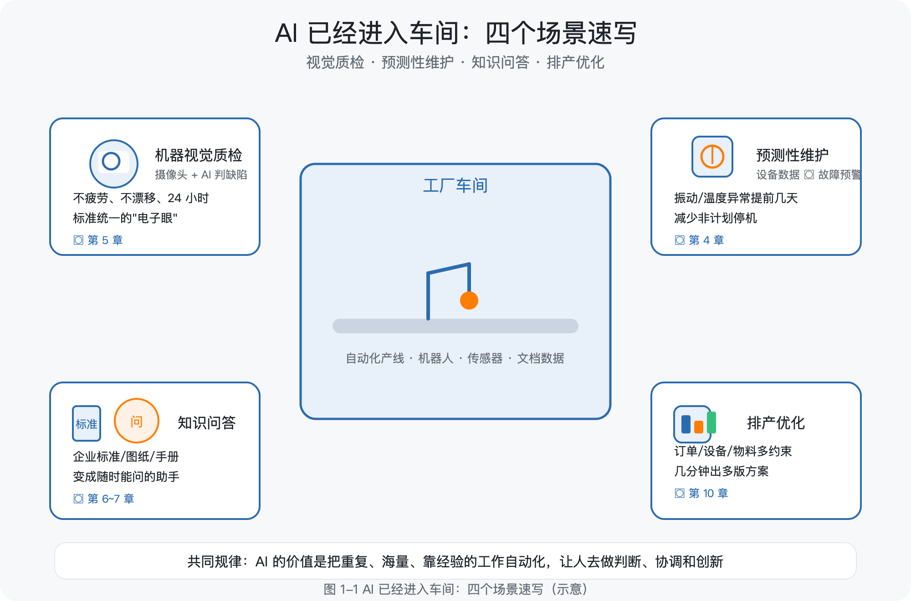
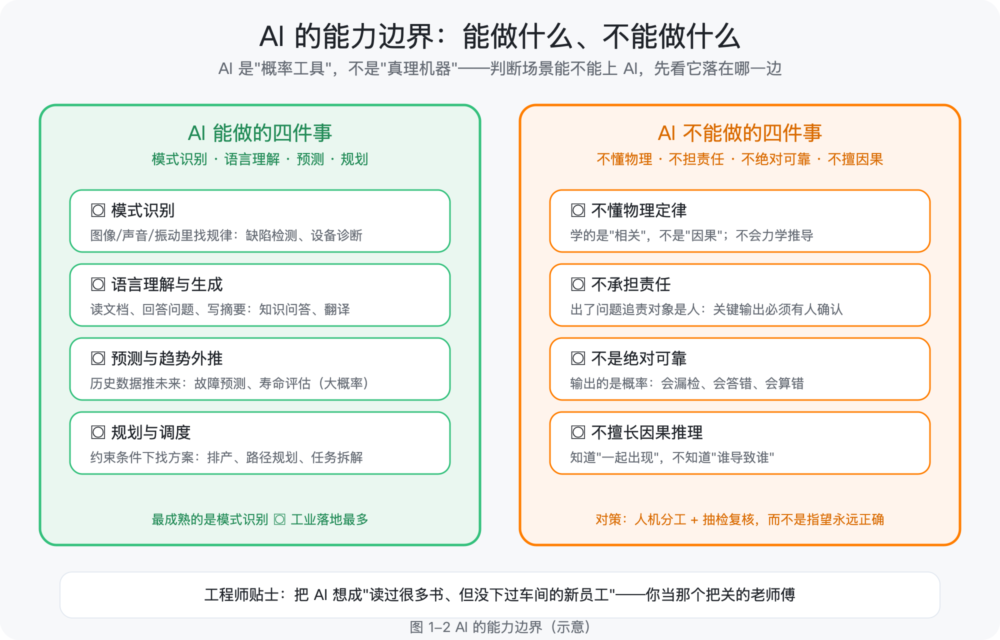
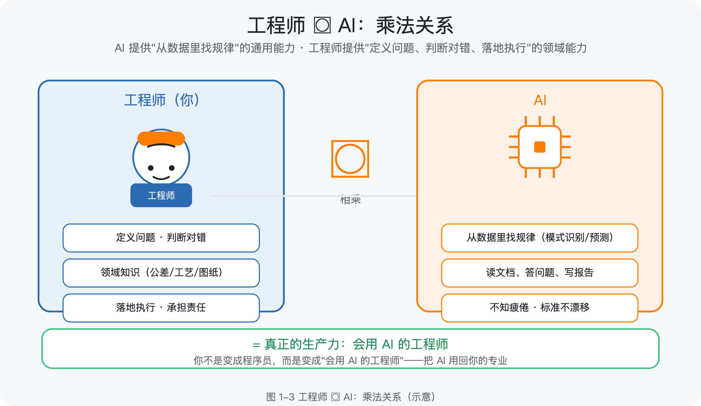

# 第 1 章 为什么工程师要拥抱 AI

> 所属框架层：L0 学习地图
> 预计篇幅：约 7,000 字（本章为全书的"入口章"，无代码门槛，第 3 段为"最小实操示例"：与大模型对话）
> 配套文件：本章配图（SVG 源文件见 `figures/ch1/` 目录）、术语表第 1 章-L0 条目
> 版本：v0.1（首稿）

**本章验收标准**：学完后能不看资料回答——AI 能帮工程师做什么、不能做什么？工程师在 AI 时代为什么有独特优势？你的 90 天学习计划是什么？

---

## 1.0 本章解决什么问题

这一章解决你翻开这本书时的第一个困惑：**AI 跟我这个画图、算强度、管产线的工程师，到底有什么关系？**

先给你讲一个真实发生过的场景。

老张，40 岁，某机械厂设计部的资深工程师。去年年底，厂里在质检车间上了一套自动检测设备，据说是"AI 视觉质检"；隔壁工艺部开始用软件查企业标准，说是"AI 问答"；领导把老张叫过去，说："你评估一下，AI 对我们设计部能有什么用，写个报告。"

老张当天晚上就开始查资料。三小时后他关掉电脑，脑子里只剩三个问题：第一，满屏的"机器学习""神经网络""大模型"，每个词好像都认识，连起来不知道在说什么；第二，所有教程都默认你会编程，第一课就是"打开终端安装 Python 环境"，他连终端是什么都不知道；第三，也是最要命的——他搜不到任何一份资料，告诉他"一个会画图、懂工艺、做了十年设计的工程师，到底该怎么学 AI"。

他不是不聪明。他闭着眼睛都能背出轴类零件调质处理的三种工艺路线。但 AI 这个世界，对他来说就像一台没有铭牌、没有图纸、接口全不认识的陌生设备。

这一章就是那份"铭牌和图纸"。我们先不碰任何代码，只回答四个问题：AI 已经在你身边做了什么？它到底能干什么、不能干什么？你作为工程师，凭什么在 AI 时代有优势？以及，接下来 6~12 个月，你该怎么学。

## 1.1 AI 已经进入车间：四个真实场景速写

先说结论：**AI 不是遥远的实验室技术，它已经以四种最常见的形态，进到了制造业的车间和办公室。** 这四种形态，恰好也是本书后续章节的主线。

### 场景一：机器视觉质检——用"眼睛"代替人眼

**机器视觉（Machine Vision）**：给机器装上摄像头和算法，让它"看"产品并判断好坏。

在零件表面缺陷检测上，过去靠质检员肉眼抽检：人眼会疲劳，漏检率随班次时间上升；而且高速产线上，很多缺陷一闪而过，人根本看不过来。

现在的做法是：摄像头对准产线，AI 模型学习了几千张"合格品 + 缺陷品"的照片之后，能连续 24 小时以稳定标准判断"这个零件表面有没有划伤、有没有气孔"。它不休息、不疲劳、标准不漂移。

**工程师视角**：你不需要会写检测算法，但你需要知道——AI 质检项目的核心不是算法，而是**打光方案、数据采集和缺陷定义**，这三样全是工程师的活。

### 场景二：预测性维护——让设备"提前告诉你"它要坏了

**预测性维护（Predictive Maintenance）**：通过设备运行数据（振动、温度、电流、声音），预测设备什么时候可能故障，提前安排维修。

过去是"坏了再修"（事后维修）或"定期保养"（预防性维修）。定期保养有个矛盾：保养太勤浪费产能，保养太晚挡不住突发故障——一台关键机床非计划停机一小时，整条产线跟着停，损失可能是几万块。

现在的做法是：在设备上装传感器，AI 持续学习这台设备"正常运行时振动长什么样"，一旦振动特征偏离正常模式，提前几天甚至几周发出预警："主轴轴承有异常，建议下个检修窗口更换。"

**工程师视角**：模型只是告诉你"有异常"，**判断"这个异常该不该停机处理"，仍然是你的事**——误报警率、停机成本、检修策略，都需要工程经验来兜底。

### 场景三：图纸与标准知识问答——把"老师傅的经验"变成随时能问的助手

每个厂都有这样的痛点：老师傅的经验在企业标准、图纸注释、故障案例里，人走了经验就断档；新人问问题，老人没时间教；翻标准手册要半天，还不一定翻得对。

现在的做法是：把企业标准、图纸说明、设备手册、历史故障记录整理成知识库，用大模型（见 1.2 节）做一个"企业问答机器人"。新员工可以直接问："这台设备的润滑周期是多少？""这个公差标注是什么意思？"机器人在企业自己的资料里找答案，并告诉你出处。

**工程师视角**：这个场景的关键不是大模型本身，而是**"哪些资料能进知识库、资料怎么整理、答案怎么校验"**——这又是工程管理的活。第 7 章我们会完整做一遍。

### 场景四：智能排产与工艺优化——把约束条件交给算法

排产是制造企业最头疼的问题之一：订单、交期、设备能力、物料、换型时间，几十个约束缠在一起，老师傅排一个星期的计划要半天，还经常被插单打乱。

现在的做法是：把产能、优先级、约束条件告诉算法，AI 在几分钟内给出多版排产方案，并说明"如果加急这个订单，会影响哪几个订单"。工艺侧同理：AI 根据零件特征和历史工艺数据，推荐加工参数、刀具组合的初始方案，工艺员在此基础上确认修改。

**工程师视角**：AI 排产输出的是"建议方案"，**最终拍板、处理突发、背绩效的仍然是人**。它的价值是把老师傅从"反复试排"里解放出来，去做更值钱的事。

### 四个场景的共同规律

把上面四个场景放在一起，你会看到一个共同规律：

> **AI 的价值不在"取代人"，而在"把重复的、海量的、靠经验积累的工作自动化，让人去做判断、协调和创新"。**

这也是本书贯穿全书的基本立场。第 10 章我们会用一整章讲"怎么评估一个场景适不适合上 AI"，现在你只需要记住：**这四个场景——视觉质检、预测性维护、知识问答、排产优化——就是 AI 在制造业最常见的四种落地形态**，它们分别对应本书的第 5 章（视觉）、第 4 章（预测）、第 6~7 章（大模型与知识库）、第 10 章（落地）。

## 1.2 AI 的能力边界：能做什么、不能做什么

上一节让你看到 AI 能做什么。这一节非常重要，因为**判断"AI 能不能上这个场景"，本质上是在判断它是否落在能力边界内**。

先说一个最基础的概念：

**人工智能（Artificial Intelligence，AI）**：让机器完成"需要人类智能才能完成的任务"的技术。**机器学习（Machine Learning）**是 AI 的一个分支：不写死规则，而是让程序**从数据里自动总结规律**。**深度学习（Deep Learning）**是机器学习的一种主流方法：用多层神经网络从大量数据中学习，擅长处理图像、语音、文本这类复杂信号。**大语言模型（Large Language Model，LLM）**是深度学习在"理解和生成人类语言"上的集大成者——你平时用的对话式 AI 助手，背后就是它。

类比记法：AI 是整个"自动化车间"；机器学习是"从数据里学工艺"的方法；深度学习是"多层神经网络"这条具体产线；大语言模型是这条产线上最擅长"读懂人话、说人话"的那台设备。

### AI 能做什么（四个能力圈）

**① 模式识别**：从图像、声音、振动信号里找出规律。典型应用：缺陷检测、语音识别、设备状态诊断。这是 AI 最成熟的能力，也是工业落地最多的领域。

**② 语言理解与生成**：读懂一段文字的意思、回答问题、写摘要、生成报告。典型应用：知识问答、文档处理、翻译。这是近三年进步最快的领域。

**③ 预测与趋势外推**：基于历史数据预测未来走向。典型应用：故障预测、需求预测、寿命评估。注意：它预测的是"统计上的大概率"，不是"必然发生"。

**④ 规划与调度**：在约束条件下寻找可行方案。典型应用：排产、路径规划、任务拆解。

### AI 不能做什么（四个边界，工程师必须清楚）

**① 不懂物理定律**：AI 是从数据里学的"相关性"，不是从力学原理推导的"因果性"。它不知道"这根轴为什么在这里会断"，它只知道"历史上这种情况断过很多次"。**凡是要追究物理机理、要出计算书、要签字负责的场合，AI 只能辅助，不能替代。**

**② 不承担责任**：AI 没有"责任"概念。出了问题，追责对象是人。所以 AI 的每个关键输出，都必须有人确认、有人负责。

**③ 不是绝对可靠**：AI 给出的是**概率**，不是**确定答案**。它一定会犯错——漏检、答错、算错。工程上的对策是：设计"人机分工 + 抽检复核"机制，而不是指望 AI 永远正确。

**④ 不擅长因果推理**：它可以发现"A 和 B 总是一起出现"，但它不知道"是 A 导致 B，还是 B 导致 A，还是 C 导致两者"。把相关当因果，是 AI 应用翻车最常见的根源。

**工程师视角（贴士）**：把 AI 想成"一个读过很多书、但没下过车间的新员工"：它知识面广、反应快、不知疲倦，但它不懂材料、不懂力学、不懂现场，而且会一本正经地胡说八道。**你的价值，就是当那个"把关的老师傅"。**

## 1.3 工程师的独特优势：领域知识是稀缺资源

听到这里，你可能有个疑问："如果 AI 这么强，那还要我干什么？"

答案是：**恰恰因为 AI 不懂工程，懂工程的人才更值钱。** 这一节讲清楚三个层次。

### 第一层：AI 不懂你的领域

一个再强的 AI 模型，也不知道"Ra 1.6"和"Ra 3.2"对一根传动轴意味着什么；不知道"调质"和"正火"在工艺上差在哪；不知道图纸上那个形位公差框格为什么必须这样标注。

模型知道的是"这些词经常一起出现"，不是"这些东西在物理世界里意味着什么"。而工程师每天都在和这些东西打交道——**领域知识，是 AI 时代最难被替代、也最稀缺的资源。**

### 第二层：AI 项目的大头工作，恰恰是工程活

一个 AI 落地项目，真正的难点通常不在算法，而在：

- **定义问题**：这个场景到底要解决什么？判断标准是什么？（这是工程问题）
- **数据**：数据在哪？怎么采？什么质量算合格？要不要标注？（这是工程问题）
- **验证**：模型说"合格"，怎么抽检？误判的代价怎么算？（这是工程问题）
- **落地**：怎么接进现有流程？现场人员怎么配合？出了问题怎么办？（这是工程问题）

算法工程师解决"模型怎么训练"，而你解决"项目能不能成"。第 10 章我们会展开讲这套方法论。

### 第三层：工程师×AI 是乘法，不是加法

纯程序员做 AI 应用，缺"懂业务"；纯工程师不用 AI，缺"能放大"。两者结合，才是完整的：

> **AI 提供"从数据里找规律"的通用能力；工程师提供"定义问题、判断对错、落地执行"的领域能力。两者相乘，才是真正的生产力。**

所以本书的立场很明确：**你不需要变成程序员，你只需要变成"会用 AI 的工程师"**——这正是这本书和市面上所有资料的根本区别。

## 1.4 本书的学习地图：五层框架与学习顺序

现在回答那个最实际的问题：**到底怎么学？学多久？**

本书把学习过程分成五层（见下图），从零基础到能落地，每一层都有明确的"学完你能做什么"。

### 五层框架

| 层 | 名称 | 包含章节 | 学完你能做什么 | 建议时长 |
|---|---|---|---|---|
| L0 | 学习地图 | 第 1 章（本章） | 知道 AI 能做什么、怎么学、往哪走 | 3~5 天 |
| L1 | 计算机通识 + 编程地基 | 第 2、3 章 | 看懂计算机世界地图；能写能跑 Python 小程序 | 6~8 周 |
| L2 | AI 核心基础 | 第 4、5 章 | 理解机器学习/深度学习原理；跑通分类、检测示例 | 6~8 周 |
| L3 | AI 应用工程化 | 第 6、7、8、9 章 | 会用大模型、搭知识库、做智能体、部署服务 | 8~10 周 |
| L4 | 工业智能落地 | 第 10、11 章 | 能独立评估场景、写落地方案、推动企业试点 | 4~6 周 |

### 学习顺序的三个原则

**原则一：先补地基，再上高楼。** 第 2 章（计算机通识）是全书最特殊的一章——市面资料默认你懂的东西（命令行、Linux、服务器、数据库、部署），这一章专门为零基础补齐。**请务必按顺序读，不要跳过第 2 章直接学 Python。**

**原则二：每一层都要"跑通"再前进。** 本书每一章都配了可运行的示例。学习的关键不是"看完"，而是"跑通"：命令行实操要真的敲一遍，Python 示例要真的运行出结果。跑不通，说明上一层的知识有缺口，回去补。

**原则三：用 AI 学 AI。** 学习过程中遇到任何不懂的概念，都可以直接问 AI 助手——下一节专门讲怎么问。

### 时间投入的现实建议

- **每天 1~2 小时**，周末 4~6 小时，是可持续的节奏；
- 全书主线约 **6~12 个月** 学完。不用赶进度，跑通比看完重要；
- 每章末尾都有"验收标准"，**能不看资料复述核心概念 + 能跑通示例代码**，再进入下一章。

## 1.5 用 AI 学 AI：把大模型当学习伙伴

这一节给你一个"立刻能用"的实操：**用对话式 AI 助手当你的私人老师。** 这也是本书唯一不依赖编程环境的章节——你只需要有一个能对话的 AI 助手（网页版、App 均可）。

**提示词（Prompt）**：你发给 AI 的指令文字。别把它想复杂，它就是你跟 AI 说话时的那段话。想让 AI 教得好，关键不是技巧，而是**把话说清楚**。

### 四个最实用的用法

**用法一：让 AI 用车间语言解释概念。** 遇到不懂的术语，直接让它换一种说法：

> 提示词："我是一个有 10 年经验的机械工程师，没写过代码。请用车间里的例子给我讲清楚什么是'神经网络'，不要用编程术语。"

**用法二：让 AI 出题考你。** 学完一节，让它出几道题检验：

> 提示词："我刚学完'机器学习'的基本概念，请出 5 道判断题考我，每题给出答案和解释。"

**用法三：把报错贴给 AI 改错。** 以后你写代码遇到报错，把报错信息完整贴给它：

> 提示词："我运行 Python 报了下面的错，我是初学者，请告诉我错在哪、怎么改：〔粘贴报错全文〕"

**用法四：让 AI 帮你规划拆解。** 把一个大任务拆成小步骤：

> 提示词："我想在 3 个月内入门 Python 并用它做一个轴强度校核小工具，请帮我拆成每周的具体任务。"

### 一个完整的示例对话（示意）

以"什么是过拟合"为例，一位工程师和 AI 的对话大致是这样（示意，实际输出以你的对话为准）：

> **你**：我是机械工程师，没学过统计。请用车间里的例子解释"过拟合"。
> **AI**：可以。过拟合就是"模型只记住了训练用的那批数据，换一批数据就不行了"。打个比方：老师傅带徒弟，徒弟把上一批零件的加工参数背得滚瓜烂熟，这批零件做得完美；但换一批新零件，他就不会了——因为他背的是"这批零件的答案"，不是"加工的规律"。机器学习里的过拟合，就是这个徒弟。
> **你**：那怎么避免过拟合？
> **AI**：三个常用办法：一是增加训练数据（让徒弟多见不同的零件）；二是降低模型复杂度（让模型别把细节背得太死）；三是交叉验证（换几批数据反复检验）。第 4 章会用轴承故障数据完整演示。

注意对话里的两个细节：**AI 用了车间类比、且在第 4 章我们会兑现这个承诺**——这就是"用 AI 学 AI"和本书结构配合的效果。

### 一个必须记住的提醒

AI 会一本正经地胡说八道（这叫"幻觉"，第 6 章详解）。**凡是涉及公式、标准、法规、安全的内容，必须以权威资料为准，AI 的回答只能当参考线索。** 把 AI 当"博学的实习生"，别当"权威的教科书"。

## 1.6 配套练习：写一份自己的 90 天学习计划

本章的交付物，是一份你自己的 **90 天学习计划**。这很重要——没有计划，你会在"不知道学什么"里反复纠结，然后在第三周放弃。

### 计划模板（可直接抄用）

| 阶段 | 时间 | 做什么 | 完成标志 |
|---|---|---|---|
| 第一阶段：通识与方向 | 第 1~30 天 | 读完本书第 1、2 章；跟着第 2 章的命令行实操全部敲一遍 | 能不看资料回答第 2 章验收四问 |
| 第二阶段：编程入门 | 第 31~60 天 | 学第 3 章 Python；跑通"轴强度校核"小工具 | 用自己的参数跑出校核报告 |
| 第三阶段：第一个 AI 示例 | 第 61~90 天 | 学第 4 章机器学习；跑通"设备异常分类"示例 | 用示例数据训练出模型并给出评估结果 |

### 老张的计划（参考示例）

- **投入**：工作日每晚 21:00–22:30，周末半天；
- **工具**：一台普通笔记本（第 2 章会讲需要什么配置）；
- **第一阶段目标**：第 2 章 10 节读完，命令行实操 A/B/C 全部完成，能把"计算机世界地图"六层结构给同事讲一遍；
- **第二阶段目标**：Python 语法过一遍，把轴强度校核工具改造成"输入我们厂常用材料参数"的版本；
- **第三阶段目标**：跑通轴承故障分类示例，能向领导演示"AI 能做设备诊断"。

### 工程师贴士：怎么向别人解释你在学什么

当家人、同事问起"你在学什么"，用一句话版本：

> "我在学怎么让 AI 帮我们干活——比如让电脑帮我查标准、看零件缺陷、预测设备故障。不是学写代码当程序员，是学'怎么用 AI 这个新工具'，就像当年学 CAD 一样。"

这句话有三个作用：让家人放心（不是转行）、让同事听懂（是工具不是威胁）、让你自己清醒（你的目标是用 AI 赋能本专业，不是变成程序员）。

---

## 本章小结

1. AI 已以四种形态进入制造业：视觉质检、预测性维护、知识问答、排产优化；
2. AI 能做的四件事：模式识别、语言理解、预测、规划；不能做的四件事：不懂物理、不担责任、不绝对可靠、不擅长因果；
3. 工程师的独特优势是领域知识——AI 项目的大头工作是工程活，工程师×AI 是乘法；
4. 全书五层框架（L0~L4），约 6~12 个月学完，每层"跑通"再前进；
5. 用 AI 学 AI 的四个用法：解释、出题、改错、拆解；关键结论要以权威资料为准。

## 延伸阅读

- 开源入门资料：[vibe-vibe（零基础 AI 学习路线）](https://github.com/datawhalechina/vibe-vibe)、[easy-vibe（基础知识体系）](https://github.com/datawhalechina/easy-vibe)——本书第 2 章内容与这两个项目的附录知识体系相互印证
- 概念加深：吴恩达《机器学习》课程第一课（免费公开）、李宏毅《机器学习》课程前两讲（中文）
- 实操准备：下一章（第 2 章）不需要安装任何软件，直接开读即可
