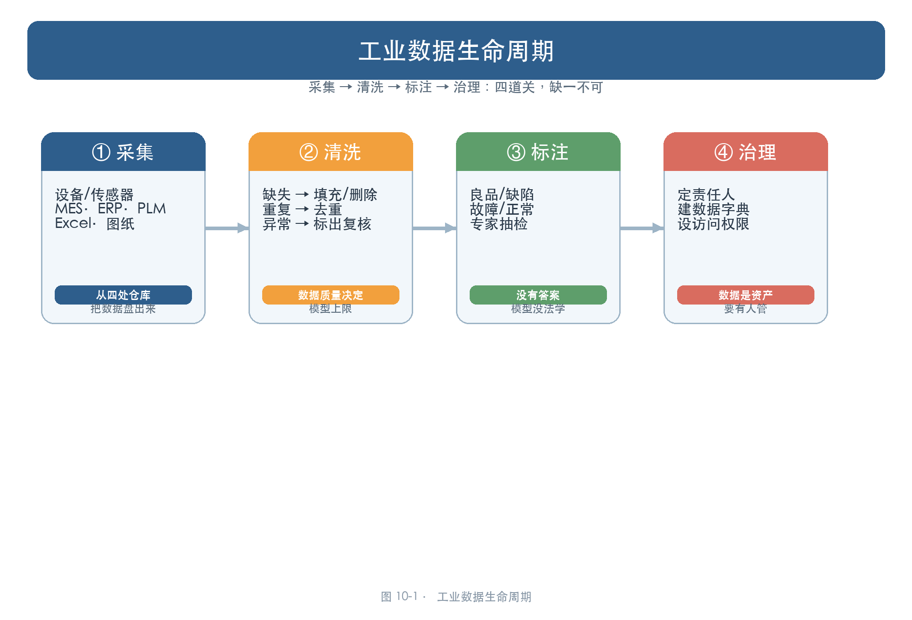
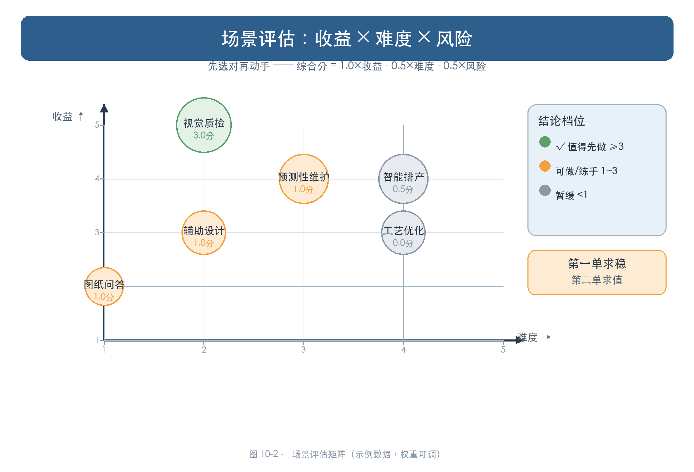
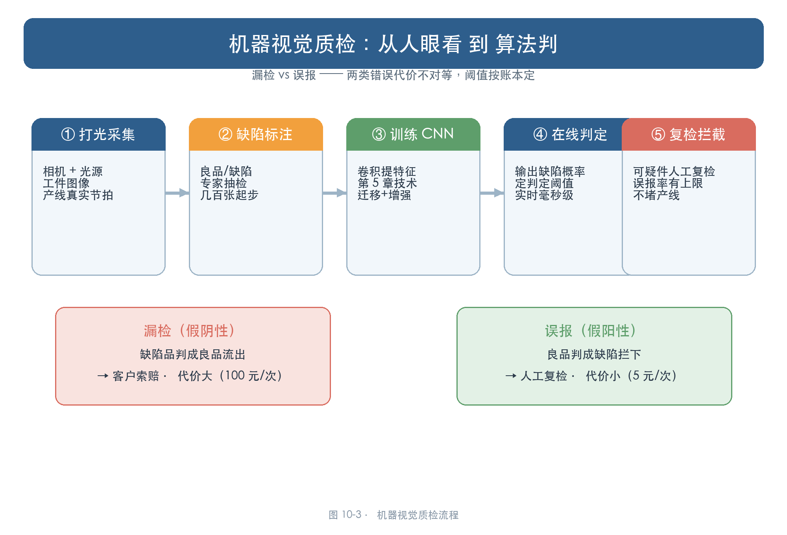
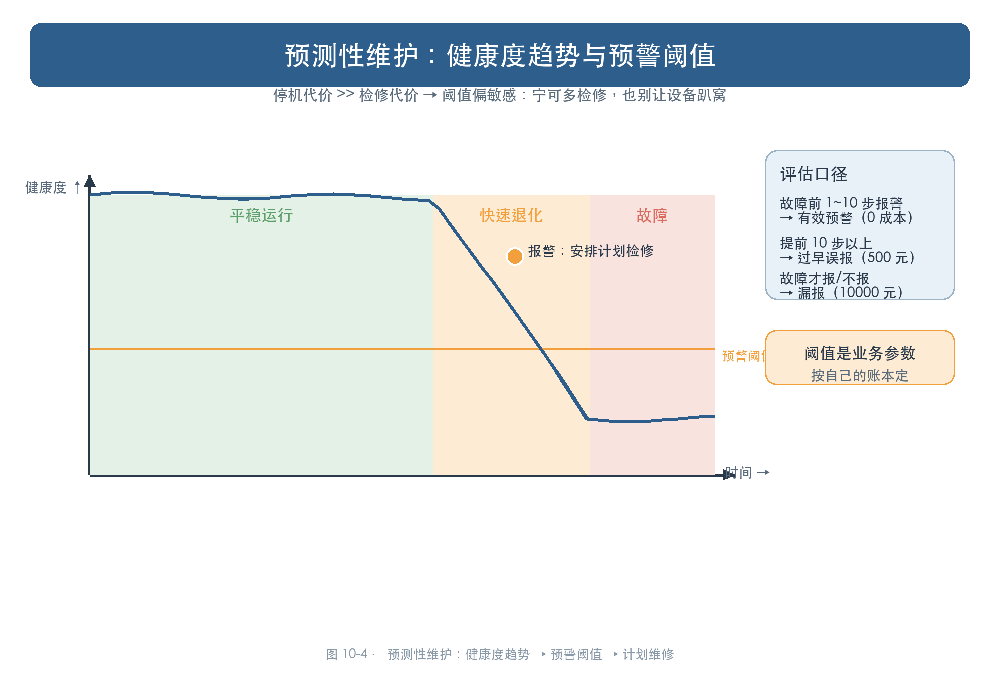
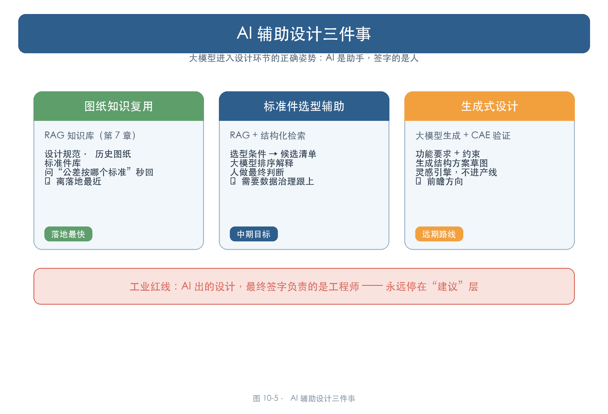
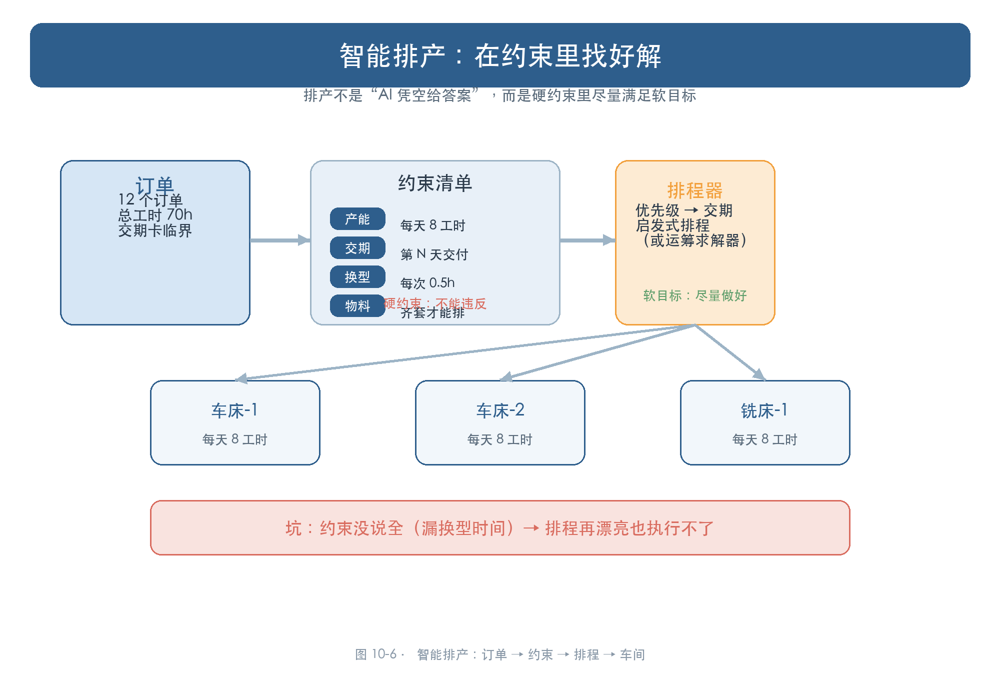
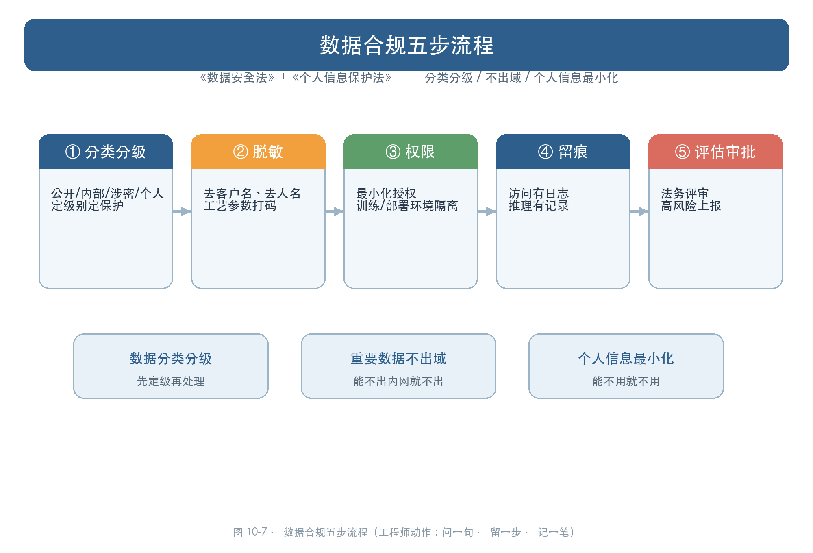
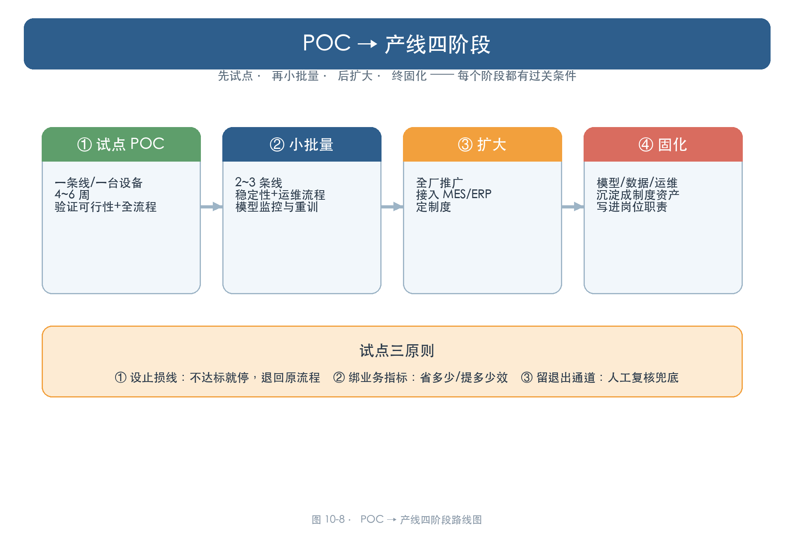

# 第 10 章 工业数据与 AI 落地：从会技术到会落地

> 所属框架层：L4 工业智能落地
> 预计篇幅：约 14,000 字（含可运行代码；10.1 为数据课，10.2 为场景盘点课，10.3~10.6 为四个落地场景课，10.7 为数据合规课，10.8 为试点方法论课，10.9 为完整配套项目）
> 配套文件：示例代码（`code/ch10/` 目录，10-1~10-6 已全部真实运行，输出见正文）、本章配图（SVG 源文件见 `figures/ch10/` 目录）、术语表第 10 章·L4 条目
> 版本：v0.1（首稿）

**本章验收标准**：学完后能不看资料回答——工业数据为什么"脏"、清洗的三道关是什么？厂里几十个环节，用什么方法挑出最值得上 AI 的前几个？四个工业场景（视觉质检 / 预测性维护 / 辅助设计 / 智能排产）各用前文哪一章的技术、各自的成本账怎么算、坑在哪里？数据安全法和个人信息保护法管的是哪三件事，企业合规五步流程是哪五步？POC 到产线要过哪五关、试点为什么要设止损线？配套项目"落地方案书"能独立完成：针对你所在企业，用评估表选场景、算成本账、填合规检查、写试点计划。

---

> **本章配图清单**（图号 / 内容 / 对应小节 / 类型）

| 图号 | 内容 | 对应小节 | 类型 |
|---|---|---|---|
| 图 10-1 | 工业数据生命周期：采集 → 清洗 → 标注 → 治理 | 10.1 | 流程四步图 |
| 图 10-2 | 场景评估：收益 × 难度 × 风险打分 | 10.2 / 10.9 | 评估矩阵图 |
| 图 10-3 | 机器视觉质检流程：打光采集 → 标注 → 模型 → 判定 | 10.3 | 流程图 |
| 图 10-4 | 预测性维护：健康度趋势 → 预警阈值 → 计划维修 | 10.4 | 趋势预警图 |
| 图 10-5 | AI 辅助设计三件事：生成式设计 / 标准件选型 / 图纸知识复用 | 10.5 | 三栏图 |
| 图 10-6 | 智能排产：订单 → 约束 → 排程 → 车间 | 10.6 | 流程图 |
| 图 10-7 | 数据合规五步：分类分级 → 脱敏 → 权限 → 留痕 → 评估 | 10.7 | 合规流程图 |
| 图 10-8 | POC → 产线四阶段：试点 → 小批量 → 扩大 → 固化 | 10.8 / 10.9 | 路线图 |

---

## 10.0 本章解决什么问题

这一章解决工程师学完 AI 之后最大的一个困惑：**技术我都会了，可回到厂里，到底该从哪儿下手？**

前九章，老张一路学下来：会写 Python（第 3 章）、懂机器学习（第 4 章）和深度学习（第 5 章）、会调大模型（第 6 章）、搭过知识库（第 7 章）、做过智能体（第 8 章）、能微调能部署（第 9 章）。技术栈看起来完整了，可真回到厂里，他发现自己面对三个新问题：

第一，**厂里的数据在哪、有多脏？** 设备日志在工控机里，工艺参数在老师傅脑子里，图纸在 PLM 系统里，检验记录在 Excel 表里——数据散得到处都是，而且缺、重、错样样都有。模型再好，喂进去的是脏数据，出来的就是垃圾结论。

第二，**厂里几十个环节，哪些最值得上 AI？** 质检能做、排产能做、设备维护能做、图纸检索也能做——但资源只有那么多。上错一个场景，半年白干。

第三，**怎么合规地做、怎么把试点做成产线？** 数据能不能出内网？用了客户图纸合不合法？试点跑通了，怎么扩大到全厂而不是烂尾？

一句话：**前九章教你"把 AI 用起来"，这一章教你"在真实工业环境里，把 AI 用对、用值、用稳"。**

学完这一章，你会拿到四样东西：一张"场景 × 收益 × 难度"评估表（10.2），四个工业场景的真实拆解（10.3~10.6，每个都有成本账和坑），一份数据合规流程清单（10.7），一条"POC → 产线"的试点路线图（10.8）。最后，用配套项目（10.9）针对自己企业写出一份"场景 × 落地方案书"——拿着它，你就可以去跟领导谈立项了。

## 10.1 工业数据的现实：数据在哪、为什么"脏"、怎么变干净

### 10.1.1 工业数据从哪来：数据散落在四个"仓库"里

老张想上 AI 项目，第一步不是写代码，而是先回答一个问题：**数据在哪儿？**

他把厂里转了一圈，发现工业数据散落在四个地方：

1. **设备与产线**：PLC、传感器的实时数据，工控机里的日志（温度、振动、电流、节拍、报警记录）；
2. **业务系统**：MES（制造执行系统）、ERP（企业资源计划）里的生产工单、质量检验、物料台账——第 2 章讲过的"数据库"在这里；
3. **研发系统**：CAD 图纸、CAE 仿真结果、PLM 里的产品数据、工艺文件、BOM 清单——这些在第 1 章已经打过照面；
4. **文档与个人电脑**：检验记录 Excel、工艺卡片 Word、老师傅笔记本里的经验参数——**这是最容易被忽视、也最难治理的一块**。

这四类数据，前两类相对"结构化"（有行有列、能进数据库），后两类是图纸和文档，处理方式完全不同（第 7 章 RAG 处理的正是这一类）。做 AI 项目的第一步，是把这四类数据盘一遍，列成一张清单：数据源在哪、什么格式、什么量级、谁负责。

### 10.1.2 为什么"脏"：数据质量决定模型上限

数据盘完了，第二个问题接踵而来：**数据干净吗？** 老张从设备日志导出一份"运行记录"，结果发现里面什么都有：温度列缺了好几个值、同一时刻的记录重复写了两遍、振动值里混着一个离谱的 88.5（正常只有 1~2）。

数据"脏"的四种典型形态：

- **缺失**：传感器偶尔断线、有人漏填，列就空了；
- **重复**：系统重复写入、多来源合并时同一记录出现两次；
- **异常**：传感器毛刺、人为录错，混进一个远超正常范围的数；
- **口径不一**：同一台设备，两个系统一个记"温度℃"、一个记"温度（华氏）"，日期格式也不同——这种最阴险，不对比根本发现不了。

为什么必须先把数据弄干净？因为一句铁律：**数据质量决定模型上限**。模型的能力天花板是数据给的——喂进去的是脏数据，模型再怎么调参，输出也不会超过数据本身的质量。这就像加工：毛坯料本身有缺陷，机床再精也加工不出合格的零件。数据清洗，就是 AI 项目的"来料检验"。

### 10.1.3 清洗动作清单：缺失、重复、异常三道关

数据清洗不是玄学，是三道标准动作：**缺失值处理 → 去重 → 异常值识别**。跑代码 10-1 看一套真实的清洗流程长什么样（零依赖，纯标准库，任何电脑都能跑）：

```python
"""
10-1 工业数据清洗最小演示：缺失、重复、异常值
================================================

配套《从工程师到 AI 工程师》第 10 章 10.1 节。

问题背景
--------
老张想给厂里做 AI 项目，第一步不是选模型，而是看清数据。
他从设备日志导出一份"运行记录"（CSV），发现里面什么都有：
缺温度、重复行、还有离谱的振动值。数据这么脏，模型再强也没用。

本演示做三件事（真实运行，零第三方依赖，纯标准库）：
  1. 读 CSV，看数据长什么样、有多脏；
  2. 三种清洗动作：缺失值处理（删除/填充）、重复行删除、异常值识别（3σ 法则）；
  3. 清洗前后对比，得出结论：数据干净了多少、哪些"异常"要人工再看一眼。

运行方式：离线真实运行，零第三方依赖。
"""

import csv
import math
import io
from statistics import mean, stdev

# ---------- 1. 一份"脏"的演示数据（模拟设备运行记录 CSV） ----------

RAW_CSV = """时间戳,温度℃,振动mm/s,电流A,状态
2026-09-01 08:00,45.2,1.1,12.4,运行
2026-09-01 08:05,45.8,1.2,12.6,运行
2026-09-01 08:10,,1.3,12.5,运行
2026-09-01 08:15,46.1,1.1,12.4,运行
2026-09-01 08:20,45.9,1.2,12.5,运行
2026-09-01 08:20,45.9,1.2,12.5,运行
2026-09-01 08:30,46.4,1.4,12.8,运行
2026-09-01 08:35,47.2,1.2,12.7,运行
2026-09-01 08:40,46.8,1.3,12.6,运行
2026-09-01 08:45,46.5,1.2,12.6,运行
2026-09-01 08:50,47.0,88.5,12.9,运行
2026-09-01 08:55,46.9,1.5,12.8,运行
2026-09-01 09:00,47.3,1.4,12.7,运行
2026-09-01 09:05,,1.3,12.6,运行
2026-09-01 09:10,47.8,1.5,12.9,运行
2026-09-01 09:15,48.0,1.6,13.1,运行
2026-09-01 09:20,48.3,1.5,13.0,运行
2026-09-01 09:25,48.5,1.6,13.2,运行
2026-09-01 09:30,48.2,1.5,13.1,运行
2026-09-01 09:35,48.8,1.7,13.3,运行
2026-09-01 09:40,48.6,1.6,13.2,运行
2026-09-01 09:45,49.0,1.7,13.4,运行
2026-09-01 09:50,49.2,1.8,13.5,运行
2026-09-01 09:55,49.5,1.7,13.4,运行
2026-09-01 10:00,49.8,1.8,13.6,运行
2026-09-01 10:05,50.1,1.9,13.8,运行
2026-09-01 10:10,50.4,1.8,13.7,运行
2026-09-01 10:15,50.8,2.0,14.0,运行
2026-09-01 10:20,51.0,1.9,14.1,运行
2026-09-01 10:25,51.3,2.1,14.3,运行
2026-09-01 10:30,51.5,2.0,14.2,运行
2026-09-01 10:35,52.0,2.2,14.5,运行
2026-09-01 10:40,52.3,2.1,14.4,运行
2026-09-01 10:45,52.6,2.3,14.6,运行
2026-09-01 10:50,52.9,2.2,14.5,运行
2026-09-01 10:55,53.2,2.4,14.8,运行
2026-09-01 11:00,53.5,2.3,14.7,运行
"""


def load_rows(text):
    """CSV 文本 → 行列表（每行 dict）。"""
    return list(csv.DictReader(io.StringIO(text)))


def col_values(rows, col):
    """取出某列全部值，None 表示缺失。"""
    return [None if (r[col] == "" or r[col].strip() == "") else float(r[col])
            for r in rows]


def fill_missing(rows, col):
    """缺失值填充：用该列均值填充，返回均值。"""
    vals = [v for v in col_values(rows, col) if v is not None]
    avg = mean(vals)
    for r in rows:
        if r[col] == "" or r[col].strip() == "":
            r[col] = f"{avg:.2f}"
    return avg


def remove_duplicates(rows):
    """删除完全重复的行，返回删除数。"""
    seen, keep, dup = set(), [], 0
    for r in rows:
        key = tuple(r.values())
        if key in seen:
            dup += 1
        else:
            seen.add(key)
            keep.append(r)
    return keep, dup


def flag_outliers(rows, col, k=3):
    """3σ 法则标异常：|x - μ| > kσ。返回 (标注行数, 上下界)。"""
    vals = [v for v in col_values(rows, col) if v is not None]
    mu, sigma = mean(vals), stdev(vals)
    lo, hi = mu - k * sigma, mu + k * sigma
    flagged = 0
    for r in rows:
        v = col_values([r], col)[0]
        if v is not None and (v < lo or v > hi):
            flagged += 1
    return flagged, (lo, hi)


# ---------- 2. 清洗流程 ----------

print("=" * 70)
print("一、原始数据：先看有多脏")
print("=" * 70)
rows = load_rows(RAW_CSV)
print(f"    共 {len(rows)} 行，字段：时间戳 / 温度 / 振动 / 电流 / 状态")

missing_temp = sum(1 for v in col_values(rows, "温度℃") if v is None)
missing_vib = sum(1 for v in col_values(rows, "振动mm/s") if v is None)
print(f"    缺失：温度 {missing_temp} 处、振动 {missing_vib} 处")
_, dup0 = remove_duplicates([dict(r) for r in rows])
print(f"    重复：{dup0} 行（08:20 那条被系统重复写入了两遍）")
flag0, _ = flag_outliers(rows, "振动mm/s")
print(f"    异常候选：振动列 3σ 检出 {flag0} 处（08:50 那条 88.5 明显是传感器毛刺）")

print()
print("=" * 70)
print("二、清洗动作")
print("=" * 70)

# 动作 1：缺失值填充（温度列均值填充）
avg_temp = fill_missing(rows, "温度℃")
print(f"    ① 缺失值：温度列均值填充为 {avg_temp:.1f}℃（共填 {missing_temp} 处）")

# 动作 2：删除重复
rows, dup = remove_duplicates(rows)
print(f"    ② 重复行：删除 {dup} 行（保留首次出现）")

# 动作 3：异常值识别（标出，交人工复核，不自动删）
flag1, (lo, hi) = flag_outliers(rows, "振动mm/s")
print(f"    ③ 异常值：振动列 3σ 边界 [{lo:.1f}, {hi:.1f}]，标出 {flag1} 处")
print("       → 工程做法：异常值先标出来人工复核，不急着删")
print("          （88.5 可能是传感器毛刺，也可能是真故障前兆）")

print()
print("=" * 70)
print("三、清洗前后对比")
print("=" * 70)
print(f"    行数：{len(load_rows(RAW_CSV))} → {len(rows)}（去重 {dup} 行）")
print(f"    缺失：{missing_temp + missing_vib} 处 → 0 处（填充）")
print(f"    异常：{flag0} 处 → 已标注待人工复核（未自动删除）")
print()
print("结论：")
print("  · 数据清洗 = 缺失/重复/异常三道关，每道关都有标准动作；")
print("  · '异常值'不要自动删——标注出来交人工复核，")
print("    它可能是脏数据，也可能是设备要出事的信号；")
print("  · 数据质量决定模型上限：脏数据进去，再好的模型也出不来。")
```

跑起来，输出是（节选关键部分）：

```
======================================================================
一、原始数据：先看有多脏
======================================================================
    共 37 行，字段：时间戳 / 温度 / 振动 / 电流 / 状态
    缺失：温度 2 处、振动 0 处
    重复：1 行（08:20 那条被系统重复写入了两遍）
    异常候选：振动列 3σ 检出 1 处（08:50 那条 88.5 明显是传感器毛刺）

======================================================================
二、清洗动作
======================================================================
    ① 缺失值：温度列均值填充为 49.0℃（共填 2 处）
    ② 重复行：删除 1 行（保留首次出现）
    ③ 异常值：振动列 3σ 边界 [-39.3, 47.5]，标出 1 处
       → 工程做法：异常值先标出来人工复核，不急着删
          （88.5 可能是传感器毛刺，也可能是真故障前兆）

======================================================================
三、清洗前后对比
======================================================================
    行数：37 → 36（去重 1 行）
    缺失：2 处 → 0 处（填充）
    异常：1 处 → 已标注待人工复核（未自动删除）
```

这套流程里有两个工程要点，值得单独拎出来：

第一，**缺失值"填还是删"，取决于用途和缺失比例**。就两三个空，均值填充即可；如果一列缺了一半，填充就没意义了，得考虑整列弃用或重新采集。第二，**异常值不要自动删**——这也是代码里最刻意的一步：那个 88.5 的振动值，可能是传感器毛刺，但也可能是设备要出大事的前兆（10.4 预测性维护正是靠这种"异常"吃饭的）。工程做法是：异常值先标出来，交给懂设备的人看一眼，再决定删还是留。

> **工程师贴士：数据清洗 = AI 项目的"来料检验"。** 干机械的都知道，毛坯进厂先检尺寸、查材质报告，不合格的料不上线——因为后面加工得再好也是白搭。数据之于模型，就是毛坯之于加工：清洗这一步偷的懒，最后都会以"模型不准"的形式加倍还回来。而且真正花时间的不是写清洗代码，而是**找懂业务的人确认口径**——"这个字段到底什么意思、异常值该删还是该留"，只有车间的人知道。

### 10.1.4 标注与治理：数据变成资产的最后两步

清洗干净之后，还有两道工序——**标注**和**治理**。

**标注（Data Annotation）**，是给数据"贴答案"：给每张零件图写上"合格/不合格"、给每段设备日志标上"故障/正常"。这是监督学习（第 4 章）的前提——没有答案，模型就不知道该往哪儿学。标注很费人力，所以有三个现实问题要提前想：标多少够用（通常先几百到几千条起步）、谁来标（业务专家标得准但贵，让 AI 预标注 + 人工抽检是常见折中）、标注质量怎么把关（两条规则：多人标同一批抽一致率、定期复核）。

**治理（Data Governance）**，是把数据当成资产管起来：谁负责、什么口径、怎么流转、谁能访问。听起来像管理问题，但它决定 AI 项目能不能持续——数据没人管，今天清洗好了，明天又脏了。治理的落地动作很朴素：给数据定责任人、建数据字典（字段口径写清楚）、设访问权限（呼应第 8 章的权限最小化）。图 10-1 把数据从散落各处到模型可用的全过程画出来：采集 → 清洗 → 标注 → 治理，四道关缺一不可。



## 10.2 场景盘点：收益 × 难度 × 风险，先选对再动手

### 10.2.1 为什么必须先盘场景：资源有限，失败代价高

数据课结束，老张开始想正事了：**厂里到底哪个环节最值得上 AI？**

他随便一数就出来十几个候选：视觉质检、预测性维护、AI 辅助设计、智能排产、工艺参数优化、图纸知识问答……每一个听着都"能做"。但现实是：团队就两三个人、预算就那么多、时间就半年。**上错一个场景，意味着半年白干，还烧掉了领导对 AI 的信心。** 所以选场景这件事，值得单独花一节来讲——它不是拍脑袋，而是一道评估题。

这里要先纠正一个常见误区：**"技术能不能做"不是选场景的第一标准，"值不值得做"才是。** 厂里一个环节技术上再成熟，如果价值很小，或者数据一塌糊涂（要补三年的数据），那就不值得先做。反过来，一个环节价值巨大，哪怕难度高一点，也值得认真评估。

### 10.2.2 三维评估法：收益、难度、风险

老张用的评估法只有三个维度，每个维度打 1~5 分：

- **收益**：这个环节上 AI 之后，省多少钱 / 提多少效？替代多少人工、减少多少废品流出、避免多少次停机？5 分 = 非常值。
- **难度**：数据就绪吗（有数据、干净、有标注）？技术成熟吗（是成熟 CV 还是前沿大模型）？5 分 = 很难。
- **风险**：判断错了代价多大（误判一件废品流出 vs 排产排错一天）？有合规约束吗（客户数据、涉密图纸）？5 分 = 高风险。

然后加权算综合分。权重怎么定？没有标准答案，它是**厂里的决策**——如果你们厂最缺人，收益权重就调高；如果最怕出事，风险权重就调高。跑代码 10-2 看一个完整的打分排序过程（零依赖，把候选场景换成你厂里的就能用）：

```python
"""
10-2 场景评估打分器：收益 × 难度 × 风险
==========================================

配套《从工程师到 AI 工程师》第 10 章 10.2 节。

问题背景
--------
老张的厂里可能有 AI 的地方一大把（质检、设备维护、排产、图纸检索……），
但资源有限，不能全上。他需要一张"场景 × 收益 × 难度"评估表，
打分排序，挑出最值得做的前几个。

本演示做三件事（真实运行，零第三方依赖）：
  1. 列出候选场景（读者可改成自己厂里的）；
  2. 每个场景在三个维度上打 1~5 分：
      收益    ：省多少钱 / 提多少效（5 = 非常值）
      难度    ：数据就绪 + 技术成熟（5 = 很难）
      风险    ：误判代价 / 合规约束（5 = 高风险）
  3. 加权算出综合分，排序并标出"值得先做"。

运行方式：离线真实运行，零第三方依赖。
"""

# ---------- 1. 参数：权重（读者可调） ----------

W_BENEFIT = 1.0    # 收益权重：值不值得做，占大头
W_DIFF = -0.5      # 难度权重：负号 = 越难越减分
W_RISK = -0.5      # 风险权重：负号 = 风险越高越减分

# ---------- 2. 候选场景（示例：老张厂里的 6 个候选，读者替换为自己的） ----------

# 每行：场景名, 收益分(1-5), 难度分(1-5), 风险分(1-5), 一句话理由
SCENARIOS = [
    ("视觉质检（外观缺陷检测）", 5, 2, 2, "替代人工目检，缺陷流出损失大，数据现成"),
    ("预测性维护（主轴/电机）", 4, 3, 3, "意外停机损失大，但故障样本少、传感器数据要整理"),
    ("AI 辅助设计（标准件选型）", 3, 2, 2, "省选型时间，RAG 技术现成，数据是内部标准好治理"),
    ("智能排产", 4, 4, 3, "排产靠老法师、易出错，但数据散在 MES/ERP，口径要统一"),
    ("工艺参数优化", 3, 4, 2, "老师傅经验难固化，验证周期长"),
    ("图纸知识问答", 2, 1, 1, "最容易起步（第 7 章技术），但价值相对小"),
]


def score(benefit, diff, risk):
    """加权综合分。"""
    return W_BENEFIT * benefit + W_DIFF * diff + W_RISK * risk


# ---------- 3. 计算与输出 ----------

print("=" * 78)
print("场景 × 收益 × 难度 × 风险 评估表（示例数据，权重可调）")
print("=" * 78)
print(f"{'场景':<24}{'收益':>6}{'难度':>6}{'风险':>6}{'综合分':>8}  结论")
print("-" * 78)

results = []
for name, b, d, r, note in SCENARIOS:
    s = score(b, d, r)
    results.append((name, b, d, r, s, note))

# 按综合分从高到低排序
results.sort(key=lambda x: x[4], reverse=True)

for name, b, d, r, s, note in results:
    if s >= 3.0:
        verdict = "√ 值得先做"
    elif s >= 1.0:
        verdict = "  可做（练手/储备）"
    else:
        verdict = "  暂缓"
    print(f"{name:<24}{b:>6}{d:>6}{r:>6}{s:>8.2f}  {verdict}  {note}")

print("-" * 78)
print("解读：")
print("  · 综合分 = 1.0×收益 - 0.5×难度 - 0.5×风险（满分 5 分，权重可改）；")
print("  · ≥3 分值得先做，1~3 分可做（练手或储备），<1 分暂缓——")
print("    排序结果不是真理，先做出一个小闭环再放大；")
print("  · 价值小但最容易起步的场景（如图纸问答），适合当'第一个练手项目'，")
print("    先建立流程信心，再上高价值场景。")
print()
print("读者用法：把 SCENARIOS 换成你厂里的候选场景，改权重，得到你的排序。")
```

真实运行输出：

```
==============================================================================
场景 × 收益 × 难度 × 风险 评估表（示例数据，权重可调）
==============================================================================
场景                          收益    难度    风险     综合分  结论
------------------------------------------------------------------------------
视觉质检（外观缺陷检测）                 5     2     2    3.00  √ 值得先做  替代人工目检，缺陷流出损失大，数据现成
预测性维护（主轴/电机）                 4     3     3    1.00    可做（练手/储备）  意外停机损失大，但故障样本少、传感器数据要整理
AI 辅助设计（标准件选型）               3     2     2    1.00    可做（练手/储备）  省选型时间，RAG 技术现成，数据是内部标准好治理
图纸知识问答                       2     1     1    1.00    可做（练手/储备）  最容易起步（第 7 章技术），但价值相对小
智能排产                         4     4     3    0.50    暂缓  排产靠老法师、易出错，但数据散在 MES/ERP，口径要统一
工艺参数优化                       3     4     2    0.00    暂缓  老师傅经验难固化，验证周期长
------------------------------------------------------------------------------
解读：
  · 综合分 = 1.0×收益 - 0.5×难度 - 0.5×风险（满分 5 分，权重可改）；
  · ≥3 分值得先做，1~3 分可做（练手或储备），<1 分暂缓——
    排序结果不是真理，先做出一个小闭环再放大；
  · 价值小但最容易起步的场景（如图纸问答），适合当'第一个练手项目'，
    先建立流程信心，再上高价值场景。

读者用法：把 SCENARIOS 换成你厂里的候选场景，改权重，得到你的排序。
```

### 10.2.3 结果怎么读：三条线 + 一个提醒

输出里画了三道线，含义是：

- **综合分 ≥ 3（值得先做）**：收益大、难度风险可控。老张的表里是视觉质检——数据现成、技术成熟（第 5 章 CNN 就能做）、价值大（缺陷流出损失大），典型的"第一单"候选；
- **1~3 分（可做，练手或储备）**：值得关注但不用急着砸资源。预测性维护、AI 辅助设计、图纸知识问答都在这档——要么数据要整理，要么价值有限；
- **< 1 分（暂缓）**：要么价值不足、要么难度风险太高。智能排产和工艺参数优化在这档——不是不能做，是**现在做不划算**：排产数据散在 MES/ERP 口径没统一，工艺优化验证周期太长。

一个提醒：**排序结果不是真理，是第一轮筛选。** 打分本身带着主观性，重要的是把候选从"十几个"缩到"两三个"，然后对这两三个做深度论证（数据盘点、成本账、试点计划——配套项目 10.9 就是干这个的）。

### 10.2.4 第一单怎么选：先赢一局，再上高价值场景

还有一个策略问题值得单独说：**第一个项目，选"高价值高难度"还是"低价值低难度"？**

老张的直觉是选价值最大的（视觉质检，3.0 分）。但很多企业现实的做法恰恰相反：**第一个项目选"最容易跑通"的（图纸知识问答，第 7 章技术现成），先建立流程信心，再上高价值场景。** 理由很实在：第一次上 AI，团队要磨合（数据怎么给、模型怎么审、交付怎么验收），领导要建立信任，这些"流程账"比"技术账"更重要。第一个项目小、稳、快，让所有人看到 AI 真的能用，第二个项目才有资源上大的。

所以图 10-2 的评估矩阵背后，还有一个决策口诀：**第一单求稳、第二单求值**。先用最容易的跑通全流程，再用挣到的信任做最有价值的。



## 10.3 场景一 · 视觉质检：从"人眼看"到"算法判"

### 10.3.1 场景价值：为什么质检是 AI 落地第一热门

视觉质检（机器视觉检测）几乎是制造业 AI 落地最经典的第一站，原因有三：**价值大、数据相对现成、技术成熟。**

价值大：缺陷品流出到客户手里，轻则索赔、重则丢订单。人工目检本身有三个硬伤——**累**（盯久了就走神）、**慢**（每件都要看）、**标准不统一**（同一个人上半夜和下半夜判得都不一样）。AI 用摄像头 + 模型替代人眼，24 小时标准一致。

技术成熟：第 5 章学的卷积神经网络（CNN），干的就是"看图分类"这件事。工业视觉的完整流程如图 10-3：打光采集 → 标注 → 训练模型 → 在线判定。

### 10.3.2 技术映射：前几章的东西在这里怎么用

视觉质检把前面学过的技术串起来了：

- **数据**（10.1）：从产线采集工件图像，标注"良品/缺陷"——注意工业缺陷样本天然稀缺（良品几千张、缺陷几十张），这是第一个坑；
- **模型**（第 5 章）：CNN 图像分类。缺陷很小的场景要升级成"目标检测"（在图上框出缺陷位置），原理仍是卷积特征提取；
- **部署**（第 9 章）：模型要跑在产线旁边的"算力盒子"（边缘设备）上，实时判定、延迟毫秒级——不可能把每张图传云端等几秒再判。

### 10.3.3 关键概念：漏检 vs 误报，两类错误代价不对等

真正的工业场景里，模型判断不是"对/错"两个答案，而是输出一个**缺陷概率**——"这工件有 72% 可能是缺陷"。接下来定多少为"判缺陷"，这个**判定阈值**决定了模型在产线上实际怎么表现，而且引出一对工业上极其重要的概念：

- **漏检（假阴性）**：缺陷品被判成良品，流出到客户 → 索赔、返工、丢订单，**代价大**；
- **误报（假阳性）**：良品被判成缺陷，被拦下来 → 人工复检一下就行，**代价小**。

关键认知：**两类错误的代价不对等，所以阈值不能拍脑袋，要按成本账来定。** 跑代码 10-3 看完整实验——合成图像数据、训练一个小 CNN、用不同阈值测试、代入成本算最优阈值（torch CPU 秒级）：

```python
"""
10-3 视觉质检玩具演示：漏检 vs 误报，阈值怎么定
==================================================

配套《从工程师到 AI 工程师》第 10 章 10.3 节。

问题背景
--------
老张要上"机器视觉质检"：摄像头拍工件，模型判断"良品/缺陷"。
但模型判断不是非黑即白——它输出一个"缺陷概率"，
定多少为"判缺陷"（判定阈值）直接影响两类错误：
  · 漏检（False Negative）：缺陷品被判成良品流出 → 客户索赔，代价大；
  · 误报（False Positive）：良品被判成缺陷被拦下 → 人工复检，代价小。
两张错误的代价不对等，阈值不能拍脑袋。

本演示（真实运行，torch CPU）：
  1. 合成"工件图像"数据（良品/带凹坑缺陷，加噪声），训练一个小 CNN；
  2. 用不同判定阈值做测试，统计漏检率 / 误报率；
  3. 代入成本（漏检 100 元/次、误报 5 元/次），算出最优阈值。

运行方式：CPU 真实运行（秒级），依赖 torch（CPU 版）。
"""

import numpy as np
import torch
import torch.nn as nn

torch.manual_seed(42)
np.random.seed(42)

# ---------- 1. 合成数据：16×16 的"工件图像" ----------

SIZE = 16


def make_image(label, rng):
    """生成一张工件图：主体矩形 + 轻微噪声；label=1 时加划痕或凹坑（缺陷）。"""
    img = np.zeros((SIZE, SIZE), dtype=np.float32)
    img[3:13, 3:13] = 1.0                     # 工件主体
    img += rng.normal(0, 0.02, (SIZE, SIZE))  # 拍摄噪声（轻微）
    if label == 1:
        if rng.random() < 0.7:
            # 划痕：一条 5 像素的暗线（水平或垂直），穿过工件内部
            if rng.random() < 0.5:
                row = int(rng.integers(4, 12))
                col = int(rng.integers(4, 8))
                for c in range(col, col + 5):
                    img[row, c] = 0.0
            else:
                col = int(rng.integers(4, 12))
                row = int(rng.integers(4, 8))
                for r in range(row, row + 5):
                    img[r, col] = 0.0
        else:
            # 凹坑：2×2 暗块
            x = int(rng.integers(4, 12))
            y = int(rng.integers(4, 12))
            img[x, y] = 0.0
            img[x + 1, y] = 0.0
            img[x, y + 1] = 0.0
            img[x + 1, y + 1] = 0.0
    return np.clip(img, 0.0, 1.0)


def make_dataset(n, rng):
    xs, ys = [], []
    for _ in range(n):
        label = int(rng.random() < 0.5)
        xs.append(make_image(label, rng))
        ys.append(label)
    x = torch.tensor(np.stack(xs)[:, None, :, :])   # (N,1,16,16)
    y = torch.tensor(ys, dtype=torch.long)
    return x, y


rng = np.random.default_rng(1)
X_train, y_train = make_dataset(1000, rng)
X_test, y_test = make_dataset(300, rng)
print(f"训练集：{len(X_train)} 张（良品/缺陷各半）；测试集：{len(X_test)} 张")

# ---------- 2. 小 CNN（第 5 章讲过：卷积层提特征 → 全连接层分类） ----------

class TinyCNN(nn.Module):
    def __init__(self):
        super().__init__()
        self.conv = nn.Sequential(
            nn.Conv2d(1, 4, 3, padding=1), nn.ReLU(),
            nn.Conv2d(4, 8, 3, padding=1), nn.ReLU(),
        )
        self.fc = nn.Linear(8 * SIZE * SIZE, 2)

    def forward(self, x):
        h = self.conv(x)
        return self.fc(h.flatten(1))


model = TinyCNN()
opt = torch.optim.Adam(model.parameters(), lr=1e-3)
lossf = nn.CrossEntropyLoss()

print("\n训练小 CNN（30 轮，CPU 秒级）……")
for epoch in range(30):
    opt.zero_grad()
    loss = lossf(model(X_train), y_train)
    loss.backward()
    opt.step()
    if (epoch + 1) % 5 == 0:
        acc = (model(X_test).argmax(1) == y_test).float().mean().item()
        print(f"  epoch {epoch + 1:>2}: 损失 {loss.item():.3f}，测试准确率 {acc:.3f}")

# ---------- 3. 阈值实验：漏检 vs 误报 ----------

with torch.no_grad():
    prob_defect = torch.softmax(model(X_test), 1)[:, 1]   # 缺陷概率
    is_defect = (y_test == 1).numpy()
    prob = prob_defect.numpy()

print("\n" + "=" * 70)
print("阈值实验：缺陷概率 ≥ 阈值 → 判缺陷")
print("=" * 70)

COST_MISS = 100.0    # 漏检代价：缺陷品流出，客户索赔/返工
COST_FALSE = 5.0     # 误报代价：良品被拦，人工复检

print(f"{'阈值':>6}{'漏检率':>10}{'误报率':>10}{'漏检数':>8}{'误报数':>8}{'总成本(元)':>12}")
best = None
rows = []
for t in [0.3, 0.4, 0.5, 0.6, 0.7, 0.8]:
    pred_defect = prob >= t
    fn = int(((pred_defect == False) & is_defect).sum())     # 漏检：真缺陷判良品
    fp = int(((pred_defect == True) & (~is_defect)).sum())   # 误报：良品判缺陷
    fn_rate = fn / is_defect.sum()
    fp_rate = fp / (~is_defect).sum()
    cost = fn * COST_MISS + fp * COST_FALSE
    rows.append((t, fn_rate, fp_rate, fn, fp, cost))
    flag = ""
    if best is None or cost < best[1]:
        best = (t, cost, fn, fp)
        flag = "  ← 当前最优"
    print(f"{t:>6.1f}{fn_rate:>10.3f}{fp_rate:>10.3f}{fn:>8}{fp:>8}{cost:>12.0f}{flag}")

# 工程约束：误报率上限 10%——产线复检资源有限，误报太多会堵死
print("-" * 70)
print("工程约束视角：误报率 > 10% 的阈值产线根本跑不动（复检堆成山），剔除后再选：")
constr_rows = [r for r in rows if r[2] <= 0.10]
best2 = min(constr_rows, key=lambda r: r[5])
print(f"  约束（误报率 ≤ 10%）下最优：阈值 {best2[0]}（漏检 {best2[3]} 次 × 100 元 + "
      f"误报 {best2[4]} 次 × 5 元 = {best2[5]:.0f} 元，误报率 {best2[2]:.1%}）")
print(f"  对比：无约束时最优阈值 {best[0]} 虽然账上成本低（{best[1]:.0f} 元），但误报率太高，不可上线。")

print("-" * 70)
print(f"结论：本批数据最优阈值 {best[0]}（漏检 {best[2]} 次 × 100 元 + 误报 {best[3]} 次 × 5 元 = {best[1]:.0f} 元）")
print("  · 阈值往低调 → 漏检少、误报多；往高调 → 漏检多、误报少；")
print("  · 因为漏检代价（100 元）远大于误报（5 元），最优阈值偏'保守'：")
print("    宁可多拦几个良品，也别放走一个缺陷品；")
print("  · 但'账上最优'还要过'工程约束'（误报率上限）——两张错误代价的比例，")
print("    加上产线能承受的误报率，一起决定最终阈值；")
print("  · 换一条产线、换一种缺陷，代价比例变了，阈值要重定——")
print("    这就是'误判成本账'：先把账算清楚，再谈模型好不好。")
```

真实运行输出：

```
训练集：1000 张（良品/缺陷各半）；测试集：300 张

训练小 CNN（30 轮，CPU 秒级）……
  epoch  5: 损失 0.681，测试准确率 0.437
  epoch 10: 损失 0.663，测试准确率 0.963
  epoch 15: 损失 0.638，测试准确率 0.937
  epoch 20: 损失 0.606，测试准确率 0.957
  epoch 25: 损失 0.570，测试准确率 0.960
  epoch 30: 损失 0.531，测试准确率 0.933

======================================================================
阈值实验：缺陷概率 ≥ 阈值 → 判缺陷
======================================================================
    阈值       漏检率       误报率     漏检数     误报数      总成本(元)
   0.3     0.000     1.000       0     167         835  ← 当前最优
   0.4     0.023     0.898       3     150        1050
   0.5     0.150     0.000      20       0        2000
   0.6     0.444     0.000      59       0        5900
   0.7     0.865     0.000     115       0       11500
   0.8     1.000     0.000     133       0       13300
----------------------------------------------------------------------
工程约束视角：误报率 > 10% 的阈值产线根本跑不动（复检堆成山），剔除后再选：
  约束（误报率 ≤ 10%）下最优：阈值 0.5（漏检 20 次 × 100 元 + 误报 0 次 × 5 元 = 2000 元，误报率 0.0%）
  对比：无约束时最优阈值 0.3 虽然账上成本低（835 元），但误报率太高，不可上线。
----------------------------------------------------------------------
结论：本批数据最优阈值 0.3（漏检 0 次 × 100 元 + 误报 167 次 × 5 元 = 835 元）
  · 阈值往低调 → 漏检少、误报多；往高调 → 漏检多、误报少；
  · 因为漏检代价（100 元）远大于误报（5 元），最优阈值偏'保守'：
    宁可多拦几个良品，也别放走一个缺陷品；
  · 但'账上最优'还要过'工程约束'（误报率上限）——两张错误代价的比例，
    加上产线能承受的误报率，一起决定最终阈值；
  · 换一条产线、换一种缺陷，代价比例变了，阈值要重定——
    这就是'误判成本账'：先把账算清楚，再谈模型好不好。
```

### 10.3.4 结果解读与落地坑

这段输出是**真实工业决策的缩影**，两点最值得记：

第一，**"账上最优"不等于"能上线"**。从纯成本看，阈值 0.3 最便宜（835 元），但它的误报率是 100%——300 张里 167 张良品全被拦下来复检。产线一天几万件，误报率 10% 都能让复检工位堆成山，100% 直接堵死产线。所以工程上先划一条"误报率 ≤ 10%"的约束线，再在约束内选最优：阈值 0.5，账上 2000 元，但误报率 0%，可上线。

第二，**阈值是业务参数，不是模型参数**。模型训练完，阈值不是"调参调出来的"，而是拿产线的成本账算出来的——漏检代价 100 元、误报代价 5 元，比例 20:1，所以阈值偏保守（宁拦错、不放走）。换一条缺陷代价不同的产线，阈值就要重算。

落地还有三个坑要提前知道：**坑一，缺陷样本太少**——工业场景缺陷率可能只有 0.1%，收集几百张缺陷图要几个月；折中办法是"迁移学习 + 数据增强"（第 5 章讲过），或用合成缺陷图。**坑二，打光和相机位置比模型更重要**——同一个模型，光源一换，准确率能掉 10 个点；项目预算里相机、光源、工装的钱常常比算力贵。**坑三，部署环境**——产线旁边要放算力盒子（边缘计算），模型要量化压缩（第 9 章），还得防灰尘、防高温。



## 10.4 场景二 · 预测性维护：在设备趴窝之前修好它

### 10.4.1 场景价值：意外停机，一天损失可能顶半年利润

预测性维护（Predictive Maintenance）是制造业 AI 的第二大热门场景，它解决的是一个最痛的问题：**设备意外停机。**

在真实工厂里，一台关键设备（主轴、电机、压缩机）意外停机，可能是半天、一天的产线停摆，连带交期延误、客户索赔——这个损失往往大得吓人。传统做法只有两招：**坏了再修**（被动，代价最大）和**定期检修**（主动但浪费——很多设备没到该修的时候就拆了，白花钱还折寿）。预测性维护要做的，是第三招：**用传感器数据预测设备还能撑多久，在它真坏之前安排维修。**

### 10.4.2 技术映射：时间序列、回归与特征工程

预测性维护用到前面学过的三类技术：

- **剩余寿命预测**（第 4 章回归）：用最近一段时间的健康度数据，预测"还能正常运行多少步/多少天"——这是个回归问题；
- **异常检测**（10.1 的 3σ 只是最简单的版本）：设备一出现异常征兆就报警，工业上常用更复杂的"多变量监控"（同时看温度、振动、电流多个通道）；
- **特征工程**（第 4 章）：光给原始传感器值，模型很难分辨"平稳运行"和"开始退化"——加上**趋势特征**（比如最近 8 步的斜率），模型一眼就能看出来。这一点在代码里特意做了演示。

### 10.4.3 关键概念：预警阈值 = 业务参数，按代价比来定

和视觉质检的"判定阈值"一样，预测性维护也有一个业务参数：**提前多久报警。**

- 提前太多 → 设备还没坏就停机检修（**过早误报**）：白白检修一次，有成本；
- 提前太少 / 不报 → 设备真坏了才停（**漏报**）：产线停摆，代价巨大。

停机损失和检修成本的比例，决定了阈值该"敏感"还是"迟钝"。跑代码 10-4 看完整实验——合成设备健康度轨迹、训练小 MLP 预测剩余寿命、模拟在线预警并代入成本（torch CPU 秒级）：

```python
"""
10-4 预测性维护玩具演示：预警阈值怎么定
==========================================

配套《从工程师到 AI 工程师》第 10 章 10.4 节。

问题背景
--------
老张想给关键设备（主轴/电机）做"预测性维护"：
用传感器数据预测设备还能撑多久，提前安排维修，避免意外停机。
但"提前多久报警"是个权衡：
  · 提前太多 → 设备还没坏就维修（误报），白白停机检修，有成本；
  · 提前太少 / 没报警 → 设备真坏了才停（漏报），产线停摆，代价巨大。

本演示（真实运行，torch CPU）：
  1. 合成一批设备的"健康度轨迹"（平稳运行 → 临近故障快速退化 → 故障），
  2. 用最近 8 步健康度预测"剩余寿命"，训练一个小 MLP；
  3. 模拟在线预警：不同预警阈值下，统计"有效预警 / 过早误报 / 漏报"，
     代入成本（误报 500 元、停机 10000 元），算出最优阈值。

运行方式：CPU 真实运行（秒级），依赖 torch（CPU 版）。
"""

import numpy as np
import torch
import torch.nn as nn

torch.manual_seed(42)
np.random.seed(42)

# ---------- 1. 合成设备健康度轨迹 ----------

N_DEV, T_MAX = 300, 100     # 300 台设备，每台最多 100 个时间步
WIN = 8                     # 特征窗口：最近 8 步健康度


def make_trajectory(rng):
    """
    健康度 h(t)：平稳段（约 1.0）→ 退化段（故障前 20~40 步快速下降）→ 故障（0.15~0.25）。
    每台设备退化时长与故障后健康度都随机——模拟真实设备差异：
    有的设备'拖很久才坏'，有的'说坏就坏'。
    """
    t_f = int(rng.uniform(60, 95))                # 故障时刻随机
    t_deg_len = int(rng.uniform(20, 40))          # 退化时长随机
    t_degrade = t_f - t_deg_len                    # 退化开始时刻
    h_fail = float(rng.uniform(0.15, 0.25))        # 故障后健康度随机
    h = np.zeros(T_MAX)
    for t in range(T_MAX):
        if t < t_degrade:
            h[t] = 1.0 - 0.001 * t + rng.normal(0, 0.01)              # 平稳段
        elif t < t_f:
            k = (t - t_degrade) / t_deg_len                           # 0→1 线性退化
            h[t] = 1.0 - (1.0 - h_fail) * k + rng.normal(0, 0.01)     # 快速下降
        else:
            h[t] = h_fail + rng.normal(0, 0.01)                       # 故障后
    return np.clip(h, 0.0, 1.0), t_f


rng = np.random.default_rng(1)
trajectories = [make_trajectory(rng) for _ in range(N_DEV)]


def build_samples(h, t_f):
    """
    特征：最近 8 步健康度 + 窗口斜率（趋势）——这是"特征工程"：
    光给原始值，模型很难分辨'平稳'和'退化'；加上斜率，一眼就能看出来。
    标签：剩余寿命 = (t_f - t)/30，归一化 0~1。
    """
    xs, ys = [], []
    for t in range(WIN, T_MAX):
        window = h[t - WIN:t]
        slope = (window[-1] - window[0]) / (WIN - 1)     # 趋势特征
        xs.append(np.concatenate([window, [slope]]))
        ys.append(min(max((t_f - t) / 30.0, 0.0), 1.0))
    return np.array(xs, dtype=np.float32), np.array(ys, dtype=np.float32)


# 按设备切分：前 240 台训练、后 60 台测试
train_n = int(N_DEV * 0.8)
X_train, Y_train = [], []
X_test, Y_test = [], []
for i, (h, t_f) in enumerate(trajectories):
    x, y = build_samples(h, t_f)
    if i < train_n:
        X_train.append(x)
        Y_train.append(y)
    else:
        X_test.append(x)
        Y_test.append(y)
X_train = torch.tensor(np.concatenate(X_train))       # (N,8)
Y_train = torch.tensor(np.concatenate(Y_train)[:, None])
X_test = torch.tensor(np.concatenate(X_test))
Y_test = torch.tensor(np.concatenate(Y_test)[:, None])

print(f"训练样本：{len(X_train)} 条（{train_n} 台设备）；测试样本：{len(X_test)} 条（{N_DEV - train_n} 台设备）")
print(f"特征：最近 {WIN} 步健康度 + 趋势斜率（共 {WIN + 1} 维）；标签：剩余寿命（归一化 0~1）")

# ---------- 2. 小 MLP：8 维特征 → 预测剩余寿命 ----------

model = nn.Sequential(nn.Linear(WIN + 1, 64), nn.ReLU(), nn.Linear(64, 1))
opt = torch.optim.Adam(model.parameters(), lr=1e-2)
lossf = nn.MSELoss()

# 样本加权：退化/故障段（剩余寿命 < 0.6）权重 3，平稳段权重 1——
# 避免模型被大量"健康样本"带偏（健康样本多，但真正要学的是退化规律）
train_w = torch.where(Y_train < 0.6,
                      torch.full_like(Y_train, 3.0),
                      torch.full_like(Y_train, 1.0))

print("\n训练小 MLP（20 轮，CPU 秒级）……")
for epoch in range(20):
    opt.zero_grad()
    loss = (lossf(model(X_train), Y_train) * train_w).mean()
    loss.backward()
    opt.step()
    with torch.no_grad():
        mae = (model(X_test) - Y_test).abs().mean().item()
    if (epoch + 1) % 5 == 0:
        print(f"  epoch {epoch + 1:>2}: 损失 {loss.item():.5f}，测试平均绝对误差 {mae:.3f}")

# 抽样：3 台测试设备"临近故障段"的预测 vs 真实
print("\n抽样：3 台测试设备临近故障段（真实剩余寿命 < 0.6）的预测 vs 真实")
for dev in range(3):
    h, t_f = trajectories[train_n + dev]
    x, y = build_samples(h, t_f)
    with torch.no_grad():
        p = model(torch.tensor(x)).numpy().ravel()
    print(f"  设备 {dev + 1}（故障时刻 t = {t_f}）：")
    for t in [t_f - 24, t_f - 12, t_f - 4]:
        idx = t - WIN
        if 0 <= idx < len(y):
            print(f"    距故障 {t_f - t:>2} 步：预测剩余寿命 {p[idx]:.3f}，真实 {y[idx]:.3f}")

# ---------- 3. 预警阈值实验：提前报警的代价 ----------

COST_FALSE_ALARM = 500.0     # 误报：没坏就去修，一次检修成本
COST_DOWNTIME = 10000.0      # 漏报：真坏了才停，产线停机损失

print("\n" + "=" * 70)
print("预警策略：预测剩余寿命 < 阈值 → 触发报警（安排检修）")
print("评估口径（每台设备，只记第一次报警）：")
print("  · 故障前 1~10 步内报警 → 有效预警（正好提前发现，成本记 0）")
print("  · 故障前 10 步以上报警 → 过早误报（设备没坏就检修，一次检修成本）")
print("  · 直到故障都没报警（或报警晚于故障）→ 漏报（一次停机损失）")
print("=" * 70)

print(f"{'预警阈值':>8}{'有效预警':>10}{'过早误报':>10}{'漏报':>8}{'总成本(元)':>12}")
best = None
for th in [0.15, 0.25, 0.35, 0.45, 0.55, 0.65]:
    n_ok, n_false, n_miss = 0, 0, 0
    for i in range(train_n, N_DEV):
        h, t_f = trajectories[i]
        x, y = build_samples(h, t_f)
        with torch.no_grad():
            p = model(torch.tensor(x)).numpy().ravel()
        # 找第一次报警时刻（预测剩余寿命 < th）
        alarm_idx = np.where(p < th)[0]
        if len(alarm_idx) == 0:
            n_miss += 1
        else:
            first = alarm_idx[0] + WIN          # 报警时的真实时刻
            lead = t_f - first                  # 提前量（步）
            if 1 <= lead <= 10:
                n_ok += 1
            elif lead > 10:
                n_false += 1
            else:
                n_miss += 1                     # 报警晚于故障
    cost = n_false * COST_FALSE_ALARM + n_miss * COST_DOWNTIME
    flag = ""
    if best is None or cost < best[1]:
        best = (th, cost, n_ok, n_false, n_miss)
        flag = "  ← 当前最优"
    print(f"{th:>8.2f}{n_ok:>10}{n_false:>10}{n_miss:>8}{cost:>12.0f}{flag}")

print("-" * 70)
print(f"结论：本批数据最优预警阈值 {best[0]}（有效预警 {best[2]} 台、"
      f"过早误报 {best[3]} 台、漏报 {best[4]} 台，总成本 {best[1]:.0f} 元）")
print("  · 阈值调高（更容易报警）→ 漏报少、误报多；调低 → 相反；")
print("  · 停机代价（10000 元）远大于一次检修（500 元），所以最优阈值偏'敏感'：")
print("    宁可多检修几次，也别让设备真趴窝；")
print("  · 阈值不是模型参数，是'业务参数'——取决于停机损失与检修成本的比例，")
print("    每家厂的比例不一样，阈值要按自己的账本定。")
```

真实运行输出：

```
训练样本：22080 条（240 台设备）；测试样本：5520 条（60 台设备）
特征：最近 8 步健康度 + 趋势斜率（共 9 维）；标签：剩余寿命（归一化 0~1）

训练小 MLP（20 轮，CPU 秒级）……
  epoch  5: 损失 0.19350，测试平均绝对误差 0.216
  epoch 10: 损失 0.24130，测试平均绝对误差 0.337
  epoch 15: 损失 0.05171，测试平均绝对误差 0.149
  epoch 20: 损失 0.09610，测试平均绝对误差 0.192

抽样：3 台测试设备临近故障段（真实剩余寿命 < 0.6）的预测 vs 真实
  设备 1（故障时刻 t = 93）：
    距故障 24 步：预测剩余寿命 0.674，真实 0.800
    距故障 12 步：预测剩余寿命 0.494，真实 0.400
    距故障  4 步：预测剩余寿命 0.272，真实 0.133
  设备 2（故障时刻 t = 85）：
    距故障 24 步：预测剩余寿命 0.671，真实 0.800
    距故障 12 步：预测剩余寿命 0.548，真实 0.400
    距故障  4 步：预测剩余寿命 0.321，真实 0.133
  设备 3（故障时刻 t = 74）：
    距故障 24 步：预测剩余寿命 0.682，真实 0.800
    距故障 12 步：预测剩余寿命 0.469，真实 0.400
    距故障  4 步：预测剩余寿命 0.290，真实 0.133

======================================================================
预警策略：预测剩余寿命 < 阈值 → 触发报警（安排检修）
评估口径（每台设备，只记第一次报警）：
  · 故障前 1~10 步内报警 → 有效预警（正好提前发现，成本记 0）
  · 故障前 10 步以上报警 → 过早误报（设备没坏就检修，一次检修成本）
  · 直到故障都没报警（或报警晚于故障）→ 漏报（一次停机损失）
======================================================================
    预警阈值      有效预警      过早误报      漏报      总成本(元)
    0.15         3         0      57      570000  ← 当前最优
    0.25        55         0       5       50000  ← 当前最优
    0.35        53         7       0        3500  ← 当前最优
    0.45        23        37       0       18500
    0.55         9        51       0       25500
    0.65         0        60       0       30000
----------------------------------------------------------------------
结论：本批数据最优预警阈值 0.35（有效预警 53 台、过早误报 7 台、漏报 0 台，总成本 3500 元）
  · 阈值调高（更容易报警）→ 漏报少、误报多；调低 → 相反；
  · 停机代价（10000 元）远大于一次检修（500 元），所以最优阈值偏'敏感'：
    宁可多检修几次，也别让设备真趴窝；
  · 阈值不是模型参数，是'业务参数'——取决于停机损失与检修成本的比例，
    每家厂的比例不一样，阈值要按自己的账本定。
```

### 10.4.4 结果解读：注意三个细节

这段输出有三个值得细看的细节：

**细节一，特征工程的威力**。抽样输出里，距故障 24 步时预测 0.674 vs 真实 0.800（偏差大），但距故障 12 步时 0.494 vs 0.400、距故障 4 步时 0.272 vs 0.133——越接近故障，预测越准。这正是加了"趋势斜率"特征的效果：退化一旦开始，模型立刻能跟上。真实项目里，特征工程（把原始信号变成模型能懂的"形状"）常常比模型结构更重要。

**细节二，样本加权**。训练时代码特意给"退化/故障段"的样本权重 3、平稳段权重 1。为什么？因为设备 90% 的时间是平稳运行的，健康样本占绝大多数——不加权，模型会偷懒，把所有样本都预测成"很健康"，因为这样平均误差最小。**它真正要学的是那 10% 的退化规律**，所以给稀有样本加权。这是工业数据不平衡场景的标准打法（和第 4 章的类别不平衡一脉相承）。

**细节三，成本账的结论方向与质检相反**。质检因为漏检代价大，阈值偏保守（宁拦错）；预测性维护因为停机代价（10000 元）远超检修（500 元），阈值偏敏感（宁可多检修几次，也别让设备趴窝）。**两个场景的"最优策略"完全相反，但背后的逻辑完全一致：按代价比定业务参数。**

### 10.4.5 落地坑：故障样本稀缺是最大的拦路虎

预测性维护落地最大的坑是**故障样本稀缺**：设备一年坏两次，你哪来几千条"故障数据"训练模型？三个现实解法：**一是用好"近故障"样本**——设备没坏，但历史上有过异常征兆的记录，可以当弱标签用；**二是迁移**——同型号设备多台，A 台坏了，B 台的同期数据就是训练样本；**三是先跑"监控 + 阈值"**——不上深度学习，先用简单的异常检测（比如多通道 3σ、控制图）跑起来收集数据，数据攒够了再上剩余寿命预测。**从简单方案起步、边跑边攒数据**，是这类项目最务实的路径。图 10-4 画出了健康度趋势、预警阈值和计划维修之间的关系。



## 10.5 场景三 · AI 辅助设计：大模型进入设计环节的正确姿势

### 10.5.1 场景价值：设计是制造业的"源头杠杆"

前面两个场景（质检、维护）都在制造环节，这一节回到设计的源头。设计环节上 AI，价值不在"替代工程师画图"，而在三件更具体的事（图 10-5）：

1. **知识复用**（第 7 章 RAG 的主场）：把企业的设计规范、历史图纸、标准件库做成知识库，工程师问"这个轴颈配合公差按哪个标准"秒回，不用翻手册、翻旧图纸。这是**离落地最近**的一件，价值中等、难度低。
2. **标准件/外购件选型辅助**：设计时"选型"最花时间——几百个供应商、几万条规格参数。用大模型 + 结构化数据库，把"选型条件"变成"候选清单"，再配合人做最终判断。
3. **生成式设计辅助**（前瞻方向）：给大模型"功能要求 + 约束"，让它生成结构方案草图或拓扑优化结果。技术上很酷，但离"能上产线"最远——生成的模型要能加工、要过仿真、要满足工艺，现阶段更适合当"灵感引擎"而不是"交付工具"。

### 10.5.2 技术映射：RAG、结构化检索与人的把关

- **知识复用**：第 7 章全套技术（文档解析 → 向量化 → 检索 → 生成），加上第 8 章智能体的工具调用（查标准件库、查历史图纸编号）；
- **选型辅助**：RAG + 结构化数据库混合检索（先查库拿到规格清单，再让大模型排序解释）；
- **生成式设计**：大模型生成 + CAE 仿真验证闭环（第 1 章讲过的"设计-仿真"循环），目前多用于概念方案。

### 10.5.3 工业红线：AI 是"助手"，签字的是人

辅助设计有一个必须拎清楚的工业红线：**AI 出的设计，最终签字负责的是工程师。** 设计错了，是图纸上的工程师担责，不是模型担责。这决定了它的用法：**AI 给方案和依据，人做判断和签字**。这跟质检、维护场景不一样——那两个场景 AI 可以直接做决策（判缺陷、发预警），设计场景 AI 永远停在"建议"层。所以辅助设计项目的验收标准不是"AI 出图多快"，而是"AI 给的依据对不对、工程师查证快不快"。

### 10.5.4 落地建议：从知识库起步，别一上来就碰生成式设计

给老张这类工程师的落地建议很直白：**先把第 7 章的设计规范知识库做起来（三个月见效），再谈选型辅助（需要数据治理跟上），生成式设计放到两年后的路线图里。** 为什么这么排序？知识库的数据是自己企业内部的标准和图纸，好治理、合规压力小；而生成式设计要接入 CAE 仿真、要定义"什么算好设计"，验证成本高得多。**先赢一局，再上高难度**——和 10.2 的决策口诀完全一致。



## 10.6 场景四 · 智能排产：AI 不是"凭空给答案"，是在约束里找好解

### 10.6.1 场景价值与认知纠偏

智能排产（生产计划优化）是制造企业最想上、也最容易踩坑的场景。它解决的是：**订单来了，几十台设备、几百个工序，怎么排最划算？** 传统上这靠"老法师"凭经验排——排得动，但排得好不好全看人，人一走经验就没了。

但在动手之前，必须先纠一个认知：**排产不是"AI 凭空给一个答案"，而是"在约束里找好解"。** 什么是约束？设备产能（一台车床一天就 8 小时）、订单交期、物料齐套、换型时间（换一个订单要换刀、调夹具，要花时间）……这些是**硬约束，不能违反**。什么叫好解？高优先级订单先排、尽量不超期、设备负载均衡——这些是**软目标，尽量做好**。AI/算法的全部工作，就是"在硬约束里尽量满足软目标"。

### 10.6.2 技术映射：从启发式到求解器到学习式

排产算法有三个层次，按复杂度递增：

1. **启发式规则**（最简单，本次演示）：按"优先级 → 交期"排序，逐单塞进设备。规则简单、跑得快、够用；
2. **运筹优化**（工业主流）：用数学规划（混合整数规划 MILP）或专用求解器（OR-Tools、CP-SAT 等）把约束和目标写成数学式，让求解器找全局最优。工业排产的"正主"是这个；
3. **强化学习 + 学习式排程**（前沿）：用 RL 学一个"排程策略"，适合超大规模、动态环境。目前落地还少，是储备方向。

前几章学的知识在这里怎么用？运筹优化本身不是深度学习，但**智能体（第 8 章）可以把排程器包成工具**——"老张问下周三能插个急单吗"，智能体调排程逻辑、查产能、回答"能，最早何时"。这就是"对话式排产"的最小原型（代码 10-5 结尾给了这个扩展思路）。

### 10.6.3 代码 10-5：约束没说全，排程再漂亮也执行不了

跑代码 10-5 看一个"教科书级"的坑：排产时**漏了换型时间**这个约束，排出来的计划看着完美，实际根本执行不了（零依赖）：

```python
"""
10-5 排产约束演示：硬约束 + 启发式排程
========================================

配套《从工程师到 AI 工程师》第 10 章 10.6 节。

问题背景
--------
老张的机加工车间拿到一批订单，要排生产计划。排产不是"AI 凭空给答案"，
而是"在约束里找好解"：
  · 硬约束（不能违反）：设备产能（每天 8 工时）、订单交期；
  · 软目标（尽量做好）：高优先级订单先排、尽量不超期。

本演示做三件事（真实运行，零第三方依赖）：
  1. 表达硬约束：设备产能、订单交期、优先级；
  2. 启发式排程：按"优先级 → 交期"排序，逐单塞进设备的时间槽；
  3. 演示"约束没说全"的后果：漏掉换型时间，排出来实际执行不了。

运行方式：离线真实运行，零第三方依赖。
"""

# ---------- 1. 车间与订单（示例数据） ----------

MACHINES = {                      # 设备：名称 → 每天可用工时
    "车床-1": 8.0,
    "车床-2": 8.0,
    "铣床-1": 8.0,
}

# 订单：编号, 名称, 所需工时(小时), 交期(第几天), 优先级(1最高)
# 12 个订单总工时 70h ≈ 3 台设备 × 8h/天 × 3 天 = 72h，产能满载、交期卡临界——
# 这样"换型时间"这一容易被漏掉的约束一加上，排程就会现出原形。
ORDERS = [
    ("O-01", "法兰盘 A", 6.0, 3, 1),
    ("O-02", "法兰盘 B", 5.0, 3, 2),
    ("O-03", "轴套 C", 8.0, 3, 1),
    ("O-04", "支架 D", 6.0, 3, 3),
    ("O-05", "轴承座 E", 6.0, 2, 1),
    ("O-06", "端盖 F", 7.0, 2, 2),
    ("O-07", "联轴器 G", 4.0, 2, 1),
    ("O-08", "底座 H", 6.0, 3, 3),
    ("O-09", "法兰盘 C", 6.0, 2, 2),
    ("O-10", "轴套 D", 3.0, 3, 3),
    ("O-11", "支架 E", 7.0, 3, 2),
    ("O-12", "端盖 G", 6.0, 2, 1),
]

SETUP_HOURS = 0.5    # 换型时间：每台设备每换一个订单的额外耗时（换刀/夹具调整）


def schedule(orders, machines, setup=0.0, verbose=True):
    """
    启发式排程：
      排序：先按优先级（1 最高），同优先级按交期；
      分配：把订单按序塞进"当前最早有空"的设备；
      输出：每台设备的排程表 + 完成时间。
    返回 (排程表, 超期订单数, 平均交期偏差)。
    """
    # 每台设备的时间槽：列表 [(开始天, 结束天, 订单名)]
    slots = {m: [] for m in machines}
    # 设备当前累计占用工时（天）
    cur = {m: 0.0 for m in machines}

    # 排序：优先级升序 → 交期升序
    sorted_orders = sorted(orders, key=lambda o: (o[4], o[3]))

    late_count = 0
    late_sum = 0.0
    plan = []
    for oid, name, hours, due, prio in sorted_orders:
        # 选"当前累计工时最少"的设备（最简单的负载均衡）
        m = min(machines, key=lambda k: cur[k])
        # 换型时间：非首个订单都要加 setup（上单结束 → 换型 → 本单开始）
        extra = setup if cur[m] > 1e-9 else 0.0
        start_day = cur[m]
        end_day = start_day + (hours + extra) / 8.0   # 工时(小时) ÷ 8 换成"天"
        cur[m] = end_day
        slots[m].append((start_day, end_day, oid, name, due, prio))
        if verbose:
            overdue = "  超期!" if end_day > due else ""
            print(f"    {oid} {name:<8} 工时{hours:>4}h 交期第{due}天 → 分给{m}  "
                  f"第{start_day:.2f}→第{end_day:.2f}天{overdue}")
        if end_day > due:
            late_count += 1
            late_sum += end_day - due
    return slots, late_count, late_sum


# ---------- 2. 第一版：约束没表达全（漏了换型时间） ----------

print("=" * 78)
print("一、启发式排程：优先级 → 交期 排序，逐单塞进设备")
print("=" * 78)
print("（假设：换型时间为 0——注意这里埋了个坑）")
print()
print("排序：优先级升序（1 最高），同优先级按交期升序；")
print("分配：每单塞进'当前累计工时最少'的设备（简单负载均衡）")
print()
slots1, late1, late_sum1 = schedule(ORDERS, MACHINES, setup=0.0)
print()
print(f"  结果：{late1} 个订单超期，平均超期 {late_sum1 / max(late1, 1):.2f} 天")
print("  → 12 单全部按期！排程表真漂亮。可这份排程根本执行不了——")

# ---------- 3. 第二版：补上换型约束 ----------

print()
print("=" * 78)
print("二、补上真实约束：每次换型需要 0.5 小时（机床换刀/换夹具）")
print("=" * 78)
print()
slots2, late2, late_sum2 = schedule(ORDERS, MACHINES, setup=SETUP_HOURS)
print()
print(f"  结果：{late2} 个订单超期，平均超期 {late_sum2 / max(late2, 1):.2f} 天")
print("  → 刚排的'漂亮计划'直接破功：该换型的时间根本没预留，")
print()
print("结论：")
print("  · 排产是'约束满足问题'——先列全约束（产能、交期、换型、物料……），")
print("    再谈优化目标（不超期、成本低、均衡）；")
print("  · AI/算法不是'凭空给答案'，是在约束里找好解；")
print("  · 约束没说全，排程再漂亮也执行不了——这是排产项目最常见的坑。")
print()
print("扩展思路（第 8 章智能体 + 本演示）：")
print("  把'排程器'包成智能体的工具：老张问'下周三能插个急单吗？'，")
print("  智能体调用排程逻辑、查产能约束、回'能/不能、最早何时'——")
print("  这就是'对话式排产'的最小原型。")
```

真实运行输出（第一版，漏了换型时间）：

```
==============================================================================
一、启发式排程：优先级 → 交期 排序，逐单塞进设备
==============================================================================
（假设：换型时间为 0——注意这里埋了个坑）

排序：优先级升序（1 最高），同优先级按交期升序；
分配：每单塞进'当前累计工时最少'的设备（简单负载均衡）

    O-05 轴承座 E    工时 6.0h 交期第2天 → 分给车床-1  第0.00→第0.75天
    O-07 联轴器 G    工时 4.0h 交期第2天 → 分给车床-2  第0.00→第0.50天
    O-12 端盖 G     工时 6.0h 交期第2天 → 分给铣床-1  第0.00→第0.75天
    O-01 法兰盘 A    工时 6.0h 交期第3天 → 分给车床-2  第0.50→第1.25天
    O-03 轴套 C     工时 8.0h 交期第3天 → 分给车床-1  第0.75→第1.75天
    O-06 端盖 F     工时 7.0h 交期第2天 → 分给铣床-1  第0.75→第1.62天
    O-09 法兰盘 C    工时 6.0h 交期第2天 → 分给车床-2  第1.25→第2.00天
    O-02 法兰盘 B    工时 5.0h 交期第3天 → 分给铣床-1  第1.62→第2.25天
    O-11 支架 E     工时 7.0h 交期第3天 → 分给车床-1  第1.75→第2.62天
    O-04 支架 D     工时 6.0h 交期第3天 → 分给车床-2  第2.00→第2.75天
    O-08 底座 H     工时 6.0h 交期第3天 → 分给铣床-1  第2.25→第3.00天
    O-10 轴套 D     工时 3.0h 交期第3天 → 分给车床-1  第2.62→第3.00天

  结果：0 个订单超期，平均超期 0.00 天
  → 12 单全部按期！排程表真漂亮。可这份排程根本执行不了——
```

第二版（补上换型约束）：

```
==============================================================================
二、补上真实约束：每次换型需要 0.5 小时（机床换刀/换夹具）
==============================================================================

    O-05 轴承座 E    工时 6.0h 交期第2天 → 分给车床-1  第0.00→第0.75天
    O-07 联轴器 G    工时 4.0h 交期第2天 → 分给车床-2  第0.00→第0.50天
    O-12 端盖 G     工时 6.0h 交期第2天 → 分给铣床-1  第0.00→第0.75天
    O-01 法兰盘 A    工时 6.0h 交期第3天 → 分给车床-2  第0.50→第1.31天
    O-03 轴套 C     工时 8.0h 交期第3天 → 分给车床-1  第0.75→第1.81天
    O-06 端盖 F     工时 7.0h 交期第2天 → 分给铣床-1  第0.75→第1.69天
    O-09 法兰盘 C    工时 6.0h 交期第2天 → 分给车床-2  第1.31→第2.12天  超期!
    O-02 法兰盘 B    工时 5.0h 交期第3天 → 分给铣床-1  第1.69→第2.38天
    O-11 支架 E     工时 7.0h 交期第3天 → 分给车床-1  第1.81→第2.75天
    O-04 支架 D     工时 6.0h 交期第3天 → 分给车床-2  第2.12→第2.94天
    O-08 底座 H     工时 6.0h 交期第3天 → 分给铣床-1  第2.38→第3.19天  超期!
    O-10 轴套 D     工时 3.0h 交期第3天 → 分给车床-1  第2.75→第3.19天  超期!

  结果：3 个订单超期，平均超期 0.17 天
  → 刚排的'漂亮计划'直接破功：该换型的时间根本没预留，

结论：
  · 排产是'约束满足问题'——先列全约束（产能、交期、换型、物料……），
    再谈优化目标（不超期、成本低、均衡）；
  · AI/算法不是'凭空给答案'，是在约束里找好解；
  · 约束没说全，排程再漂亮也执行不了——这是排产项目最常见的坑。

扩展思路（第 8 章智能体 + 本演示）：
  把'排程器'包成智能体的工具：老张问'下周三能插个急单吗？'，
  智能体调用排程逻辑、查产能约束、回'能/不能、最早何时'——
  这就是'对话式排产'的最小原型。
```

### 10.6.4 这个坑为什么"教科书级"：约束建模是排产的第一道关

这段演示不是炫技，它把排产项目**最常见、最致命**的坑演了一遍：**约束没列全。** 数据示例特意设计成"12 单总工时 70h ≈ 72h 产能，满载临界"——这样换型时间一加，立刻破功。真实项目里比这更狠：漏掉的不只是换型，还有物料齐套（料没到排了也白排）、设备专用（不是所有设备都能干所有活）、人员技能（会调这台机床的师傅只有两个）……

所以排产项目的正确打开方式是：**先花一半时间建约束清单**——拉着计划员、车间主任、工艺，把"什么绝对不能违反"逐条列出来、写清楚；再谈算法和优化目标。约束建模做扎实了，哪怕只用启发式规则，排出来也能用；约束建模偷懒，再高级的求解器排出来也是废纸。图 10-6 把"订单 → 约束 → 排程 → 车间"的完整链路画出来，方便对照着做。



## 10.7 数据合规：上 AI 之前，先过法律这关

### 10.7.1 为什么单独一节讲合规：出事比项目失败贵得多

很多工程师觉得合规是法务的事，跟技术无关。但工业 AI 项目里，**数据合规是技术方案的一部分**：你的数据能不能出内网、能不能喂给云端大模型、能不能拿客户的图纸做训练，这些问题直接决定技术选型（第 9 章的"云端 API vs 私有化部署"很大程度就是合规逼出来的）。更重要的是，出事比项目失败贵得多——数据泄露的处罚、客户索赔、商业信誉损失，任何一个都能让项目"成功"变得毫无意义。

这一节讲原则和流程，不逐条引法条原文，也不构成法律意见（具体方案请找企业法务或律师）。需要记住的核心是两部法律管的三件事。

### 10.7.2 两部法律、三件事：数据安全法、个人信息保护法

工业场景主要受两部法律约束：

- **《数据安全法》**：管的是"数据"本身——建立数据分类分级制度（把数据按重要程度分级，不同级别不同保护措施）、重要数据的出境评估、数据处理者的安全义务；
- **《个人信息保护法》**：管的是"个人信息"——工业场景里主要是**员工数据**（考勤、绩效、生物识别打卡）和**客户/供应商联系人信息**（电话、邮箱）。处理个人信息要有"合法正当必要"的理由（通常靠"告知 + 同意"或"履行合同所必需"），而且信息主体有权查阅、更正、删除。

对工程师来说，真正要记住的是**三件事**：

1. **数据分类分级**：先给数据定级。客户的图纸、核心工艺参数——这是企业最敏感的数据；公开的标准手册——这是低风险数据。不同级别，存储、传输、使用的安全要求不同；
2. **重要数据不出域**：涉及国家/行业监管的重要数据（比如某些领域的核心工艺数据），跨境传输有专门评估流程。对企业内部项目来说，最稳妥的做法是"能不出内网就不出内网"——这直接推导出第 9 章"私有化部署优先"的结论；
3. **个人信息最小化**：能不用员工/客户个人信息就不用，用了就要告知、授权、留痕、可删除。工业 AI 项目里"能不碰个人信息就不碰"，是最省事的合规策略。

### 10.7.3 合规五步流程：进项目就要做，不是上线前补

合规不是上线前补一张检查表，而是项目从一开始就要走的流程（图 10-7）。老张的项目团队用五步：

**第一步，数据盘点与分类分级**：项目用到哪些数据、从哪来、什么级别。落一个"数据清单"表格：数据源、类型、敏感级别、责任人。

**第二步，脱敏与匿名化**：能脱敏就脱敏——图纸去掉客户 logo、日志去掉人员姓名、摄像头画面做模糊处理。原则：**项目只用"必要且脱敏后"的数据**。

**第三步，权限控制**：谁能看到什么数据、谁能训练模型、谁能访问部署环境。沿用第 8 章讲过的"权限最小化"——开发人员不必要不接触真实生产数据，测试用合成/脱敏数据。

**第四步，留痕与审计**：谁在什么时候访问了什么数据、模型输入输出了什么，都要有日志（第 9 章部署那节的日志设计在这里派上用场）。真出问题，能查、能追、能举证。

**第五步，合规评估与审批**：新项目立项时过一遍合规评审（谁评审、走什么流程，企业内部定），高风险项目（用客户图纸、碰个人信息）报法务/管理层审批。

### 10.7.4 工程师的三个现实动作

落到工程师个人，合规不是抽象概念，是三个具体动作：

- **问一句**：拿数据之前，先问"这数据能不能用、有没有授权"——特别是客户图纸、供应商数据，一定要有书面的使用授权；
- **留一步**：训练数据和模型文件放内网、加密、设权限；模型部署在防火墙内（第 9 章的内网拓扑）；
- **记一笔**：项目文档里写清楚数据来源、脱敏方式、访问权限——真被审计时，有记录就是最大的保护。

> **工程师贴士：合规不是束缚，是护身符。** 换个角度想：数据合规做扎实了，你反而能拿到别人拿不到的"数据通行证"——很多客户就是因为"你们的数据安全管理达标"才愿意给你数据和订单。合规做得好，是项目的竞争优势，不是成本。



## 10.8 从 POC 到产线：试点怎么设、怎么扩、怎么止损

### 10.8.1 路线图：四阶段，别想一口吃成胖子

场景选好了、技术验证过了，最后一步是把 AI 真正装进产线。这一步失败的比成功的多，原因几乎都是同一个：**想一步到位**。正确的做法是分四个阶段走（图 10-8）：

1. **试点（Pilot / POC）**：挑最小范围（一条线、一台设备、一个工位）跑 4~6 周。目的不是"效果好"，是"验证可行性 + 摸清全流程"；
2. **小批量（Pilot Scale-up）**：试点达标后扩到 2~3 条线，验证稳定性和运维流程（模型监控、重训节奏）；
3. **扩大（Scale）**：全厂推广，接入现有系统（MES/ERP），定制度；
4. **固化（Institutionalize）**：把模型、数据、运维沉淀成制度和资产——模型谁管、数据谁维护、多久重训一次，写进岗位职责。

每个阶段都有明确的"过关条件"：不过关就退回上一阶段或止损，不硬闯。

### 10.8.2 试点的五关检查：上线前逐关过

不管是 POC 还是扩大阶段，上线前都要过五关检查：

| 关 | 检查什么 | 不过关的表现 |
|---|---|---|
| ① 数据关 | 数据真实、干净、够量、有标注 | 训练用数据和线上数据长得不一样 |
| ② 模型关 | 离线指标达标（漏检率/准确率） | 离线好、线上崩——分布变了 |
| ③ 业务关 | 指标对业务有意义（省了钱/提了效） | 指标好看但没人用、没省成本 |
| ④ 部署关 | 延迟、稳定性、运维齐（第 9 章） | 盒子死机没人管、模型越跑越不准 |
| ⑤ 组织关 | 有人用、有人管、领导支持 | 试点完没人接手，烂尾 |

### 10.8.3 试点三原则：止损线、业务指标、退出通道

试点阶段有三个原则，是工业 AI 项目"活下来"的关键：

**原则一，设止损线**。开工前就写明："4 周内准确率达不到目标，就停，退回原流程。"听起来泄气，其实是专业——**止损不是失败，是控制损失**。没有止损线，团队会陷入"再试两周就好"的无限循环，钱和时间全烧进去。

**原则二，绑业务指标，不绑技术指标**。验收标准必须是"漏检率降了多少、省了几个人、停机少了几次"这种业务语言，而不是"准确率 99%"。技术指标好看但业务没收益的项目，等于没做。

**原则三，留退出通道**。试点期间原流程不拆——AI 判断之后必须有人工复核兜底（代码 10-3 里的"误报率约束"就是为这个服务的）。这样 AI 出问题，产线照样转，损失可控。

> **工程师贴士：试点是"在产线上做实验"，不是"在实验室做演示"。** 很多团队把 POC 做成了"实验室 demo"——数据是自己攒的干净数据、环境是理想环境，上线就翻车。正确的 POC 一开始就用产线真实数据、真实节拍、真实操作工，哪怕指标难看一点，但每个问题都暴露得早、修得早。



## 10.9 配套项目：给你的企业写一份"AI 落地"方案书

### 10.9.1 项目目标与交付物

前几章的配套项目都是技术演示，这一章的项目要"换挡"：**用本章的方法论，针对你所在的企业（或一个假设的车间），产出一份可以拿去立项的《AI 落地项目方案书》。**

交付物有两件：

1. **落地方案书**：用仓库里的模板填写（`code/ch10/10-6_plan_template.md`，八模块 + 一页纸版），内容全部基于真实调研——数据清单去车间问、成本账去财务问、合规检查去问法务；
2. **评估与成本表**：用代码 10-2 的打分器（把候选场景换成你厂里的）产出场景排序，用方案书 ④ 的成本账模板算投入产出和回收期。

为什么方案书用模板而不是写代码？因为这一章的"产品"是一份**决策文档**——真正的工业 AI 落地，最后比的不是谁的模型调得好，而是**谁能把"做什么、花多少钱、值不值、怎么试"讲清楚**。方案书写得清楚，领导才敢批钱。

### 10.9.2 方案书八模块怎么填：每个模块对应本章哪节

模板的八个模块，每一个都是本章某节的"输出物"：

| 模块 | 填什么 | 对应章节 |
|---|---|---|
| ① 场景与痛点 | 现在怎么做的、痛点一年花多少钱 | 10.2（选场景） |
| ② 数据清单 | 数据在哪、格式、质量、能不能出内网 | 10.1（数据盘点）+ 10.7（红线） |
| ③ 技术方案 | 用什么技术、谁开发、怎么部署 | 10.3~10.6 + 第 9 章 |
| ④ 收益估算 | 省多少、投多少、几年回本 | 10.3/10.4 的成本账思路 |
| ⑤ 难度与风险 | 最大风险 + 对策 | 10.2 评估 |
| ⑥ 合规检查 | 10.7 五步逐项打钩 | 10.7 |
| ⑦ 试点计划 | 范围、时长、验收标准、止损线 | 10.8 |
| ⑧ 里程碑 | 12 周分阶段交付物 | 10.8 路线图 |

### 10.9.3 完成路线与验收标准

完成路线建议分三步走：

- **第 1 步（半天）**：跑代码 10-2，把候选场景换成你厂里的，得到排序；挑出前两名；
- **第 2 步（1~2 天）**：对第一名做真实调研——去车间问数据、去财务问成本、去 IT 问系统，填方案书 ①②③④；
- **第 3 步（半天）**：补 ⑤⑥⑦⑧，写一页纸摘要，找同事/领导评审一次。

**验收标准**：① 方案书八模块全部填写完成，没有留空的"【 】"（拿不到真实数据的地方，标注"待调研"并写明去哪拿）；② 收益表和投入表数字可追溯；③ 合规检查六项逐项有结论；④ 试点计划有止损线和可量化的验收标准；⑤ 能当着领导的面，用一页纸把项目讲清楚（1 分钟讲完）。

> **为什么这个项目值得做？** 因为它是全书的"总验收"：方案书 ① 用到 10.2 的选场景方法，② 用到 10.1 的数据盘点，③ 用到前九章的每一样技术，④ 用到 10.3/10.4 的成本账逻辑，⑥ 用到 10.7 的合规流程，⑦⑧ 用到 10.8 的试点方法论。**一份方案书，把这本书的所有知识点串成了"能用"的能力。** 做完它，你从"会 AI 技术的工程师"变成了"能推动 AI 落地的工程师"——这正是书名《从工程师到 AI 工程师》要的终点。

## 10.10 本章小结、常见坑与练习

### 10.10.1 本章小结

第 10 章把"技术"接到了"业务"上，核心就五件事：

1. **数据是地基**：数据质量决定模型上限；清洗 = 缺失/重复/异常三道关；异常值要标注交人工复核，别自动删（10.1）；
2. **先选对场景再动手**：收益 × 难度 × 风险三维打分，≥3 先做、1~3 练手、<1 暂缓；第一单求稳、第二单求值（10.2）；
3. **四个场景各有各的账本**：视觉质检按"漏检 vs 误报代价比"定判定阈值；预测性维护按"停机 vs 检修代价比"定预警阈值；辅助设计 AI 永远是"助手"，签字的是人；排产先在约束里找好解，约束没列全再漂亮的排程也执行不了（10.3~10.6）；
4. **合规是护身符**：数据安全法 + 个人信息保护法管三件事——分类分级、重要数据不出域、个人信息最小化；五步流程从立项就走，不是上线前补（10.7）；
5. **试点是科学不是赌博**：四阶段推进，五关检查，三条原则——止损线、绑业务指标、留退出通道（10.8）。

配套项目把这一切落成一份方案书（10.9）——**从"会技术"到"会落地"，中间隔着的就是这一章。**

### 10.10.2 常见坑清单（写方案书前先扫一遍）

- **坑 1：不盘数据就选场景**——场景选得再好，数据一塌糊涂照样做不成。先盘数据再选场景；
- **坑 2：异常值直接删**——传感器毛刺可能是故障前兆（10.1 的 88.5 就是例子）。标出来交人工复核；
- **坑 3：只看准确率不看成本账**——准确率 99% 但误报率高到堵死产线，等于白做。业务指标优先（10.3）；
- **坑 4：阈值拍脑袋**——判定阈值、预警阈值都是业务参数，按代价比算，换产线重算（10.3/10.4）；
- **坑 5：辅助设计让 AI 直接出图**——设计环节 AI 只到"建议"层，签字担责的是工程师（10.5）；
- **坑 6：排产约束没列全**——换型、物料、设备专用、人员技能都可能是硬约束（10.6）；
- **坑 7：合规上线前才补**——数据能不能出内网决定技术选型，立项就要过五步（10.7）；
- **坑 8：试点没有止损线**——没有止损线就没有决策点，项目会无限"再试两周"（10.8）。

### 10.10.3 练习

- **练习 1**：跑代码 10-1，把演示数据换成你自己/假设的产线数据（哪怕手抄 20 行），走一遍清洗三关，写一句"我的数据最脏的地方是____"；
- **练习 2**：跑代码 10-2，把 SCENARIOS 换成你厂里的 5 个真实候选场景（拿不准的打分找同事一起打），给出排序和你的"第一单"结论；
- **练习 3**：跑代码 10-3，把漏检/误报代价比例改成 1:1（各 50 元），看最优阈值怎么变——体会"代价比决定业务参数"；
- **练习 4**：用 10-6 模板完成方案书 ①②③④ 四个模块（半天内），拿给同事听一遍，记录他问得最多的三个问题，把答案补进方案书。

---

> **延伸阅读**：本章是全书最后一章技术/落地内容。写方案书时若需回顾：第 4 章（回归/分类/特征工程）对应 10.3/10.4，第 5 章（CNN）对应 10.3，第 7 章（RAG）对应 10.5，第 8 章（智能体）对应 10.6 的扩展思路，第 9 章（部署/合规边界）对应 10.7/10.8。术语表"L4 工业智能落地"组已收录本章全部新术语。
