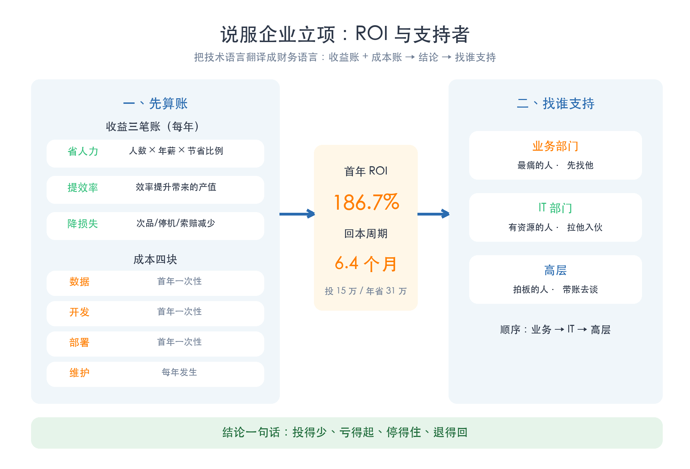
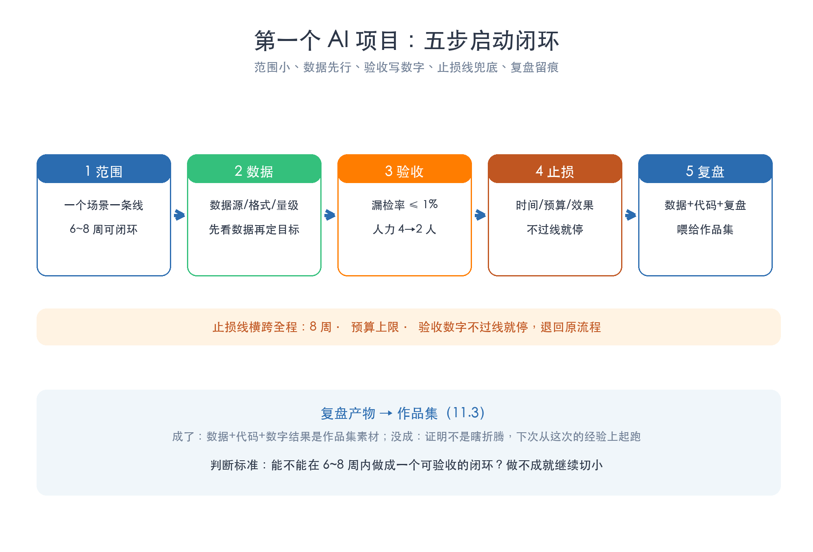
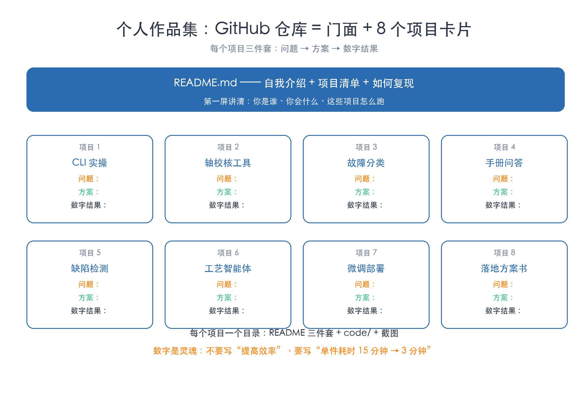
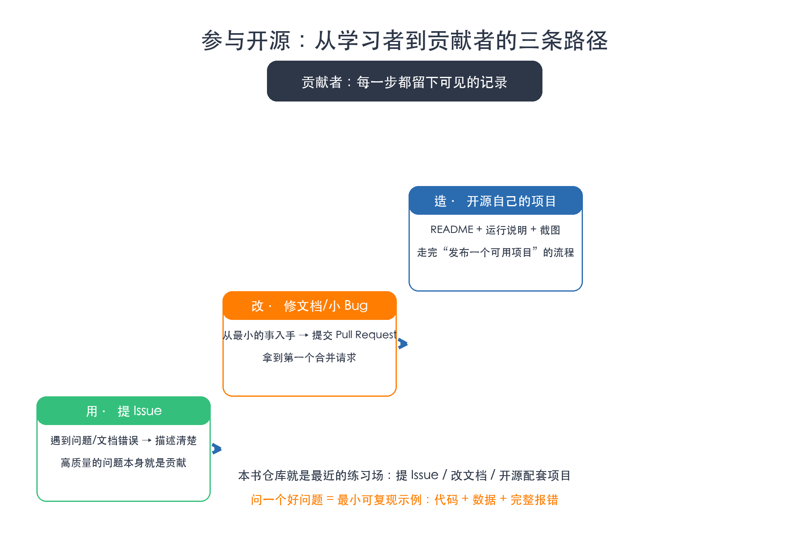
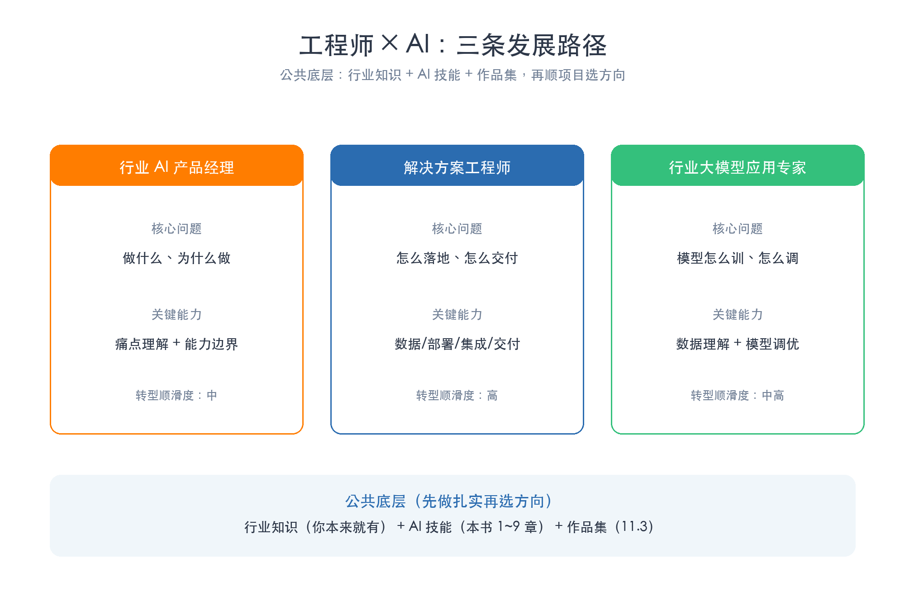
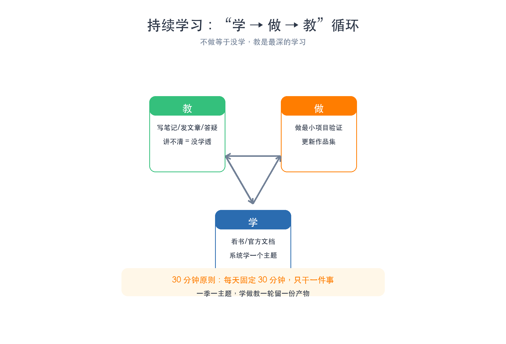
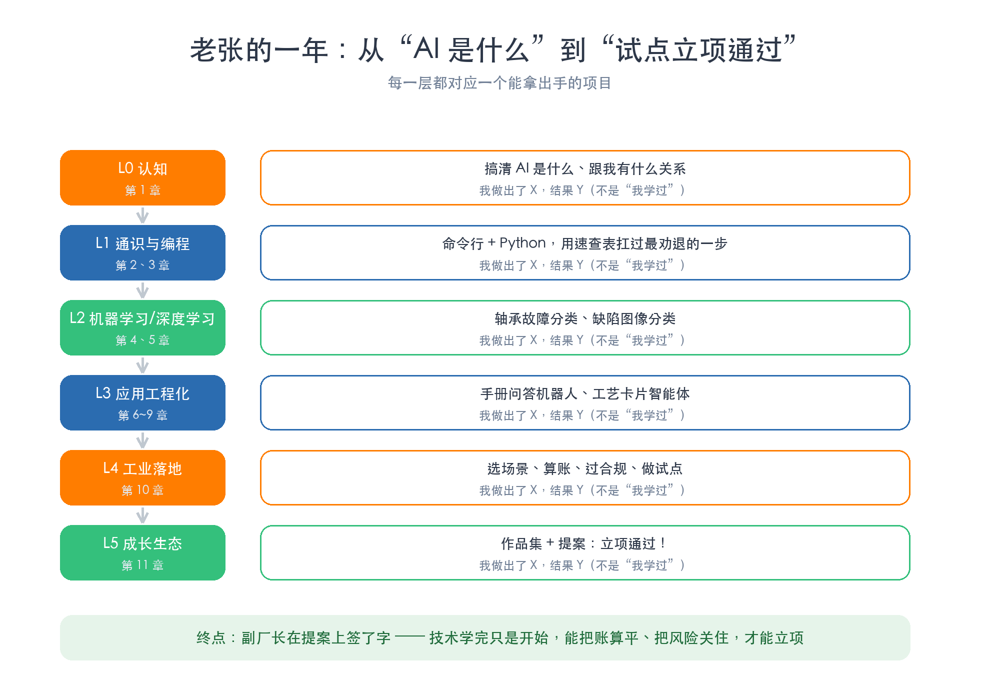
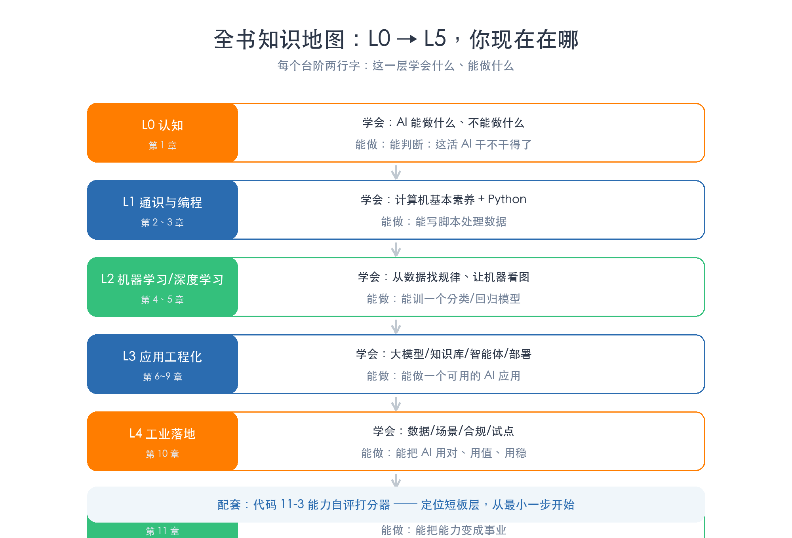

# 第 11 章 从学到做：企业试点与个人成长

> 所属框架层：L4/L5 成长生态
> 预计篇幅：约 11,000 字（含可运行代码；11.1 为算账与说服课，11.2 为试点启动课，11.3 为作品集课，11.4 为开源课，11.5 为职业定位课，11.6 为持续学习课，11.7 为全书收尾与能力自评）
> 配套文件：示例代码（`code/ch11/` 目录，11-1~11-3 已全部真实运行，输出见正文）、本章配图（SVG 源文件见 `figures/ch11/` 目录）、术语表第 11 章·L5 条目
> 版本：v0.1（首稿）

**本章验收标准**：学完后能不看资料回答——说服企业立项，ROI 的"三笔收益账"和"四块成本"分别是什么，回本周期怎么算？第一个试点项目为什么要"范围小、数据先行、验收写数字、止损线兜底"？作品集的"三件套"是哪三件，GitHub 仓库怎么组织？参与开源的三条路径（用→改→造）每步的具体动作是什么？工程师 × AI 的三条发展路径分别靠什么吃饭、公共底层是什么？对照代码 11-3 的能力自评，你能说出自己现在在哪一层、下一步补什么。配套项目"个人作品集 + 一页纸试点提案"能独立完成：把全书项目按"问题 → 方案 → 数字结果"整理成作品集，并写出一份带 ROI 与止损线的试点提案。

---

> **本章配图清单**（图号 / 内容 / 对应小节 / 类型）

| 图号 | 内容 | 对应小节 | 类型 |
|---|---|---|---|
| 图 11-1 | ROI 与说服逻辑：三笔收益账 + 四块成本 → 找谁支持 | 11.1 | 双栏结构图 |
| 图 11-2 | 第一个项目五步启动：范围 → 数据 → 验收 → 止损 → 复盘 | 11.2 | 流程五步图 |
| 图 11-3 | 作品集结构：GitHub 仓库 = 8 个项目卡片 | 11.3 | 结构图 |
| 图 11-4 | 开源三条路径阶梯：用 → 改 → 造 | 11.4 | 阶梯图 |
| 图 11-5 | 三条发展路径：产品经理 / 解决方案工程师 / 行业应用专家 | 11.5 | 三栏对照图 |
| 图 11-6 | 持续学习循环：学 → 做 → 教 | 11.6 | 循环图 |
| 图 11-7 | 老张的一年：L0 入门 → L5 立项通过 | 11.7 | 时间线图 |
| 图 11-8 | 全书知识地图：L0 → L5 各层能力与对应章节 | 11.7 | 路径总览图 |

---

## 11.0 本章解决什么问题

这一章解决工程师学完 AI 之后最大的一个困惑：**技术我都会了，可企业就是不立项，别人也不知道我能干什么，再过两年 AI 又变样了，我该怎么办？**

前十章，老张一路学下来：会写 Python（第 3 章）、懂机器学习（第 4 章）和深度学习（第 5 章）、会调大模型（第 6 章）、搭过知识库（第 7 章）、做过智能体（第 8 章）、能微调能部署（第 9 章）、还会给厂里写落地方案书（第 10 章）。技术栈完整了，可真到要用的时候，他发现自己面对四个新问题：

第一，**企业凭什么掏钱做试点？** 他跟副厂长讲卷积神经网络、讲召回率，对方听得直皱眉。副厂长只问一句话："投进去的钱，多久能回来？"

第二，**第一个项目怎么开才不会烂尾？** 他见过太多"全厂上 AI"的大口号，半年后一个能用的都没有。小步快跑到底怎么跑？

第三，**学了一堆东西，怎么让人看见？** 简历上写"熟悉机器学习"没人信，作品集里摆着能复现的项目才有人认。

第四，**AI 变得这么快，三年后我还在不在牌桌上？** 今天追这个模型、明天追那个框架，追得过来吗？

一句话：**前 10 章教你"把 AI 用起来"，这一章教你"把会用变成用上、把用上变成事业"。** 技术只是入场券，算账、沟通、展示、定位、持续学习，才是从工程师走到"工程师 × AI"的完整路径。

学完这一章，你会拿到六样东西：一张 ROI 计算与说服沟通的模板（11.1），第一个试点项目的启动检查清单（11.2），个人作品集的组织结构（11.3），参与开源的三条路径（11.4），工程师 × AI 的三条长期定位（11.5），一份分级信息源与持续学习方法（11.6）。最后，跟着老张看一遍他的一年，对照全书知识地图完成一次能力自评（11.7），你就知道自己现在在哪、下一步做什么。

## 11.1 说服企业：从"学技术"到"立项"

### 11.1.1 为什么难：企业不是不信 AI，是不信账能算平

老张第一次去找副厂长，兴冲冲讲"用机器视觉做质检，卷积神经网络准确率能到 98%"。副厂长听完只问了三句话：

"要花多少钱？""多久能见效？""要是搞不成，产线停不停？"

老张全答不上来。这不是沟通技巧问题，是**语言体系问题**：工程师习惯讲技术指标（准确率、召回率、模型参数量），决策者只认财务语言（投入、回报、风险）。要把一个 AI 试点讲清楚，得先把"技术语言"翻译成"财务语言"——翻译过来就是三个数字：**要投多少钱、每年省多少、多久回本**。

先记住一个原则：**企业不是不信 AI，是不信"投入有回报、风险可控"。** 你做的事，是把这两件事都变成可计算的数字。

### 11.1.2 ROI 怎么算：三笔收益账 + 四块成本

ROI（投资回报率）不是一个玄学指标，它只有两个输入：收益和成本。关键是别拍脑袋，把账一项一项列出来。

**收益三笔账**（每年）：

- **省人力**：省下的人工成本 = 省下的人数 × 人均年薪 × 节省比例。质检线原来 4 个人，AI 初检后留 2 个人复检，就省了 2 个人的成本。
- **提效率**：效率提升带来的收益增量。原来一天检 3,000 件，现在一天检 5,000 件，多出来的产值就是收益。
- **降损失**：损失降低省下的钱。漏检的缺陷品流出被客户索赔、停机损失、废品率下降——这些"少赔的钱"也是收益，而且往往比省人力还大。

**成本四块**：

- **数据**：采集、清洗、标注（首年一次性）。很多人低估这块，其实标注往往是最贵的。
- **开发**：模型训练、评估、调试（首年一次性）。
- **部署**：硬件、服务器、产线集成（首年一次性）。要 GPU 还是 CPU、能不能复用现有工控机，差很多钱。
- **维护**：模型监控、定期重训、人工值守（每年发生，容易被漏掉）。

有了这两组数字，就能算出决策者最关心的两个结果：**首年 ROI**（年化净收益 ÷ 首年投入）和**回本周期**（首年投入 ÷ 年化净收益 × 12 个月）。代码 11-1 就是一个可以反复填数的计算器——先用内置的演示案例跑一遍，再换成你自己场景的数字。

```python
#!/usr/bin/env python3
# -*- coding: utf-8 -*-
"""
代码 11-1：ROI 计算器 —— 说服企业前，先把账算清楚
第 11 章 11.1（从学到做：企业试点与个人成长）

零依赖，仅用标准库。演示"老张的视觉质检试点"的完整算账过程：
  收益三笔账：省人力、提效率、降损失（每年）
  成本四块：  数据、开发、部署（首年一次性）+ 维护（每年）
输出：
  年化总收益、首年投入、年化净收益、ROI、回本周期（月）

用法：
  python3 11-1_roi_calculator.py                 # 跑内置演示案例
  python3 11-1_roi_calculator.py --auto 0        # 交互模式（自己填数字）
"""

import argparse

# 收益三笔账（每年，单位：万元）—— 每一项都要写明"这笔钱怎么来的"
BENEFIT_LABELS = [
    ("省人力", "省下的人工成本：人数 × 年薪 × 节省比例"),
    ("提效率", "效率提升带来的产值/收益增量"),
    ("降损失", "次品率/停机/索赔损失的降低"),
]

# 成本四块（单位：万元）—— 前三年是首年一次性投入，维护是每年发生
COST_LABELS = [
    ("数据", "数据采集、清洗、标注（首年一次性）"),
    ("开发", "模型训练、评估、调试（首年一次性）"),
    ("部署", "硬件、服务器、产线集成（首年一次性）"),
    ("维护", "模型监控、定期重训、人工值守（每年）"),
]


def run_case(benefits: dict, costs: dict) -> dict:
    """按三笔收益账 + 四块成本，算 ROI 与回本周期。"""
    yearly_benefit = sum(benefits.values())          # 年化总收益
    first_year_cost = costs["数据"] + costs["开发"] + costs["部署"]  # 首年一次性投入
    yearly_maintain = costs["维护"]                   # 每年维护成本
    net_yearly = yearly_benefit - yearly_maintain     # 年化净收益
    if first_year_cost <= 0 or net_yearly <= 0:
        raise ValueError("投入或净收益必须为正，才能计算 ROI / 回本周期")
    roi = net_yearly / first_year_cost               # 首年 ROI（口径：净收益/首年投入）
    payback_months = first_year_cost / net_yearly * 12  # 回本周期（月）
    return {
        "yearly_benefit": yearly_benefit,
        "first_year_cost": first_year_cost,
        "yearly_maintain": yearly_maintain,
        "net_yearly": net_yearly,
        "roi": roi,
        "payback_months": payback_months,
    }


def print_report(title: str, benefits: dict, costs: dict, result: dict) -> None:
    """把账目与结果打印成一张清晰的报表。"""
    line = "-" * 58
    print(line)
    print(f"项目：{title}")
    print(line)
    print("一、收益三笔账（每年，万元）")
    for key, desc in BENEFIT_LABELS:
        print(f"  {key}（{desc.split('：')[0]}）：{benefits[key]:.1f}")
    print(f"  → 年化总收益：{result['yearly_benefit']:.1f} 万元")
    print(line)
    print("二、成本四块（万元）")
    for key, desc in COST_LABELS:
        print(f"  {key}（{'首年一次性' if key != '维护' else '每年'}）：{costs[key]:.1f}")
    print(f"  → 首年一次性投入：{result['first_year_cost']:.1f} 万元")
    print(f"  → 每年维护成本：{result['yearly_maintain']:.1f} 万元")
    print(line)
    print("三、结论")
    print(f"  年化净收益 = 年化总收益 - 维护成本 = {result['net_yearly']:.1f} 万元")
    print(f"  首年 ROI = 年化净收益 / 首年投入 = {result['roi'] * 100:.1f}%")
    print(f"  回本周期 = 首年投入 / 年化净收益 × 12 ≈ {result['payback_months']:.1f} 个月")
    print(line)
    print("说明：ROI 只是立项的第一关，还要配合 11.2 的止损线与验收标准。")


def demo() -> None:
    """内置演示：老张的视觉质检试点。"""
    benefits = {"省人力": 16.0, "提效率": 5.0, "降损失": 10.0}  # 每年 31 万
    costs = {"数据": 3.0, "开发": 8.0, "部署": 4.0, "维护": 3.0}  # 首年 15 万 + 维护 3 万/年
    result = run_case(benefits, costs)
    print_report("视觉质检试点（演示案例：数字为虚构）", benefits, costs, result)


def interactive() -> None:
    """交互模式：自己填数字，算自己场景的账。"""
    benefits, costs = {}, {}
    print("=== 交互模式：请依次输入数字（万元，可带小数）===")
    for key, desc in BENEFIT_LABELS:
        while True:
            try:
                benefits[key] = float(input(f"  收益 · {key}（{desc.split('：')[1]}）：").strip() or "0")
                break
            except ValueError:
                print("    输入无效，请输入数字（如 5.5）")
    for key, desc in COST_LABELS:
        while True:
            try:
                costs[key] = float(input(f"  成本 · {key}（{desc.split('：')[1]}）：").strip() or "0")
                break
            except ValueError:
                print("    输入无效，请输入数字（如 5.5）")
    result = run_case(benefits, costs)
    print_report("我的试点项目", benefits, costs, result)


def main() -> None:
    parser = argparse.ArgumentParser(description="ROI 计算器：说服企业前先把账算清楚")
    parser.add_argument("--auto", type=int, default=1,
                        help="1=跑演示案例（默认）；0=交互模式自己填数字")
    args = parser.parse_args()
    if args.auto == 1:
        demo()
    else:
        interactive()


if __name__ == "__main__":
    main()
```

运行这段代码（`python3 11-1_roi_calculator.py`），真实输出如下：

```text
----------------------------------------------------------
项目：视觉质检试点（演示案例：数字为虚构）
----------------------------------------------------------
一、收益三笔账（每年，万元）
  省人力（省下的人工成本）：16.0
  提效率（效率提升带来的产值/收益增量）：5.0
  降损失（次品率/停机/索赔损失的降低）：10.0
  → 年化总收益：31.0 万元
----------------------------------------------------------
二、成本四块（万元）
  数据（首年一次性）：3.0
  开发（首年一次性）：8.0
  部署（首年一次性）：4.0
  维护（每年）：3.0
  → 首年一次性投入：15.0 万元
  → 每年维护成本：3.0 万元
----------------------------------------------------------
三、结论
  年化净收益 = 年化总收益 - 维护成本 = 28.0 万元
  首年 ROI = 年化净收益 / 首年投入 = 186.7%
  回本周期 = 首年投入 / 年化净收益 × 12 ≈ 6.4 个月
----------------------------------------------------------
说明：ROI 只是立项的第一关，还要配合 11.2 的止损线与验收标准。
```

看到这组数字，副厂长的态度立刻不一样了：投 15 万，一年净赚 28 万，**六个半月回本**。这就是把技术语言翻译成财务语言的效果。

注意两个容易算错的坑：第一，**维护成本一定要算进去**——模型上线不是一锤子买卖，每年都要重训、监控，这笔钱漏掉，第二年的账就全是假的。第二，**收益要有依据**——"提效率大概能提 10%"不算数，要能说出"原来 4 个人检 3,000 件，试点后 2 个人检 5,000 件"这样的具体口径，否则领导随口一句"这数字哪来的"就破功。

还有一个口径陷阱要特别小心：**别把一次性收益算成年收益。** 比如"部署一次节省了 5 万元外包费用"是首年的一次性收益，不能写进每年 31 万那笔账里；只有"每年都发生的"才能进年化收益。账目口径错了，回本周期会算得过分乐观——领导按你的数字拍板，第二年对不上账，信任就透支了。一个稳妥的自检办法：把每一笔收益和成本都写上"来源 + 周期"，凡是写不出周期的一律不进年化数字。

### 11.1.3 风险怎么沟通：小投入、有止损、可退回

ROI 算清楚了，副厂长还有最后一关：**"万一搞不成呢？"**

这时候别拍胸脯说"一定能成"，那是自断后路。正确的话术是承认不确定性、同时把风险关进笼子里：

- **小投入**：先投一个场景、一条线，不是全厂改造。总投入就是代码 11-1 里那个数，控制在"试错也试得起"的范围内。
- **有止损**：试点定好时间、预算、最低效果三条线，不过线就停（11.2.3 展开）。
- **可退回**：试点期间保留原流程，模型不行随时退回人工，产线不停。

把这三句话讲清楚，风险沟通就完成了：**"投得少、亏得起、停得住、退得回。"** 这不是示弱，恰恰是让决策者敢拍板的理由——因为失败成本被控制住了。

给一个可以直接用的沟通话术模板（对着副厂长讲的版本）：

> "这个试点我们只投 15 万、只做三号质检线这一条线，8 周内见结果。验收标准三个数字，达不到就停，产线随时退回人工复检，不影响交付。成了，回本 6.5 个月；没成，损失就是 15 万封顶。您看值不值得试一次？"

这段话说完，决策者的注意力就从"会不会搞砸"转移到了"试错的成本是否可接受"——这正是你想要的结果。

### 11.1.4 找谁支持：业务、IT、高层，一个都不能少

账算好了，还得有人推。老张的经验是找三类人，各有各的作用：

- **业务部门**：最痛的人。质检科长天天为漏检索赔头疼，他是你天然的同盟——你帮他解决痛点，他帮你提供场景和数据。**先找他。**
- **IT 部门**：有资源的人。服务器、内网、数据库权限都在他手里，试点要部署（第 9 章）绕不开他。**用业务需求拉他入伙**，别等他来问你。
- **高层**：拍板的人。副厂长只认账，用 11.1.2 的 ROI 和 11.1.3 的风险话术去谈。**最后找他，带着完整的账去。**

顺序很重要：**先业务、再 IT、最后高层**。如果你先去跟高层谈，高层一句"找业务确认一下"，你就要回来补业务这块，绕一大圈。反过来，业务支持 + IT 支持在手，高层那关只剩算账——而你账已经算好了。

（图 11-1 把这张"收益账 + 成本账 → ROI → 三类支持者"的完整说服逻辑画在了一张图上，写提案时照着这张图组织你的话术。）



## 11.2 小步快跑：第一个 AI 项目的正确打开方式

### 11.2.1 范围：把一个"全厂上 AI"切成一个闭环

立项通过后，最容易犯的错是**贪大**："既然领导支持了，那就质检、排产、设备维护一起上！"——这基本等于给自己挖坑。第一个项目的大忌就是范围失控：场景太多，数据、人力、时间全被摊薄，一个都做不成。

正确做法是把目标切小，小到**"一个场景、一条线、一个环节"**：不是"全厂质检 AI 化"，而是"三号质检线的外观缺陷初检"；不是"全厂智能排产"，而是"CNC 车间下周的插单排程"。判断标准就一条：**这件事能不能在 6~8 周内做成一个可验收的闭环？** 做不成就继续切。

这不是格局小，是第 10 章 10.2 就讲过的原则：**先小场景做出闭环，再谈扩大。** 一个成功的闭环能换来信任和扩大投入；十个烂尾的大场景只会让 AI 在厂里彻底失去信用。

### 11.2.2 数据先行，验收写数字

定好范围后，第二件事不是写代码，是**看数据**（第 10 章 10.1 的三道关）：数据源在哪、能不能导出、格式是什么、量级多少、脏不脏。先看数据再定目标——数据质量决定模型上限，数据都没有，目标定得再好也是空的。

同时，**把验收标准写成数字**。不是"效果还行"，而是三行可测量的指标：

- 漏检率 ≤ 1%（原来 3%），误报率 ≤ 5%；
- 质检人力从 4 人降到 2 人；
- 单件检测节拍 ≤ 1.5 秒（不拖慢产线）。

写成数字有两大好处：一是**验收时有据可依**，模型行不行一眼可见；二是**止损线才有意义**——数字就是止损线的那条"线"，后面会用到。

### 11.2.3 止损线：不过线就停，停不是失败是止损

止损线（Stop-loss Line）是第一个 AI 项目最重要的保护机制，三个维度各设一条：

- **时间线**：试点最多 8 周，到期未达验收就停，不无限延。
- **预算线**：总投入最多 X 万元，超了就停，不追加。
- **效果线**：验收数字（11.2.2）达标才转正，不达标就退回原流程。

止损线的价值在于：**它把"失败"变成了"可控的试错"。** 没有止损线，试点会变成无底洞——项目组不敢停，怕前功尽弃；有了止损线，"不过线就停"是写在计划里的约定，停得理直气壮，复盘照样做（11.2.4）。老张的体会是：**停不是失败是止损**，止损换回来的时间和预算，可以投到下一个更靠谱的场景上。

### 11.2.4 复盘：留下"数据 + 代码 + 复盘三件事"

试点结束，不管成不成，都要做一件事：**复盘并留下三样东西**——数据（哪怕没跑通的原始数据）、代码（跑过的脚本和记录）、复盘（成在哪、败在哪、下一步改什么）。原因很实际：

- 成了：这三样是 11.3 作品集里最有说服力的素材（"问题 → 方案 → 数字结果"）。
- 没成：这三样证明你不是瞎折腾——有数据、有代码、有结论，下一次试点能站在这次的肩膀上，而不是从零再来。

代码 11-2 是一张十项启动检查清单：立项后、开工前，逐项勾一遍，把未就绪项补上再动手。老张的教训是——**很多项目烂尾，不是模型不行，是开工前就埋了雷**（范围没切小、数据没看过、验收没写数字、止损没定）。

```python
#!/usr/bin/env python3
# -*- coding: utf-8 -*-
"""
代码 11-2：第一个试点项目的启动检查清单
第 11 章 11.2（从学到做：企业试点与个人成长）

零依赖，仅用标准库。演示"老张的视觉质检试点"立项前的十项检查：
  范围 → 数据 → 验收 → 止损 → 支持 → 合规 → 部署 → 运维 → 退路 → 复盘
输出：
  逐项就绪状态、就绪率、未就绪项清单（每一项都附"怎么做才就绪"的提示）

用法：
  python3 11-2_project_checklist.py              # 跑内置演示（老张案例，含 2 项未就绪）
  python3 11-2_project_checklist.py --interactive  # 逐项回答 y/n，算自己项目的就绪率
"""

import argparse

# 十项检查：每项 = (标题, 检查问题, 就绪提示)
CHECKLIST = [
    ("范围", "是否只选了一个场景、一条线、一个环节，而不是'全厂上 AI'？",
     "把目标切小：先做成一个闭环（第 10 章 10.2 的'先小场景出闭环'）"),
    ("数据", "是否已经看过真实数据：数据源、格式、量级、质量都确认了？",
     "先看数据再定目标：数据质量决定模型上限（第 10 章 10.1）"),
    ("验收", "验收标准是否写成了数字（准确率/省人力/节拍/停机时长）？",
     "'效果还行'不算验收，写成可测量的数字才有止损依据（11.2.2）"),
    ("止损", "是否设了止损线：时间、预算、最低效果三条线？",
     "不过线就停，停不是失败是止损（11.2.3，对应术语 Stop-loss Line）"),
    ("支持", "业务（痛点）、IT（资源）、高层（拍板）三类人都找到了？",
     "先找业务部门确认痛点，再拉 IT 谈资源，最后用 ROI 说服高层（11.1.4）"),
    ("合规", "是否按'分类分级→脱敏→权限→留痕→评估'五步过了一遍红线？",
     "数据能不能进模型、能不能出域，先过红线清单（第 10 章 10.7）"),
    ("部署", "是否确认了部署条件：硬件、网络、能否私有化？",
     "生产环境不是笔记本：GPU/服务器/内网隔离先谈好（第 9 章 9.6）"),
    ("运维", "是否安排了上线后的运维：谁监控、多久重训一次？",
     "模型会'旧'：数据变了它就不准，运维与定期重训要提前排班（第 9 章 9.6.4）"),
    ("退路", "是否保留了退路：试点失败时能退回原流程？",
     "模型不行就退回人工/原系统，别让试点成为唯一选项（第 10 章 10.8）"),
    ("复盘", "是否计划了复盘：无论成败都留下'数据+代码+复盘三件事'？",
     "复盘产物直接喂给作品集（11.3）：问题→方案→数字结果"),
]


def evaluate(answers: list) -> dict:
    """根据逐项回答（True=就绪），返回就绪率与未就绪项。"""
    not_ready = [CHECKLIST[i] for i, ok in enumerate(answers) if not ok]
    ready_rate = sum(answers) / len(answers) * 100
    return {"not_ready": not_ready, "ready_rate": ready_rate}


def print_report(title: str, answers: list) -> None:
    line = "-" * 58
    print(line)
    print(f"项目：{title} —— 启动检查报告")
    print(line)
    for i, (name, question, _) in enumerate(CHECKLIST, start=1):
        mark = "√ 就绪" if answers[i - 1] else "× 未就绪"
        print(f"  {i:>2}. [{mark}] {name}：{question}")
    result = evaluate(answers)
    print(line)
    print(f"  就绪率：{result['ready_rate']:.0f}%（{sum(answers)}/{len(answers)} 项）")
    if result["not_ready"]:
        print("  未就绪项与补齐动作：")
        for name, _, tip in result["not_ready"]:
            print(f"    - {name}：{tip}")
    else:
        print("  全部就绪：可以进入试点（但别忘了 11.2 的止损线随时生效）")
    print(line)


def demo() -> None:
    """内置演示：老张的视觉质检试点 —— 8 项就绪、2 项未就绪。"""
    answers = [
        True,   # 范围：只选了质检线一条线
        True,   # 数据：看过三个月检验记录
        True,   # 验收：漏检率、误报率、节省人力都写成数字
        False,  # 止损：还没定时间和预算上限 ← 未就绪
        True,   # 支持：质检科长（痛点）、IT 主任（资源）、副厂长（拍板）
        True,   # 合规：检验数据不涉及个人数据，五步已过
        False,  # 部署：产线工控机算力不足，GPU 还没申请 ← 未就绪
        True,   # 运维：计划每季度重训一次
        True,   # 退路：试点期保留人工复检
        True,   # 复盘：试点结束写复盘报告
    ]
    print_report("视觉质检试点（演示案例）", answers)


def interactive() -> None:
    """交互模式：逐项回答 y/n，算自己项目的就绪率。"""
    answers = []
    print("=== 交互模式：逐项回答 y（就绪）或 n（未就绪）===")
    for name, question, tip in CHECKLIST:
        while True:
            ans = input(f"  {name}：{question} [y/n] ").strip().lower()
            if ans in ("y", "n"):
                answers.append(ans == "y")
                break
            print("    请输入 y 或 n")
    print_report("我的试点项目", answers)


def main() -> None:
    parser = argparse.ArgumentParser(description="第一个试点项目的启动检查清单")
    parser.add_argument("--interactive", action="store_true",
                        help="逐项回答 y/n，算自己项目的就绪率（默认跑演示案例）")
    args = parser.parse_args()
    if args.interactive:
        interactive()
    else:
        demo()


if __name__ == "__main__":
    main()
```

运行这段代码（`python3 11-2_project_checklist.py`），真实输出如下：

```text
----------------------------------------------------------
项目：视觉质检试点（演示案例） —— 启动检查报告
----------------------------------------------------------
   1. [√ 就绪] 范围：是否只选了一个场景、一条线、一个环节，而不是'全厂上 AI'？
   2. [√ 就绪] 数据：是否已经看过真实数据：数据源、格式、量级、质量都确认了？
   3. [√ 就绪] 验收：验收标准是否写成了数字（准确率/省人力/节拍/停机时长）？
   4. [× 未就绪] 止损：是否设了止损线：时间、预算、最低效果三条线？
   5. [√ 就绪] 支持：业务（痛点）、IT（资源）、高层（拍板）三类人都找到了？
   6. [√ 就绪] 合规：是否按'分类分级→脱敏→权限→留痕→评估'五步过了一遍红线？
   7. [× 未就绪] 部署：是否确认了部署条件：硬件、网络、能否私有化？
   8. [√ 就绪] 运维：是否安排了上线后的运维：谁监控、多久重训一次？
   9. [√ 就绪] 退路：是否保留了退路：试点失败时能退回原流程？
  10. [√ 就绪] 复盘：是否计划了复盘：无论成败都留下'数据+代码+复盘三件事'？
----------------------------------------------------------
  就绪率：80%（8/10 项）
  未就绪项与补齐动作：
    - 止损：不过线就停，停不是失败是止损（11.2.3，对应术语 Stop-loss Line）
    - 部署：生产环境不是笔记本：GPU/服务器/内网隔离先谈好（第 9 章 9.6）
----------------------------------------------------------
```

老张跑完这个清单，发现两处未就绪：**止损线没定、GPU 没申请**。补齐这两项再开工——这就是清单的意义：把"感觉差不多"变成"逐项可查"。

（图 11-2 把"范围 → 数据 → 验收 → 止损 → 复盘"五步画成流程图：五步一个闭环，止损线横跨中间，随时可以叫停。）



## 11.3 个人作品集：把 8 个项目打包成"看得见的成果"

### 11.3.1 为什么需要作品集：可复现 > 简历话术

老张学过一句很扎心的话：**简历上写"熟悉机器学习"，等于没写。** 因为人人都这么写。真正让人信服的，是你能拿出一个**别人可以复现的项目**——代码在仓库里、数据能下载、跑一下就能看到结果。企业面试官、合作方、甚至你自己复盘，看的都是这个。

作品集（Portfolio）就是你的"可复现证据库"：**问题 → 方案 → 数字结果**，每个项目三件套。不用大而全，全书 8 个项目整理下来，已经是一份有说服力的展示了。

### 11.3.2 全书项目线回顾：8 个项目，一条完整的能力链

回看全书（1.5 项目线），你其实已经做出了 8 个项目：

| 序号 | 项目 | 对应章节 | 三件套（问题 → 方案 → 数字结果）示例 |
|---|---|---|---|
| 1 | 命令行实操 | 第 2 章 | 不懂命令行 → 掌握基础命令 → 能独立管理文件与进程 |
| 2 | Python 轴强度校核小工具 | 第 3 章 | 手算轴强度易错 → 写脚本自动校核 → 秒出结果、可复算 |
| 3 | 轴承故障分类模型 | 第 4 章 | 靠听音辨故障不可靠 → 机器学习分类 → 测试集准确率可量化 |
| 4 | 设备手册问答机器人 | 第 6、7 章 | 手册翻不到 → RAG 知识库 → 提问秒答并附出处 |
| 5 | 零件表面缺陷图像分类 | 第 5 章 | 人工质检疲劳 → CNN 分类 → 准确率 + 漏检/误报可控 |
| 6 | 自动生成工艺卡片智能体 | 第 8 章 | 工艺卡片手工填 → 智能体调工具自动生成 → 单件耗时下降 |
| 7 | 模型微调与私有化部署 | 第 9 章 | 数据不能出域 → 本地微调 + 部署 → 内网可用 |
| 8 | 场景落地方案书 | 第 10 章 | 场景不知从哪下手 → 评估表 + 方案书 → 可提交立项 |

注意每一行都符合"问题 → 方案 → 数字结果"，而且**数字结果越具体越好**：不要写"提高效率"，要写"单件耗时从 15 分钟降到 3 分钟"。数字是作品集的灵魂。

为什么这 8 个项目恰好构成一条完整的能力链？因为它们覆盖了 AI 落地的全部环节：**会用工具（1）→ 会写程序（2）→ 会训模型（3、5）→ 会做大模型应用（4）→ 会做智能体（6）→ 会部署（7）→ 会落地（8）**。单独看任何一个项目都平平无奇，串起来就是一个"从零基础到能落地"的完整证据链——这比一个"看起来很厉害"的大项目更有说服力，因为它证明你的能力不是偶然，而是可复制的。

### 11.3.3 作品集怎么组织：GitHub 仓库结构

作品集的载体建议是 GitHub 仓库，结构照着这样搭（本书仓库本身就是活例子）：

```text
my-ai-portfolio/
├── README.md            # 自我介绍 + 项目清单 + 如何复现
├── project-01-cli/      # 每个项目一个目录
│   ├── README.md        # 三件套：问题 / 方案 / 数字结果
│   ├── code/            # 可运行的代码
│   └── screenshot.png   # 运行截图或结果图
├── project-02-shaft/
└── ...
```

三个要点：

- **README 是门面**：第一屏就要让人看懂"你是谁、你会什么、这些项目怎么跑"。
- **每个项目一个目录**：目录里 README 写三件套，代码必须能跑（依赖写清楚、给运行命令）。
- **截图比文字强**：跑出来的图表、输出、界面，各放一张，别让人脑补。

（图 11-3 把仓库结构画成一张图：一个 README 门面 + 8 张项目卡片，每张卡片上写着问题 → 方案 → 数字结果。）



### 11.3.4 展示与讲述：30 秒讲一个项目

作品集有了，还要会讲。给一个万能的"30 秒项目话术"模板：

> **"我做了一个 [项目名]，解决 [痛点]。做法是 [方案一句话，含用的技术]。结果 [数字]——[具体收益]。比如 [一个具体例子]。"

套进第 5 章的项目就是：

> "我做了一个零件表面缺陷图像分类模型，解决质检员疲劳漏检的问题。做法是用卷积神经网络（CNN）做缺陷分类，配合阈值控制误报。结果漏检率从 3% 降到 1%，一条线省了 2 个人。比如划痕和缺料这两种缺陷，原来靠人眼看，现在模型秒判。"

30 秒讲完，对方记住的只有三样：**痛点真实、方案清楚、数字具体。** 这三样正好是作品集三件套的另一种说法。

## 11.4 参与开源与社区：从学习者到贡献者

### 11.4.1 为什么参与：开源是免费的高质量实习

老张发现，学习效率最高的时候，不是自己看书，而是**改别人的代码 + 让别人看你的代码**——而这正是开源（Open Source）的日常。一个开源项目里：真实代码、真实问题、真实的维护者会 review 你的改动并给出意见。这套"实习"完全免费，而且全程留痕（你的贡献记录就是履历）。

对零基础转行的工程师来说，开源尤其适合：它不要求科班出身，只要求**会动手、能沟通**。而这正是工程师的强项。

### 11.4.2 三条路径：用 → 改 → 造

参与开源不是一步登天，按难度分三条路径，逐级而上：

**路径一：用（提 Issue）**。用别人的项目，遇到问题、发现文档错误、想到改进建议，就去提一个 Issue（议题/工单）。这是最简单的贡献：不写代码，只负责把问题描述清楚。别小看这一步——**高质量的问题本身就是贡献**，维护者最缺的就是真实使用反馈。

**路径二：改（修文档、修小 bug、补示例）**。从"最小的事"入手：修正文档里的错误、补一个示例代码、修一个标注 bug。这类贡献门槛低、容易过 review，是新手拿到第一个 Pull Request（合并请求）的最佳入口——把改动提交上去，维护者审核通过后合并进项目，你的名字就进了贡献者列表。

**路径三：造（开源自己的项目）**。把自己做的小项目（比如本书 8 个项目里的任何一个）开源出去，写清楚 README、怎么跑、怎么用。这一步的意义不在代码多牛，而在**你已经走完了"发布一个可用项目"的完整流程**——这也是作品集（11.3）最硬的一块。

三条路径的关系是阶梯：**先会用、会问（用），再会改、会补（改），最后会造、会发（造）。** 每一步都在积累"可见的贡献记录"。

每个路径给一组具体的动作清单，照着做就行：

- **路径一（用）本周动作**：选一个你正在用的开源项目（可以是本书仓库），去它的 Issues 列表看有没有"等待确认的 bug"或"文档疑问"，选一条你能复现的，回复"我复现了，环境是……，现象是……"。这就是你的第一个贡献。
- **路径二（改）本月动作**：找该项目的"good first issue"标签（新手友好问题），挑一个文档类或小 bug 类问题，fork 下来改好，提交 Pull Request。注意先读它的 CONTRIBUTING 文档（贡献指南），按人家的规范来。
- **路径三（造）本季度动作**：把你已完成的一个小项目整理成可发布状态：写 README（怎么装、怎么跑、依赖是什么）、加一张运行截图、补一个示例数据，然后 push 到 GitHub 公开。发布后把它链接进你的作品集（11.3）。

这三组动作都不需要"等水平够了再开始"——**水平是在做的过程中够的**，不是反过来。

### 11.4.3 本书的仓库，就是你最近的练习场

学这本书的人有一个现成的入口：本书的 GitHub 仓库。你能做的第一件开源贡献就在眼前——

- **提 Issue**：读到哪一章发现错别字、代码跑不通、例子看不懂，去提 Issue（描述清楚现象 + 复现步骤）；
- **改文档**：补充一个行业案例、修正一处术语解释、完善某个示例的注释，走 Pull Request 流程；
- **造项目**：把配套项目（比如第 10 章的落地方案书模板）做成你自己的版本开源出去。

从"这本书的读者"到"这本书的贡献者"，只差一个 Issue 或一个 Pull Request 的距离。

### 11.4.4 怎么问一个好问题：最小可复现示例

无论提 Issue 还是混社区，核心技能是**问一个好问题**。好问题的标准不是"问题难"，而是"别人能复现"——三个要素缺一不可（即最小可复现示例，Minimal Reproducible Example，MRE）：

- **代码**：能触发问题的完整小段代码（去掉无关部分，越短越好）；
- **数据**：能让代码跑起来的最小数据（几行就行，别贴整份文件）；
- **报错**：完整的报错信息（不要只贴一句"报错了"，要贴全文含堆栈）。

老张的体会：**写完问题先自检一遍"别人照着我的描述能复现吗"，能，再发出去。** 用这个标准过滤，你问的问题会被认真对待，而不是被当成噪声。

（图 11-4 把"用 → 改 → 造"三条路径画成阶梯：一级级往上，每级标注具体动作，顶上写着"贡献者"。）



## 11.5 工程师 × AI 的长期定位：三条发展路径

### 11.5.1 三条路径：你可以在哪三个位置上吃这碗饭

学了这么多，长期往哪走？老张总结出三条主流路径，各有各的核心能力：

**路径一：行业 AI 产品经理。** 不写代码，负责定义"做什么、为什么做"。核心能力是**行业痛点理解 + AI 能力边界判断**：知道行业里哪些环节痛、AI 到底能不能解决、做成什么形态用户才买单。工程师转这个方向有天然优势——你比科班产品经理更懂现场。

**路径二：解决方案工程师。** 把 AI 落进企业场景，负责数据、部署、集成、交付、培训。核心能力是**端到端落地能力**：从第 9 章部署、第 10 章试点方法论，到跟产线打交道。这是离现场最近的位置，也是工程师转型最顺的一条路——你会的正是这个岗位要的。

**路径三：行业大模型应用专家。** 深耕一个行业的数据与模型，做调优、评估、创新应用。核心能力是**行业数据理解 + 模型调优经验**：知道这个行业的数据长什么样、模型该怎么训、评估标准是什么。这条路径技术密度最高，也最依赖持续学习（11.6）。

### 11.5.2 怎么选：先看公共底层，再分方向

三条路径看着不同，但**公共底层只有三块**：行业知识（你本来就有）+ AI 技能（本书 1~9 章）+ 作品集（11.3）。所以正确的策略不是"先选方向再补能力"，而是**先把公共底层做扎实，再顺着手里的项目选方向**：

- 你做的项目偏"定义问题、评估价值"（第 10 章方案书）→ 往产品经理方向走；
- 你做的项目偏"部署、集成、现场交付"（第 9 章 + 第 10 章试点）→ 往解决方案工程师方向走；
- 你做的项目偏"训模型、调指标"（第 4、5 章）→ 往行业应用专家方向走。

对照表：

| 维度 | 行业 AI 产品经理 | 解决方案工程师 | 行业大模型应用专家 |
|---|---|---|---|
| 核心问题 | 做什么、为什么做 | 怎么落地、怎么交付 | 模型怎么训、怎么调 |
| 关键能力 | 痛点理解 + 能力边界 | 数据/部署/集成/交付 | 数据理解 + 模型调优 |
| 对应本书重点 | 第 10 章方案书 | 第 9 章 + 第 10 章试点 | 第 4、5、6 章 |
| 转型顺滑度 | 中（需补产品思维） | 高（最接近工程师） | 中高（需持续技术投入） |

选方向时容易踩三个误区，先排掉再选：

- **误区一：三选一，选错就完了。** 实际上三条路径不是互斥的终点，而是同一个底层的三种延伸——先做解决方案工程师积累现场案例，再转产品经理或行业专家都很常见。**先选一个能积累作品集的入口，比纠结"最终定位"更重要。**
- **误区二：产品经理不写代码，所以最轻松。** 恰恰相反，行业 AI 产品经理最难的是一线行业经验 + 判断力，这两样都急不来；工程师转产品不缺行业经验，缺的是"从用户视角定义问题"的切换。
- **误区三：专家路线就是要追最新模型。** 行业大模型应用专家的护城河不是"会用新模型"，而是"懂这个行业的数据和评估标准"——模型三个月换一个，行业数据十年不变。底座永远比追新值钱。

（图 11-5 把三条路径画成三栏对照：中间一行是公共底层"行业知识 + AI 技能 + 作品集"，三栏往上各自展开核心问题与关键能力。）



## 11.6 持续学习：AI 日新月异，怎么不掉队

### 11.6.1 学习观：技术会过时，方法论不过时

老张学到第 11 章最深的体会是：**AI 的技术栈每一两年就翻新一次**——今天火的框架，明天可能被替代。如果学习 = 追新框架，那就永远在追。

真正能迁移、能保值的是三层"底座"：

- **第 2 章计算机通识**：命令行、软硬件、网络、部署——底层逻辑不变；
- **第 4 章机器学习思维**：数据、特征、训练、评估、过拟合——换了什么模型都逃不开这套思维；
- **第 10 章落地方法论**：场景评估、成本账、合规、试点——企业关心的永远是这套。

**技术是流水的，底座是铁打的。** 追新只占一小部分时间，把底座打牢才是长期主义。

### 11.6.2 信息源分级清单：别让信息淹没你

AI 的信息量巨大，不分级管理就会被淹没。按三层筛选：

| 层级 | 信息源 | 怎么用 |
|---|---|---|
| 入门 | 本书、官方文档、开源课程（如本书附录 C 收录的 vibe-vibe / easy-vibe 等） | 系统学，打底座 |
| 进阶 | 权威技术博客、行业报告、知名项目的 release 说明 | 每周固定时间刷，记笔记 |
| 前沿 | 顶会论文、技术雷达、一线团队的技术分享 | 只挑与你的行业相关的看，别贪多 |

一个原则：**信息源宁精勿多**。官方文档永远第一手，二手解读只用来补充理解；同类的订阅号/博客控制在 5 个以内，再多就是噪音。

怎么判断一个信息源值不值得长期跟？三条标准：**一手性**（是官方/原作者说的吗）、**可复现性**（给代码和数据吗）、**时间密度**（同样的内容别人写过几遍了吗）。三条全中的留下，缺两条的取关——信息源的筛选本身就是在训练你的判断力。

### 11.6.3 学习方法："学 → 做 → 教"循环

比"怎么找信息"更重要的是"怎么把信息变成能力"。老张总结的循环是三步：

1. **学**：系统学一个主题（看书、看官方文档）；
2. **做**：立刻做一个最小项目验证（更新作品集 11.3）——**不做等于没学**；
3. **教**：把学到的写出来、讲出来（写笔记、发文章、答疑）——**教是最深的学习**，讲不清 = 没学透。

这个循环（Learning Path 学习路径）的节奏是：**学一个主题 → 做一个项目 → 写一篇分享**，然后进入下一个主题。每轮循环都会留下看得见的产物（作品集 + 分享记录），几年下来就是别人没法抄走的能力资产。

用一个例子看循环怎么跑：老张学 RAG（第 7 章主题）时——**学**：读官方文档 + 本书第 7 章，搞清检索、嵌入、生成三件事；**做**：把厂里的设备手册做成本地问答机器人（这就是作品集里第 4 个项目）；**教**：把搭建过程写成一篇"机械工程师的 RAG 踩坑记"发到社区。一轮下来，别人问"你会 RAG 吗"，他不回答"会"，而是甩出链接：项目 + 文章。**这就是"学做教"循环的复利：每一轮都在给下一轮攒素材。**

### 11.6.4 时间管理：工程师日常怎么挤时间

工程师最缺的是整块时间，但"学做教"循环不要求大块时间，要点是**把学习碎片化、项目化**：

- **30 分钟原则**：每天固定 30 分钟，只干一件事（读一节、写十行代码、改一段笔记），比周末突击 5 小时有效；
- **碎片任务化**：通勤时间看一篇文档、等设备的空档改一个小 bug，碎片时间只做"输入"，"做"和"教"留给 30 分钟整块；
- **季度能力投资**：每季度定一个主题（如本季度专攻 RAG），一个季度只追一个方向，不贪多。

（图 11-6 把"学 → 做 → 教"画成循环：三个节点互相咬合，旁边标注 30 分钟原则，提示循环不需要大块时间。）



## 11.7 收尾：老张的一年与全书知识地图

### 11.7.1 老张的一年：从"AI 是什么"到"试点立项通过"

让我们把镜头拉回第 1 章开头的那个老张——40 岁的机械工程师，坐在办公室翻着一份看不懂的 AI 报告，心里想："这跟我有什么关系？"

一年后，他站在副厂长面前，讲完了那场改变一切的汇报：

> "三号质检线的视觉初检试点，首年投 15 万、年化净收益 28 万、六个半月回本。验收标准三条：漏检率降到 1% 以内、误报率 5% 以内、质检人力从 4 人降到 2 人。止损线三条：8 周、15 万、验收数字不过线就退回人工复检。数据合规五步已过：检验记录不涉及个人数据、不出域、权限最小化。请批准立项。"

副厂长签了字。

这一年他做了什么？不是一口气学完了所有东西，而是**一段一段走完了全书的知识地图**：

- 第 1 章，他搞清了"AI 是什么、跟我有什么关系"（L0）；
- 第 2、3 章，他补上了计算机通识和 Python（L1）——对零基础的机械工程师来说，这一步最劝退，但他用"速查表 + 小工具"的方法扛过来了；
- 第 4、5 章，他理解了机器学习和深度学习（L2），用轴承故障分类和缺陷图像分类练了手；
- 第 6~9 章，他把大模型、知识库、智能体、部署串成了应用能力（L3），做出了手册问答机器人和工艺卡片智能体；
- 第 10 章，他学会了在真实环境里选场景、算账、过合规、做试点（L4）；
- 第 11 章，他把这一切打包成了作品集和一份能立项的提案（L5）。

**每一层都对应着一次"能拿出手的东西"**：不是"我学过"，而是"我做出了 X，结果 Y"。这就是从学到做的全部秘密。

回看这一年，老张也踩过坑，有三条他特意记下来提醒后来者：

- **第一个坑：第 2 章差点劝退他。** 命令行、软硬件、数据库，对零基础的机械工程师来说全是新世界。他的解法是"速查表 + 小工具"：把命令整理成速查表，每学一个概念就写一个能跑的小工具练手——**别按部就班啃教材，直接奔着"能动手"去。**
- **第二个坑：贪多嚼不烂。** 他一度同时学五个主题，结果一个都没学透。后来改成"一季一主题"（11.6.4 的季度能力投资），每个主题按"学做教"循环走完再换下一个。
- **第三个坑：学完不展示。** 前几个月他埋头做了一堆东西，一个都没放上网。直到他把轴承故障分类项目整理成作品集发出去，才第一次收到陌生人的反馈——**从那以后他坚持"做完就发"，作品集越滚越厚。**

这三个坑对应本书的三个方法：速查表式学习（第 2 章）、一季一主题（11.6.4）、做完就发（11.3）。老张说，踩坑不可怕，可怕的是踩完还不记录——所以他每年都翻一遍自己的作品集，看看这一年又多了什么。

（图 11-7 把老张的一年画成时间线：从 L0"AI 是什么"一路到 L5"试点立项通过"，每个节点标注那一层做出的项目。）



### 11.7.2 全书知识地图回顾：你现在在哪

老张的故事是别人的，下面这张图是你的。全书知识地图（图 11-8）把 11 章压缩成六个台阶，每个台阶两行字：**这一层学会什么、能做什么**。

- **L0 认知**（第 1 章）：AI 能做什么、不能做什么 → 能判断"这活 AI 干不干得了"；
- **L1 通识与编程**（第 2、3 章）：计算机基本素养 + Python → 能写脚本处理数据；
- **L2 机器学习 / 深度学习**（第 4、5 章）：从数据找规律、让机器看图 → 能训一个分类/回归模型；
- **L3 应用工程化**（第 6~9 章）：大模型、知识库、智能体、部署 → 能做一个可用的 AI 应用；
- **L4 工业落地**（第 10 章）：数据、场景、合规、试点 → 能把 AI 用对、用值、用稳；
- **L5 成长生态**（第 11 章）：作品集、开源、定位、持续学习 → 能把能力变成事业。



### 11.7.3 给你的起点：能力自评，然后走你的第一步

地图有了，怎么定位自己？代码 11-3 是一张能力自评表：对照六层能力清单逐项打分（0~5 分），输出你的分层均分、短板层和"下一步建议"。老张在写完这本书时自评了一次（结果见下方输出）：技术层（L0~L3）都在 3.5 分以上，落地层（L4）3.2 分刚上手，成长层（L5）2.5 分最薄——建议直奔"整理作品集 + 迈出开源第一步"。

```python
#!/usr/bin/env python3
# -*- coding: utf-8 -*-
"""
代码 11-3：能力自评打分器 —— 对照全书，定位你现在在哪
第 11 章 11.7（从学到做：企业试点与个人成长）

零依赖，仅用标准库。全书按 L0~L5 六层组织（对应第 1~11 章）：
  L0 认知与动机（第 1 章）
  L1 通识与编程（第 2、3 章）
  L2 机器学习 / 深度学习（第 4、5 章）
  L3 应用工程化（第 6、7、8、9 章）
  L4 工业数据与落地（第 10 章）
  L5 成长生态（第 11 章）
每一层有若干能力项，逐项自评 0~5 分（0=没接触，5=能独立完成）。
输出：
  分层平均分、总分、短板层、"下一步建议"（对照章节回炉或进入下一层）

用法：
  python3 11-3_self_assessment.py               # 跑内置演示（老张的自评）
  python3 11-3_self_assessment.py --interactive  # 逐项打分，算自己的自评
"""

import argparse

# L0~L5 六层能力清单：层名、对应章节、能力项（逐项 0~5 分）
LEVELS = [
    ("L0 认知与动机", "第 1 章",
     [("AI 能做什么", "能说清 AI 的典型能力与边界，判断哪些场景适合 AI"),
      ("行业机会判断", "能结合自己行业列出 3 个 AI 应用机会")]),
    ("L1 通识与编程", "第 2、3 章",
     [("计算机通识", "懂命令行、软硬件、前端后端、数据库、部署等基本概念"),
      ("Python 基础", "能写脚本处理数据、调用函数、读写文件"),
      ("数据分析工具", "会用 DataFrame 做清洗、统计、可视化")]),
    ("L2 机器学习 / 深度学习", "第 4、5 章",
     [("机器学习概念", "理解监督/无监督、训练/评估、过拟合等核心概念"),
      ("模型实战", "能完成一个分类或回归小项目并评估指标"),
      ("深度学习基础", "理解神经网络/CNN 的机制，能跑通图像分类示例")]),
    ("L3 应用工程化", "第 6、7、8、9 章",
     [("大模型与提示词", "能用提示词完成文档处理/标准解读类任务"),
      ("RAG 知识库", "能把企业文档变成可问答的知识库"),
      ("智能体搭建", "能让智能体调工具、执行多步任务"),
      ("微调与部署", "能微调小模型并私有化部署成服务")]),
    ("L4 工业数据与落地", "第 10 章",
     [("数据工程", "能清洗真实数据、识别缺失/异常/口径问题"),
      ("场景评估", "能用收益×难度×风险给场景打分排序"),
      ("合规意识", "知道数据分类分级与出域红线，会过五步检查"),
      ("试点方法论", "能定验收标准、设止损线、规划 POC→产线")]),
    ("L5 成长生态", "第 11 章",
     [("作品集", "能把项目整理成'问题→方案→数字结果'的公开作品集"),
      ("开源参与", "能提 Issue、修文档或开源自己的小项目"),
      ("路径规划", "能说清产品经理/解决方案工程师/行业专家三条路径"),
      ("持续学习", "有信息源清单与'学做教'循环的实践")]),
]

# 分数 → 状态描述
def score_label(score: float) -> str:
    if score >= 4.5:
        return "熟练（可独立带项目）"
    if score >= 3.5:
        return "上手（能独立完成常见任务）"
    if score >= 2.5:
        return "会一点（能跟着示例做）"
    if score >= 1.5:
        return "接触过（知道概念，没实践）"
    return "空白（还没接触）"


def evaluate(scores_by_level: dict) -> dict:
    """输入 {层名: [各项分数]}，返回分层平均分、短板层与建议。"""
    level_avg = {name: sum(s) / len(s) for name, s in scores_by_level.items()}
    weakest = min(level_avg, key=level_avg.get)
    advice = []
    # 短板层 → 回炉对应章节
    ch_map = {name: ch for name, ch, _ in LEVELS}
    if level_avg[weakest] < 2.5:
        advice.append(f"当前短板在【{weakest}】（{ch_map[weakest]}）：先回炉对应章节，"
                      f"把这一层补到 3 分以上再往前走。")
    # 若 L1/L2 都过关而 L4/L5 偏低 → 补落地与展示
    if level_avg["L1 通识与编程"] >= 3.5 and level_avg["L2 机器学习 / 深度学习"] >= 3.5:
        if level_avg["L4 工业数据与落地"] < 3.5:
            advice.append("技术层已过关，下一步建议：用第 10 章的方法给自己企业"
                          "选一个真实场景，把数据工程与试点方法论做一遍。")
        if level_avg["L5 成长生态"] < 3.5:
            advice.append("落地能力已具备，下一步建议：按第 11 章把项目整理成作品集，"
                          "并迈出开源第一步（提一个 Issue 或修一处文档）。")
    if not advice:
        advice.append("各层都比较均衡：把短板层再补一轮，然后用'学做教'循环持续迭代。")
    return {"level_avg": level_avg, "weakest": weakest, "advice": advice}


def print_report(scores_by_level: dict) -> None:
    result = evaluate(scores_by_level)
    line = "-" * 58
    print(line)
    print("能力自评报告（对照《从工程师到 AI 工程师》全书 L0~L5）")
    print(line)
    total, count = 0.0, 0
    for name, ch, items in LEVELS:
        avg = result["level_avg"][name]
        total += avg * len(items)
        count += len(items)
        print(f"  {name}（{ch}）平均 {avg:.1f} —— {score_label(avg)}")
        for label, desc in items:
            print(f"    · {label}：{desc}（自评 {scores_by_level[name][items.index((label, desc))]:.1f} 分）")
    print(line)
    print(f"  综合均分：{total / count:.1f}；当前短板层：【{result['weakest']}】")
    for tip in result["advice"]:
        print(f"  建议：{tip}")
    print(line)


def demo() -> None:
    """内置演示：老张的自评（L0~L5 一路学上来，L4/L5 略薄）。"""
    scores = {
        "L0 认知与动机": [4.5, 4.0],
        "L1 通识与编程": [4.0, 4.0, 3.5],
        "L2 机器学习 / 深度学习": [4.0, 3.5, 3.5],
        "L3 应用工程化": [4.0, 4.0, 3.5, 3.0],
        "L4 工业数据与落地": [3.5, 3.5, 3.0, 3.0],
        "L5 成长生态": [2.5, 2.0, 2.5, 3.0],
    }
    print_report(scores)


def interactive() -> None:
    """交互模式：逐层逐项自评 0~5 分。"""
    scores_by_level = {}
    print("=== 交互模式：逐项输入 0~5 分（0=没接触，5=能独立完成）===")
    for name, ch, items in LEVELS:
        scores = []
        for label, desc in items:
            while True:
                try:
                    val = float(input(f"  {name} · {label}（{desc}）[0~5]：").strip())
                    if 0 <= val <= 5:
                        scores.append(val)
                        break
                    print("    请输入 0~5 之间的数字")
                except ValueError:
                    print("    请输入数字（如 3、3.5）")
        scores_by_level[name] = scores
    print_report(scores_by_level)


def main() -> None:
    parser = argparse.ArgumentParser(description="能力自评打分器：对照全书 L0~L5 定位自己")
    parser.add_argument("--interactive", action="store_true",
                        help="逐项打分算自己的自评（默认跑演示案例）")
    args = parser.parse_args()
    if args.interactive:
        interactive()
    else:
        demo()


if __name__ == "__main__":
    main()
```

运行这段代码（`python3 11-3_self_assessment.py`），真实输出如下：

```text
----------------------------------------------------------
能力自评报告（对照《从工程师到 AI 工程师》全书 L0~L5）
----------------------------------------------------------
  L0 认知与动机（第 1 章）平均 4.2 —— 上手（能独立完成常见任务）
    · AI 能做什么：能说清 AI 的典型能力与边界，判断哪些场景适合 AI（自评 4.5 分）
    · 行业机会判断：能结合自己行业列出 3 个 AI 应用机会（自评 4.0 分）
  L1 通识与编程（第 2、3 章）平均 3.8 —— 上手（能独立完成常见任务）
    · 计算机通识：懂命令行、软硬件、前端后端、数据库、部署等基本概念（自评 4.0 分）
    · Python 基础：能写脚本处理数据、调用函数、读写文件（自评 4.0 分）
    · 数据分析工具：会用 DataFrame 做清洗、统计、可视化（自评 3.5 分）
  L2 机器学习 / 深度学习（第 4、5 章）平均 3.7 —— 上手（能独立完成常见任务）
    · 机器学习概念：理解监督/无监督、训练/评估、过拟合等核心概念（自评 4.0 分）
    · 模型实战：能完成一个分类或回归小项目并评估指标（自评 3.5 分）
    · 深度学习基础：理解神经网络/CNN 的机制，能跑通图像分类示例（自评 3.5 分）
  L3 应用工程化（第 6、7、8、9 章）平均 3.6 —— 上手（能独立完成常见任务）
    · 大模型与提示词：能用提示词完成文档处理/标准解读类任务（自评 4.0 分）
    · RAG 知识库：能把企业文档变成可问答的知识库（自评 4.0 分）
    · 智能体搭建：能让智能体调工具、执行多步任务（自评 3.5 分）
    · 微调与部署：能微调小模型并私有化部署成服务（自评 3.0 分）
  L4 工业数据与落地（第 10 章）平均 3.2 —— 会一点（能跟着示例做）
    · 数据工程：能清洗真实数据、识别缺失/异常/口径问题（自评 3.5 分）
    · 场景评估：能用收益×难度×风险给场景打分排序（自评 3.5 分）
    · 合规意识：知道数据分类分级与出域红线，会过五步检查（自评 3.0 分）
    · 试点方法论：能定验收标准、设止损线、规划 POC→产线（自评 3.0 分）
  L5 成长生态（第 11 章）平均 2.5 —— 会一点（能跟着示例做）
    · 作品集：能把项目整理成'问题→方案→数字结果'的公开作品集（自评 2.5 分）
    · 开源参与：能提 Issue、修文档或开源自己的小项目（自评 2.0 分）
    · 路径规划：能说清产品经理/解决方案工程师/行业专家三条路径（自评 2.5 分）
    · 持续学习：有信息源清单与'学做教'循环的实践（自评 3.0 分）
----------------------------------------------------------
  综合均分：3.4；当前短板层：【L5 成长生态】
  建议：技术层已过关，下一步建议：用第 10 章的方法给自己企业选一个真实场景，把数据工程与试点方法论做一遍。
  建议：落地能力已具备，下一步建议：按第 11 章把项目整理成作品集，并迈出开源第一步（提一个 Issue 或修一处文档）。
----------------------------------------------------------
```

跑完自评，你就拿到了自己的起点。老张的建议只有一句：**从短板层的最小一步开始。** 如果你的短板也在 L5，那今天就能做的最小一步是——把这本书仓库的 README 读一遍，去提一个 Issue，或者把第一个项目整理成"问题 → 方案 → 数字结果"的卡片。不需要一年，几周后回头看，你已经在路上了。

## 11.8 常见坑与练习

**常见坑**：

- **只会讲技术不会讲钱**：跟领导讲准确率、讲模型结构，就是不讲 ROI——立项永远是"以后再说"。先算三笔账（11.1.2），把技术语言翻译成财务语言。
- **第一个项目就贪大**："全厂上 AI"喊得响，半年后一个能用的都没有。范围切到"一个场景、一条线、一个环节"，先做成闭环（11.2.1）。
- **验收标准模糊**："效果还行"等于没验收。写成数字（漏检率、误报率、节拍）才有止损线可言（11.2.2）。
- **学了不展示**：做了 8 个项目一个都没放上网，等于白做。作品集是可复现的证据，不是简历话术（11.3）。
- **只学不做、只做不教**：学了不实践记不住，做了不分享没人看见。"学做教"循环缺一环，能力就沉淀不下来（11.6.3）。
- **追新不追底**：今天追这个模型、明天追那个框架，底座（计算机通识、机器学习思维、落地方法论）没打牢，永远在追（11.6.1）。

**练习与验收标准**：

- 练习 1：用代码 11-1 给自己第一个候选场景算 ROI 与回本周期，写一页纸"试点提案"（承接第 10 章方案书）。
- 练习 2：用代码 11-2 给这个试点项目定范围、验收标准与止损线，跑出你的"启动检查报告"。
- 练习 3：把全书 8 个项目按"问题 → 方案 → 数字结果"整理成作品集 README（用代码 11-3 的自评表辅助定位短板）。
- 练习 4：到本书仓库提一个 Issue 或改进一处文档（迈出开源第一步）。

验收标准："能立项"——独立写出一份带 ROI 与止损线的试点提案；"能展示"——整理出可上线的作品集结构并讲清 3 个项目；"能规划"——对照能力自评表给出自己未来一年的定位与学习计划。

**本章小结（5 句）**：技术学完了只是开始，能不能用起来取决于你会不会算账、会不会沟通——把技术语言翻译成"省多少、快多少、少赔多少"；第一个项目小步快跑，范围小、数据先行、验收写数字、止损线兜底，停不是失败是止损；把 8 个项目按"问题 → 方案 → 数字结果"打包成作品集，可复现的作品集比简历更能说服人；开源是免费的高质量实习，从提 Issue 修文档到开源自己的项目，一步步从学习者变成贡献者；AI 技术会过时，方法论不过时——行业知识 + AI 技能 + 作品集是你的长期底座，用"学做教"循环保持不掉队。

**延伸阅读**：

- 本书配套仓库（docs/、code/、glossary/）与 GitHub Pages 在线文档站
- ROI 与项目评估基础（财务/项目管理入门资料）
- GitHub 官方文档（fork / Issue / Pull Request 入门）
- 开源贡献者指南（如 First Timers Only、Good First Issue 平台）
- 行业 AI 落地报告与工程师转型访谈（公开报道为主）
