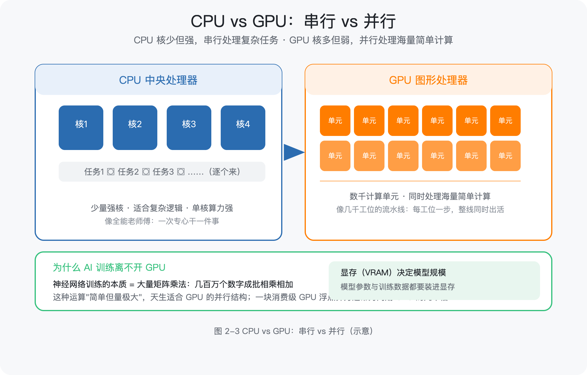
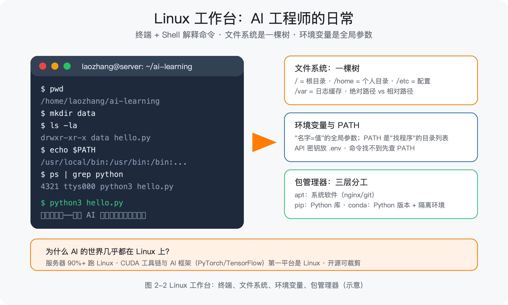
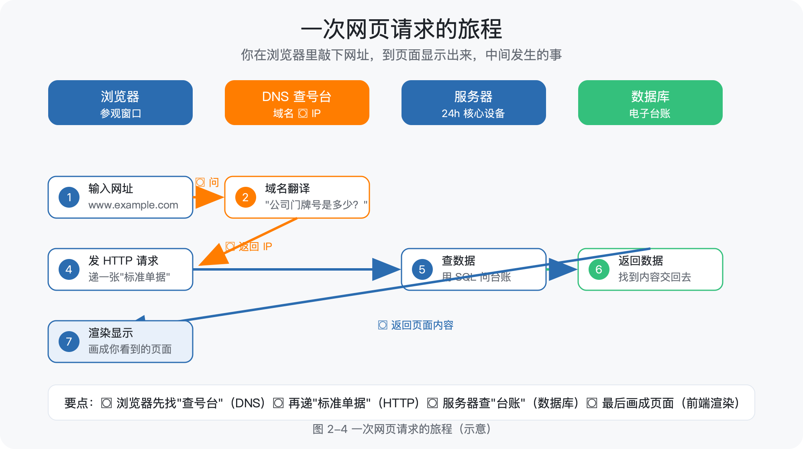
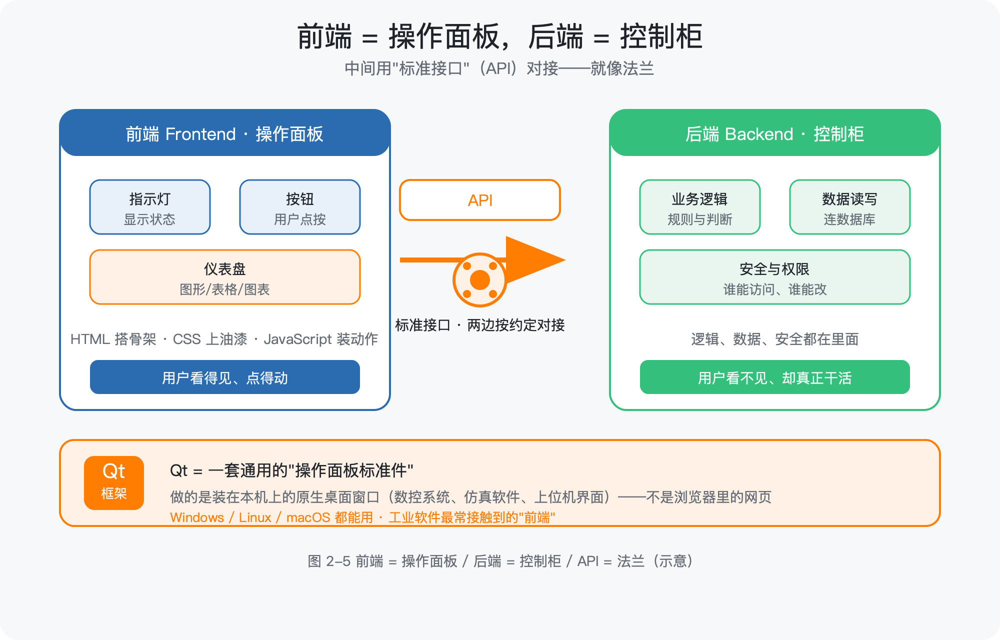
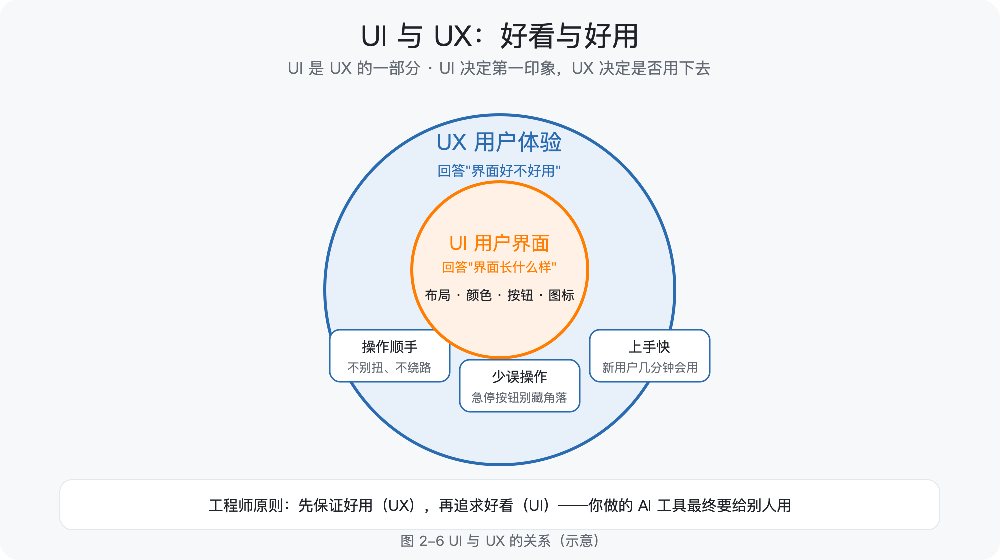
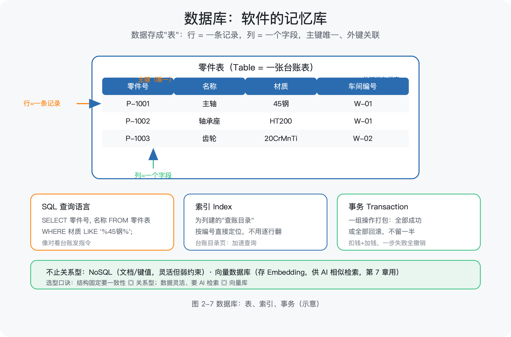
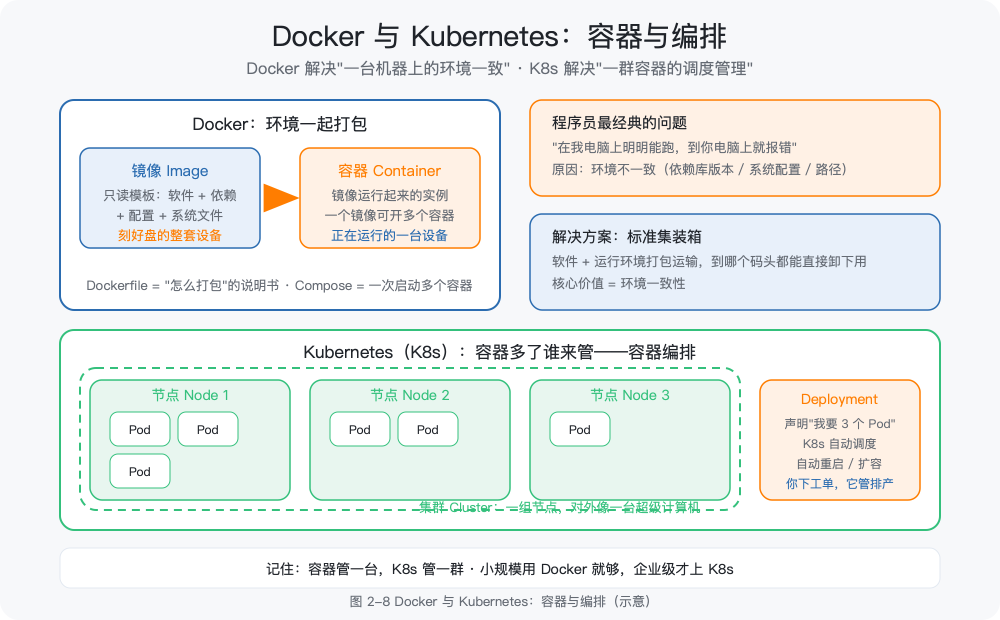
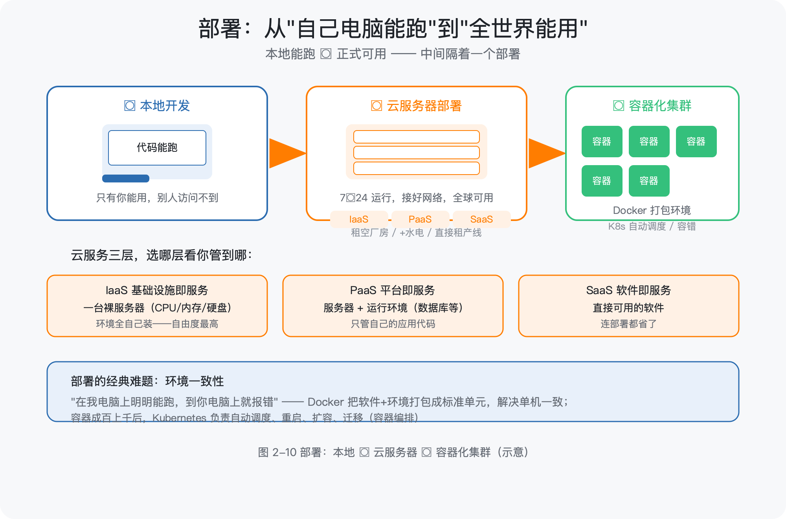
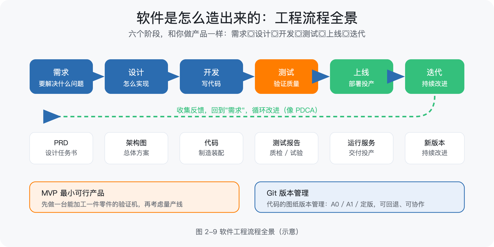
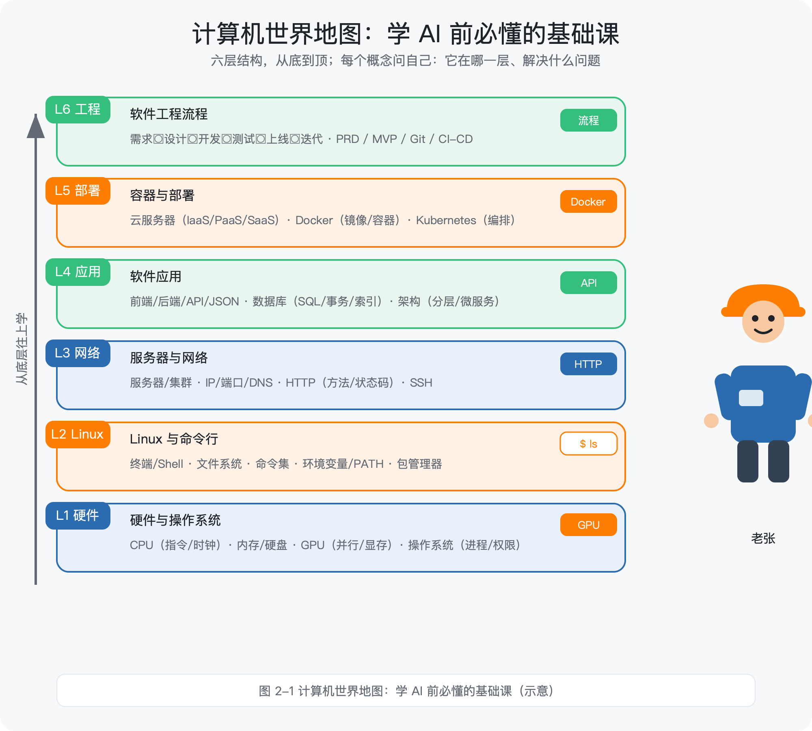

# 第 2 章 计算机通识：学 AI 前必懂的基础课（L1 计算机世界地图）

> 所属框架层：L1 编程与软件工程地基
> 预计篇幅：约 11,000 字（本章无代码门槛，第 3 段为"最小实操示例"）
> 配套文件：本章配图（SVG 源文件见 `figures/ch2/` 目录）、术语表第 2 章·L1 条目
> v1.1 修订：类比降密（只保留少量记忆锚点，以准确语言讲清定义与机制）；内容加深加广（新增 Linux、服务器、GPU 机制、Docker/Kubernetes、环境变量、端口、HTTP 状态码、JSON 等）
> 本章验收附加：学完后能不看资料回答——命令行是什么？前端和后端各干什么？数据库存什么？部署是做什么的？为什么 AI 训练离不开 GPU 和 Linux？

---

## 2.0 本章解决什么问题

这一章解决你的一个具体困境：你打开任何一份 AI 教程，前 20 分钟就会被"打开终端配置环境""装 NVIDIA 驱动""部署到服务器""用 Docker 打包"这些词劝退——不是你不会编程，而是没人给你讲过电脑这台"机器"是怎么运转的，更没人告诉你：**AI 的世界里，Linux、GPU、服务器、容器是默认的工作语言**。

老张，40 岁，某机械厂的资深工艺工程师。去年他下定决心学 AI，第一周就受了挫：教程让他"用 ssh 连上服务器跑训练"，他不知道服务器在哪、为什么要连；教程说"训练要用 GPU"，他以为 GPU 就是好一点的显卡；让他"把代码打包成 Docker 镜像部署"，他完全不知道镜像是什么。他不是不聪明——他闭着眼睛都能说出车床主轴的三种润滑方式——但计算机世界的名词，对他来说就像一台没有图纸、没有铭牌的陌生设备。

这一章就是那份"设备说明书"。我们不追求让你成为计算机专家，而是用**准确的语言**把电脑、Linux、网络、服务器、软件这几样东西讲清楚，让你建立"原生计算机素养"：知道每个概念是什么、为什么存在、解决什么问题。学完这一章，后面每一章提到 GPU、Linux、命令行、数据库、Docker、部署时，你都不会再犯怵。

> **本章配图清单**（图号 / 内容 / 对应小节 / 类型）

| 图号 | 内容 | 对应小节 | 类型 |
|---|---|---|---|
| 图 2-1 | 计算机世界地图（六层总览） | 2.1 / 2.10 | 架构图 |
| 图 2-2 | Linux 工作台：文件系统与命令 | 2.2 | 示意图 |
| 图 2-3 | CPU vs GPU：串行 vs 并行 | 2.1 | 对比图 |
| 图 2-4 | 网页请求旅程（浏览器→DNS→服务器→数据库→返回） | 2.3 | 流程图 |
| 图 2-5 | 前端与后端（含 API 与 JSON） | 2.4 | 架构图 |
| 图 2-6 | UI 与 UX 的关系 | 2.5 | 示意图 |
| 图 2-7 | 数据库：表、索引、事务 | 2.6 | 示意图 |
| 图 2-8 | Docker 与 Kubernetes：容器与编排 | 2.8 | 架构图 |
| 图 2-9 | 软件工程流程全景 | 2.9 | 流程图 |
| 图 2-10 | 部署：本地 → 云服务器 → 容器化集群 | 2.8 | 示意图 |

---

## 2.1 计算机是怎么工作的：硬件与软件

### 2.1.1 CPU 到底在干什么

中央处理器（Central Processing Unit，CPU）是计算机的运算核心。它做的事情极其简单，但速度极快：**读取一条指令 → 执行它 → 读取下一条**，如此循环。指令是"把这两个数相加""把这块数据搬到那里"这类最基础的操作。

三个关键概念，先建立"原生认知"：

- **时钟（Clock）**：CPU 内部有一个节拍器，每"滴答"一次执行一步。3.0 GHz 的意思就是每秒滴答 30 亿次。频率越高，同样时间内能执行的指令越多。
- **寄存器（Register）**：CPU 内部的一小块超高速存储，存放正在处理的数。它比内存快得多，但容量极小。
- **指令集（Instruction Set）**：CPU 认识的全部"动作清单"。不同品牌（Intel、AMD、ARM）的 CPU 各有各的清单，就像不同系统的数控机床指令格式不同。

你不需要会写汇编，但知道"CPU = 按节拍逐条执行指令的部件"，后面理解"为什么代码要经过编译/解释"就顺理成章了（见 2.9 节）。

### 2.1.2 内存与硬盘：两种存储的分工

计算机有两类存储，初学者最容易混：

- **内存（Memory，RAM）**：与 CPU 直接交换数据的存储，速度快、容量小、**断电即失**。它保存的是"正在处理的"数据。
- **硬盘（Disk，存储）**：长期保存数据，速度慢、容量大、**断电不丢**。它保存的是"要长期留着的"数据。

两者关系用一句话讲清楚：**CPU 只跟内存打交道，硬盘里的数据要先"搬到"内存才能被 CPU 处理**。你打开一个 1 万行的 Excel 表格，Excel 把它从硬盘读进内存，然后你的一切操作都在内存里进行——没保存就断电，等于白干。所以"保存"这个动作的本质是：把内存里的最新数据写回硬盘。

如果需要一个记忆锚点：内存像工作台，硬盘像仓库。工作台的东西关机就清空，仓库的东西断电还在。

### 2.1.3 GPU 与 AI：为什么训练模型离不开它

图形处理器（Graphics Processing Unit，GPU）最初是为了渲染 3D 画面设计的，但 AI 行业发现它是训练神经网络的最佳工具。原因在**并行计算**：

- CPU 有 8 核、16 核，每个核很强，适合"串行"地逐条处理复杂任务——像一个全能老师傅，一次专心干一件事，干得又快又好。
- GPU 有数千个计算单元，单个单元很弱，但可以**同时**做海量简单计算——像一条有几千个工位的流水线，每个工位只做一步简单操作，但整条线同时产出大量结果。

神经网络训练的本质是大量矩阵乘法：几百万个数字成批相乘相加。这种运算"简单但量极大"，天生适合 GPU 的并行结构。一个直观数据：一块消费级 GPU 的浮点算力通常是同期 CPU 的几十倍。

另一个必须知道的概念是**显存（VRAM）**：GPU 自带的高速内存。模型参数、训练数据都要装进显存才能被 GPU 计算。**显存容量决定了你能训练多大的模型**——这也是为什么大模型训练要用多张 GPU 组成集群（见 2.3 节）。

AI 实践中最常见的 GPU 名词：NVIDIA 的 CUDA（GPU 的编程接口）、显存 8G/24G/80G（决定模型规模）、GPU 服务器（多卡集群，按小时租赁）。第 9 章讲私有化部署时会再算这笔账。




### 2.1.4 操作系统：硬件之上的"管理者"

操作系统（Operating System，OS）是运行在硬件之上的基础软件，管理所有硬件资源并为应用程序提供服务。它干四类活：

- **进程与线程管理**：进程（Process）是一个正在运行的程序（如"你打开的 Excel"），线程（Thread）是进程内的执行单元（如"Excel 同时做计算和界面刷新"）。操作系统负责给每个进程分配 CPU 时间、内存空间，并保证它们互不干扰。
- **内存管理**：给每个进程划分独立的内存区域，防止一个程序崩溃拖垮整个系统。
- **文件系统**：把硬盘组织成"目录（文件夹）+ 文件"的层级结构，并记录每个文件在哪。文件系统结构是理解路径的前提（见 2.2 节）。
- **权限管理**：规定谁能读、谁能在哪个目录写、谁能安装软件。工业场景里"操作工只能动自己工位、车间主任才能改排产"就是权限的日常版。

Windows、macOS、Linux 都是操作系统。你在个人电脑上用 Windows 或 macOS，但学 AI 时你会频繁接触 Linux——原因见下一节。

### 2.1.5 数据在电脑里怎么存：二进制与编码

电脑里一切数据最终都是二进制（0 和 1）。一个 0 或 1 叫一个比特（bit），8 个比特组成一个字节（Byte），是存储的基本单位（1KB = 1024 字节，一张照片约 2–5MB）。

文本是怎么变成 0/1 的？靠**字符编码**：每个字符对应一个编号。现代世界统一的编码是 UTF-8——它兼容 ASCII（英文/数字/符号），又能表示全世界所有文字（包括中文）。"机械"两个字在 UTF-8 下各占 3 个字节。为什么工程师要知道这个？因为 AI 处理文本、代码文件乱码、数据库存储中文字段，都跟编码有关——遇到"打开文件全是乱码"时，先查编码。

另一种必须认识的数据格式是 **JSON**（JavaScript Object Notation，一种轻量级数据交换格式）：用"键: 值"的文本方式表示结构化数据。它几乎成了程序之间传数据的"普通话"：

```json
{
  "设备编号": "MC-003",
  "状态": "运行中",
  "主轴转速": 1200,
  "报警": null
}
```

JSON 是人类可读的，机器也好解析。2.4 节讲 API 时会频繁见到它。

---

## 2.2 Linux 系统与命令行：AI 工程师的工作台

### 2.2.1 为什么 AI 的世界几乎都在 Linux 上

这是本章最重要的"为什么"。原因有三个：

1. **服务器生态**：AI 训练和推理跑在服务器上，而互联网服务器 90% 以上运行 Linux。你租的云服务器、企业的 GPU 服务器，几乎都是 Linux。
2. **GPU 驱动与工具链**：NVIDIA 的 CUDA 工具链、PyTorch、TensorFlow 等 AI 框架，最先、最完整支持的平台就是 Linux。
3. **开源与可定制**：Linux 完全开源，可裁剪、可定制，适合构建从嵌入式到超算的各种环境。

一句话：**你不一定要在个人电脑上装 Linux，但你学的 AI 知识最终都要跑在 Linux 服务器上**。所以至少要会用 Linux 的命令行——这不是"程序员的高深爱好"，而是 AI 实践的基本功。

### 2.2.2 Linux 与 Windows/macOS 有什么不同

| 维度 | Windows / macOS | Linux |
|---|---|---|
| 开发来源 | 商业公司闭源开发 | 开源社区协作开发 |
| 操作方式 | 图形界面为主，命令行为辅 | 命令行为主（服务器版甚至没有图形界面） |
| 常见发行版 | — | Ubuntu、Debian、CentOS、Rocky Linux 等 |
| 使用场景 | 个人办公、日常使用 | 服务器、云计算、AI 训练、嵌入式 |
| 文件路径写法 | `C:\Users\...` / `/Users/...` | `/home/用户名/...`（一切从根目录 `/` 开始） |

macOS 的底层也是类 Unix 系统，所以你在 macOS 的"终端"里学的命令，在 Linux 上几乎完全通用——这对你来说是个好消息。

### 2.2.3 终端与 Shell：命令行的两个概念

- **终端（Terminal）**：一个窗口程序，让你输入命令并看到输出。它本身不执行命令，只是"显示器 + 键盘"。
- **Shell**：真正解释和执行命令的程序。常见的有 bash、zsh。你输入 `ls`，Shell 找到并执行 `ls` 这个程序，把结果交给终端显示。

命令行（Command Line Interface，CLI）就是用文本命令操作电脑的方式。为什么程序员爱用它？三个实际理由：**可复制**（一条命令发给同事就能复现）、**可组合**（命令可以管道连接，如 `ps | grep python` 表示"列出进程，筛出 python"）、**可脚本化**（把多条命令写进文件自动执行）。

### 2.2.4 Linux 文件系统：先看懂树状结构

Linux 的一切文件都从根目录 `/` 开始，是一棵倒挂的树。几个你必须知道的目录：

| 目录 | 存什么 |
|---|---|
| `/` | 根目录，树的起点 |
| `/home/用户名` | 你的个人目录（相当于 Windows 的用户文件夹） |
| `/etc` | 系统配置文件（相当于"设备参数表"） |
| `/var` | 经常变化的文件：日志、缓存（相当于"运行记录"） |
| `/tmp` | 临时文件 |
| `/usr` | 系统安装的软件 |

路径就是"从根到目标的路线"：绝对路径从 `/` 开始（`/home/laozhang/projects`），相对路径从当前位置开始（`projects/`，前面没有斜杠）。终端里 `~` 是"我的个人目录"的缩写，`.` 是当前目录，`..` 是上一级目录。

### 2.2.5 工程师命令集（先会用，再理解）

下面的命令是 AI 实践中最高频的，每个后面都说明它实际干什么：

| 命令 | 干什么 |
|---|---|
| `pwd` | 显示当前所在目录 |
| `ls` / `ls -la` | 列出当前目录内容 / 列出详细信息（含权限、大小） |
| `cd 目录` | 进入某个目录 |
| `mkdir 名称` | 新建目录 |
| `cp 源 目标` / `mv 源 目标` | 复制 / 移动或重命名 |
| `cat 文件` | 把文件内容打印到终端 |
| `chmod 权限 文件` | 修改文件权限（如 `chmod +x run.sh` 给脚本加执行权限） |
| `ps` / `top` | 查看正在运行的进程 / 实时查看资源占用 |
| `curl 网址` | 向网址发送网络请求（2.3 节会实测） |
| `ssh 用户@主机` | 远程登录另一台电脑（2.3 节讲） |
| `git clone 网址` | 把网上的代码仓库复制到本地 |
| `pip install 包名` | 安装 Python 库 |
| `sudo 命令` | 以管理员权限执行命令（类比：需要车间主任签字） |

命令记不住很正常，你不需要背——**理解每个命令在"电脑里实际做什么"，比背命令本身重要**。后面所有章节用到时都会再出现。

### 2.2.6 环境变量与 PATH

环境变量（Environment Variable）是操作系统和程序共享的一组"全局参数"，每个变量是一个"名字=值"的键值对。最常见的 PATH 变量存的是"可执行程序所在的目录列表"：你输入 `python3`，系统按 PATH 里的目录顺序去找名为 `python3` 的程序，找到就执行。

为什么工程师必须懂环境变量？三个实际场景：

1. 安装软件后提示"命令找不到"——通常是该软件的目录没加进 PATH。
2. AI 项目里，API 密钥、数据库地址等敏感配置通常放在 `.env` 文件里，程序启动时读为环境变量（比写死在代码里安全）。
3. 切换 Python 版本、配置 CUDA 路径，本质都是在改环境变量。

查看环境变量的命令是 `echo $PATH`（输出 PATH 的值）。第 3 章配置 Python 环境时会实际用到。

### 2.2.7 包管理器：apt、pip、conda 的分工

包管理器（Package Manager）是自动下载、安装、管理软件依赖的工具。Linux 生态有三个层次，分工不同：

- **apt**（Ubuntu 等发行版自带）：管理系统级软件（如安装 nginx、git）。类比：从"系统标准件库"领件。
- **pip**：安装 Python 库（如 `pip install pandas`）。类比：从"Python 专用零件库"领件。
- **conda**：同时管理 Python 版本和库，且能创建互相隔离的"环境"（Environment）——每个环境有自己的 Python 和依赖版本。类比：为不同项目各配一套独立的工具箱。

**为什么需要隔离环境？** 项目 A 需要 pandas 2.0，项目 B 需要 pandas 1.5——如果装在一个环境里会互相打架。conda 虚拟环境让每个项目有自己的工具箱，互不干扰。第 3 章你会亲手创建第一个虚拟环境。

---




## 2.3 服务器与网络

### 2.3.1 服务器是什么

服务器（Server）本质是一台电脑，但它与个人电脑有三点不同：

1. **7×24 小时运行**：设计上就是不停机的（冗余电源、冗余硬盘）。
2. **没有显示器键盘**：服务器版系统只有命令行，人靠远程登录操作。
3. **按用途分工**：有的存数据（数据库服务器），有的跑计算（GPU 训练服务器），有的对外提供网页（Web 服务器）。

当多台服务器一起干活、对外像一台机器时，叫**集群（Cluster）**。大模型训练就是上百台 GPU 服务器组成集群，用高速网络连起来协同计算。

### 2.3.2 IP、端口、域名、DNS

一台电脑要访问另一台，靠三个概念：

- **IP 地址**：每台联网设备的门牌号，如 `192.168.1.100`。
- **端口（Port）**：一台机器上"具体的服务入口"。IP 找到机器，端口找到这台机器上的哪个服务。类比：门牌号找到公司，部门分机号找到具体的人。HTTP 服务默认端口是 80，HTTPS 是 443，数据库 MySQL 是 3306。
- **域名与 DNS**：记 IP 很难受，于是用域名（`example.com`）代替。DNS（域名系统）负责把域名翻译成 IP——类比"公司名查号台"。

一条命令就能查 DNS：`nslookup example.com` 会返回它的 IP。你可以试试，会发现"www.baidu.com"背后其实有好几个 IP——这是负载均衡（见 2.7 节）的体现。

### 2.3.3 HTTP/HTTPS：请求与响应

超文本传输协议（HyperText Transfer Protocol，HTTP）是浏览器（客户端）与服务器之间通信的规则。核心模型是**请求-响应**：

1. 客户端发一个**请求**：包含方法（Method）、地址（URL）、请求头（Header，如浏览器类型、认证信息）、可选请求体（Body，如表单数据）。
2. 服务器回一个**响应**：包含状态码（Status Code）、响应头、响应体（Body，通常是 HTML 或 JSON）。

**HTTP 方法**就几种，记住常用的：GET（取数据，不改变服务器状态）、POST（提交数据，如提交表单）、PUT/DELETE（更新/删除）。类比：GET 是"查台账"，POST 是"登记新记录"。

**HTTP 状态码**是服务器给客户的"一句话回执"，必须认识这几类：

| 状态码 | 含义 | 工程师视角 |
|---|---|---|
| 200 | 成功 | 请求处理完毕，正常返回 |
| 301/302 | 重定向 | 内容搬走了，去新地址 |
| 404 | 找不到 | 地址写错或资源不存在 |
| 500 | 服务器内部错误 | 服务器自己出问题了 |
| 403 | 没有权限 | 有地址但没权限访问 |

HTTPS 是 HTTP 的加密版本：传输内容加密（相当于单据套了密封信封），防止中途被窃听或篡改。凡是要输入账号密码的网站，地址栏必须是 `https://`。

### 2.3.4 一次网页请求的旅程

你在浏览器输入 `https://example.com`，背后发生的事（图 2-4）：




1. 浏览器先查 DNS："example.com 的 IP 是多少？"
2. DNS 返回 IP（如 `93.184.216.34`）。
3. 浏览器向该 IP 的 443 端口发一个 HTTPS 请求（GET）。
4. 服务器收到请求，可能需要去数据库查数据（见 2.6 节）。
5. 服务器把结果打包成响应（状态码 200 + HTML/JSON 内容）。
6. 浏览器拿到响应，解析并渲染成你看到的页面。

一次网页请求，就是一趟"查询-回传"的完整流程。2.10 节你会用 `curl` 亲手看到这个过程的原始形态。

### 2.3.5 SSH：远程操作服务器的标准方式

SSH（Secure Shell，安全外壳协议）是远程登录另一台电脑的命令行协议，AI 实践中最常用的操作方式——你租了一台云服务器，就是用 SSH 登录去配置它：

```bash
ssh 用户名@服务器IP
```

连接后，你的终端就变成了那台服务器的终端，可以执行命令、传文件（`scp`）、跑训练。SSH 的"安全"体现在加密传输和密钥认证：生产环境用**密钥对**（公钥放服务器、私钥留本地）代替密码登录，更安全。2.10 节的实操会演示怎么用 SSH 连一个本地环境。

---

## 2.4 前端与后端：软件的一体两面

### 2.4.1 浏览器如何工作

浏览器（Browser）是运行网页的程序。它做的事情可以概括为：**拉取资源（HTML/CSS/JS/图片）→ 解析 → 渲染成可视页面 → 响应你的操作**。你在地址栏输入网址，浏览器就是那个发起 HTTP 请求、接收响应、把代码"画"成页面的角色。

浏览器的核心工作包括：解析 HTML 生成页面结构（DOM）、解析 CSS 计算样式、执行 JavaScript 处理交互。一个现代网页，本质是"内容结构 + 样式 + 行为"三部分的组合。

### 2.4.2 HTML、CSS、JavaScript：网页的三层

| 技术 | 全称 | 负责什么 | 特点 |
|---|---|---|---|
| HTML | 超文本标记语言 | 页面内容的结构（标题、段落、表格、图片） | 描述"有什么" |
| CSS | 层叠样式表 | 页面的外观（颜色、字体、布局） | 描述"长什么样" |
| JavaScript（JS） | — | 页面的行为（点击响应、数据更新、动画） | 描述"怎么动" |

三者的关系一句话：**HTML 定义内容结构，CSS 定义外观，JavaScript 定义行为**。后面第 6 章你用 AI 生成网页工具时，实际就是在生成这三层代码。

### 2.4.3 API 与 JSON：前端怎么向后端要数据

**前端（Frontend）**：运行在用户浏览器里的部分——用户看得见、点得动的界面。**后端（Backend）**：运行在服务器上的部分——处理业务逻辑、读写数据库。两者不在同一台机器上，怎么通信？靠 API。

应用程序接口（Application Programming Interface，API）是程序之间约定的通信方式。Web 领域最常见的是 **REST API**：后端把每个"能力"定义成一个 URL + 方法（如 `GET /api/devices` 表示"获取设备列表"），前端发请求、后端回 JSON。一次典型对话：

```
前端发：GET /api/devices/MC-003
后端回：200 OK
{"设备编号": "MC-003", "状态": "运行中", "主轴转速": 1200}
```

如果需要一个记忆锚点：**前端是用户看到的"操作面板"，后端是藏在服务器上的"控制柜"，API 是两者之间约定好的标准接口**。第 6 章调用大模型 API，就是"前端/脚本向后端发请求、收 JSON"这个模式的直接应用。

### 2.4.4 Qt 是什么（工业软件里的"前端"）

Qt 是一套跨平台桌面软件界面框架——用 C++/Python 等语言快速搭建 Windows、Linux、macOS 都能运行的桌面程序界面。工业软件（数控系统、仿真软件、上位机、SCADA 组态）大量使用 Qt，这是工程师最容易直接接触到的"前端"技术。

和网页前端的区别：网页前端运行在浏览器里（需要浏览器这个"运行环境"），Qt 程序是独立运行的桌面应用（自带窗口，不需要浏览器）。但两者做的事本质相同：**都负责"用户看到的界面 + 用户操作的响应"**。学完 2.4 节，你再看 Qt 相关的招聘要求或软件文档，就不会觉得陌生了。

---




## 2.5 UI 与 UX：好看与好用

- **UI**（User Interface，用户界面）：界面的视觉设计——布局、颜色、按钮大小、图标。回答"界面长什么样"。
- **UX**（User Experience，用户体验）：使用过程的整体体验——顺不顺手、容不容易误操作、新用户多久能上手。回答"界面好不好用"。

两者的关系：**UI 是 UX 的一部分**。界面好看但操作别扭（急停按钮藏在角落），UX 差；操作合理但界面混乱没人愿意用，UI 拖后腿。

工程师为什么也要懂一点 UI/UX？因为你做的 AI 工具最终要给别人用。判断标准很简单：**UI 决定用户第一印象，UX 决定用户是否真的用下去**。第 11 章讲"把工具做成别人愿意用的产品"时会展开。现阶段记住"先保证好用（UX），再追求好看（UI）"就够。

---




## 2.6 数据库：软件的记忆库

### 2.6.1 关系型数据库与 SQL

数据库（Database）是结构化存储和管理数据的软件系统。最主流的是**关系型数据库**（Relational Database）：数据存成"表（Table）"，表有行（一条记录）和列（一个字段），表与表之间用**主键/外键**关联。典型：MySQL、PostgreSQL。

| 概念 | 是什么 | 对应你熟悉的东西 |
|---|---|---|
| 表（Table） | 一类数据的集合 | 一张台账表 |
| 行（Row） | 一条记录 | 台账里的一行 |
| 列（Column） | 一个字段 | 台账里的一列 |
| 主键（Primary Key） | 唯一标识一条记录的字段 | 设备编号（不重复） |
| 外键（Foreign Key） | 指向另一张表的字段 | "车间编号"指向车间表 |

操作数据库的语言是 **SQL**（结构化查询语言）。几个最常用的语句：

```sql
-- 查询：把 2025 年 3 月入库、材质含 45 钢的零件列出来
SELECT 零件号, 名称 FROM 零件表
WHERE 入库日期 BETWEEN '2025-03-01' AND '2025-03-31'
  AND 材质 LIKE '%45钢%';

-- 新增一条记录
INSERT INTO 零件表 (零件号, 名称) VALUES ('P-1001', '传动轴');

-- 更新
UPDATE 零件表 SET 状态 = '已领用' WHERE 零件号 = 'P-1001';
```

SQL 值得学，因为它是"和数据库说话"的标准语言，AI 项目里做数据准备（第 4、10 章）会反复用到。

### 2.6.2 事务与索引：数据库为什么可靠又快速

两个概念级认知，帮你理解数据库的工程价值：

- **事务（Transaction）**：把一组操作打包成一个"要么全部成功、要么全部回滚"的整体。比如"转账 = 扣钱 + 加钱"，中途任何一步失败，整体回滚，账不会对不上。数据库通过事务保证数据一致性（ACID 原则）。
- **索引（Index）**：数据库为某列建立的"查账目录"，让查询从"逐行翻台账"变成"按目录直接定位"，速度提升几个数量级。代价是索引占用存储、写入变慢。给哪些列建索引，是数据库优化的核心工作。

### 2.6.3 非关系型数据库与向量数据库

非关系型数据库（NoSQL）不要求固定表格结构，适合海量、多样、变化快的数据（典型：MongoDB、Redis——Redis 常作缓存，见 2.7 节）。

AI 世界里还有一类必须提前认识的：**向量数据库（Vector Database）**。它存储的是数据的"向量表示"（一组数字坐标），支持按"相似度"检索——本质是"语义上最接近的内容"。第 7 章做企业知识库问答（RAG）时，它就是检索的核心部件。这里只需知道：**AI 应用离不开数据存储，既有传统的关系型数据库，也有为 AI 设计的向量数据库**。

---




## 2.7 架构：把系统搭得像车间产线

### 2.7.1 架构是什么，为什么要先规划

架构（Architecture）是软件系统的整体结构与模块划分：有哪些模块、模块之间怎么连接、数据怎么流动。就像车间要先做布局规划再进设备，软件不规划架构就开写，等于不画车间布局图就进场装设备——初期很爽，后期返工。

### 2.7.2 怎么看一张架构图

架构图就是"系统布局图"：**方框 = 模块/服务，箭头 = 数据流/调用关系**。拿到任何一张架构图，只问三个问题：

1. 有哪些模块（方框）？
2. 模块之间传什么（箭头上的标签）？
3. 数据从哪进、从哪出（边界在哪）？

看懂这三个问题，你就能读懂绝大多数 AI 方案的架构图——这是"看得懂 AI 方案"能力的第一步。

### 2.7.3 分层架构与单体/微服务

最常见的架构是**三层分层**：前端（界面层）→ 后端（业务逻辑层）→ 数据库（数据层）。数据单向流动：前端请求 → 后端处理 → 数据库存取 → 结果返回前端。

**单体架构（Monolithic）**：所有功能在一个程序里，像一条大产线——简单好管，但一处改动影响全局、扩充困难。**微服务（Microservices）**：拆成多个独立服务，各自部署、独立升级，像多条专业化产线——灵活可扩展，但协调与运维复杂（这正是 Kubernetes 要解决的问题，见 2.8 节）。

### 2.7.4 高可用与负载均衡（概念级）

大型系统要解决两个现实问题：

- **负载均衡（Load Balancing）**：一台服务器扛不住所有请求，于是前面放一个"调度员"（如 Nginx），把请求分发给多台服务器。这也是 `www.baidu.com` 背后有多个 IP 的原因。
- **高可用（High Availability）**：单台服务器会坏，于是同一服务部署多份，一台故障自动切换。用"冗余"换"可靠"，和数控机床配双回路一个道理。

这两个概念是"生产级系统"的标志，第 9 章部署 AI 服务时会再见到。

---

## 2.8 容器与部署：从"自己电脑能跑"到"全世界能用"

### 2.8.1 部署是什么

部署（Deployment）是把软件安装配置到运行环境、并让它正式运行起来的过程。你写的程序在自己电脑能跑，只等于"车间试制成功"；要让别人都能用，需要放到一台 7×24 运行的机器上、配好环境、接好网络——这一整套动作就是部署。**"本地能跑"和"正式可用"之间，隔着一个部署**。

运行环境分两类：**本地/内网**（自己电脑或企业内网）和**云服务器**（租云厂商的机器，阿里云、腾讯云、AWS 等）。云服务的分层概念：

| 缩写 | 全称 | 你得到什么 | 类比 |
|---|---|---|---|
| IaaS | 基础设施即服务 | 一台裸的服务器（CPU/内存/硬盘） | 租一间空厂房 |
| PaaS | 平台即服务 | 服务器 + 运行环境（数据库等） | 租厂房 + 装好水电 |
| SaaS | 软件即服务 | 直接可用的软件 | 直接租用整条产线 |

### 2.8.2 Docker：把环境一起打包

程序员最经典的问题："在我电脑上明明能跑，到你电脑上就报错。"原因通常是**环境不一致**：依赖库版本、系统配置、路径不同。

Docker 的解决方案：把"软件 + 它的运行环境（依赖库、配置、系统文件）"打包成一个标准单元。两个核心概念：

- **镜像（Image）**：打包好的"只读模板"，包含全部环境——类比：刻好盘的整套设备 + 工装 + 参数设置。
- **容器（Container）**：镜像运行起来的实例——类比：用这套模板开出的、正在运行的一台设备。同一镜像可以开出任意多个容器。

打包方式写在一个叫 **Dockerfile** 的文本文件里（内容是"从什么基础镜像开始、装什么、拷什么、启动什么"），构建一次镜像，到处运行。多个容器要一起跑（如"网页服务 + 数据库"），用 **Docker Compose** 一个命令全部启动。

如果需要一个记忆锚点：**Docker 容器像标准集装箱**——设备连同工装打包运输，到哪个码头都能直接卸下来用。它解决的核心问题是"环境一致性"。

### 2.8.3 Kubernetes（K8s）：容器多了谁来管

容器解决了"单台机器上的环境一致性"，但生产环境里容器有成百上千个，分布在几十台服务器上，又出现新问题：容器挂了一个谁来重启？流量怎么分配给各容器？服务器坏了容器怎么迁移？——这叫**容器编排（Orchestration）**。

Kubernetes（简称 K8s，读作"kube-eights"）是事实标准的容器编排平台。四个核心概念，概念级理解即可：

| 概念 | 是什么 |
|---|---|
| 节点（Node） | 集群里的一台服务器（物理机或虚拟机） |
| 集群（Cluster） | 一组节点组成的一个整体，对外像一台超级计算机 |
| Pod | K8s 里最小的运行单元（一个或多个容器装在一起） |
| Deployment | 声明"我要跑几个 Pod"，K8s 自动维持这个数量 |

K8s 的核心能力一句话：**你告诉它"我要运行 3 个这种容器"，它负责在集群里调度、维持、自动重启、自动扩容**。就像车间的中央调度系统：你只管下工单，它管排产、看机、换刀、报警。

对工程师的实际意义：第 9 章私有化部署 AI 服务时，小规模用 Docker 就够；企业级、多服务、要扩缩容时，才需要 K8s。**先知道"容器管一台，K8s 管一群"就够了**。




### 2.8.4 CI/CD：自动化的交付流水线

CI/CD 是软件交付的自动化流水线：

- **CI（持续集成）**：代码一提交，自动编译 + 自动跑测试——有问题立刻发现，不让坏代码积累。
- **CD（持续部署）**：测试通过后，自动构建镜像、自动部署上线。

类比：**自动化的装配-检验-发货线**——代码提交是"零件到位"，测试是"质检"，部署是"发货"。人工参与越少，交付越快越稳。第 3 章学 Git 后，你会第一次体验"提交代码触发自动化检查"。

---




## 2.9 软件是怎么造出来的：工程流程全景

### 2.9.1 六个阶段

软件工程（Software Engineering）的完整流程，类比一个产品从需求到持续改进的生命周期（图 2-9）：




| 阶段 | 干什么 | 产物 | 你要知道的 |
|---|---|---|---|
| 需求 | 明确要解决什么问题 | PRD（产品需求文档） | 设计任务书 |
| 设计 | 规划怎么实现 | 架构图、接口设计 | 总体方案 |
| 开发 | 写代码 | 代码 | 制造装配 |
| 测试 | 验证功能与质量 | 测试报告 | 质检 / 出厂试验 |
| 上线 | 部署发布 | 正式运行的服务 | 交付投产 |
| 迭代 | 收集反馈、持续改进 | 新版本 | 持续改进 |

软件工程不是什么神秘学科，它就是工程管理在软件上的翻版。你的流程思维（PDCA、质量控制、文档管理）几乎可以平移过来——这是工程师学软件的巨大优势。

### 2.9.2 三个必须认识的工程概念

- **MVP（最小可行产品）**：先做功能最简、但能验证需求是否成立的版本，再迭代。类比：先做一台能加工一件零件的验证机，确认方案可行，再考虑量产线。
- **Git 版本管理**：代码的"图纸版本管理"——每次改动留版本、可回退、可多人协作（分支/合并）。第 3 章会实际用起来。
- **编译器与解释器**：代码要变成机器能执行的指令，需要翻译。**编译器**（如 C++）把整个程序一次性翻译成机器码再运行；**解释器**（如 Python）边翻译边执行。这也是为什么 Python 代码要"运行"（解释器执行）而 C++ 要"编译"（生成可执行文件）。Python 是 AI 世界的主力语言，因为它开发效率高、生态完善——代价是执行速度比编译型慢，但在 AI 场景里通常不是瓶颈。

---

## 2.10 本章地图与练习

### 2.10.1 一张"学 AI 前的计算机世界地图"

把全章收成一张图（图 2-1），六层，从底到顶：

```
第6层 软件工程：需求→设计→开发→测试→上线→迭代（PRD/MVP/Git/CI-CD）
第5层 容器与部署：云服务器（IaaS/PaaS/SaaS）· Docker（镜像/容器）· Kubernetes（编排）
第4层 软件应用：前端/后端/API/JSON · 数据库（SQL/事务/索引）· 架构（分层/微服务）
第3层 服务器与网络：服务器/集群 · IP/端口/DNS · HTTP（方法/状态码）· SSH
第2层 Linux 与命令行：终端/Shell · 文件系统 · 命令集 · 环境变量/PATH · 包管理器
第1层 硬件：CPU（指令/时钟）· 内存/硬盘 · GPU（并行/显存）· 操作系统（进程/权限）
```




以后遇到任何不懂的计算机词，先问自己：**它在这张地图的哪一层、解决什么问题？**——这就是老张的"地图思维"。

### 2.10.2 最小实操示例：30 分钟在命令行里走通一圈

**实操 A：Linux 命令集走一遍**（macOS 终端或 Windows 的 WSL 均可，命令通用）：

```bash
# 本段做什么：建目录、查看内容、看进程——感受命令行的节奏
cd ~                # 回到个人目录
mkdir ai-learning   # 新建项目目录
cd ai-learning      # 进入它
pwd                 # 确认当前路径
ls -la              # 列出内容（含隐藏文件，此刻应该几乎为空）
ps                  # 查看当前终端的进程
echo $PATH          # 查看环境变量 PATH 的内容
```

在本书写作环境实测，`pwd` 输出的是你所在的完整路径（每个人不同），`ls -la` 会列出 `.` 和 `..` 两行（表示当前目录和上级目录），`ps` 输出进程列表，`echo $PATH` 会打出一长串冒号分隔的目录——那正是 2.2.6 节讲的 PATH：系统找程序时按这个顺序搜索。

**实操 B：安装 Python 库并运行一个脚本**（第 3 章会系统学，这里先打通环境）：

```bash
python3 --version   # 检查 Python 版本（要求 3.10+）
pip3 install pandas # 安装数据分析库 pandas
```

然后创建 `hello.py`（内容如下）并运行：

```python
# 目标：验证环境跑通，并输出一句"工程话"
import platform
print("Python 版本：", platform.python_version())
print("你好，老张——你的 AI 之路，从这一行开始。")
```

```bash
python3 hello.py
```

**实操 C：用 curl 观察一次真实的 HTTP 请求**（这是本章的"惊喜练习"）：

```bash
curl -sI https://www.baidu.com
```

`-s` 静默模式，`-I` 只取响应头。在本书写作环境实测，输出如下——这就是 2.3 节讲的状态码和响应头：

```
HTTP/1.1 200 OK
Cache-Control: private, no-cache...
Content-Type: text/html
Server: bfe
```

看到 `200 OK`，说明这次请求成功了。把 URL 换成一个不存在的地址再跑一次：

```bash
curl -sI https://www.baidu.com/nonexist-xyz
```

实测输出：

```
HTTP/1.1 404 Not Found
Content-Type: text/html; charset=iso-8859-1
```

`404` 的意思就是"找不到"——现在你亲眼见过两个最重要的 HTTP 状态码了。

### 2.10.3 练习与检验标准

**练习 1（能跑通）**：完成实操 A、B、C 全部命令，记录每步输出。再追加：`cd /etc` 后用 `ls | head` 看看系统配置文件目录里有什么。

**练习 2（能讲清）**：不看资料，向同事讲清楚：GPU 为什么适合 AI 训练？Linux 为什么是 AI 的主场？Docker 和 Kubernetes 各自解决什么问题？

**练习 3（能画出）**：默画"网页请求旅程"流程图（浏览器→DNS→服务器→数据库→返回），并标注每一步用到的概念（IP / 端口 / DNS / HTTP / 数据库 / 前端渲染）。

**双验收标准**：
- 能讲清：完整复述"计算机世界地图"六层结构，每个概念说得出"是什么 + 解决什么问题"；
- 能跑通：实操 A/B/C 全部成功，输出与本书一致；
- 验收六问（本章附加）：
  1. 命令行是什么？——用文本命令操作电脑的方式（终端 + Shell）。
  2. 前端和后端各干什么？——前端是浏览器里用户看到的界面；后端是服务器上处理逻辑与数据的部分；两者用 API（HTTP + JSON）通信。
  3. 数据库存什么？——结构化数据（关系型用表存、SQL 查；还有为 AI 设计的向量数据库）。
  4. 部署是做什么的？——把软件配置到运行环境、正式投产；小规模用 Docker，集群规模用 Kubernetes。
  5. 为什么 AI 训练离不开 GPU？——神经网络训练是海量矩阵运算，GPU 有数千个并行计算单元，算力远超 CPU；显存决定模型规模。
  6. 为什么 AI 生态在 Linux 上？——服务器、CUDA 工具链、AI 框架都以 Linux 为第一平台。

---

## 2.11 常见坑与工程师贴士

### 常见坑（本章高频翻车点）

| 坑 | 表现 | 纠正 |
|---|---|---|
| 把命令行当编程 | "我不会编程，不敢用命令行" | 命令行只是"对话方式"；先会用再理解 |
| 内存和硬盘分不清 | 以为没保存的文件断电后还在 | 内存断电即失，硬盘持久保存；保存=写回硬盘 |
| 以为 GPU = 好一点的显卡 | 用打游戏的经验理解 AI 训练 | GPU 的核心价值是并行计算 + 显存；AI 训练拼的是算力和显存 |
| 在个人 Windows 上硬装 AI 环境 | 装 CUDA 反复失败 | 先本地学语法，正式训练用云 GPU 服务器（Linux） |
| 以为"部署 = 发布 App" | 觉得部署是上架商店 | 部署=正式投产；本地跑通只算试制成功 |
| 命令背了就忘 | 反复查同样命令 | 记"每个命令在电脑里干什么"，理解优先于背诵 |
| 把数据库当 Excel | 用 Excel 思路理解数据库 | 数据库是"有约束、可并发、可事务"的工程化台账，靠 SQL 操作 |
| 跳过环境隔离 | 一个环境装所有包，依赖打架 | 每个项目用独立虚拟环境（conda/venv），第 3 章会实践 |

### 工程师贴士：把电脑当成一台你要管理的设备

你管理过机床、产线、设备档案，现在把电脑和服务器当成同样的对象：**硬件是设备本体，操作系统是设备的管理系统，命令行是操作面板，环境变量是参数设置，Docker 是把设备连同参数一起打包的标准单元，Kubernetes 是整条产线的中央调度**。遇到任何不懂的计算机术语，先问两个问题：它在这台"设备"上是哪个部件？它解决什么问题？——答上来就懂了。大多数计算机概念，工程师在车间里早就见过类似的形态。

---

## 本章小结

1. 硬件：CPU 按节拍执行指令，内存断电即失，硬盘持久保存，GPU 靠数千并行单元成为 AI 训练主力（显存决定模型规模）；
2. Linux 是 AI 的主场：服务器、CUDA、AI 框架都以 Linux 为第一平台，命令、文件系统、环境变量、包管理器是基本功；
3. 网络世界靠 IP（门牌号）、端口（分机号）、DNS（查号台）、HTTP（请求-响应 + 状态码）协作；SSH 是远程操作服务器的标准方式；
4. 软件应用：前端是浏览器里的界面，后端是服务器上的逻辑，API（HTTP+JSON）连接两者；数据库是工程化台账，架构是系统布局规划；
5. 部署让软件正式投产：Docker 解决"环境一致性"，Kubernetes 管"一群容器"，CI/CD 自动化交付；
6. 学 AI 前先拿到这张"计算机世界地图"，建立原生计算机素养——后面每一章你都不会迷路。

## 延伸阅读

- **easy-vibe**（开源，datawhalechina 出品）：附录"知识体系"9 大领域与本章逐节对应——计算机基础（操作系统、数据编码、计算机网络、编程语言图谱）、开发工具（命令行与 Shell、环境变量与 PATH、SSH 与认证、包管理器）、浏览器与前端、服务器与后端（HTTP 协议、认证与授权、缓存、限流）、数据（数据库基础、数据模型）、架构与系统设计（单体到微服务、高可用）、基础设施与运维（Linux 基础、Docker 容器、Kubernetes、CI/CD、云平台、监控与日志）。学完本章后按需深入。
- **vibe-vibe**（开源，datawhalechina 出品，www.vibevibe.cn）：进阶篇"开发常识与技术栈、UI 与 UX、环境变量与安全、数据持久化与数据库、Localhost 与公网访问、Git、无服务器部署与 CI/CD、域名 DNS、云服务器运维"——与本章 2.2–2.8 节对应，适合做项目时对照查阅。
- **CS50**（哈佛大学计算机导论，公开免费，有中文字幕）：第 0–2 周（二进制、C 语言、数组）与本章 2.1、2.9 节对应；想听英文原味讲解的工程师可作补充。
- 术语表：本章全部术语（第 2 章·L1）见随书飞书术语表，每条含"英文 + 中文 + 一句话解释"。
