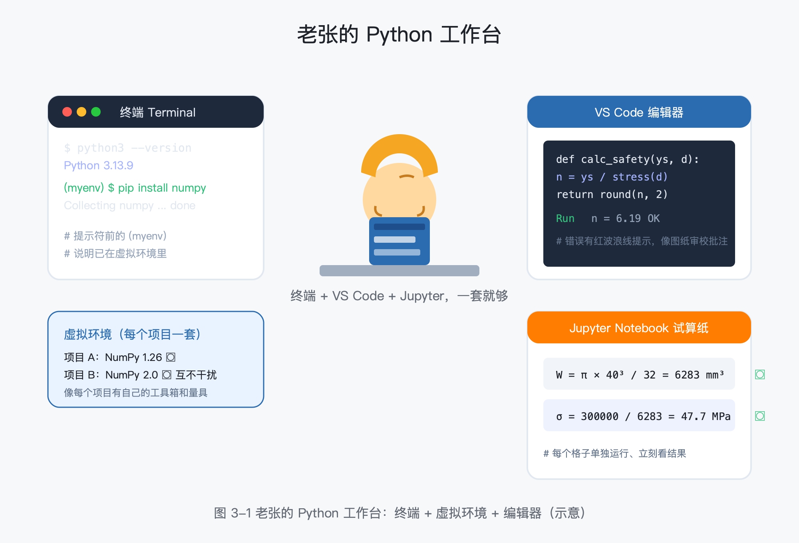
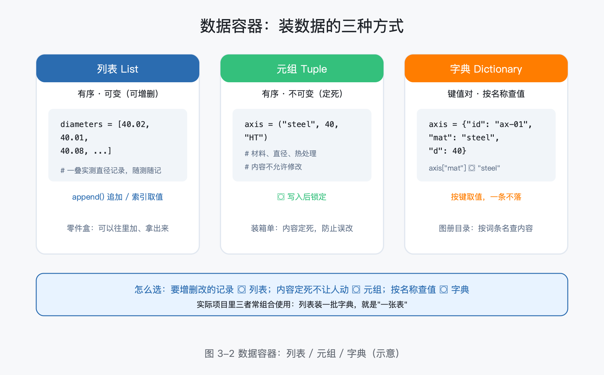
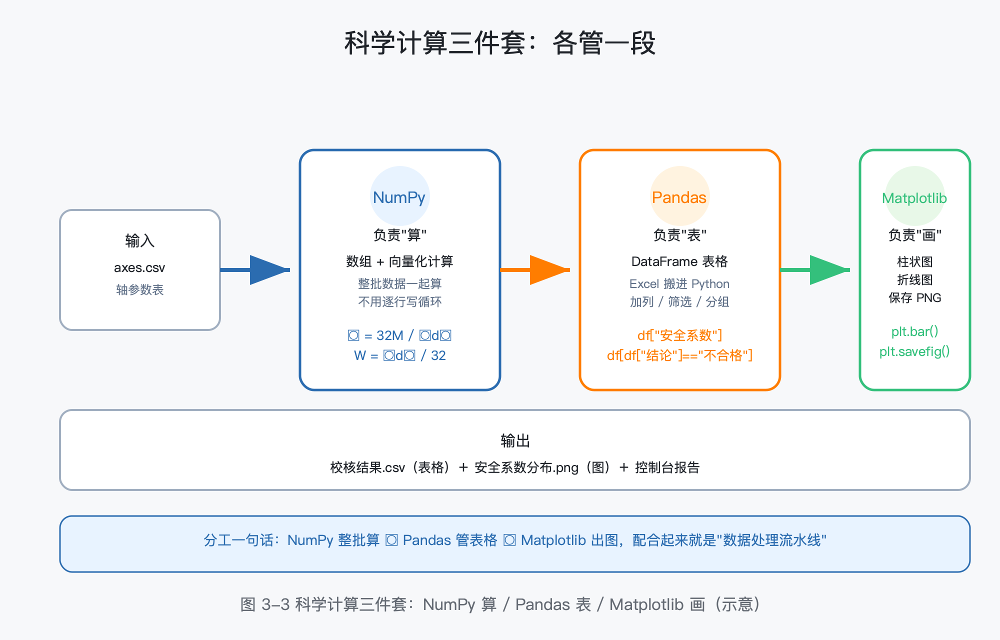
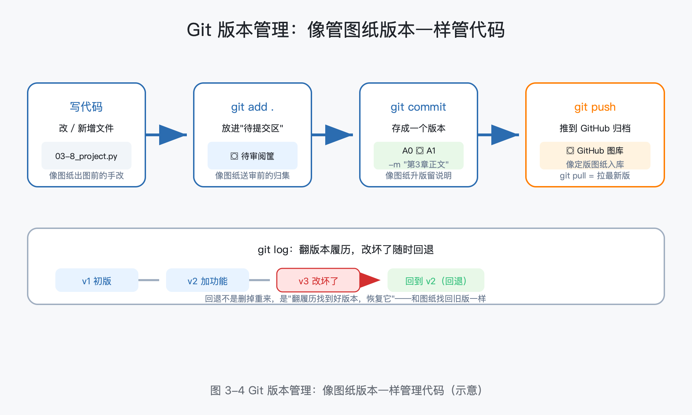

# 第 3 章 编程第一课：像搭积木一样学 Python

> 所属框架层：L1 编程与软件工程地基
> 预计篇幅：约 10,000 字（含可运行代码；第 3 段为"最小示例代码"，第 3.8 节为完整配套项目）
> 配套文件：示例代码（`code/ch3/` 目录，全部在 Python 3.13 环境真实运行过）、本章配图（SVG 源文件见 `figures/ch3/` 目录）、术语表第 3 章·L1 条目
> 版本：v0.1（首稿）

**本章验收标准**：学完后能不看资料回答——Python 的变量、列表、字典、函数各是什么、什么时候用？虚拟环境解决什么问题？怎么让程序读 CSV 且出错不崩溃？NumPy / Pandas / Matplotlib 各自干什么？Git 的 add / commit / push 各是什么？

---

> **本章配图清单**（图号 / 内容 / 对应小节 / 类型）

| 图号 | 内容 | 对应小节 | 类型 |
|---|---|---|---|
| 图 3-1 | 老张的 Python 工作台：终端 + 虚拟环境 + 编辑器 | 3.1 | 示意图 |
| 图 3-2 | 数据容器：列表 / 元组 / 字典 | 3.2 | 示意图 |
| 图 3-3 | 科学计算三件套：NumPy / Pandas / Matplotlib 的分工 | 3.5 | 架构图 |
| 图 3-4 | Git 版本管理：像图纸版本一样管理代码 | 3.7 | 流程图 |

---

## 3.0 本章解决什么问题

这一章解决你学编程时最具体的困境：**教程让你装 Python、跑 hello world，你装好了、跑通了，然后呢？**

老张，40 岁，某机械厂设计部资深工程师。第 2 章学完，他终于搞清楚了终端、Linux、数据库、Docker 都是干什么的。现在他信心满满地打开一本 Python 教程：安装 Python → 打印"Hello World" → 下一页开始讲"类、装饰器、生成器"。他盯着屏幕想：**这些东西我学完，能解决我手头哪件事？** 他手头明明压着一堆活——下周要交 6 根轴的强度校核报告，每根轴要算弯扭合成应力、安全系数，他打算用 Excel 算到半夜。

这一章不按计算机系的路子讲。我们的目标只有一条：**用最少的语法，把"从数据到结果"的最小闭环跑通**——装好环境 → 用变量和容器装数据 → 用函数打包计算 → 从 CSV 读参数 → 用科学计算三件套算数、出图 → 让 AI 帮你写代码 → 用 Git 管住版本。学完这一章，你交出的不是一个 hello world，而是一个**你自己写的、能出校核报告的工具**。

## 3.1 搭好工作台：Python、虚拟环境与编辑器

### 3.1.1 Python 是什么

Python（读作"派森"）是一门**解释型编程语言**（Interpreted Language）：它由解释器（Interpreter）逐行读取你的代码、翻译成计算机能执行的指令，读一行执行一行。第 2 章我们讲过编译器与解释器的区别——这里的记忆锚点只有一个：**解释器像把图纸逐行翻译成施工单的工艺员，写完一行立刻能看到这一行的结果**。所以 Python 特别适合边写边试。

它有三个特点，决定它适合你：

- **语法简单**：接近自然语言，缩进就是程序块边界，没有大括号、分号这些"噪音"；
- **生态庞大**：科学计算、数据处理、AI 领域的主流工具（NumPy、Pandas、PyTorch、LangChain）都是 Python 写的，学 AI 绕不开；
- **跨平台**：Windows、macOS、Linux 上跑的是同一套代码。

### 3.1.2 安装与第一行代码

安装有两种主流方式，二选一：

| 方式 | 适合谁 | 说明 |
|---|---|---|
| Anaconda（推荐） | 打算认真学 AI | 自带 Python + 300 多个常用库（含 NumPy / Pandas / Matplotlib），免去逐个安装 |
| python.org 官方安装包 | 只想装个最小环境 | 干净，但科学计算库要自己一个个 pip install |

装好后打开终端（不会用终端先回看第 2 章 2.2 节），验证安装：

```bash
python3 --version
```

如果看到类似 `Python 3.13.9` 的输出，说明安装成功。接着输入 `python3` 回车，就进入**交互模式**（提示符变成 `>>>`），可以直接敲代码：

```python
>>> print("我的第一行 Python")
我的第一行 Python
```

> 交互模式适合试一两行；写正式程序用文件（见 3.1.4）。

### 3.1.3 虚拟环境：每个项目一套独立环境

**虚拟环境（Virtual Environment）** 解决一个真实痛点：项目 A 要 NumPy 1.26，项目 B 要 NumPy 2.0，装在一个 Python 里会互相打架——你升级了 A 的库，B 就崩了。

虚拟环境为每个项目建一个**独立的小环境**，每个环境有自己的库清单，互不干扰。你可以把它理解为：**每个项目有自己的工具箱和量具，不混用**。

创建和使用只要三步（在项目目录下执行）：

```bash
python3 -m venv myenv          # 1. 创建虚拟环境 myenv（会新建 myenv 文件夹）
source myenv/bin/activate      # 2. 激活（Windows 用 myenv\Scripts\activate）
pip install numpy pandas       # 3. 在这个环境里装库，只影响本项目
```

激活后，命令行提示符前面会出现 `(myenv)`，说明你已经在虚拟环境里了。装库用 **pip**（Python 的包管理器，类比：标准件库 + 自动领料员，第 2 章讲过）。**本书每章项目都建议建一个独立虚拟环境**，这是以后不踩环境坑的最便宜的办法。

### 3.1.4 编辑器：VS Code 与 Jupyter Notebook

写代码要有一个趁手的"工作台"，两个选择：

- **VS Code**（微软免费编辑器）：写正式程序用。装好 Python 插件后，打开 `.py` 文件，点右上角"运行"按钮即可执行，出错会红波浪线提示；
- **Jupyter Notebook**（Anaconda 自带）：按"格子"组织代码，每个格子可以单独运行、立刻看到结果，特别适合**算数、试错、看数据**——相当于一张带预览的计算纸。

两者关系：正式的工具脚本放 VS Code，探索性计算放 Jupyter，两不误。图 3-1 是老张的工作台全景。



> **工程师贴士**：环境出问题（装库失败、版本冲突）时，90% 的解法是"新建一个干净的虚拟环境重来"，而不是在乱掉的环境里继续折腾。这和产线上"工装夹具乱了对不上，先清场复位"是一个道理。

## 3.2 Python 语法速通：变量、容器、循环与判断

这一节只讲四样东西：变量、容器、循环、判断。它们能覆盖你 80% 的日常写码需求。

### 3.2.1 变量：给数据贴标签

**变量（Variable）** 是给数据起的名字。`nominal = 40.0` 的意思是"把数值 40.0 存起来，以后用 nominal 这个名字引用它"。

Python 的变量不需要声明类型，类型由赋的值决定：

```python
axis_name = "轴-01"   # 字符串 str：文本
nominal = 40.0        # 浮点数 float：带小数
tol = 0.05            # 浮点数
count = 6             # 整数 int
is_ok = True          # 布尔 bool：True/False
```

用内置函数 `type()` 可以随时查一个变量的类型。变量名建议用英文单词或拼音，别用 a、b、c 这种——一个月后你自己都看不懂。

### 3.2.2 字符串与 f-string：给文本排版

字符串（String）是文本数据。工程师场景里最常用的是 **f-string**（格式化字符串）：在字符串前加 `f`，用 `{}` 把变量嵌进去，像给工艺卡片填空：

```python
d = 40.0
print(f"轴径 {d} mm，公差 ±{tol} mm")   # → 轴径 40.0 mm，公差 ±0.05 mm
```

### 3.2.3 容器：把数据装起来

程序要处理批量数据，就需要容器。Python 有三个最常用的，记一个场景就够：

| 容器 | 英文 | 特点 | 一句话场景 |
|---|---|---|---|
| 列表 | List | 有序、可变（可增删） | 一叠实测直径记录，随测随记 |
| 元组 | Tuple | 有序、不可变（定死） | 一根轴的"装箱单"：材料、直径、热处理，不允许改 |
| 字典 | Dictionary | 键值对，按键取值 | 一根轴的技术档案：按"材料""直径"这些名称查值 |

字典最像工程师的日常——**按名称查值**：

```python
axis = {"轴号": "轴-01", "材料": "45钢", "直径": 40, "热处理": "调质"}
print(axis["材料"])      # → 45钢，像翻图册目录按词条取内容
axis["表面处理"] = "镀铬"  # 追加一项
```

图 3-2 展示了三种容器的分工。



### 3.2.4 循环与判断：逐根检验

有了容器装数据，用**循环**（for）逐条处理，用**判断**（if/else）逐条下结论。下面这段就是老张的直径公差检验——6 根轴，名义直径 40 mm，公差 ±0.05 mm（对应仓库 `code/ch3/03-2_syntax.py`，代码清单 3-1）：

```python
# 场景：对 6 根轴做直径公差检验。名义 40 mm，公差 ±0.05 mm。
diameters = [40.02, 40.01, 39.97, 40.05, 40.08, 39.95]  # 实测直径，单位 mm
nominal = 40.0
tol = 0.05

for i, d in enumerate(diameters, 1):      # enumerate：循环时同时拿到序号 i 和值 d
    ok = abs(d - nominal) <= tol           # 偏差绝对值在公差内？
    status = "合格" if ok else "超差"       # 条件表达式，一行写完 if/else
    print(f"第{i}根轴：实测 {d:.2f} mm，偏差 {d - nominal:+.2f} mm → {status}")
```

真实运行结果：

```
第1根轴：实测 40.02 mm，偏差 +0.02 mm → 合格
第2根轴：实测 40.01 mm，偏差 +0.01 mm → 合格
第3根轴：实测 39.97 mm，偏差 -0.03 mm → 合格
第4根轴：实测 40.05 mm，偏差 +0.05 mm → 合格
第5根轴：实测 40.08 mm，偏差 +0.08 mm → 超差
第6根轴：实测 39.95 mm，偏差 -0.05 mm → 合格
```

> **工程师贴士**：Python 用**缩进**（4 个空格）表示程序块的边界，不用大括号。同一个块内的代码缩进必须一致，混用 Tab 和空格会直接报错。把它想成图纸上的图层规范——图层乱了，图就乱了。

## 3.3 函数与模块：把重复的事打包

### 3.3.1 函数：你的"标准件"

**函数（Function）** 是一段有名字、可反复调用的代码块。它和标准件是一个逻辑：**把常用的动作定型，需要时直接调用，不用每次重写**。

老张的轴校核里，弯扭合成应力的公式（第三强度理论：σ_ca = √(σ² + 4τ²)）每根轴都要算。写成函数，一次定型、到处调用（对应 `code/ch3/03-3_function.py`，代码清单 3-2）：

```python
import math

def 弯扭合成应力(直径_mm, 弯矩_Nmm, 扭矩_Nmm):
    """第三强度理论：σ_ca = √(σ² + 4τ²)；σ = 32M/πd³，τ = 16T/πd³"""
    d3 = 直径_mm ** 3
    sigma = 32 * 弯矩_Nmm / (math.pi * d3)   # 弯曲应力 MPa
    tau = 16 * 扭矩_Nmm / (math.pi * d3)     # 扭转应力 MPa
    return math.sqrt(sigma ** 2 + 4 * tau ** 2)

def 安全系数(材料屈服_MPa, 直径_mm, 弯矩_Nmm, 扭矩_Nmm):
    """静强度安全系数 = 材料屈服强度 / 计算应力"""
    return 材料屈服_MPa / 弯扭合成应力(直径_mm, 弯矩_Nmm, 扭矩_Nmm)

# 轴-01：45钢（屈服 355 MPa），直径 40 mm，弯矩 300 N·m，扭矩 200 N·m
n = 安全系数(355, 40, 300_000, 200_000)
print(f"轴-01 安全系数 n = {n:.2f}，{'合格' if n >= 1.5 else '不合格'}")
```

真实运行结果：

```
轴-01 安全系数 n = 6.19，合格
```

看懂这段的三个要点：

- `def 函数名(参数):` 定义函数；参数是调用时传进去的"输入"；
- `return` 把计算结果"交出来"，函数就有了返回值；
- 调用 `安全系数(355, 40, 300_000, 200_000)` 时，355、40、300000、200000 依次填入参数位置。

之后任何一根轴，一行调用就能算出安全系数——这就是"标准件"的价值。

### 3.3.2 模块与 import：你的"标准件图库"

**模块（Module）** 是按用途把函数分门别类存放的文件。`import` 就是"从图库里领出这个标准件"。

- 用别人的：`import math`、`import pandas as pd`（`as` 是起个别名，后面少打字）；
- 用你自己的：把函数存进 `strength.py`，另一处写 `from strength import 安全系数` 即可复用。

以后你会发现：**学 Python 很大一部分是学"该 import 哪个库、怎么用"**，而不是从零写算法。这和第 2 章讲的"站在巨人的肩膀上"完全一致。

## 3.4 文件读写与异常处理：让程序"干活"

程序真正的价值，在于读写真实数据。这一节讲两件事：读 CSV 文件、出错不崩溃。

### 3.4.1 读 CSV：一行一条记录

**CSV（Comma-Separated Values，逗号分隔值）** 是最通用的数据交换格式——Excel 的"另存为 CSV"就能导出，任何工具都能读。第 3 章的示例数据 `code/ch3/axes.csv` 长这样：

```
轴号,材料,屈服强度MPa,直径mm,弯矩N·m,扭矩N·m
轴-01,45钢,355,40,300,200
轴-02,45钢,355,30,320,220
...
```

Python 标准库自带 `csv` 模块，`csv.DictReader` 会**把第一行当表头，每行数据变成一个字典**（对应 `code/ch3/03-4_files.py`，代码清单 3-3）：

```python
import csv

def 读轴参数表(路径):
    rows = []
    with open(路径, encoding="utf-8") as f:
        reader = csv.DictReader(f)
        for r in reader:
            rows.append(r)
    return rows

rows = 读轴参数表("axes.csv")
print(f"成功读入 {len(rows)} 行轴参数，字段：{list(rows[0].keys())}")
```

真实运行结果：

```
成功读入 6 行轴参数，字段：['轴号', '材料', '屈服强度MPa', '直径mm', '弯矩N·m', '扭矩N·m']
```

`with open(...) as f:` 这种写法保证文件用完自动关闭——相当于"用完设备随手关电"，不用你手动记。

### 3.4.2 异常处理：程序出错，不崩溃

程序跑起来总会遇到意外：文件不存在、编码不对、某行数据是空的。没有保护的代码遇到这些会**直接崩溃**（抛异常），屏幕上甩一大段红色报错。**异常处理（Exception Handling）** 就是给程序加"报警保护"：识别错误类型，给出人话提示（对应 `code/ch3/03-4_files.py` 后半段）：

```python
try:
    rows = 读轴参数表("axes.csv")
    print(f"成功读入 {len(rows)} 行轴参数")
except FileNotFoundError:
    print("找不到 axes.csv——请确认文件与脚本在同一目录")
except UnicodeDecodeError:
    print("编码不对——请把 CSV 另存为 UTF-8 编码")
```

**try/except** 的读法：先试着（try）执行；如果抛出的是"文件找不到"错误，就进入对应的 except 分支，给用户一句人话，程序继续走。

> **工程师贴士（编码坑）**：中文 Excel 导出的 CSV 可能是 GBK 编码，Python 按 UTF-8 读会报 `UnicodeDecodeError`。两个解决办法：Excel 另存时选"CSV UTF-8"，或读文件时把 `encoding` 换成 `"gbk"`。导出结果时用 `encoding="utf-8-sig"`，Excel 打开就不会乱码——第 3.8 节项目里就是这么做的。

## 3.5 科学计算三件套：NumPy、Pandas、Matplotlib

数据处理是工程师和 Python 之间最实在的接口。三个库各管一段：**NumPy 负责算，Pandas 负责表，Matplotlib 负责画**（图 3-3）。



### 3.5.1 NumPy：数组与"整批一起算"

**NumPy（Numerical Python）** 的核心是**数组（ndarray）**——一种"整批数据装在一起"的结构。它的杀手锏是**向量化计算**：对整批数据一次性做运算，不用写循环。

对比感受一下：要算 6 根轴的抗弯截面系数 W = πd³/32，用普通 Python 要写 for 循环；用 NumPy 一行搞定，且速度快几十倍：

```python
import numpy as np
d = np.array([40, 30, 25, 22, 50, 28])      # 6 根轴的直径，单位 mm
W = np.pi * d ** 3 / 32                       # 整批一起算，W 也是一个数组
print(W.round(1))                             # → [6283.2 2650.7 1534.0 1045.4 12271.8 2155.1]
```

**数组的算术运算自动逐元素进行**——这正是"批量加工"的思路：不是一根根轴算，而是整批上产线。

### 3.5.2 Pandas：把 Excel 搬进 Python

**Pandas** 的核心是 **DataFrame**——一张带行列索引的表格，可以理解成"Excel 表格搬进了 Python"。读 CSV 只要一行：

```python
import pandas as pd
df = pd.read_csv("axes.csv", encoding="utf-8")   # df 就是一张表
```

然后可以像操作 Excel 一样操作它：看前几行、加计算列、筛选行。下面这段把 3.3 节的校核公式搬到整张表上，一次算出 6 根轴的安全系数，并筛出不合格的（对应 `code/ch3/03-5_sci.py`，代码清单 3-4 前半部分）：

```python
import numpy as np
import pandas as pd

df = pd.read_csv("axes.csv", encoding="utf-8")

# NumPy 向量化：整批算弯曲应力、扭转应力、合成应力
d = df["直径mm"].to_numpy()
W  = np.pi * d ** 3 / 32
Wt = np.pi * d ** 3 / 16
sigma   = df["弯矩N·m"].to_numpy() * 1000 / W    # 弯曲应力 MPa
tau     = df["扭矩N·m"].to_numpy() * 1000 / Wt   # 扭转应力 MPa
sigma_ca = np.sqrt(sigma ** 2 + 4 * tau ** 2)    # 第三强度理论

df["弯扭合成应力MPa"] = np.round(sigma_ca, 2)
df["安全系数"] = np.round(df["屈服强度MPa"].to_numpy() / sigma_ca, 2)
df["结论"] = np.where(df["安全系数"] >= 1.5, "合格", "不合格")

print(df.head(3).to_string(index=False))          # 看前 3 行
bad = df[df["结论"] == "不合格"]                   # 筛选出不合格行
print(bad[["轴号", "材料", "弯扭合成应力MPa", "安全系数"]].to_string(index=False))
```

真实运行结果：

```
前 3 行：
  轴号   材料  屈服强度MPa  直径mm  弯矩N·m  扭矩N·m
轴-01  45钢      355    40    300    200
轴-02  45钢      355    30    320    220
轴-03 Q235      235    25    180    150

不合格轴：
  轴号   材料  弯扭合成应力MPa  安全系数
轴-04 Q235     203.38  1.16
```

注意这一段的几个"工程惯用语"：`df["直径mm"]` 取一列；`df[df["结论"] == "不合格"]` 是**条件筛选**（选出满足条件的行）；`.to_numpy()` 把列变成数组交给 NumPy 计算。三件套在这里配合得严丝合缝——**Pandas 管表格、NumPy 管计算**。

### 3.5.3 Matplotlib：把结果画出来

**Matplotlib** 是绘图库。工程师几乎总会要"一张图"：安全系数分布柱状图、载荷-挠度曲线、温升曲线。套路固定：`plt.figure()` 建画布 → 画图（`plt.bar` / `plt.plot`）→ `plt.savefig` 存图 → 展示。

对应 `code/ch3/03-5_sci.py` 后半部分（图已在上一节生成）：

```python
import matplotlib
matplotlib.use("Agg")                       # 无界面环境（脚本/服务器）用 Agg 后端
import matplotlib.pyplot as plt

plt.figure(figsize=(8, 4))
colors = ["#2B6CB0" if c == "合格" else "#FF7D00" for c in df["结论"]]
plt.bar(df["轴号"], df["安全系数"], color=colors)   # 合格蓝、不合格橙
plt.axhline(1.5, color="#D32F2F", linestyle="--", linewidth=1)  # 合格线
plt.ylabel("安全系数 n")
plt.title("轴静强度校核：各轴安全系数分布")
plt.savefig("安全系数分布.png", dpi=150)
```

运行后目录里出现 `安全系数分布.png`——轴-04 是橙色柱，明晃晃低于红色合格线，比看表格数字直观得多。**中文显示**：macOS 上默认能显示；Linux 服务器上若中文变方块，在脚本开头加两行设置中文字体（见 `code/ch3/03-8_project.py` 开头）。

> **工程师贴士**：三件套是"会 import、会查文档、会调参数"就能用，不需要背 API。遇到不会的用法，把问题丢给 AI（3.6 节）或查官方文档，比死记硬背高效得多。

## 3.6 用 AI 帮你写代码：Vibe Coding 入门

### 3.6.1 为什么工程师学编程可以走"捷径"

传统的学法是：先背语法、再写练习、最后做项目。但你的目标不是当程序员，而是**用代码解决工程问题**。Vibe Coding（提示式编程，也译"氛围编程"）是另一条路：**用自然语言向 AI 描述需求，AI 生成代码，你来运行、审查、修改**。

它的分工非常契合工程师：**你懂需求**（物理、公式、单位、约束），**AI 懂语法**。你缺的是"把需求翻译成代码"，这正是 AI 最擅长的。

### 3.6.2 四步法：说清需求 → 生成 → 运行 → 追问

一个高质量提示词的骨架，是把"输入、输出、单位、约束"说清楚。拿第 3.5 节的需求举例：

> 用 Python 写一个小工具：读入一个 CSV 文件，里面有轴的"直径mm、弯矩N·m、扭矩N·m、屈服强度MPa"四列。请按第三强度理论（σ_ca = √(σ² + 4τ²)，σ = 32M/πd³，τ = 16T/πd³）计算每根轴的弯扭合成应力和安全系数，安全系数小于 1.5 的标为"不合格"。用 Pandas 实现，输出一张包含结果的表，并把结果导出为新 CSV。

AI 会生成一版代码——通常和你看到的 3.5 节代码八九不离十。**关键动作在后面**：

1. **运行验证**：把代码存成 `.py` 文件跑一遍，看输出对不对；
2. **逐行审查**：单位换算对不对（N·m 要 ×1000 变 N·mm）、公式对不对（直径三次方、π/32）、边界条件（空文件、缺列）会不会崩；
3. **追问修改**："把这个工具改成一个函数，方便我批量调用""加上异常处理，文件找不到时给提示"——AI 会立刻改。

### 3.6.3 底线：AI 的代码必须"验收"

AI 生成的代码可能包含**幻觉（Hallucination）**——一本正经地给出错误公式、错误单位、不存在的函数。所以铁律只有一条：**AI 写的代码，你必须运行验证后才能算数**。

这和第 2 章建立的概念完全接上了：你学计算机通识、学 Python 语法，不是为了自己从头写一切，而是为了**具备验收 AI 代码的能力**——看得懂它在干什么、判断得了它对不对。AI 是外协供应商，你是验收工程师。

> **工程师贴士**：想让 AI 少出错，提示词里把"单位、公式、已知条件"原样贴进去（像给外协发图纸：图纸越全，偏差越小）。生成后第一句追问："这段代码有没有单位或公式错误？"——让 AI 自查一遍，能拦住一半幻觉。

## 3.7 Git 与协作：代码的版本管理

### 3.7.1 Git 是什么

**Git** 是代码的**版本管理**工具。你的代码会一直改：今天加一个功能，明天改一个参数，后天发现改坏了想回到昨天的版本。Git 记录每一次改动，随时可以回退、对比、合并。

这个逻辑你其实很熟——**图纸版本管理**：A0 版、A1 版、定版。图纸改了要升版、要留痕、错了能找回旧版；代码也一样，Git 就是你的"图纸版本管理系统"（图 3-4）。



### 3.7.2 最常用的五个命令

| 命令 | 干什么 | 图纸类比 |
|---|---|---|
| `git init` | 把当前目录变成 Git 仓库（一次性） | 给这个项目建一个档案室 |
| `git add 文件` | 把改动放进"待提交区" | 把改好的图纸放进待审阅筐 |
| `git commit -m "说明"` | 把待提交区存成一个版本 | 升版：A0 → A1，留个版本说明 |
| `git status` | 看现在有哪些改动没提交 | 看档案室台账 |
| `git log` | 看所有提交历史 | 翻版本履历 |

日常流程只有三步：**改代码 → `git add .` → `git commit -m "做了什么"`**。改坏了想回退，用 `git log` 找到好版本，再恢复它。

### 3.7.3 Git 与 GitHub

**GitHub** 是放 Git 仓库的远程服务器（类比：图纸的共享云盘 + 图库）。本地提交之后：

- `git push`：把本地版本推送到 GitHub（你的代码入库归档）；
- `git pull`：把远程最新版本拉回本地（别人改过时）。

你正在读的这本书的仓库就是这么管理的——每一章的内容都是一个 commit，你可以翻开 `git log` 看到"第 1 章正文""第 2 章配图"这样一条条记录。**养成习惯：完成一个小成果就 commit 一次**，你的学习历程本身就成了作品集。

## 3.8 配套项目：用 Python 做轴的强度校核

把这一章学的所有东西串起来，做第一个完整工具。这是本书第 1 个"能交差"的项目。

### 3.8.1 需求

老张要交付一份轴静强度校核报告：输入是轴参数表（`axes.csv`，6 根轴），输出是每根轴的弯扭合成应力、安全系数、合格结论，外加一张安全系数分布图，结果导出成新 CSV 给同事看。

### 3.8.2 完整代码

对应仓库 `code/ch3/03-8_project.py`（代码清单 3-5）。在项目目录建虚拟环境、`pip install -r requirements.txt`（numpy / pandas / matplotlib）后，`python 03-8_project.py` 直接运行：

```python
# 轴静强度校核工具 v0.1
# 读入轴参数表(CSV)，按第三强度理论计算弯扭合成应力与安全系数，
# 输出报告(控制台 + CSV)并生成安全系数图。axes.csv 与本脚本同目录。
import numpy as np
import pandas as pd
import matplotlib
matplotlib.use("Agg")
import matplotlib.pyplot as plt

plt.rcParams["font.sans-serif"] = ["PingFang SC", "Heiti SC", "Arial Unicode MS", "SimHei"]
plt.rcParams["axes.unicode_minus"] = False

INPUT_CSV = "axes.csv"
OUTPUT_CSV = "校核结果.csv"
OUTPUT_PNG = "安全系数分布.png"
MIN_SAFETY = 1.5  # 最小许用安全系数

def 校核(df):
    """对整批轴做静强度校核，返回带计算列的表"""
    d = df["直径mm"].to_numpy()
    W  = np.pi * d ** 3 / 32                       # 抗弯截面系数 mm³
    Wt = np.pi * d ** 3 / 16                       # 抗扭截面系数 mm³
    sigma   = df["弯矩N·m"].to_numpy() * 1000 / W   # 弯曲应力 MPa
    tau     = df["扭矩N·m"].to_numpy() * 1000 / Wt  # 扭转应力 MPa
    sigma_ca = np.sqrt(sigma ** 2 + 4 * tau ** 2)   # 第三强度理论
    df["弯扭合成应力MPa"] = np.round(sigma_ca, 2)
    df["安全系数"] = np.round(df["屈服强度MPa"].to_numpy() / sigma_ca, 2)
    df["结论"] = np.where(df["安全系数"] >= MIN_SAFETY, "合格", "不合格")
    return df

def 主程序():
    df = pd.read_csv(INPUT_CSV, encoding="utf-8")
    df = 校核(df)
    # 1) 控制台报告
    print("=" * 50)
    print("轴静强度校核报告（第三强度理论，最小安全系数 n = 1.5）")
    print("=" * 50)
    print(df[["轴号", "材料", "弯扭合成应力MPa", "安全系数", "结论"]].to_string(index=False))
    bad = df[df["结论"] == "不合格"]
    print("-" * 50)
    print(f"共校核 {len(df)} 根轴；不合格 {len(bad)} 根；最低安全系数 n = {df['安全系数'].min():.2f}")
    # 2) 导出结果 CSV（utf-8-sig 让 Excel 打开不乱码）
    df.to_csv(OUTPUT_CSV, index=False, encoding="utf-8-sig")
    # 3) 安全系数分布图
    plt.figure(figsize=(8, 4))
    colors = ["#2B6CB0" if c == "合格" else "#FF7D00" for c in df["结论"]]
    plt.bar(df["轴号"], df["安全系数"], color=colors)
    plt.axhline(MIN_SAFETY, color="#D32F2F", linestyle="--", linewidth=1)
    plt.text(0.02, MIN_SAFETY + 0.08, "n=1.5 合格线", color="#D32F2F", fontsize=9)
    plt.ylabel("安全系数 n")
    plt.title("轴静强度校核：各轴安全系数分布")
    plt.tight_layout()
    plt.savefig(OUTPUT_PNG, dpi=150)
    print(f"结果已导出：{OUTPUT_CSV}；图已保存：{OUTPUT_PNG}")

if __name__ == "__main__":
    主程序()
```

真实运行输出：

```
==================================================
轴静强度校核报告（第三强度理论，最小安全系数 n = 1.5）
==================================================
  轴号   材料  弯扭合成应力MPa  安全系数  结论
轴-01  45钢      57.38  6.19  合格
轴-02  45钢     146.50  2.42  合格
轴-03 Q235     152.74  1.54  合格
轴-04 Q235     203.38  1.16 不合格
轴-05  45钢      49.73  7.14  合格
轴-06  45钢     177.30  2.00  合格
--------------------------------------------------
共校核 6 根轴；不合格 1 根；最低安全系数 n = 1.16
结果已导出：校核结果.csv；图已保存：安全系数分布.png
```

### 3.8.3 读懂这个工具

看这个输出，你其实已经掌握了"工程计算程序"的完整套路：

- **读数据**：`pd.read_csv` 一行进表；
- **算**：NumPy 向量化，公式写在明处（第三强度理论），单位换算写清（N·m × 1000 → N·mm）；
- **出结论**：`np.where(安全系数 >= 1.5, "合格", "不合格")` 一条规则全表生效；
- **出报告**：控制台表格 + 导出 CSV（`utf-8-sig` 防 Excel 乱码）+ 出图。

轴-04（Q235、直径 22 mm）应力 203.38 MPa 超过许用范围，安全系数 1.16 不达标——**改设计（加大直径、换材料）→ 改 CSV 里一行 → 重跑脚本**，新报告秒出。这就是程序化计算的威力：参数一变，全流程自动重算。

> **工程师贴士**：这个"读数据 → 算 → 出报告 → 出图"的闭环，是后续每一章（机器学习、深度学习、RAG、智能体）都会复用的骨架。第 3 章你建的每个习惯——虚拟环境、函数封装、异常处理、Git 提交——后面都会成倍回报。

### 3.8.4 泛理工科替换案例

同样的骨架，换一套公式和输入，就是另一个专业的小工具：

| 专业 | 替换案例 | 输入 → 输出 |
|---|---|---|
| 电气 | 电缆截面选择 | 负荷电流、敷设条件 → 最小截面、压降 |
| 土木 | 简支梁配筋估算 | 跨度、荷载 → 弯矩、所需钢筋面积 |
| 化工 | 管道压降核算 | 管径、流量、介质 → 沿程阻力、泵扬程需求 |

做法完全一样：参数表进 CSV → 公式写进函数/向量化计算 → 结果表 + 图 + 报告。第 10 章我们会把同样的思路升级成"带 AI 的工业落地工具"。

## 本章小结

1. Python 是解释型语言，装好环境后，第一件事是掌握"运行代码"这个动作——交互模式、脚本文件、虚拟环境三种方式各有用途。
2. 变量存数据，列表/元组/字典装数据，函数把动作打包成"标准件"，模块把函数归档成"图库"。
3. 读 CSV 用 Pandas 一行搞定；异常处理让程序在出错时不崩溃、给人话提示。
4. 三件套分工明确：NumPy 整批算、Pandas 管表格、Matplotlib 画图。
5. 让 AI 写代码、你用工程知识验收，再用 Git 管住版本——这是工程师学 AI 的最优路径。

## 延伸阅读

- Python 官方教程（英文，适合查语法）：<https://docs.python.org/3/tutorial/>
- Datawhale 开源学习资料：<https://github.com/datawhalechina/vibe-vibe> 与 <https://github.com/datawhalechina/easy-vibe>（面向 AI 学习者的入门路线与工具链，可对照本书第 2、3 章使用）
- Pandas 官方十分钟入门（中文）：<https://pandas.pydata.org/docs/getting_started/intro_tutorials/>
- 本书配套代码与数据：仓库 `code/ch3/` 目录（`axes.csv`、`03-2_syntax.py` ~ `03-8_project.py`、`requirements.txt`）
