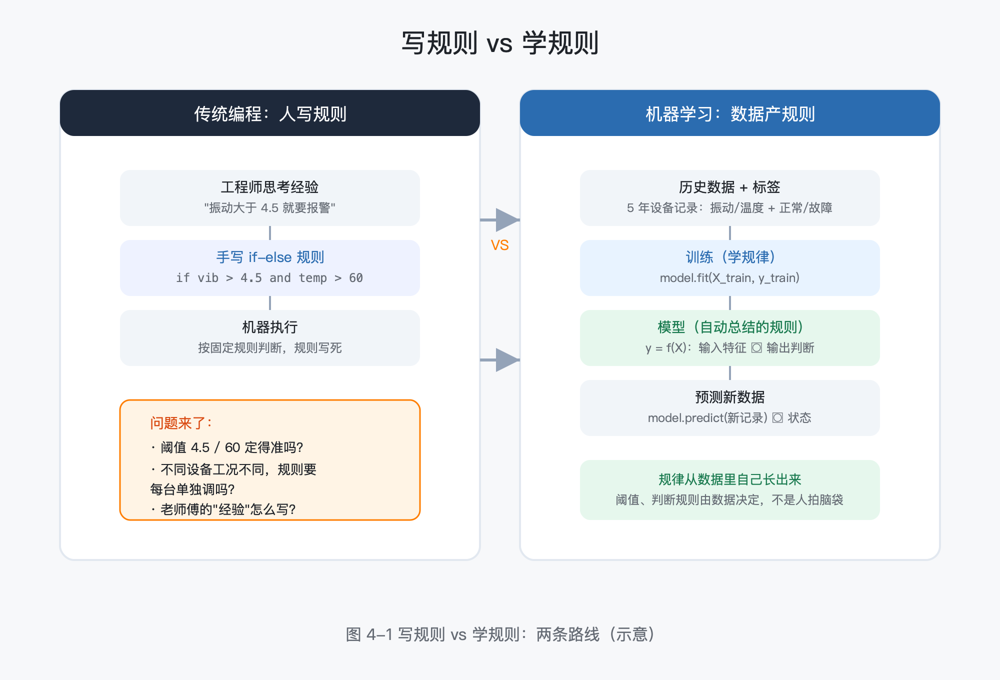
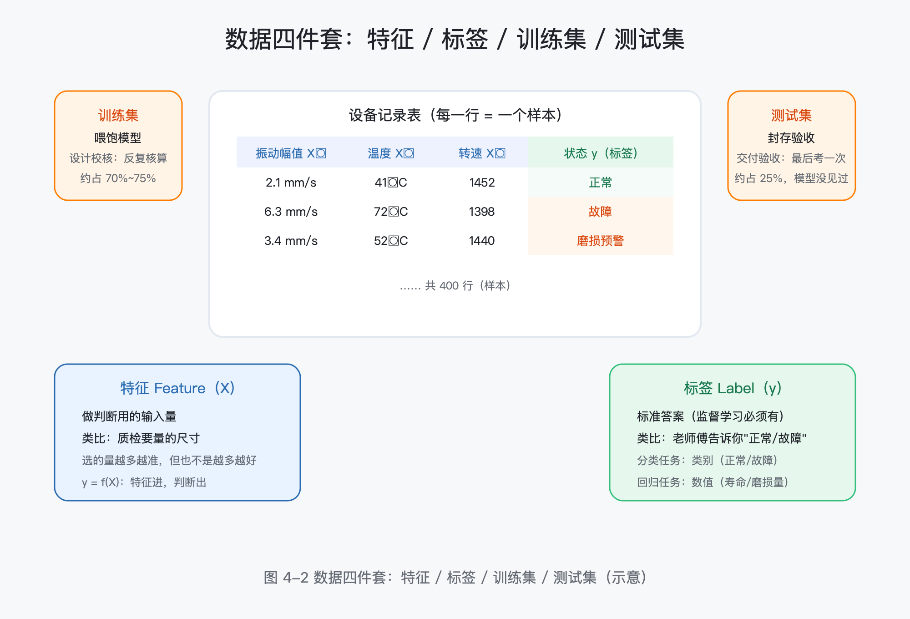
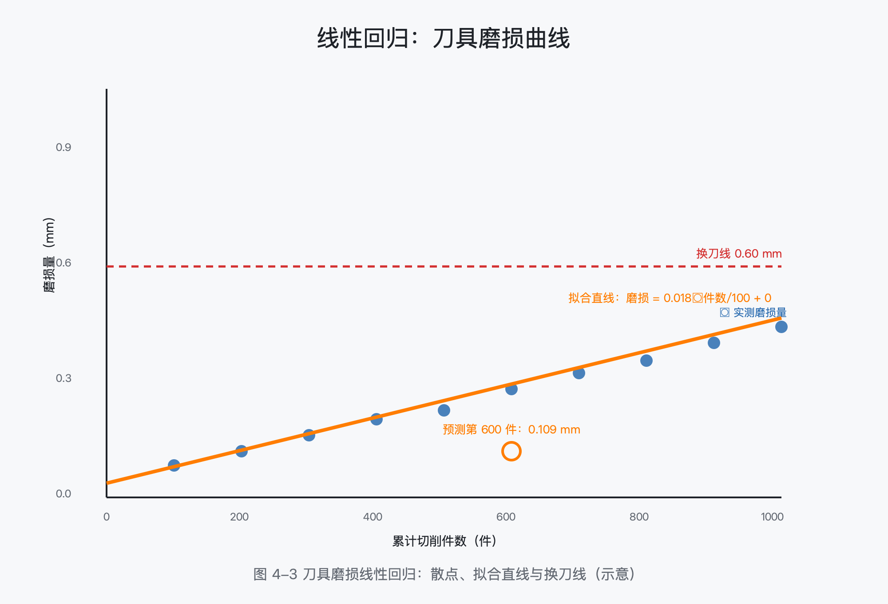
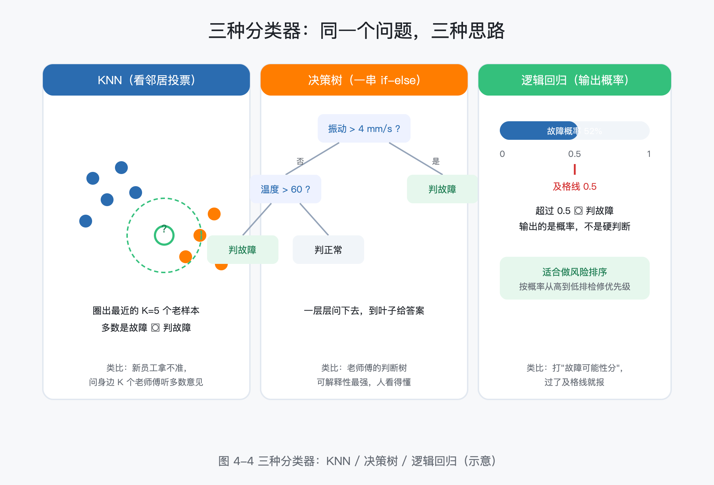
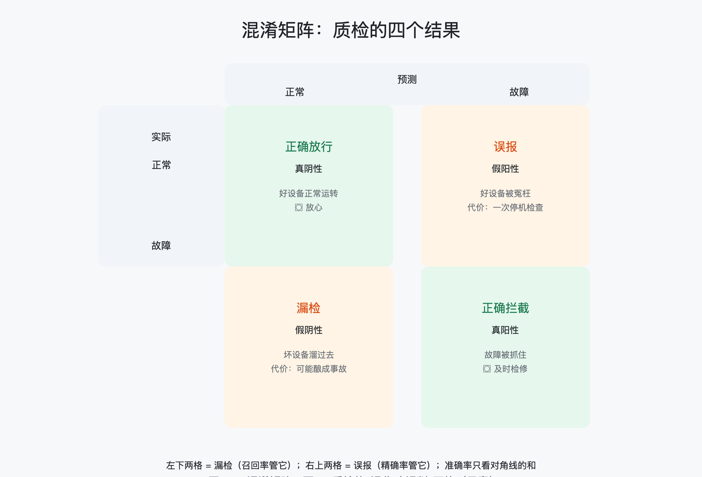
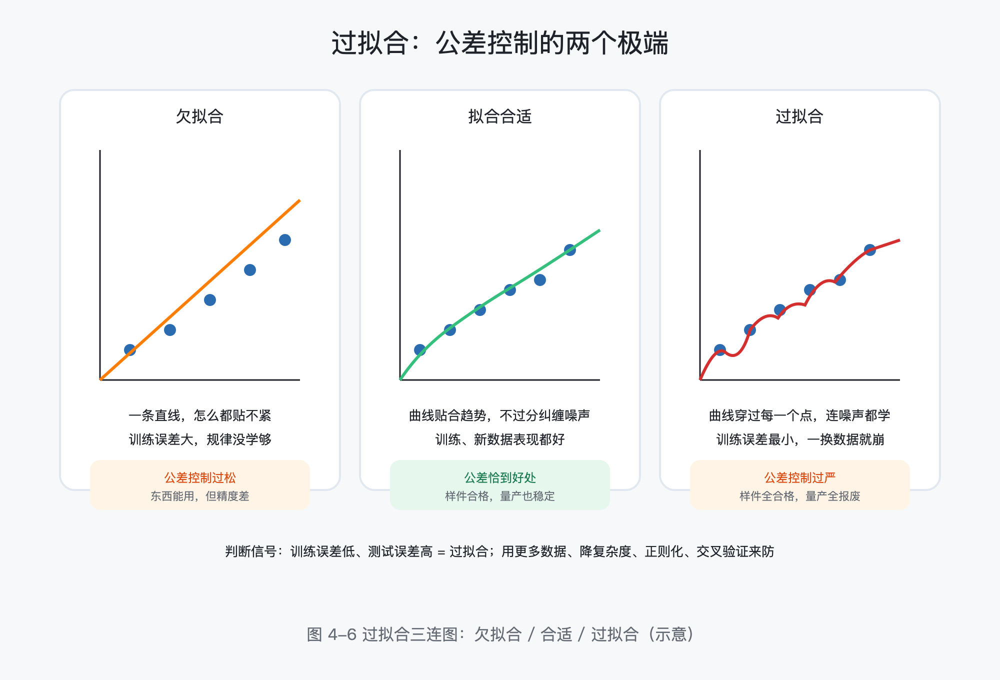
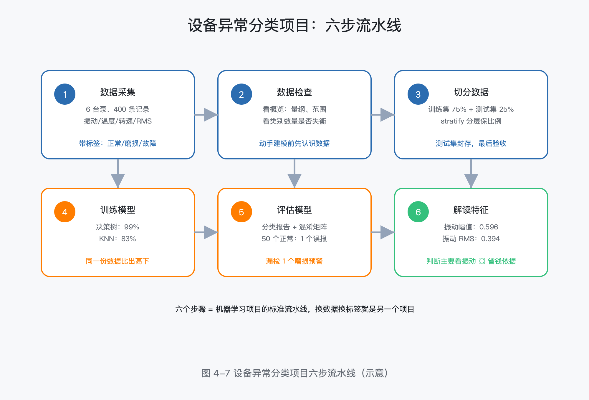

# 第 4 章 机器学习：让机器从数据里找规律

> 所属框架层：L2 机器学习基础
> 预计篇幅：约 12,000 字（含可运行代码；4.3~4.7 为概念 + 最小示例代码，4.8 为完整配套项目）
> 配套文件：示例代码（`code/ch4/` 目录，全部在 Python 3.13 + scikit-learn 1.6.1 环境真实运行过）、本章配图（SVG 源文件见 `figures/ch4/` 目录）、术语表第 4 章·L2 条目
> 版本：v0.1（首稿）

**本章验收标准**：学完后能不看资料回答——机器学习与"写规则"的程序本质区别是什么？特征、标签、训练集、测试集各是什么？回归和分类分别解决什么问题？为什么不能只看准确率？过拟合是怎么回事、怎么防？一个 sklearn 分类项目从数据到评估的完整流程怎么走？

---

> **本章配图清单**（图号 / 内容 / 对应小节 / 类型）

| 图号 | 内容 | 对应小节 | 类型 |
|---|---|---|---|
| 图 4-1 | 写规则 vs 学规则：两条路线的流程图 | 4.1 | 流程图 |
| 图 4-2 | 数据四件套：特征 / 标签 / 训练集 / 测试集 | 4.2 | 示意图 |
| 图 4-3 | 线性回归：散点 + 拟合直线 + 换刀线 | 4.3 | 数据图 |
| 图 4-4 | 三种分类器：KNN / 决策树 / 逻辑回归的决策边界 | 4.4 | 示意图 |
| 图 4-5 | 混淆矩阵 2×2：质检的"误收 / 误判"四格 | 4.5 | 示意图 |
| 图 4-6 | 过拟合三连图：欠拟合 / 合适 / 过拟合 | 4.6 | 对比图 |
| 图 4-7 | 设备异常分类项目六步流水线 | 4.8 | 流程图 |

---

## 4.0 本章解决什么问题

这一章解决你学 AI 路上最核心的一个困惑：**"机器学习"到底是怎么让机器学会东西的？它和传统的编程有什么本质区别？**

老张，40 岁，某机械厂设备科资深工程师。他负责全厂 40 台关键设备。每天早上一进车间，先围着几台"重点设备"转一圈：听声音、摸温度、看油位。车间里最有经验的老师傅能从轴承的"嗡嗡"声里听出毛病——"这台主轴轴承要换了，再撑一个月没问题"。老张很佩服，但老师傅总有退休的一天，他的经验怎么留下来？

厂里其实有数据。每台设备装了传感器，振动、温度、电流记录了一堆。老张看着监控屏上的曲线想：**数据就在这儿，但我只会"看趋势"，曲线一陡我就知道出事了。有没有办法让电脑自己从这些数据里找规律，替我把"老师傅的耳朵"学下来？**

这一章就是回答这个问题的第一课。学完它，你会明白：机器学习不是魔法，它是"**让程序从数据里自己总结规律**"的一套方法。我们用轴承、刀具、泵这些你熟悉的设备做例子，从最简单的线性回归讲到完整的一个分类项目，全程代码可运行、可改、可复用。

## 4.1 什么是机器学习：从"写规则"到"学规则"

### 4.1.1 传统编程：人把规则写给机器

你过去写的所有程序（包括第 3 章的轴校核工具）都是同一个套路：**人把规则写好，机器照着执行**。

比如一个最简单的设备报警程序：

```python
if 振动幅值 > 4.5 and 温度 > 60:      # 规则是人定的
    print("设备异常，请检查")
else:
    print("设备正常")
```

规则很清楚：振动超过 4.5 mm/s、温度超过 60°C 就报警。这套规则怎么来的？人定的——工程师看了大量历史数据，拍脑袋定下来的阈值。

问题来了：

- 阈值 4.5 和 60 定得准吗？为什么不是 5.0 和 55？
- 不同设备工况不同，规则要不要每台设备单独调？
- 故障模式有几十种，靠几条 if-else 能覆盖吗？
- 老师傅的"声音有点闷，像轴承保持架的问题"——这种经验怎么写成 if-else？

### 4.1.2 机器学习：机器从数据里自己学规则

**机器学习（Machine Learning，ML）** 换了一条路：**不给机器写规则，给它看大量"输入 → 结果"的例子，让它自己总结出规律**（图 4-1）。



同样做设备报警，机器学习的方式是：

1. 把过去 5 年的设备记录整理成表格：每一行是某台设备某一天的状态，列是"振动幅值、温度、转速……"以及最后的结果"正常 / 故障"；
2. 把这张表喂给程序；
3. 程序自己找出"什么样的数据组合 → 对应什么结果"的规律；
4. 以后来一条新数据，程序按学到的规律自动判断。

用一句话概括：**传统编程是人写规则，机器学习是数据产规则**。机器学习的"学习"（Training，训练），就是"从数据里把规律找出来"这个过程；找出来的规律在机器学习里叫**模型（Model）**——你可以把它理解成"一套自动总结好的、可对新数据做判断的规则"。

### 4.1.3 三大范式：监督学习、无监督学习、强化学习

机器学习大致分三大类，先用一张表建立全局观（细节后面章节展开）：

| 范式 | 训练数据长什么样 | 要解决的事 | 工程类比 | 典型场景 |
|---|---|---|---|---|
| **监督学习**（Supervised Learning） | 每个样本都带"标准答案"（标签） | 学"输入 → 答案"的映射 | 师傅带徒弟：每个工件都告诉徒弟"这个对、那个错" | 故障分类、寿命预测、尺寸检测 |
| **无监督学习**（Unsupervised Learning） | 只有数据，没有标签 | 自己找数据里的结构 | 自己看一堆零件，没人告诉你类别，自己归类 | 设备工况聚类、异常点发现 |
| **强化学习**（Reinforcement Learning） | 没有答案，只有"奖励/惩罚" | 通过试错学出一套策略 | 新员工上手操作，干得好得奖励、干砸了挨批评，慢慢学会最优操作 | 机器人路径规划、生产排程 |

本章只讲**监督学习**里的两个最基础问题——**回归**和**分类**，它们覆盖了制造业 80% 的机器学习场景：要么预测一个数（还剩多少寿命），要么判断一个类别（正常还是故障）。

> **工程师贴士**：把"训练"想成"对师傅经验的数字化复制"——师傅带徒弟靠的是"看大量例子 + 纠正"，机器学习本质相同，只是把"例子"换成数据、"纠正"换成数学上的误差调整。这样想，后面所有概念都不会悬空。

## 4.2 数据语言：特征、标签、训练集与测试集

机器学习的原料是数据，但数据要先翻译成机器能"学习"的形式。这一节把数据语言的四件套讲透（图 4-2）。



### 4.2.1 特征与标签：X 和 y

把设备数据整理成一张表，每一行是一条**样本（Sample）**——某台设备某一次的运行记录；每一列是一个**特征（Feature）**——影响判断的一个测量值。

| 样本（行） | 振动幅值（特征1） | 温度（特征2） | 转速（特征3） | 状态（标签） |
|---|---|---|---|---|
| 1 号泵 3月5日 | 2.1 mm/s | 41°C | 1452 r/min | 正常 |
| 1 号泵 4月2日 | 6.3 mm/s | 72°C | 1398 r/min | 故障 |
| 2 号泵 3月5日 | 3.4 mm/s | 52°C | 1440 r/min | 磨损预警 |

- **特征（Feature，记作 X）**：用来做判断的输入量。类比：质检时你要量哪些尺寸——选的量越多越准，但也不是越多越好；
- **标签（Label，记作 y）**：标准答案。监督学习里，训练数据必须带标签。类比：老师傅告诉你这个轴承"正常/故障"，这就是标签。

一个朴素但关键的观点：**机器学习的本质，是找一个函数，能把特征 X 映射到标签 y——y = f(X)**。后面所有模型，线性回归、决策树、神经网络，都是不同形式的"这个函数长什么样"。

### 4.2.2 训练集、验证集、测试集：三场考试

有了带标签的数据，不能全拿去"学"，要分成三份，各有分工（这是全书反复使用的官方类比）：

| 数据集 | 干什么用 | 工程类比 |
|---|---|---|
| **训练集**（Training Set） | 让模型从这份数据里学规律 | 设计校核：用已知工况反复核算设计 |
| **验证集**（Validation Set） | 调模型参数时用来"试考" | 样机试验：边改边试，验证机调到位 |
| **测试集**（Test Set） | 全部训练完成后，最后考一次 | 交付验收：用客户现场工况验收，一次定论 |

三个集合的数据**不能混**，尤其是测试集：模型如果"见过"测试题的答案，验收就没有意义了。第 4.6 节我们会看到"拿测试集调参"是新手最容易踩的坑。

用代码切分只一行（对应 `code/ch4/04-8_project.py`）：

```python
from sklearn.model_selection import train_test_split
X_train, X_test, y_train, y_test = train_test_split(
    X, y, test_size=0.25, random_state=42, stratify=y)
```

`test_size=0.25` 表示拿 25% 的数据做测试；`stratify=y` 表示按类别比例分层切分（故障样本本来就少，不能全被切进测试集）；`random_state=42` 是随机种子——固定它，每次运行切分结果都一样，方便复现（类比：图纸上的版本号，固定了才能对得上）。

> **工程师贴士**：数据切分记住一句口诀——**"训练喂饱，测试封存"**。训练集像老师傅带徒弟反复看的工件，测试集像客户验收的样件：徒弟再熟，验收件也得是没见过的。

## 4.3 线性回归：预测一个连续的数

从最简单的模型开始。**回归（Regression）** 解决"预测一个连续数值"的问题：刀具还剩多少寿命、设备温度会升到多少、混凝土 28 天强度大概是多少。

### 4.3.1 场景：刀具磨损曲线

车间的刀具管理有个经典问题：一把刀具用多久该换？换早了浪费，换晚了崩刀伤工件。老师傅的经验是"看加工件数，200 件以内放心用，超过 300 件开始勤检查"。

如果我们把每次换刀前的记录整理出来——累计切削件数和对应磨损量——就能画出一张散点图（图 4-3）。散点大致沿一条直线上升。**线性回归（Linear Regression）** 就是"在这些散点里找一条最合适的直线"，让它尽量贴合所有点。找到直线后，新来一个件数，往直线上一投影，就得到预测的磨损量。



直线方程就是模型：**磨损量 = 斜率 × 件数 + 截距**。斜率物理意义明确：每加工 100 件，磨损多少毫米。

### 4.3.2 最小示例代码（对应 `code/ch4/04-3_regression.py`）

```python
import numpy as np
from sklearn.linear_model import LinearRegression

# 合成示例数据：累计切削件数（100~500 件），磨损量随件数增长并带波动
rng = np.random.default_rng(42)
cuts = np.arange(100, 501, 50)
wear = 0.02 * cuts / 100 + rng.normal(0, 0.02, len(cuts))   # 磨损量（mm）

X = cuts.reshape(-1, 1)                        # 特征：切削件数
model = LinearRegression().fit(X, wear)        # 训练：找最合适的直线

print(f"斜率：每加工 100 件，刀具磨损 {model.coef_[0] * 100:.3f} mm")
print(f"预测第 600 件的磨损量：{model.predict([[600]])[0]:.3f} mm")
```

真实运行输出：

```
斜率：每加工 100 件，刀具磨损 0.018 mm
截距：初始磨损量 -0.0004 mm
预测第 600 件的磨损量：0.109 mm
判断：超过 0.60 mm 即到换刀线 → 第 600 件尚不需换刀
```

三行代码，机器就从数据里学到了"每加工 100 件磨损约 0.018 mm"这条规律，还能外推到没见过的第 600 件。注意一个细节：**`fit` 就是"训练"**——scikit-learn 里所有模型的训练动作都叫 `fit`，预测动作都叫 `predict`，记住了这个，后面所有模型的操作都是一样的。

### 4.3.3 两个核心概念：损失函数与梯度下降

"找一条最合适的直线"在数学上怎么做？两个概念必须懂，因为它们是所有机器学习模型的共同地基。

**损失函数（Loss Function）** 度量"这条直线有多不合适"。具体做法：对每个数据点，算"预测值 − 实际值"的差，平方后加起来取平均——这个值叫**均方误差（Mean Squared Error，MSE）**。损失函数就是"总偏差量"。类比：装配调试时，你要控制每个配合面的间隙偏差；MSE 就是"所有配合面的偏差平方和"——越小，装配越到位。

**梯度下降（Gradient Descent）** 是"怎么把损失函数调小"的算法。思路朴素：先随便画一条线，算损失；然后看"斜率往哪边动，损失会变小"，朝那个方向挪一点点；反复做，直到损失不再明显下降。

类比：调整装配间隙时，你不会一次拧到位，而是"松一点 → 看配合 → 再松一点 → 再看"——每次都朝"偏差变小"的方向微调。梯度下降就是把这个动作自动化、数学化：它告诉你每一步往哪个方向调、调多少。

> **工程师贴士**：不用背梯度下降的公式。你只需要记住三个词的关系——**损失函数告诉我们"现在差多少"，梯度下降告诉"下一步往哪调"**。后面深度学习里的"反向传播"是它的进阶版，原理同一棵树。

## 4.4 分类：判断它是哪一类

回归预测连续数值，**分类（Classification）** 判断离散类别：这台设备正常还是故障、这个零件合格还是不合格、这批板材是哪种材料。

### 4.4.1 场景：轴承故障诊断

给轴承装传感器，采两个特征——振动幅值和温度。历史数据告诉我们：正常轴承"低温、低振动"，故障轴承"高温、高振动"。分类要做的，就是画出一条**决策边界（Decision Boundary）**，把两类样本分开（图 4-4）。新样本落在边界哪一侧，就判成哪一类。



### 4.4.2 三个最常用的分类器

| 分类器 | 思路 | 工程类比 | 特点 |
|---|---|---|---|
| **KNN（K-近邻）** | 看新样本周围最近的 K 个"老样本"多数是哪类，就判哪类 | 新员工拿不准，问身边 K 个老师傅，听多数意见 | 简单直观，但数据量大时预测慢 |
| **决策树**（Decision Tree） | 一连串 if-else：先问振动 > 4？再问温度 > 60？逐层判断到叶子 | 老师傅的判断树："先听声，声大再看温度，温度也高就是轴承问题" | 可解释性最强，人看得懂 |
| **逻辑回归**（Logistic Regression） | 算出"属于故障的概率"，超过 0.5 判故障 | 按经验打"故障可能性分"，过了及格线就报 | 输出的是概率，适合做风险排序 |

### 4.4.3 最小示例代码（对应 `code/ch4/04-4_classifiers.py`）

```python
import numpy as np
from sklearn.model_selection import train_test_split
from sklearn.neighbors import KNeighborsClassifier
from sklearn.tree import DecisionTreeClassifier
from sklearn.linear_model import LogisticRegression
from sklearn.metrics import accuracy_score

# 合成示例数据：正常（低温低振动）与故障（高温高振动）两簇
rng = np.random.default_rng(7)
normal = rng.normal([2.0, 40], [0.6, 8], (150, 2))
fault  = rng.normal([6.0, 75], [0.8, 9], (50, 2))
X = np.vstack([normal, fault])
y = np.array([0] * 150 + [1] * 50)             # 0=正常，1=故障

X_train, X_test, y_train, y_test = train_test_split(
    X, y, test_size=0.3, random_state=42, stratify=y)

models = {
    "KNN（看邻居，k=5）": KNeighborsClassifier(n_neighbors=5),
    "决策树（一连串 if-else）": DecisionTreeClassifier(max_depth=4, random_state=42),
    "逻辑回归（输出故障概率）": LogisticRegression(max_iter=1000),
}
for name, model in models.items():
    model.fit(X_train, y_train)
    print(f"{name:<24} 测试集准确率：{accuracy_score(y_test, model.predict(X_test)):.2%}")
```

真实运行输出：

```
KNN（看邻居，k=5）             测试集准确率：100.00%
决策树（一连串 if-else）         测试集准确率：100.00%
逻辑回归（输出故障概率）             测试集准确率：100.00%

决策树对前 3 个测试样本的预测： [1, 1, 0] （1=故障）
```

三个模型全 100%——因为示例数据两类分得很开。这恰恰说明一个道理：**模型先不急着比好坏，先把数据备好**。数据干净可分时，哪个模型都学得会；模型之间的差距，要在数据有噪声、类别不平衡时才显出来——这正是下一节的内容。

## 4.5 模型评估：不能只看准确率

模型训练完了，怎么知道它好不好？新手的第一反应是看**准确率（Accuracy）**："测试集上 98% 正确，模型很棒！"——这一节要打破这个错觉。

### 4.5.1 准确率会骗人：故障只占 25% 的场景

回到轴承诊断。假设故障样本只占全部数据的 25%（现实中故障就是少数）。这时一个"无脑模型"——把所有样本都判为正常——准确率也有 75%。你训练了半天，准确率 78%，比无脑模型只高 3 个百分点，能说它好吗？

更危险的场景：**漏检**。把故障判成正常，设备带病运转，轻则停机、重则事故。准确率指标完全看不出这个问题。

### 4.5.2 混淆矩阵：质检的"误收 / 误判"四格

评估分类模型的标准工具是**混淆矩阵（Confusion Matrix）**——一张 2×2 表，行是实际类别，列是预测类别。这四格恰好对应质检环节的四个结果（图 4-5）：



|  | 预测"正常" | 预测"故障" |
|---|---|---|
| **实际正常** | 正确放行（真阴性） | **误报**（假阳性）：好设备被冤枉 |
| **实际故障** | **漏检**（假阴性）：坏设备溜过去 | 正确拦截（真阳性） |

质检语境下这两个错误后果完全不同：**误报**浪费一次停机检查；**漏检**可能酿成事故。所以评估模型不能只问"总的对不对"，要问"漏检了几个、误报了几个"。

### 4.5.3 精确率与召回率：漏检 vs 误报的权衡

从混淆矩阵可以算出两个更细的指标（对应 `code/ch4/04-5_evaluation.py`，为演示我们把两类数据调得略有重叠，更接近真实车间）：

```python
from sklearn.metrics import confusion_matrix, classification_report
cm = confusion_matrix(y_test, y_pred)
print("混淆矩阵（行=实际，列=预测）：")
print(f"  正常判正常（正确放行）: {cm[0][0]}")
print(f"  正常判故障（误报）    : {cm[0][1]}")
print(f"  故障判正常（漏检）    : {cm[1][0]}")
print(f"  故障判故障（正确拦截）: {cm[1][1]}")
print(f"\n准确率 = {(cm[0][0] + cm[1][1]) / cm.sum():.2%} —— 但故障只占 25%，全判正常也能有 75%")
print(classification_report(y_test, y_pred, target_names=["正常", "故障"]))
```

真实运行输出：

```
混淆矩阵（行=实际，列=预测）：
  正常判正常（正确放行）: 44
  正常判故障（误报）    : 1
  故障判正常（漏检）    : 0
  故障判故障（正确拦截）: 15

准确率 = 98.33% —— 但故障只占 25%，全判正常也能有 75%

分类报告（precision 精确率 / recall 召回率 / f1）：
              precision    recall  f1-score   support

          正常       1.00      0.98      0.99        45
          故障       0.94      1.00      0.97        15

    accuracy                           0.98        60
```

- **精确率（Precision）**：报"故障"的里面，真故障占多少。本例 0.94——报 10 次故障，约 9 次真有问题。精确率低 = **误报多**。
- **召回率（Recall）**：真故障里面，被抓住的占多少。本例 1.00——15 个真故障全抓住了。召回率低 = **漏检多**。

这两个指标天然互相拉扯：把报警阈值调松，抓得全（召回率高）但误报多（精确率低）；调严则反过来。**选哪个优先，取决于业务代价**——设备安全场景宁肯误报也要先抓漏检（召回率优先）；质量终检场景误报意味着合格品被报废，要平衡。**F1 分数**是两个指标的调和平均，用来给模型排一个综合名次。

> **工程师贴士**：把精确率和召回率翻译回质检语言——**"报出来的都要查，查了的不能漏"**。报得多查得勤（召回率），前提是别冤枉合格品（精确率）。两个数都看，别只看准确率。

## 4.6 过拟合与正则化：公差控制的两个极端

### 4.6.1 公差控制过严 → 量产崩盘

机械工程师对"公差"再熟悉不过。第 4 章开篇的官方类比在这里正式登场：

- **公差控制过松**：尺寸要求放太宽，样件粗制滥造也能"合格"——东西能用，但精度差。对应机器学习的**欠拟合（Underfitting）**：模型太简单，规律没学够；
- **公差控制过严**：样件逐件精雕细琢，全合格；可一上量产线，毛坯、设备、人员稍有波动就全报废——因为标准是"照着样件本身"定的，把样件的偶然波动也当成了必须满足的要求。对应机器学习的**过拟合（Overfitting）**：模型太复杂，把数据里的噪声也当成规律学了。

过拟合的典型症状：**训练集上几乎零误差，一到新数据（测试集）就原形毕露**。因为模型记住的不是"规律"，而是"训练数据本身"。

### 4.6.2 代码演示：多项式次数越高越容易过拟合（对应 `code/ch4/04-6_overfit.py`）

```python
from sklearn.preprocessing import PolynomialFeatures
from sklearn.linear_model import LinearRegression
from sklearn.pipeline import make_pipeline
from sklearn.model_selection import cross_val_score

# 用三个"模型复杂度"拟合：次数 1（太简单）/ 3（合适）/ 15（过拟合）
for degree in (1, 3, 15):
    model = make_pipeline(PolynomialFeatures(degree), LinearRegression())
    model.fit(X, y)
    mse_train = mean_squared_error(y, model.predict(X))       # 训练误差
    scores = cross_val_score(model, X, y, cv=5, scoring="neg_mean_squared_error")
    print(f"次数 {degree:>2}：训练误差 {mse_train:6.2f}，5 折交叉验证平均误差 {-scores.mean():6.2f}")
```

真实运行输出：

```
次数  1：训练误差   3.22，5 折交叉验证平均误差   8.17
次数  3：训练误差   1.38，5 折交叉验证平均误差   6.14
次数 15：训练误差   1.10，5 折交叉验证平均误差 45376090651.97
```

看最后一行的数字：次数 15 的模型训练误差最小（1.10），但交叉验证误差暴涨到 453 亿——它在训练数据上"背题"背得滚瓜烂熟，一换题目就彻底崩溃（图 4-6）。



### 4.6.3 防过拟合的三板斧与交叉验证

1. **更多数据**：样本多了，噪声会被"平均"掉，模型很难死记硬背；
2. **降低模型复杂度**：决策树限制深度（`max_depth`）、多项式降低次数——相当于收窄公差；
3. **正则化（Regularization）**：给损失函数加一条"惩罚项"，让模型不敢把参数调得太大——类比：给装配加"扭力限制"，拧太紧会报警。

还有一个评估手段叫**交叉验证（Cross Validation）**：把数据切成 K 份，轮流拿 1 份当测试、其余当训练，K 次结果取平均。类比：考核老师傅的水平，不让他只考一张卷子，而是换 5 套卷子轮流考，取平均分——单次考试有运气，交叉验证更可信。

## 4.7 特征工程：选对测量基准与检具

模型吃数据，数据好不好直接决定模型上限。**特征工程（Feature Engineering）** 是"把原始测量变成模型爱吃的样子"——官方类比：**选择合适的测量基准与检具**。基准选错了，再好的量具也白搭。

### 4.7.1 归一化：把不同量纲拉到同一尺度

振动幅值（2~8 mm/s）和温度（40~80°C）量纲不同、数值范围不同。很多模型对"数值大小"敏感：振动幅值最大 8，温度最大 80，模型会误以为温度更重要。

**归一化（Normalization / StandardScaler）** 把每个特征都变成"均值 0、标准差 1"，让所有特征在同一个尺度上比较（对应 `code/ch4/04-7_features.py`）：

```python
from sklearn.preprocessing import StandardScaler
scaler = StandardScaler()
scaled = scaler.fit_transform(df[["振动幅值", "直径"]])   # mm/s 和 mm 拉到同一尺度
print(np.round(scaled, 3))
```

真实运行输出：

```
归一化后（振动幅值、直径都在 0 附近波动）：
[[-1.087  0.162]
 [ 1.327 -1.298]
 [-0.239  1.136]]
```

类比：把不同单位的尺寸全部换算成"偏差多少个标准差"——就像把公制和英制图纸统一换算成同一套基准，才能放在一起比较。

### 4.7.2 独热编码：类别不能当数字比大小

材料是"45钢、Q235、304不锈钢"——这是**类别（Category）**，不是数值。如果硬编码成 1、2、3，模型会以为"304 是 45钢 的 3 倍"，这是错的。**独热编码（One-Hot Encoding）** 把每个类别拆成一列 0/1：

```python
from sklearn.preprocessing import OneHotEncoder
enc = OneHotEncoder(sparse_output=False)
mat = enc.fit_transform(df[["材料"]])
print(pd.DataFrame(mat, columns=enc.get_feature_names_out(["材料"])))
```

真实运行输出：

```
独热编码后（材料 → 三列 0/1）：
   材料_304不锈钢  材料_45钢  材料_Q235
0        0.0     1.0      0.0
1        0.0     0.0      1.0
2        1.0     0.0      0.0
```

### 4.7.3 从原始信号里"提炼"特征

特征工程更常见的工作是从原始数据里**算新特征**。比如轴承振动信号，原始是一长串波形，直接丢给模型效果很差；但从中算出几个统计量就非常有用：

| 特征 | 含义 | 工程价值 |
|---|---|---|
| RMS（均方根值） | 振动的"有效值"，衡量总体能量 | 磨损加剧时 RMS 明显上升 |
| 峰值 | 最大瞬时冲击 | 轴承点蚀时出现尖峰 |
| 峭度（Kurtosis） | 波形"尖不尖" | 早期故障的敏感指标 |

这就是老师傅经验的数字化：他知道"声音发闷、振动发飘"，特征工程就是把这些经验翻译成可计算的量。

> **工程师贴士**：特征工程是工程师最容易发挥优势的地方——你懂设备、懂工艺，知道哪个量该测、哪个量有物理意义。模型算法是通用的，但对业务的理解是你的护城河。

## 4.8 配套项目：设备异常分类（完整流程）

把这一章学的东西串起来，做一个完整的分类项目。这是本书第 2 个"能交差"的项目，对应仓库 `code/ch4/04-8_project.py`。

### 4.8.1 需求

6 台泵类设备装传感器，采集振动幅值、温度、转速、振动 RMS 四项数据。历史记录标注了三种状态：正常、磨损预警、故障。要求：训练一个分类模型，来一条新记录能自动判状态；输出分类报告、混淆矩阵图、特征重要性。

### 4.8.2 完整代码

建虚拟环境、`pip install -r requirements.txt` 后直接运行（数据为合成示例，注释中说明了如何替换为现场数据）：

```python
# 配套项目：设备异常分类（sklearn 全流程）
# 本段做什么：从"数据采集 → 清洗 → 特征 → 训练 → 评估"跑通一个设备状态分类项目
# 运行前要装什么：scikit-learn、numpy、pandas、matplotlib（见 requirements.txt）
# 数据说明：合成示例数据，模拟 6 台泵类设备的运行记录，
#           特征为振动幅值、温度、转速、振动 RMS；标签为 正常/磨损预警/故障 三类。
#           真实项目中用现场传感器数据替换即可（字段结构不变）。
import numpy as np
import pandas as pd
import matplotlib
matplotlib.use("Agg")
import matplotlib.pyplot as plt
from sklearn.model_selection import train_test_split
from sklearn.tree import DecisionTreeClassifier
from sklearn.neighbors import KNeighborsClassifier
from sklearn.metrics import accuracy_score, classification_report, confusion_matrix

# 中文字体（macOS/Windows/Linux 各留一个候选）
matplotlib.rcParams["font.sans-serif"] = ["PingFang SC", "Heiti SC",
                                          "Arial Unicode MS", "SimHei"]
matplotlib.rcParams["axes.unicode_minus"] = False

# ---------- 1. 数据采集：生成合成示例数据 ----------
rng = np.random.default_rng(42)
n_normal, n_wear, n_fault = 200, 120, 80          # 三类样本数（故障最少，接近实际）
normal = rng.normal([2.0, 40, 1450, 2.2], [0.5, 6, 30, 0.4], (n_normal, 4))
wear   = rng.normal([4.5, 58, 1440, 4.0], [0.6, 7, 40, 0.5], (n_wear, 4))
fault  = rng.normal([7.5, 78, 1400, 6.8], [0.9, 9, 60, 0.7], (n_fault, 4))
data = np.vstack([normal, wear, fault])
labels = np.array([0] * n_normal + [1] * n_wear + [2] * n_fault)
df = pd.DataFrame(data, columns=["振动幅值", "温度", "转速", "振动RMS"])
df["状态"] = labels
df["状态名"] = df["状态"].map({0: "正常", 1: "磨损预警", 2: "故障"})

# ---------- 2. 数据检查（清洗的第一步：看有没有缺失、量纲如何）----------
print("=== 数据概览（400 条运行记录）===")
print(df.describe().round(2).loc[["mean", "std", "min", "max"]])
print(f"\n各状态数量：\n{df['状态名'].value_counts().to_string()}")

# ---------- 3. 特征与标签 ----------
X = df[["振动幅值", "温度", "转速", "振动RMS"]].values
y = df["状态"].values

# ---------- 4. 训练/测试切分（测试集 25%，按类别比例分层）----------
X_train, X_test, y_train, y_test = train_test_split(
    X, y, test_size=0.25, random_state=42, stratify=y)

# ---------- 5. 训练两个模型 ----------
models = {
    "决策树": DecisionTreeClassifier(max_depth=5, random_state=42),
    "KNN(k=5)": KNeighborsClassifier(n_neighbors=5),
}
for name, model in models.items():
    model.fit(X_train, y_train)
    acc = accuracy_score(y_test, model.predict(X_test))
    print(f"\n{name} 测试集准确率：{acc:.2%}")

# ---------- 6. 评估：分类报告 + 混淆矩阵 ----------
best = DecisionTreeClassifier(max_depth=5, random_state=42).fit(X_train, y_train)
y_pred = best.predict(X_test)
print("\n=== 决策树分类报告 ===")
print(classification_report(y_test, y_pred, target_names=["正常", "磨损预警", "故障"]))
cm = confusion_matrix(y_test, y_pred)
print("混淆矩阵（行=实际，列=预测）：")
print(cm)

# ---------- 7. 混淆矩阵可视化 ----------
plt.figure(figsize=(5, 4))
plt.imshow(cm, cmap="Blues")
plt.colorbar()
plt.xticks([0, 1, 2], ["正常", "磨损预警", "故障"])
plt.yticks([0, 1, 2], ["正常", "磨损预警", "故障"])
plt.xlabel("预测状态")
plt.ylabel("实际状态")
for i in range(3):
    for j in range(3):
        plt.text(j, i, cm[i][j], ha="center", va="center", fontsize=14)
plt.title("设备异常分类 · 混淆矩阵")
plt.tight_layout()
plt.savefig("设备异常分类-混淆矩阵.png", dpi=120)
print("\n已保存图示：设备异常分类-混淆矩阵.png")

# ---------- 8. 特征重要性：哪个特征最管用 ----------
importances = pd.Series(best.feature_importances_,
                        index=["振动幅值", "温度", "转速", "振动RMS"])
print("\n特征重要性（越大越能区分状态）：")
print(importances.round(3).to_string())
```

真实运行输出：

```
=== 数据概览（400 条运行记录）===
      振动幅值     温度       转速  振动RMS    状态
mean  3.84  52.36  1434.55   3.67  0.70
std   2.23  15.80    49.68   1.85  0.78
min   0.52  24.60  1259.34   1.27  0.00
max   9.57  98.79  1567.15   8.36  2.00

各状态数量：
状态名
正常      200
磨损预警    120
故障       80

决策树 测试集准确率：99.00%

KNN(k=5) 测试集准确率：83.00%

=== 决策树分类报告 ===
              precision    recall  f1-score   support

          正常       0.98      1.00      0.99        50
        磨损预警       1.00      0.97      0.98        30
          故障       1.00      1.00      1.00        20

    accuracy                           0.99       100
   macro avg       0.99      0.99      0.99       100
weighted avg       0.99      0.99      0.99       100

混淆矩阵（行=实际，列=预测）：
[[50  0  0]
 [ 1 29  0]
 [ 0  0 20]]

已保存图示：设备异常分类-混淆矩阵.png

特征重要性（越大越能区分状态）：
振动幅值     0.596
温度       0.011
转速       0.000
振动RMS    0.394
```

### 4.8.3 读懂这个项目

这个项目完整走完了机器学习的标准六步（图 4-7），也复用了第 3 章的工程习惯：



- **第 1~2 步（数据）**：先看概览、看类别数量——这和第 3 章"读 CSV 先看表头"是同一个习惯：**动手建模前先认识数据**；
- **第 3~4 步（切分）**：特征与标签分离，25% 留作测试，`stratify` 保证三类比例在测试集里不变形；
- **第 5 步（训练）**：同一份数据试两个模型——决策树 99%、KNN 83%，决策树胜出（这里就能看到模型差异了，对比 4.4 节两类分开时全是 100%）；
- **第 6 步（评估）**：分类报告 + 混淆矩阵。看混淆矩阵：50 个正常样本里 1 个被误判成磨损预警（误报），30 个磨损预警里 29 个抓住、1 个漏成正常（漏检），20 个故障全部抓住。对于"设备安全"场景，这个结果是可接受的；
- **第 8 步（特征重要性）**：决策树自带"哪个特征最管用"的答案——振动幅值贡献 0.596、振动 RMS 贡献 0.394，温度和转速几乎不贡献。**这个输出本身就是给设备科的报告素材**：说明判断设备状态主要看振动，温度转速帮助不大——省传感器的钱，就从这里来。

### 4.8.4 泛理工科替换案例

同样的六步流水线，换数据、换标签，就是另一个专业的机器学习项目：

| 专业 | 替换案例 | 特征 → 标签 |
|---|---|---|
| 土木 | 混凝土 28 天强度预测 | 水灰比、砂率、养护温度 → 强度（回归） |
| 化工 | 反应收率预测与异常判别 | 温度、压力、投料比、停留时间 → 收率（回归）/ 是否异常（分类） |
| 电气 | 变压器状态评估 | 油温、油中气体含量、负载率 → 正常/预警/故障（分类） |
| 工艺 | 焊接质量预测 | 电流、电压、送丝速度、母材厚度 → 合格/不合格（分类） |

做法完全一样：整理带标签的历史数据 → 切分 → 选模型训练 → 评估 → 看特征重要性。第 6 章讲完大语言模型后，我们会把同样的项目升级成"AI 自动读设备记录、直接给维护建议"的智能体。

## 4.9 常见坑（工程师视角）

1. **数据泄漏（Data Leakage）**：测试集信息混进训练过程——比如先对整个数据集做归一化，再切分。正确顺序：**先切分，再对训练集拟合缩放器**（`scaler.fit(X_train)`），测试集只 `transform`。类比：验收用的样件不能提前让徒弟练手。
2. **类别不平衡**：故障只占 1%，模型学成了"全判正常"，准确率 99% 却毫无用处。对策：`stratify` 分层切分、`class_weight` 给少数类加权、或对少数类过采样。判定标准是**召回率**，不是准确率。
3. **拿测试集调参**：反复用测试集试参数，测试集实际上变成了训练集的一部分，验收成绩虚高。正确做法：训练集 / 验证集 / 测试集三分，参数在验证集上调，测试集只最后考一次。
4. **特征量纲不一致**：温度（几十）和振动（个位数）直接拼在一起喂给 KNN，距离计算会被温度主导。先归一化。
5. **过拟合误判为"模型很强"**：训练集 100%、测试集 60%，不是模型强，是过拟合。先看交叉验证分数。
6. **sklearn 版本差异**：不同版本 API 有变动（如 `OneHotEncoder` 的 `sparse_output` 参数在旧版叫 `sparse`）。运行前 `pip install -r requirements.txt` 锁定本书验证过的版本；报错先看参数名是否过时。

> **工程师贴士**：踩坑不可怕，可怕的是不知道坑长什么样。第 2 章我们说过"验收是工程师的本能"，机器学习里这条同样成立——**模型的每一个数字，都要能说清它怎么来的、代表什么**，说不清，先别上线。

## 4.10 练习与检验

动手做，才算学会：

1. **改数据看效果**：把 04-4 的故障簇中心从 `[6.0, 75]` 改成 `[3.0, 50]`（两类更接近），重跑，看三种模型准确率怎么变。想一想：为什么准确率降了？哪个模型最抗造？
2. **读混淆矩阵**：跑 04-5，把输出四格翻译成一句话："这批测试样本里，误报几个、漏检几个？如果漏检一次代价是 10 万停机损失，误报一次是 5 千检查费，这个模型划算吗？"
3. **亲手做过拟合**：跑 04-6，把次数 15 换成次数 30，观察交叉验证误差怎么变。再把样本数从 40 加到 400，重跑，看次数 15 还过拟合吗？——这就是"更多数据治过拟合"的直观证据。
4. **小项目**：用 04-8 的骨架，把你手头一个"有历史记录、有结论标注"的小场景（某设备、某工艺参数）整理成 CSV，跑一遍分类或回归，写下你得到的最重要发现。

## 本章小结

1. 机器学习的本质是"数据产规则"：不写 if-else，让模型从带标签的例子里自己总结规律（y = f(X)）。
2. 数据四件套要分清：特征 X、标签 y、训练集（喂饱）、测试集（封存）；回归预测连续数值，分类判断离散类别。
3. 评估不能只看准确率：混淆矩阵看四格，精确率管误报、召回率管漏检，业务代价决定优先谁。
4. 过拟合是"把噪声当规律"：训练误差低、测试误差高就是信号；用更多数据、降复杂度、正则化、交叉验证来防。
5. 一个 sklearn 项目就是六步：数据 → 检查 → 切分 → 训练 → 评估 → 解读；特征工程是你的护城河。

## 延伸阅读

- scikit-learn 官方教程（英文，动手型）：<https://scikit-learn.org/stable/tutorial/index.html>
- 周志华《机器学习》（"西瓜书"，中文经典教材，第 4 章后可对照阅读回归/分类章节）：机械工业出版社
- Datawhale 开源学习资料：<https://github.com/datawhalechina/vibe-vibe>（机器学习入门路线可对照本书第 4 章使用）
- 本书配套代码与数据：仓库 `code/ch4/` 目录（`04-3_regression.py` ~ `04-8_project.py`、`requirements.txt`）
