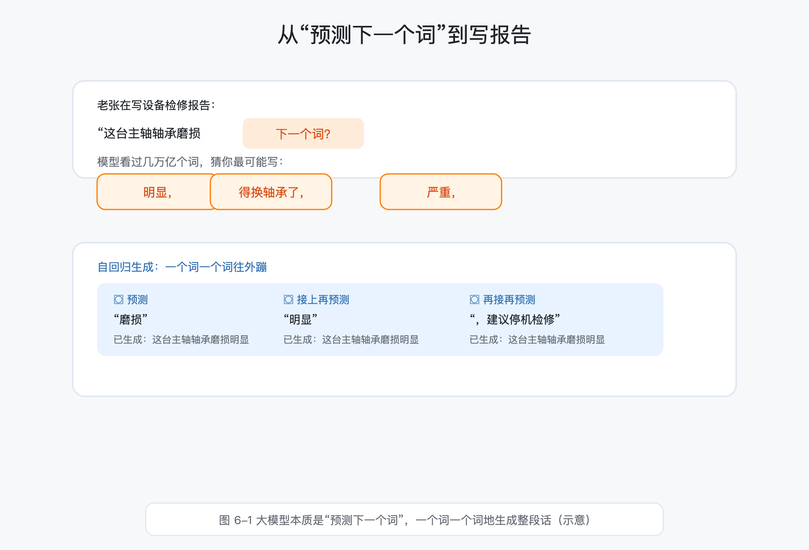
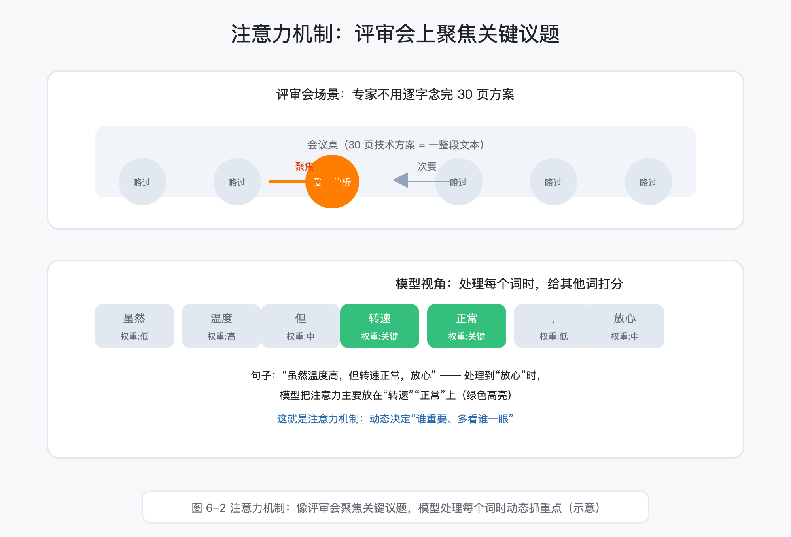
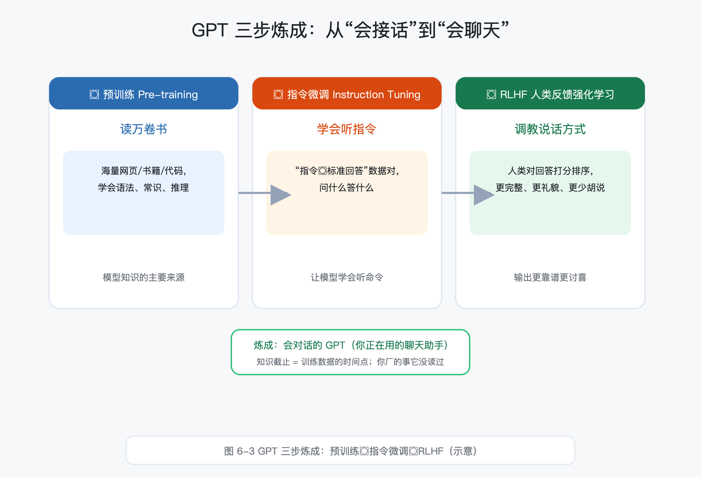
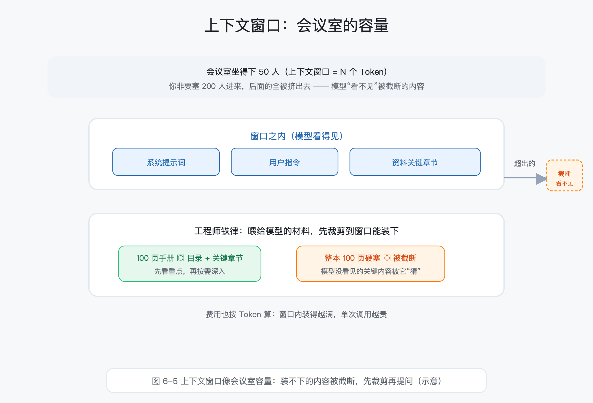
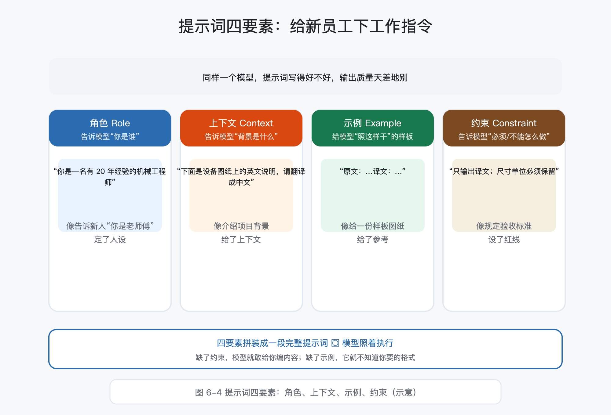
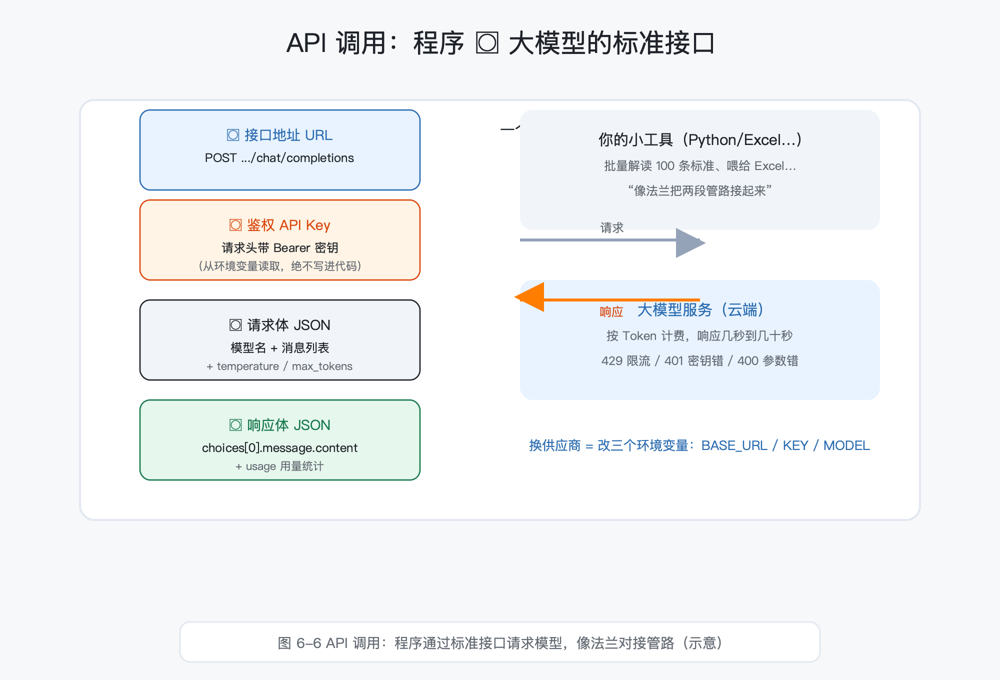
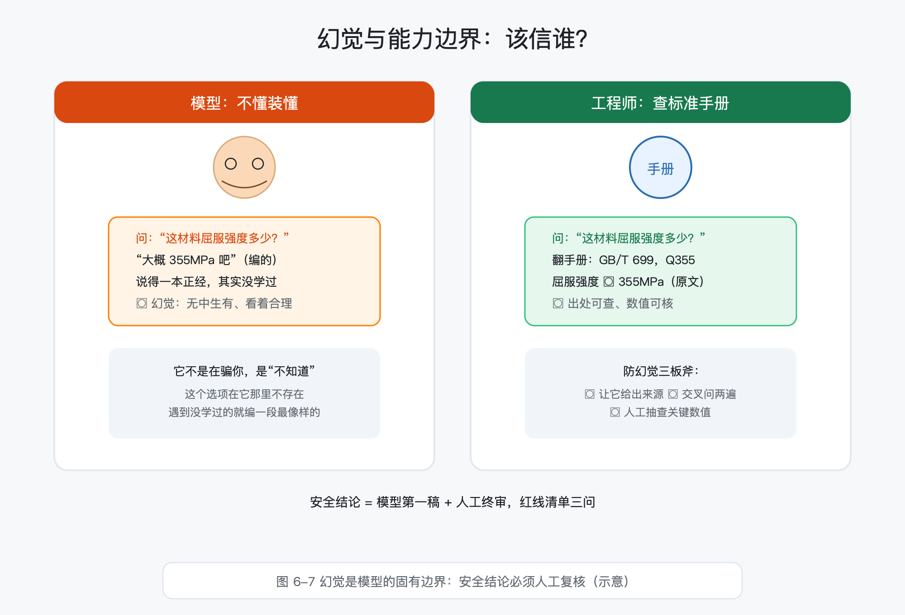
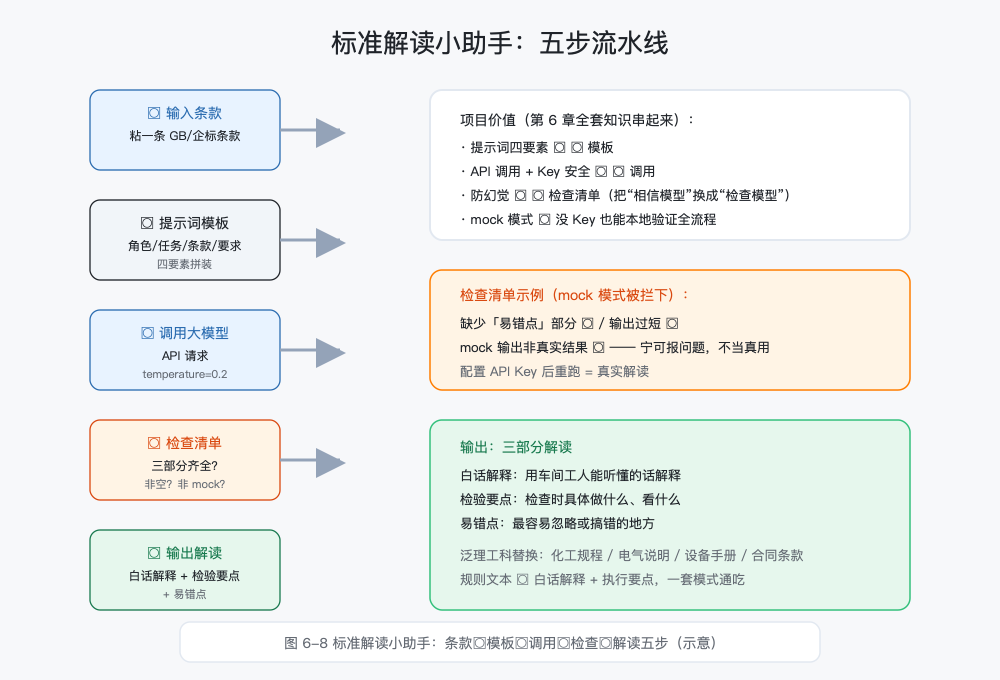

# 第 6 章 大语言模型：让 AI 听懂工程师的话

> 所属框架层：L3 AI 应用工程化
> 预计篇幅：约 10,000~12,000 字（含可运行代码；6.1~6.3 为概念课，6.4~6.6 为最小示例代码，6.8 为完整配套项目）
> 配套文件：示例代码（`code/ch6/` 目录，6-1~6-3 已真实运行，6-4/6-5 提供 mock 模式离线验证）、本章配图（SVG 源文件见 `figures/ch6/` 目录）、术语表第 6 章·L3 条目
> 版本：v0.1（首稿）

**本章验收标准**：学完后能不看资料回答——大语言模型为什么本质上是"预测下一个词"？Token、上下文窗口、注意力机制各是什么？提示词四要素是哪四个、怎么用？怎么用 API 把大模型接进自己的小工具？幻觉是什么、怎么防？配套项目"标准解读小助手"能独立跑通并给出一次真实解读。

---

> **本章配图清单**（图号 / 内容 / 对应小节 / 类型）

| 图号 | 内容 | 对应小节 | 类型 |
|---|---|---|---|
| 图 6-1 | 从"预测下一个词"到写报告：AI 逐词接龙 | 6.1 | 示意图 |
| 图 6-2 | 注意力机制：评审会聚焦关键发言人 | 6.2 | 场景图 |
| 图 6-3 | GPT 三步炼成：预训练→指令微调→RLHF | 6.3 | 流程图 |
| 图 6-4 | 提示词四要素：角色 / 上下文 / 示例 / 约束 | 6.4 | 四卡片图 |
| 图 6-5 | 上下文窗口：会议室的容量 | 6.4 | 示意图 |
| 图 6-6 | API 调用流程：请求→鉴权→模型→响应 | 6.6 | 流程图 |
| 图 6-7 | 幻觉与边界：不懂装懂 vs 查手册 | 6.7 | 对比图 |
| 图 6-8 | 标准解读小助手流程 | 6.8 | 流程图 |

---

## 6.0 本章解决什么问题

这一章解决你从"会用 ChatGPT 聊天"到"能把大模型用在正事上"之间的一串疑问：**大语言模型到底是怎么工作的？怎么让它稳定输出工程师要的东西？它一本正经说错话时怎么办？**

老张，40 岁，某机械厂设备科资深工程师。第 4 章里，他用 sklearn 做了设备异常分类，效果不错。可他很快发现一个尴尬：**机器学得会"表格数据"，学不会"人话"**。厂里的标准条款、图纸说明、设备手册、老师傅口述的经验——这些全是文字，怎么让电脑读得懂？

同事小李天天用 ChatGPT 聊天、写邮件，很溜。老张问："它能帮我查标准吗？"小李说："你直接问它就行。"老张把一条 GB 条款粘进去，ChatGPT 回答得头头是道。老张差点直接打印出来贴车间，转念一想不对——**它说的到底对不对？错了谁负责？**

这一章回答的就是这些问题。学完它，你会明白：大语言模型不是魔法，它是"**根据前文预测下一个词**"的巨型模型；你知道它的原理、会写提示词、会调 API、知道它的边界在哪，就能把它变成自己手下的"实习生"——干活快，但必须有人把关。

## 6.1 大语言模型是什么：从"预测下一个词"说起

### 6.1.1 语言模型的本质：预测下一个词

先忘掉"智能"这个词。大语言模型（Large Language Model，LLM）做的核心事情，用一句话就能说清：**给你一句话的前半截，猜下一个词是什么**。

车间里你肯定见过这种场景：老师傅听你说"这台泵的声音有点……"，他马上接"闷是吧？轴承缺油了"。老师傅不是读心术，他是根据前半句和几十年经验，**预测了你最可能说的下一个词**。大语言模型干的活一模一样，只不过它读过几万亿个词，接话的本事大了几个数量级。

但"预测下一个词"和"会聊天"之间差着一层：模型预测完一个词，把这个词接在原文后面，再预测下一个，一个词一个词地往外蹦，直到凑成一段完整的话。这个过程叫**自回归生成（Autoregressive Generation）**——"回归"这个词你在第 4 章见过，这里的意思是"拿前面的输出当后面的输入"，像工人逐段装配：装完一段，下一段在这段的基础上继续装。

### 6.1.2 Token：模型处理文本的最小单位

模型读的不是"字"也不是"词"，而是 **Token（词元）**——模型处理文本的最小单位。

你可以把 Token 理解成**把一页资料切成可以处理的最小字块**：英文按子词切（"spindle"会被切成 "Sp" + "indle"），中文大多按字或词切，数字和标点也会被切成独立的块。模型真正"看到"的，是一串 Token 编号，不是文字本身。

怎么直观感受？跑一下代码 6-1，用 OpenAI 开源的 tiktoken 工具看真实的切分结果：

```python
# -*- coding: utf-8 -*-
"""代码 6-1：Token 切分演示
本段做什么：用 OpenAI 的 tiktoken 工具演示"大语言模型怎么把文字切成最小单位 Token"，
并对比同一句话用中文和英文写，各消耗多少 Token（直接关系到费用和上下文窗口占用）。
运行前要装什么：pip install tiktoken
"""
import tiktoken

# 用 GPT-3.5/GPT-4 系列的编码方式（cl100k_base）
enc = tiktoken.get_encoding("cl100k_base")

print("=" * 60)
print("示例 1：一句混合了中文、英文和数字的设备检修记录")
text = "设备转速1450rpm，轴承温度62.5°C，建议立即停机检修。The bearing temperature is high."
tokens = enc.encode(text)
print(f"原文：{text}")
print(f"Token 数量：{len(tokens)}")
print(f"Token 编号（前 20 个）：{tokens[:20]}")
print(f"还原文本（应和原文一致）：{enc.decode(tokens)}")
print()

print("=" * 60)
print("示例 2：同一句话，中文写 vs 英文写，Token 消耗差多少")
text_cn = "设备转速1450转每分钟，轴承温度62.5摄氏度，建议立即停机检修。"
text_en = "The spindle speed is 1450 rpm and the bearing temperature is 62.5 degrees Celsius. Stop the machine for inspection."

n_cn = len(enc.encode(text_cn))
n_en = len(enc.encode(text_en))
print(f"中文版（{len(text_cn)} 个字符）：{n_cn} 个 Token")
print(f"英文版（{len(text_en)} 个字符）：{n_en} 个 Token")
print(f"中文版 Token 数是英文版的 {n_cn / n_en:.1f} 倍")
print()

print("=" * 60)
print("示例 3：逐 Token 拆开看（用英文演示，Token 更接近完整单词）")
demo_en = "Spindle speed 1450 rpm."
for i, t in enumerate(enc.encode(demo_en)[:12]):
    print(f"  Token[{i:2d}] = {t:5d}  ->  {enc.decode([t])!r}")
```

运行结果（真实输出）：

```
============================================================
示例 1：一句混合了中文、英文和数字的设备检修记录
原文：设备转速1450rpm，轴承温度62.5°C，建议立即停机检修。The bearing temperature is high.
Token 数量：35
Token 编号（前 20 个）：[30735, 57378, 47770, 95399, 9591, 15, 74882, 3922, 15568, 112, 15355, 123, 35086, 102, 27479, 5538, 13, 20, 32037, 3922]
还原文本（应和原文一致）：设备转速1450rpm，轴承温度62.5°C，建议立即停机检修。The bearing temperature is high.

============================================================
示例 2：同一句话，中文写 vs 英文写，Token 消耗差多少
中文版（34 个字符）：35 个 Token
英文版（115 个字符）：26 个 Token
中文版 Token 数是英文版的 1.3 倍

============================================================
示例 3：逐 Token 拆开看（用英文演示，Token 更接近完整单词）
  Token[ 0] =  6540  ->  'Sp'
  Token[ 1] = 58863  ->  'indle'
  Token[ 2] =  4732  ->  ' speed'
  Token[ 3] =   220  ->  ' '
  Token[ 4] =  9591  ->  '145'
  Token[ 5] =    15  ->  '0'
  Token[ 6] = 51025  ->  ' rpm'
  Token[ 7] =    13  ->  '.'
```

两个工程师必须记住的结论：

1. **Token 就是"钱"和"窗口"**：大模型按 Token 计费，上下文窗口（6.4 讲）也按 Token 算。你的提示词写得啰嗦，钱包和窗口一起吃亏。
2. **中英文 Token 消耗不一样**：同一句话，中文版 35 个 Token、英文版 26 个——中文在多数模型的词表里是"按字切"，相对费 Token。写提示词时不必刻意中译英，但心里要有这笔账。

### 6.1.3 大语言模型"大"在哪

"大语言模型"的"大"有两层意思：**参数量大**（几百亿到上万亿个参数，参数≈模型里可调的"旋钮"，见第 4 章梯度下降），**训练数据大**（读过的文本以万亿词计）。两个"大"合起来，模型才能从文字里"悟"出语法、常识、推理能力。

工程师视角的提醒：**"大"是资源堆出来的，不是算法魔法**。GPT-4 级别的模型训练一次的成本是千万美元级——所以普通人用大模型的正确姿势是"**用现成的，不自己训**"。你想让模型懂你的专业，靠的不是重新训练，而是后面讲的提示词、微调和 RAG（第 7 章）。

## 6.2 Transformer 与注意力机制（概念级）


### 6.2.1 为什么需要注意力机制

你肯定经历过这种评审会：一份 30 页的技术方案，专家不可能逐字念完，他扫一眼目录、翻到关键页，盯着"受力分析""成本预算"几个重点看。**专家不是看得少，是知道哪里重要**。

大模型处理文字也面临同样的问题：一句话里的几十个词，不是每个都同等重要。翻译"The bearing is hot"时，"bearing"和"hot"是关键；理解"虽然温度高，但转速正常"时，转折关系比字面意思更重要。模型需要一种能力：**在处理每个词时，动态决定把注意力放在其他哪些词上**。

这个能力就是**注意力机制（Attention）**——模型在处理某个词时，给全句其他词算一个"重要程度"，重要的多看一眼，不重要的略过。类比库里最贴切的说法：**评审会上聚焦关键议题**，而不是把资料从头到尾念一遍。

### 6.2.2 自注意力：词与词互相"对答案"

Transformer 用的叫**自注意力（Self-Attention）**："自"的意思是，句子里的每个词都和**同一句话里其他所有词**互相计算关联度。

举个例子，"这台设备昨天刚检修过，今天又报警了。"——理解"又"字，需要回头看"昨天刚检修过"；理解"报警了"，需要联系"设备"。自注意力让每个词在处理时都能"看到"全句，动态抓重点。

Transformer（变换器）是现代大模型的**核心网络结构**。它最革命性的两点：

1. **并行计算**：第 4 章提过老式序列模型 RNN 要"逐词读、记住前文"，读长句子又慢又容易忘；Transformer 一次把整句话的所有词同时处理，训练速度提升了几个数量级——"大"才训得动。
2. **长距离依赖**：第 1 句话和第 100 句话之间的关联，自注意力也能直接建立，不用隔着 99 步"传递消息"。

### 6.2.3 工程师视角：不用会推公式

写到这里，我要明确划一条线：**本章不要求你推导注意力公式、不要求你写 Transformer 代码**。对机械工程师，你只需要记住三件事：

- 大模型靠注意力机制"抓重点"，所以**你喂给它的材料里，重点内容要写得清楚**（这是提示词设计的底层原因）；
- 模型看完整句话才处理，所以**上下文顺序会影响它怎么抓重点**；
- "注意力"是可以被引导的——你明确说"重点看尺寸公差"，它就真的把注意力往那里偏。

这三条，就是你接下来学提示词工程的"物理基础"。

## 6.3 从预训练到对话：GPT 是怎么炼成的


你现在用的对话式大模型，不是"生下来就会聊天"的。它经历了三步训练，你可以类比成带徒弟：

### 6.3.1 预训练：读万卷书

**预训练（Pre-training）**：把海量互联网文本（网页、书籍、论文、代码……以万亿词计）喂给模型，让它做"预测下一个词"的练习。读得够多，模型就"悟"出了语法规则、世界常识、推理能力——这是模型知识的主要来源。

类比：**让一个学徒把全厂过去 20 年的图纸、工艺卡、检验报告都读一遍**。他读完之后，你对他说半句话，他能接出专业的下半句——但他"接话"是凭读过的资料，不是真的干过这些活。

### 6.3.2 指令微调：学会听指令

读万卷书的模型只会"接话"，不会"听命令"。你问它"这条标准什么意思"，它可能继续给你接一段标准原文。

**指令微调（Instruction Tuning）**：用大量"指令 → 标准回答"的数据对（人类专家写好的），再训练一轮，让模型学会"用户问什么，我就按指令回答"。类比：**师傅拿着工作手册，一条一条教徒弟"听到'解释这条标准'，你要分三点回答"**。

### 6.3.3 RLHF：调教说话方式

**RLHF（Reinforcement Learning from Human Feedback，人类反馈强化学习）**：让模型生成多个回答，人类给它们打分排序，模型学着"让人类更满意的回答方式"调整自己——回答更完整、更礼貌、更少胡说八道。类比：**师傅在徒弟出活后点评"这个回答太冲了""那个没给结论"**，徒弟慢慢学会怎么说话让人满意。

### 6.3.4 知识截止与能力来源

三步训练完，你就该明白一个关键事实：**模型知道什么，取决于它训练时见过什么**。2023 年训练的模型，不知道 2024 年的新标准；你厂的内部工艺规程，模型更是听都没听过。

这解释了工程师最常见的两个困惑：

- "它怎么连我厂里的事都知道？"——多半是你或者别人在对话里告诉它的（它当场记住，但下次对话就忘）；
- "它为什么不知道最新标准？"——因为知识截止（Knowledge Cutoff）在训练数据的时间点。

**结论：大模型是"通用实习生"，不是"厂里老员工"。** 让实习生快速懂你厂的知识，是第 7 章 RAG 的事。

## 6.4 上下文窗口与提示词工程入门


### 6.4.1 上下文窗口：会议室的容量

模型一次对话能"看到"多少内容，有硬上限，这个上限叫**上下文窗口（Context Window）**，按 Token 计。

类比：**会议室的容量**。会议室坐得下 50 人，你非要塞 200 人进来，要么进不来、要么后面的人被挤出去。模型也一样：你贴的材料总 Token 数超过窗口，超出的部分它根本看不见——而且往往是**最前面的被保留、最后面的被截断**（具体策略因模型而异），回答质量立刻下降。

所以工程师用大模型的第一条铁律：**喂给模型的材料，先裁剪到窗口能装下**。一份 100 页设备手册，别整本贴进去，先让它看目录和关键章节。

### 6.4.2 提示词四要素：角色、上下文、示例、约束


**提示词（Prompt）**就是你发给模型的指令文字。同样一个模型，提示词写得好不好，输出质量能差出"能用"和"不能用的距离"。

把提示词拆成四个要素，最容易上手（类比：**给新员工下的工作指令，说清楚才办得好**）：

| 要素 | 作用 | 工程例子 |
|---|---|---|
| **角色 Role** | 告诉模型"你是谁" | "你是一名有 20 年经验的机械工程师" |
| **上下文 Context** | 告诉模型"背景是什么" | "下面是设备图纸上的英文说明，请翻译成中文" |
| **示例 Example** | 给模型一个"照这样干"的样板 | "原文：…译文：…" |
| **约束 Constraint** | 告诉模型"必须/不能怎么做" | "只输出译文；尺寸单位必须保留；不要解释" |

跑一下代码 6-2，看四个要素怎么拼装成完整提示词：

```python
# -*- coding: utf-8 -*-
"""代码 6-2：提示词四要素模板（角色 / 上下文 / 示例 / 约束）
本段做什么：用 Python 字符串模板演示"怎么把提示词工程化"——
把角色、上下文、示例、约束四个要素拼装成一段完整提示词，方便批量复用、统一管理。
运行前要装什么：无需额外安装（纯 Python 标准库）
"""


def build_prompt(role, context, example, constraint):
    """把提示词四要素拼装成一段完整提示词。"""
    parts = []
    if role:
        parts.append(f"【角色】{role}")
    if context:
        parts.append(f"【背景】{context}")
    if example:
        parts.append(f"【示例】{example}")
    if constraint:
        parts.append(f"【要求】{constraint}")
    return "\n\n".join(parts)


print("=" * 60)
print("场景 A：翻译图纸说明（英文 → 中文，术语保真）")
prompt_a = build_prompt(
    role="你是一名有 20 年经验的机械工程师，精通英文图纸和技术手册翻译。",
    context="下面是一段设备图纸上的英文说明，请翻译成中文，保留所有尺寸和单位，术语使用国内机械行业通用叫法。",
    example="原文：The spindle shall be dynamically balanced to G2.5 grade. 译文：主轴应进行动平衡，等级达到 G2.5 级。",
    constraint="只输出译文，不要解释；尺寸、公差、单位必须原样保留。",
)
print(prompt_a)
print()

print("=" * 60)
print("场景 B：把会议记录整理成工单（表格输出）")
prompt_b = build_prompt(
    role="你是设备科的助理工程师，负责把会议记录整理成可执行工单。",
    context="下面是今天设备科会议的口语记录，请整理成表格：任务、负责人、完成期限三列。",
    example="记录：小王说下周要换 3 号机的轴承。整理后：| 任务 | 负责人 | 期限 | | 更换 3 号机轴承 | 小王 | 下周 |",
    constraint="表格用 Markdown 格式；没提到负责人的写'待定'；不要添加记录里没有的内容。",
)
print(prompt_b)
print()

print("=" * 60)
print("技巧：把模板固化成函数，参数一换就能复用")
article = "检验规则：每批抽取 5 件，按 GB/T 2828.1 判定。"
prompt_c = build_prompt(
    role="你是机械产品检验工程师。",
    context=f"请把下面这条检验规则改写成'白话解释 + 检验要点 + 易错点'三部分。\n规则原文：{article}",
    example="规则：外观不得有划伤。白话解释：表面不能有肉眼可见的划痕。检验要点：目视检查全部表面。易错点：忽略端面倒角处。",
    constraint="三部分都要有，每部分不超过 3 句话。",
)
print(prompt_c)
```

运行结果（真实输出，节选场景 A）：

```
============================================================
场景 A：翻译图纸说明（英文 → 中文，术语保真）
【角色】你是一名有 20 年经验的机械工程师，精通英文图纸和技术手册翻译。

【背景】下面是一段设备图纸上的英文说明，请翻译成中文，保留所有尺寸和单位，术语使用国内机械行业通用叫法。

【示例】原文：The spindle shall be dynamically balanced to G2.5 grade. 译文：主轴应进行动平衡，等级达到 G2.5 级。

【要求】只输出译文，不要解释；尺寸、公差、单位必须原样保留。
```

注意看"示例"这一行的价值：模型不用猜"什么叫术语保真"，你直接给了样板，它照着做。**给示例永远比讲道理管用**。

### 6.4.3 提示词技巧进阶


入门四要素之外，三个高频技巧：

1. **少样本提示（Few-shot）**：在提示词里放 2~3 个"输入→输出"示例，引导模型按你的格式输出（上面的场景 A 就是）。对应术语 **Few-shot**；一个示例不给叫**零样本（Zero-shot）**。
2. **思维链（Chain-of-Thought, CoT）**：让模型"一步步想"再给结论。标准："先列出受力分析步骤，再给结论"——模型分步推理时错误率显著下降，像要求徒弟"把计算过程写在报告里，别只报结果"。
3. **输出格式约束**：要表格就给表格模板、要 JSON 就给 JSON 骨架。模型按格式生成的比率会高很多，方便你后面的程序直接解析。

## 6.5 工程师提示词实战

四要素学会，看四个真场景。每个场景给出可直接改用的提示词骨架。

### 6.5.1 场景一：会议纪要转结构化工单

```text
【角色】你是设备科助理工程师。
【背景】下面是设备科会议的口语记录，请整理成表格：任务、负责人、期限三列。
【示例】记录：小王说下周要换3号机轴承。整理后：| 任务 | 负责人 | 期限 | | 更换3号机轴承 | 小王 | 下周 |
【要求】Markdown 表格；没提负责人的写"待定"；不添加记录里没有的内容。
```

输出是一张可以直接抄进 Excel 的表。**注意约束里的"不添加记录里没有的内容"**——没有这一句，模型很乐意给你"补全"一些会上没说过的事。

### 6.5.2 场景二：解读标准条款

这是本章配套项目（6.8）的核心模板。代码 6-3 演示模板 + 输出检查函数：

```python
# -*- coding: utf-8 -*-
"""代码 6-3：标准解读提示词模板 + 输出格式检查函数
本段做什么：① 构造一个"解读标准条款"的提示词模板；② 写一个检查函数，
验证模型输出是否包含"白话解释 / 检验要点 / 易错点"三部分、内容是否非空。
用一段模拟的模型输出演示检查函数怎么拦下不合格结果。
运行前要装什么：无需额外安装（纯 Python 标准库）
"""

# ---------- 提示词模板 ----------
TEMPLATE = """【角色】你是一名机械行业标准解读专家，熟悉 GB、JB 等国家和行业标准。

【任务】请把下面的标准条款改写成三部分：
1. 白话解释：用车间工人能听懂的话解释这条规则在说什么
2. 检验要点：检查时具体要做什么、看什么、量什么
3. 易错点：执行这条规则时最容易忽略或搞错的地方

【条款】
{article}

【要求】三部分都要有；每部分不超过 3 句话；不得编造条款里没有的要求。"""


def build_prompt(article):
    """把标准条款装进模板，返回完整提示词。"""
    return TEMPLATE.format(article=article)


# ---------- 输出格式检查函数 ----------
REQUIRED_SECTIONS = ["白话解释", "检验要点", "易错点"]


def check_output(text):
    """检查模型输出是否结构完整、内容非空。返回 (是否通过, 问题列表)。"""
    problems = []
    for section in REQUIRED_SECTIONS:
        if section not in text:
            problems.append(f"缺少「{section}」部分")
    lines = [ln.strip() for ln in text.splitlines() if ln.strip()]
    if not lines:
        problems.append("输出为空")
    if len(text) < 20:
        problems.append("输出过短，疑似没认真回答")
    return (len(problems) == 0, problems)


# ---------- 演示 ----------
article = "示例条款（非标准原文）：焊缝外观不得有裂纹、气孔、咬边等缺陷，重要焊缝应进行无损检测。"

print("=" * 60)
print("渲染后的完整提示词：")
prompt = build_prompt(article)
print(prompt)
print()

print("=" * 60)
print("模拟模型输出 1：结构完整（应该通过检查）")
mock_ok = """白话解释：焊完之后表面不能有裂纹、气孔、咬边这类毛病，重要的焊缝还要用仪器探伤。
检验要点：先目视检查全部焊缝表面，再对重要焊缝安排无损检测并记录结果。
易错点：气孔很小容易被忽略，咬边在接头转角处最常出现。"""
passed, problems = check_output(mock_ok)
print(f"检查结果：通过={passed}，问题={problems}")
print()

print("=" * 60)
print("模拟模型输出 2：漏掉一个部分（应该被拦下）")
mock_bad = """白话解释：焊缝表面要光滑。
检验要点：目视检查。"""
passed, problems = check_output(mock_bad)
print(f"检查结果：通过={passed}，问题={problems}")
```

运行结果（真实输出，节选）：

```
============================================================
渲染后的完整提示词：
【角色】你是一名机械行业标准解读专家，熟悉 GB、JB 等国家和行业标准。

【任务】请把下面的标准条款改写成三部分：
1. 白话解释：用车间工人能听懂的话解释这条规则在说什么
2. 检验要点：检查时具体要做什么、看什么、量什么
3. 易错点：执行这条规则时最容易忽略或搞错的地方

【条款】
示例条款（非标准原文）：焊缝外观不得有裂纹、气孔、咬边等缺陷，重要焊缝应进行无损检测。

【要求】三部分都要有；每部分不超过 3 句话；不得编造条款里没有的要求。

============================================================
模拟模型输出 1：结构完整（应该通过检查）
检查结果：通过=True，问题=[]

============================================================
模拟模型输出 2：漏掉一个部分（应该被拦下）
检查结果：通过=False，问题=['缺少「易错点」部分']
```

**看到重点了吗**：模型输出不可控，所以你要写代码"检查"它的输出——漏了「易错点」就拦下来。**把"相信模型"换成"检查模型"**，是大模型应用从玩具走向工具的转折点。

### 6.5.3 场景三：翻译图纸说明 / 英文手册

```text
【角色】你是一名有 20 年经验的机械工程师，精通英文图纸翻译。
【背景】翻译下面的英文设备说明为中文，保留所有尺寸和单位。
【示例】原文：The spindle shall be dynamically balanced to G2.5 grade. 译文：主轴应进行动平衡，等级达到 G2.5 级。
【要求】只输出译文；尺寸、公差、单位原样保留；专业术语用国内通用叫法；不确定的术语用"（）"标注原文。
```

### 6.5.4 场景四：生成检验规范初稿

```text
【角色】你是质检科工艺工程师。
【背景】为"外协加工的回转轴"起草一份进厂检验规范初稿，检验项参照常规轴类零件。
【要求】输出表格：检验项目 / 检验方法 / 抽样比例 / 判定标准；标准号写"待定"，不得编造具体数值；只做初稿，供工程师复核。
```

**"标准号写待定，不得编造具体数值"**——这条约束是防幻觉的关键，下一节展开。

## 6.6 API 调用入门：把大模型接进自己的小工具

网页聊天人人会，但工程师要的是**把模型接进自己的程序**——批量解读 100 条标准、把模型输出喂给 Excel、集成进设备管理系统。这就要用到 **API（Application Programming Interface，应用程序接口）**。第 2 章我们用"法兰"打过比方：**API 是程序之间对接的标准接口，像法兰把两段管路接起来**。

### 6.6.1 一个完整请求拆解

大模型 API 的调用套路全球统一（OpenAI 兼容格式），一个请求包含四件事：

1. **接口地址（URL）**：形如 `https://xxx/api/v1/chat/completions`；
2. **鉴权（API Key）**：一个像密码一样的字符串，放在请求头里证明"你是谁、谁付费"。**Key 必须从环境变量读取，绝不写进代码、绝不提交进 git 仓库**；
3. **请求体（JSON）**：模型名、消息列表（system 角色 + user 消息）、参数（temperature、max_tokens）；
4. **响应体（JSON）**：模型生成的内容 + token 用量统计。

### 6.6.2 最小可运行示例（mock 模式）


代码 6-4 是完整可运行示例。**设计要点：没设 Key 时自动进入 mock 模式**——打印请求/响应结构、返回模拟输出，让你在没花钱的情况下验证"代码本身没问题"；设了 `LLM_API_KEY` 环境变量后自动真实调用：

```python
# -*- coding: utf-8 -*-
"""代码 6-4：LLM API 调用完整示例（OpenAI 兼容格式）
本段做什么：演示"程序怎么调用大模型 API"——构造请求、发送、拿到响应。
安全要点：API Key 从环境变量读取，绝不写进代码。
两种模式：
  有 Key（设置了环境变量 LLM_API_KEY）：真实调用接口；
  无 Key：mock 模式，打印完整请求结构 + 模拟响应，用于本地验证代码本身没问题。
运行前要装什么：pip install requests python-dotenv
"""
import json
import os
import requests
from dotenv import load_dotenv

load_dotenv()  # 从 .env 文件读环境变量（可选）

API_KEY = os.environ.get("LLM_API_KEY", "")
BASE_URL = os.environ.get("LLM_BASE_URL", "https://api.openai.com/v1")
MODEL = os.environ.get("LLM_MODEL", "gpt-4o-mini")


def build_messages(prompt, system="你是一名机械工程师助理。"):
    """构造对话消息：系统角色 + 用户提问。"""
    return [
        {"role": "system", "content": system},
        {"role": "user", "content": prompt},
    ]


def build_payload(messages, temperature=0.3, max_tokens=500):
    """构造请求体：消息、随机性参数、输出长度上限。"""
    return {
        "model": MODEL,
        "messages": messages,
        "temperature": temperature,
        "max_tokens": max_tokens,
    }


def mock_response(payload):
    """无 Key 时的模拟响应：展示真实的响应结构长什么样。"""
    return {
        "id": "chatcmpl-mock-0001",
        "object": "chat.completion",
        "choices": [
            {
                "index": 0,
                "message": {
                    "role": "assistant",
                    "content": "【模拟输出】主轴转速 1450rpm、温度 62.5°C 属正常范围。"
                    "若温度持续超过 75°C，应停机检查轴承润滑。",
                },
                "finish_reason": "stop",
            }
        ],
        "usage": {"prompt_tokens": 210, "completion_tokens": 42, "total_tokens": 252},
    }


def call_llm(prompt):
    """调用大模型 API，返回 (是否真实调用, 文本输出)。"""
    messages = build_messages(prompt)
    payload = build_payload(messages)

    if not API_KEY:
        # mock 模式：打印请求结构，返回模拟响应
        print("（未设置 LLM_API_KEY，进入 mock 模式，不发起真实请求）")
        print(f"请求地址：POST {BASE_URL}/chat/completions")
        print(f"请求头：Authorization: Bearer <你的API_KEY>（脱敏显示）")
        print(f"请求体：{json.dumps(payload, ensure_ascii=False, indent=2)}")
        resp = mock_response(payload)
        print(f"响应体：{json.dumps(resp, ensure_ascii=False, indent=2)}")
        return False, resp["choices"][0]["message"]["content"]

    # 真实模式
    resp = requests.post(
        f"{BASE_URL}/chat/completions",
        headers={
            "Authorization": f"Bearer {API_KEY}",
            "Content-Type": "application/json",
        },
        json=payload,
        timeout=60,
    )
    resp.raise_for_status()
    data = resp.json()
    return True, data["choices"][0]["message"]["content"]


if __name__ == "__main__":
    prompt = "主轴转速1450rpm，轴承温度62.5°C。请问这个状态正常吗？需要注意什么？"
    real, answer = call_llm(prompt)
    print()
    print("=" * 60)
    print(f"调用方式：{'真实 API 调用' if real else 'mock 模式（未真实调用）'}")
    print(f"模型返回：{answer}")
```

无 Key 时的运行输出（真实输出）：

```
（未设置 LLM_API_KEY，进入 mock 模式，不发起真实请求）
请求地址：POST https://api.openai.com/v1/chat/completions
请求头：Authorization: Bearer <你的API_KEY>（脱敏显示）
请求体：{
  "model": "gpt-4o-mini",
  "messages": [
    {
      "role": "system",
      "content": "你是一名机械工程师助理。"
    },
    {
      "role": "user",
      "content": "主轴转速1450rpm，轴承温度62.5°C。请问这个状态正常吗？需要注意什么？"
    }
  ],
  "temperature": 0.3,
  "max_tokens": 500
}
响应体：{
  "id": "chatcmpl-mock-0001",
  "object": "chat.completion",
  "choices": [
    {
      "index": 0,
      "message": {
        "role": "assistant",
        "content": "【模拟输出】主轴转速 1450rpm、温度 62.5°C 属正常范围。若温度持续超过 75°C，应停机检查轴承润滑。"
      },
      "finish_reason": "stop"
    }
  ],
  "usage": {
    "prompt_tokens": 210,
    "completion_tokens": 42,
    "total_tokens": 252
  }
}

============================================================
调用方式：mock 模式（未真实调用）
模型返回：【模拟输出】主轴转速 1450rpm、温度 62.5°C 属正常范围。若温度持续超过 75°C，应停机检查轴承润滑。
```

配置好 Key 后，把以下内容写进项目根目录的 `.env` 文件（**这个文件要加进 `.gitignore`，防止 Key 泄露到仓库**）：

```bash
LLM_API_KEY=sk-你的密钥
LLM_BASE_URL=https://api.openai.com/v1
LLM_MODEL=gpt-4o-mini
```

### 6.6.3 模型与参数

请求体里有两个参数决定输出风格，工程师必须会调：

| 参数 | 作用 | 什么时候调 |
|---|---|---|
| **temperature**（温度） | 输出随机性：0 接近"每次都一样"，1 以上天马行空 | 解读标准、翻译、抽取数据→设 0~0.3（要稳定）；头脑风暴、起名字→0.7~1.0（要发散） |
| **max_tokens** | 输出长度上限（Token 数） | 设得够用即可，太长费钱且容易"车轱辘话" |

关于 **max_tokens 与 top_p**：`max_tokens` 直接限制输出长度；`top_p` 是另一种随机性旋钮（按概率截断候选词），日常用 `temperature` 一个就够，两个同时调容易互相打架，新手建议只动 `temperature`。

### 6.6.4 工程要点：超时、费用、兼容性

四个工程要点，都是踩坑换来的：

1. **超时与重试**：模型服务偶发慢响应，请求要设 `timeout`（代码里给了 60 秒）；失败重试 2~3 次（退避重试），但**别无限重试**——那是费用失控的开始。
2. **费用按 Token 算**：响应体 `usage` 字段会告诉你每次调用的 token 数；长文档别反复整段喂，先裁剪。
3. **错误处理**：HTTP 429 是限流（等一会儿重试）、401 是 Key 错了、400 是参数或内容不合规——先看状态码再动手，别盲目重试。
4. **模型兼容性**：主流模型的 API 基本都兼容 OpenAI 格式，切换供应商只需要改三个环境变量：

| 供应商 | 改 `LLM_BASE_URL` 为 | 模型示例（`LLM_MODEL`） |
|---|---|---|
| OpenAI | `https://api.openai.com/v1` | `gpt-4o-mini` |
| DeepSeek | `https://api.deepseek.com/v1` | `deepseek-chat` |
| 阿里云通义千问 | `https://dashscope.aliyuncs.com/compatible-mode/v1` | `qwen-plus` |
| 火山引擎（豆包） | `https://ark.cn-beijing.volces.com/api/v3` | 接入点 ID（如 `ep-xxxx`） |

> 具体接入点和价格以各家官网最新文档为准，接口格式均为 OpenAI 兼容。**同一段代码，换三个环境变量就能换一家模型**——这就是"API 标准化"给工程师的便利。

## 6.7 幻觉与能力边界

### 6.7.1 幻觉：AI 不懂装懂

**幻觉（Hallucination）**：模型生成**无中生有、看起来却非常合理**的内容。它不是在"骗你"——它本质是"预测下一个词"，遇到没学过的知识，它不会说"我不知道"，而是**基于上下文编一段最像样的**。

类比：**不懂装懂的新员工**。你问实习生"这个材料屈服强度多少"，他明明不知道，但为了不丢脸，给你编了个"大概 355MPa 吧"，还说得一本正经。模型也一样——**它不是故意撒谎，是"不知道"这个选项在它那里不存在**。

### 6.7.2 什么场景能用、什么不能用


| 场景 | 风险 | 建议 |
|---|---|---|
| 翻译、润色、改写 | 低（错了看得见） | ✅ 放心用 |
| 总结、提取要点 | 低~中（对照原文可查） | ✅ 用，但保留原文可查 |
| 起草初稿（工艺卡、检验规范） | 中（需要人复核） | ✅ 用，必须复核数值与条款 |
| 解读标准/法规条款 | **高（错一个字就是事故）** | ⚠️ 只当"参考解读"，必须核对原文 |
| 精确计算、安全结论、放行判定 | **极高** | ❌ 别让模型做最后决定 |
| 编代码、改代码 | 中（跑不起来/有漏洞） | ⚠️ 当"结对程序员"用，代码要自己看 |

一句话决策原则：**错了会造成什么后果？** 后果小，放手用；后果大，模型只能当"第一稿"，人必须当"终审"。

### 6.7.3 防幻觉三板斧

1. **让它给出来源**：要求"引用条款编号、给出处"——给不出出处的内容天然可疑；
2. **交叉验证**：同一个问题换说法问两遍，回答不一致就是可疑信号；
3. **人工抽查**：抽样核对关键数值和条款（标准解读项目里，检查清单函数就是自动化的"抽查"）。

### 6.7.4 数据安全红线

工程师用大模型，还有一条红线：**图纸、工艺参数、客户数据、涉密文件，未经审批不得发给外部模型服务**。你在网页聊天框里贴进一张图纸，它就进了别人的服务器。

对策三选一：用有保密协议的企业版服务、用私有化部署（自己机房里跑开源模型，第 11 章涉及）、或者**先脱敏再问**（把具体数值换成"XX MPa"）。**这条红线没有例外**——成本最低的合规动作，是先问自己一句：这段文字出去，出事了谁负责？

> **工程师贴士：LLM 应用的"质量红线清单"**
> 每次要把模型输出用于正式场合前，问三句话：① 错了会怎样（后果等级）；② 谁来复核（明确责任人）；③ 数据能不能出去（合规检查）。三关都过，才允许进正式流程。

## 6.8 配套项目：标准解读小助手

把本章所有知识串起来：**输入一条标准条款，输出"白话解释 + 检验要点 + 易错点"，并对输出做结构检查**——配套项目"标准解读小助手"（`code/ch6/06-5_standard_helper.py`，约 100 行）。

### 6.8.1 需求拆解

- 输入：一段标准条款文字；
- 输出：三部分解读（白话解释 / 检验要点 / 易错点）；
- 保障：检查清单函数确认三部分齐全，mock 模式明确标注"非真实结果"。

### 6.8.2 完整代码

```python
# -*- coding: utf-8 -*-
"""代码 6-5：标准解读小助手（第 6 章配套项目，约 100 行）
本段做什么：输入一段标准条款，输出"白话解释 + 检验要点 + 易错点"，
并对输出做结构检查（缺部分就提示），防止把模型"编的内容"直接当结论用。
运行前要装什么：pip install requests python-dotenv
    （可选）设置环境变量 LLM_API_KEY 后为真实调用；未设置则用 mock 输出演示全流程。
"""
import os
import requests
from dotenv import load_dotenv

load_dotenv()

API_KEY = os.environ.get("LLM_API_KEY", "")
BASE_URL = os.environ.get("LLM_BASE_URL", "https://api.openai.com/v1")
MODEL = os.environ.get("LLM_MODEL", "gpt-4o-mini")

TEMPLATE = """【角色】你是一名机械行业标准解读专家。

【任务】把下面条款改写成三部分：
1. 白话解释：用车间工人能听懂的话解释
2. 检验要点：检查时具体做什么
3. 易错点：最容易忽略或搞错的地方

【条款】
{article}

【要求】三部分都要有；每部分不超过 3 句话；不得编造条款里没有的要求。"""

REQUIRED_SECTIONS = ["白话解释", "检验要点", "易错点"]


def build_prompt(article):
    return TEMPLATE.format(article=article)


def call_llm(prompt):
    """调用大模型；无 Key 时返回一段标注清楚的模拟输出。"""
    payload = {
        "model": MODEL,
        "messages": [
            {"role": "system", "content": "你是一名机械行业标准解读专家。"},
            {"role": "user", "content": prompt},
        ],
        "temperature": 0.2,
        "max_tokens": 600,
    }
    if not API_KEY:
        return "【mock 输出，非真实模型结果】\n" + "白话解释：条款要求焊缝表面不得有裂纹、气孔、咬边等缺陷，重要焊缝还需无损检测。\n检验要点：目视检查全部焊缝表面，重要焊缝安排无损检测并留记录。\n易错点：气孔小易漏检；咬边在转角处最常出现。"
    resp = requests.post(
        f"{BASE_URL}/chat/completions",
        headers={"Authorization": f"Bearer {API_KEY}", "Content-Type": "application/json"},
        json=payload,
        timeout=60,
    )
    resp.raise_for_status()
    return resp.json()["choices"][0]["message"]["content"]


def check_output(text):
    """结果检查清单：结构是否完整、内容是否非空。返回 (通过, 问题列表)。"""
    problems = []
    for section in REQUIRED_SECTIONS:
        if section not in text:
            problems.append(f"缺少「{section}」部分")
    if len(text) < 30:
        problems.append("输出过短")
    if "mock" in text:
        problems.append("当前为 mock 输出，配置 API Key 后才是真实结果")
    return (len(problems) == 0, problems)


def main():
    print("标准解读小助手 v0.1（第 6 章配套项目）")
    print("-" * 60)
    article = input("请粘贴一条标准条款（回车使用示例条款）：\n").strip()
    if not article:
        article = "示例条款（非标准原文）：焊缝外观不得有裂纹、气孔、咬边等缺陷，重要焊缝应进行无损检测。"
        print(f"使用示例条款：{article}")

    prompt = build_prompt(article)
    print("\n[1/3] 提示词已构造（%d 字符）" % len(prompt))

    answer = call_llm(prompt)
    print("\n[2/3] 模型输出：\n" + answer)

    passed, problems = check_output(answer)
    print("\n[3/3] 检查清单：" + ("通过 ✔" if passed else "发现问题 ✘"))
    for p in problems:
        print("  - " + p)
    if not passed:
        print("提示：不要把上面的输出直接当结论，先修正问题或人工复核。")


if __name__ == "__main__":
    main()
```

运行结果（mock 模式，真实输出）：

```
标准解读小助手 v0.1（第 6 章配套项目）
------------------------------------------------------------
请粘贴一条标准条款（回车使用示例条款）：
使用示例条款：示例条款（非标准原文）：焊缝外观不得有裂纹、气孔、咬边等缺陷，重要焊缝应进行无损检测。

[1/3] 提示词已构造（182 字符）

[2/3] 模型输出：
【mock 输出，非真实模型结果】
白话解释：条款要求焊缝表面不得有裂纹、气孔、咬边等缺陷，重要焊缝还需无损检测。
检验要点：目视检查全部焊缝表面，重要焊缝安排无损检测并留记录。
易错点：气孔小易漏检；咬边在转角处最常出现。

[3/3] 检查清单：发现问题 ✘
  - 当前为 mock 输出，配置 API Key 后才是真实结果
提示：不要把上面的输出直接当结论，先修正问题或人工复核。
```

注意 `[3/3]` 的检查清单：**mock 模式被明确拦下**（"当前为 mock 输出，配置 API Key 后才是真实结果"）——项目宁可"报问题"，也不让你把模拟结果当真的用。配置好 `.env` 后重跑，就是真实解读了。**真实输出因模型而异，正文不再贴固定样例**。

### 6.8.3 泛理工科替换案例


"标准解读"这个模式可以平移到你所在的任何领域——**规则文本 → 白话解释 + 执行要点**：

| 领域 | 输入 | 输出 |
|---|---|---|
| 化工 | 安全操作规程条款 | 白话解释 + 操作要点 + 易错点 |
| 电气 | 接线说明/检验规程 | 白话解释 + 检验要点 + 易错点 |
| 设备管理 | 设备手册维护章节 | 保养要点 + 周期表 + 常见误区 |
| 采购/合同 | 技术协议条款 | 权责解读 + 验收要点 + 风险点 |

## 6.9 常见坑、练习与延伸阅读

### 常见坑

1. **幻觉当事实**：最危险。标准解读错一个字就是事故——模型输出必须带出处、人工复核，配套项目的检查清单就是干这个的。
2. **上下文超限**：材料太长被截断，模型"没看见"关键内容还硬答。先裁剪再提问。
3. **提示词无效**：没说角色/约束，输出泛泛而谈。回到四要素逐项检查。
4. **API Key 泄露**：Key 写进代码、提交进 git 仓库，被公开后被人盗刷。Key 只放环境变量/`.env`，`.env` 加进 `.gitignore`。
5. **费用失控**：长文档反复整段喂、无限重试、max_tokens 开太大。先裁剪、设超时、看 `usage` 字段。
6. **安全结论无人复核**：把模型输出直接用于放行/判定。红线清单三问：错了会怎样、谁来复核、数据能不能出去。
7. **模型切换后行为不一致**：同一提示词在不同模型/版本上输出风格不同。切换后先跑一遍回归测试（用固定输入对比输出结构）。

### 练习与检验标准

- **练习 1**：用四要素重写一个"翻译图纸说明"的提示词（加"示例"要素 vs 不加），用任意可访问的对话式 AI 对比两组输出质量差异。
- **练习 2**：把配套项目的模板换成"设备手册问答"（输入：手册段落，输出：要点 + 注意事项），改模板后跑通。
- **练习 3**：设计一个对抗幻觉的检查清单（例如要求"给出处""交叉问两遍"），用模型故意"编造"一条标准条款，验证你的清单能否拦下。
- **验收标准**："能讲清"——向同事解释大模型为什么本质是"预测下一个词"、为什么会有幻觉；"能跑通"——配好 API Key 独立跑通标准解读小助手，并给出一次真实解读输出（三部分齐全、经检查清单通过）。

### 本章小结（5 句）

大语言模型本质是"根据前文预测下一个词"，Token 是它处理文本的最小单位，直接决定费用和上下文窗口；Transformer 的注意力机制让它能并行抓重点，预训练→指令微调→RLHF 三步炼成会对话的 GPT；提示词四要素（角色、上下文、示例、约束）是让模型稳定输出的基本功，上下文窗口就是它的"会议室容量"；API 调用把模型接进自己的工具，Key 必须放环境变量，同一段代码换环境变量就能切换模型；幻觉是模型固有的边界，防幻觉三板斧是给出处、交叉验证、人工抽查——安全结论必须人终审，RAG 与智能体是后面两章的事。

### 延伸阅读

- 吴恩达《ChatGPT Prompt Engineering for Developers》（免费短课，提示词工程最简入门）
- OpenAI / Anthropic 官方提示词工程文档（中英对照，进阶参考）
- Datawhale 开源教程（本书同系列配套章节）
- 李宏毅《机器学习》大语言模型系列视频（概念深度补充，免费）
