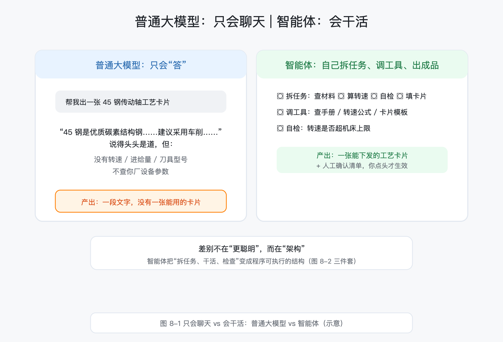
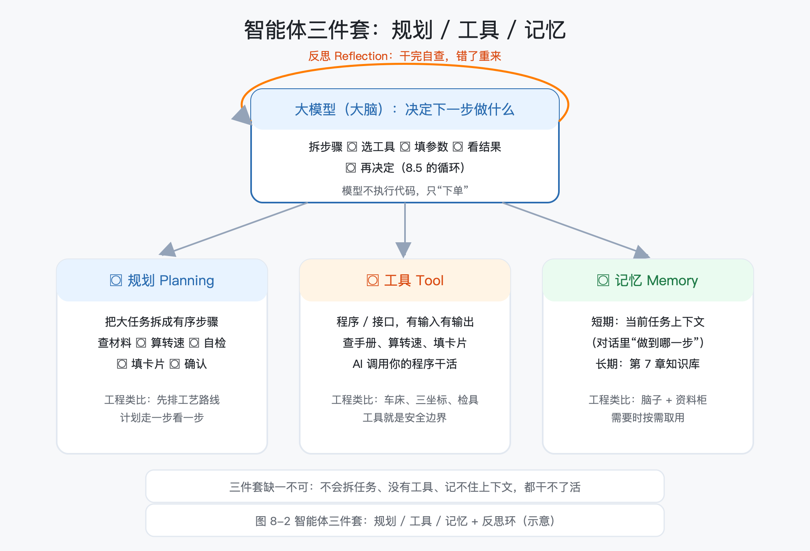
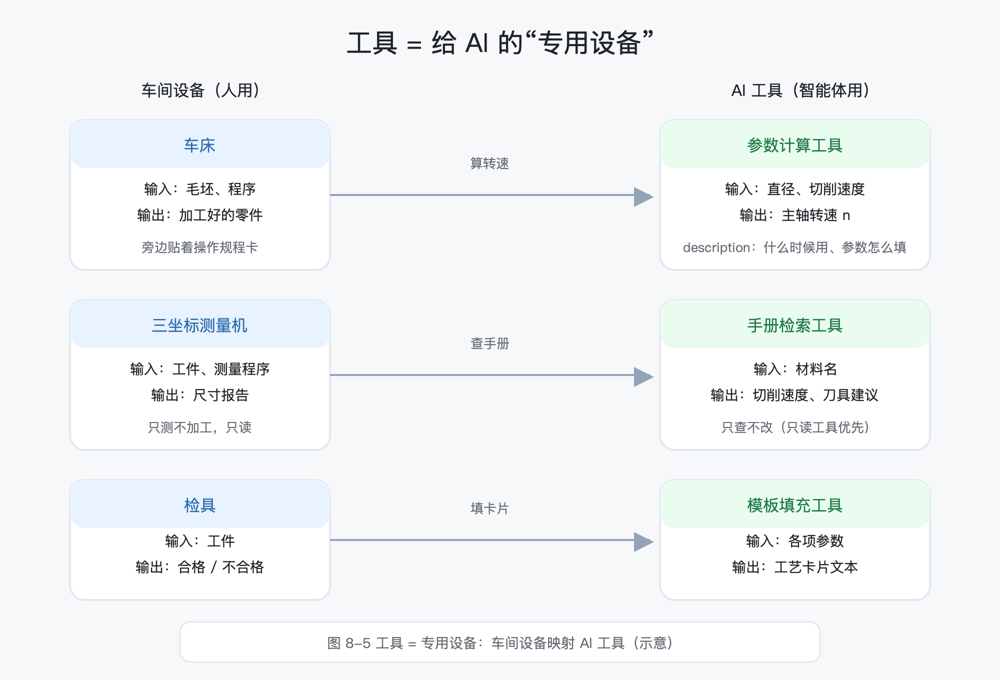
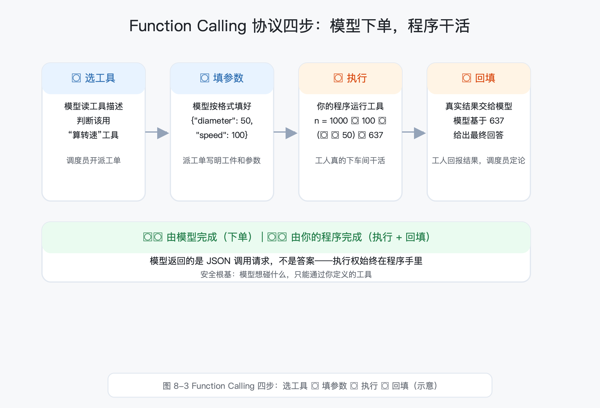
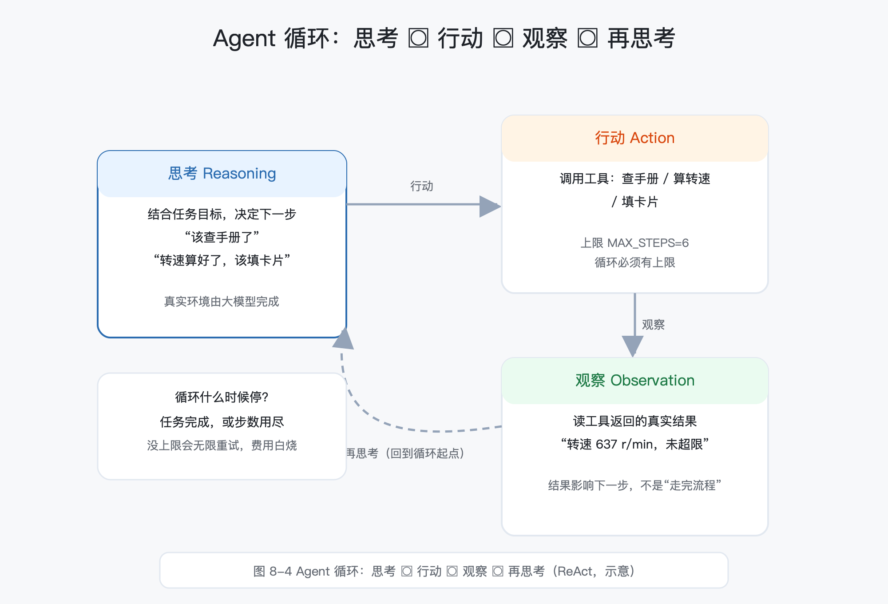
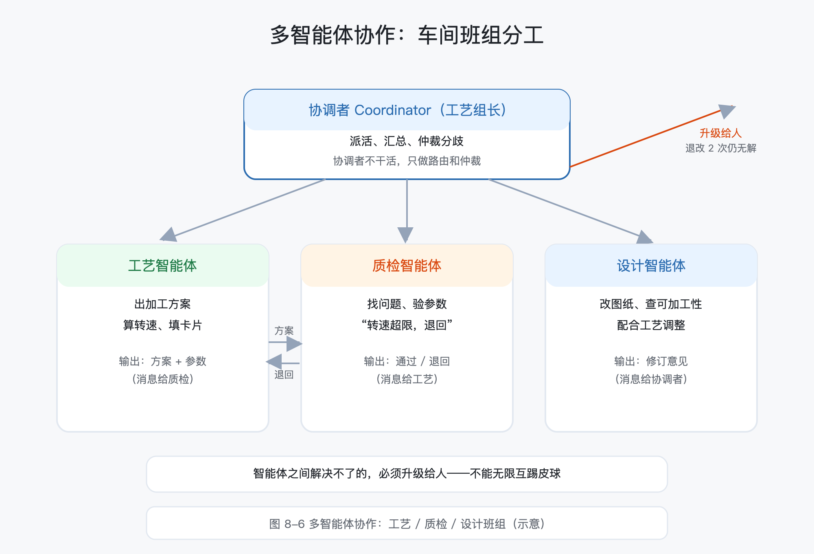
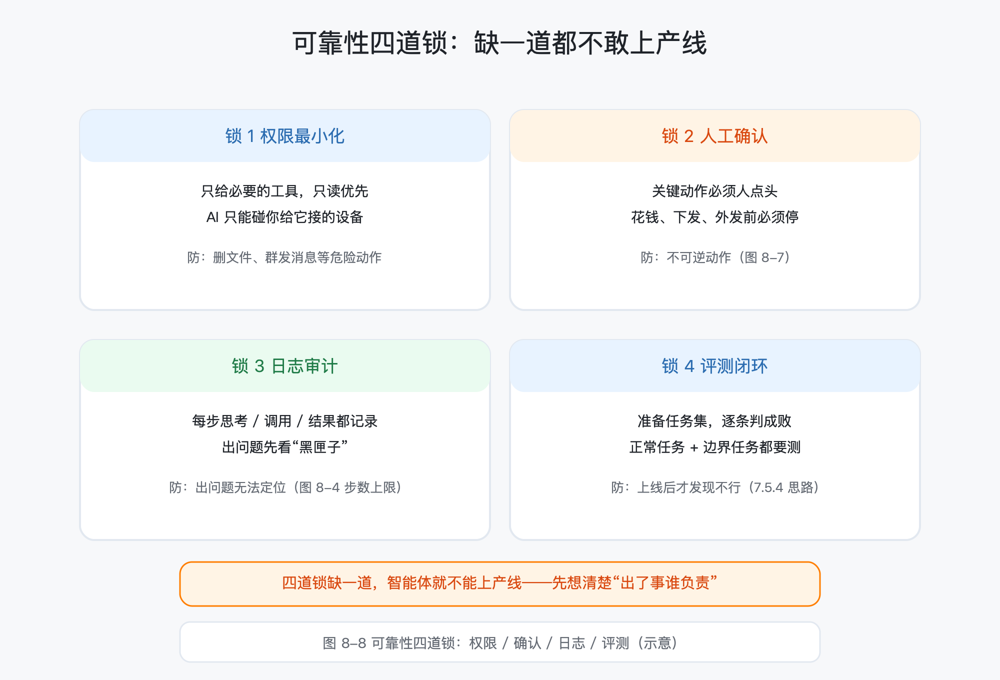
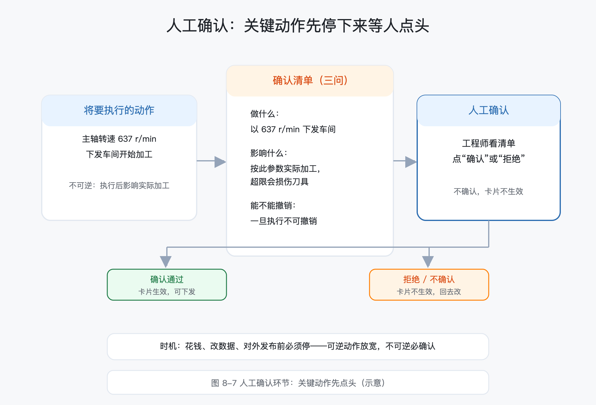

# 第 8 章 AI 智能体：从"问答"到"干活"

> 所属框架层：L3 AI 应用工程化
> 预计篇幅：约 10,000~12,000 字（含可运行代码；8.1~8.2 为概念课，8.3/8.4 为机制课，8.5/8.6 为框架与协作课，8.8 为完整配套项目）
> 配套文件：示例代码（`code/ch8/` 目录，08-1~08-4 已全部真实运行，输出见正文）、本章配图（SVG 源文件见 `figures/ch8/` 目录）、术语表第 8 章·L3 条目
> 版本：v0.1（首稿）

**本章验收标准**：学完后能不看资料回答——智能体和普通大模型会话的区别是什么？智能体三件套（规划 / 工具 / 记忆）各自解决什么问题？Function Calling 的协议四步（选工具→填参数→执行→回填）每一步在干什么？工具描述为什么重要？Agent 循环（思考→行动→观察）为什么是一个 while 循环？多智能体怎么协作、谁来仲裁？可靠性四道锁（权限 / 确认 / 日志 / 评测）缺一道会出什么事？配套项目"工艺卡片生成智能体"能独立跑通，并给出 10 张卡片的人工确认通过率报告。

---

> **本章配图清单**（图号 / 内容 / 对应小节 / 类型）

| 图号 | 内容 | 对应小节 | 类型 |
|---|---|---|---|
| 图 8-1 | 只会聊天 vs 会干活：普通大模型 vs 智能体 | 8.1 | 左右对比图 |
| 图 8-2 | 智能体三件套：规划 / 工具 / 记忆 + 反思环 | 8.1 / 8.2 / 8.8 | 结构图 |
| 图 8-3 | Function Calling 四步：选工具→填参数→执行→回填 | 8.3 | 流程图 |
| 图 8-4 | Agent 循环：思考→行动→观察→再思考（ReAct） | 8.5 | 循环流程图 |
| 图 8-5 | 工具 = 专用设备：车间设备映射 AI 工具 | 8.3 / 8.4 / 8.8 | 映射示意图 |
| 图 8-6 | 多智能体协作：工艺 / 质检 / 设计班组 | 8.6 | 协作示意图 |
| 图 8-7 | 人工确认环节：关键动作先点头 | 8.7 / 8.8 | 流程示意 |
| 图 8-8 | 可靠性四道锁：权限 / 确认 / 日志 / 评测 | 8.7 | 四格防护图 |

---

## 8.0 本章解决什么问题

这一章解决一个比"会聊天"更进一步的实际问题：**AI 已经能回答"主轴轴承多久换一次油"，可它只会答，不会干**。第 7 章搭的知识库问答机器人，你问它什么，它答什么；但真要让 AI 顶上一个岗位，靠的是"干活"——接到一个任务，自己拆步骤、查手册、算参数、填表格，干完还知道让你确认。问题很明确：**AI 能不能像新来的工艺员一样，独立完成一件多步骤的活儿，而不是只会动嘴？**

老张，40 岁，某机械厂设备科资深工程师。第 7 章他把厂里的设备手册、企业标准做成了知识库，问答机器人用得很顺手。可他很快发现一个尴尬：填一张工艺卡片，他自己要做五件事——查手册定切削参数、算主轴转速、套模板、填内容、走审批。问答机器人能告诉他"45 钢推荐切削速度 80~120 m/min"，但**剩下四件事还得他自己干**。老张想：能不能让 AI 把整张卡片干完，干完只让我最后点一下头？

这一章的主角叫 **AI 智能体（Agent）**——翻译成工程师的话：**会自己拆任务、会调用工具、会记住上下文的 AI**。就像车间来了个新工艺员：给他设备手册（工具）和工艺模板（工具），告诉他任务，他自己查、自己算、自己填；但涉及下发车间的关键动作，他必须先停下来找你签字。学完这一章，你会亲手搭一个"自动生成工艺卡片的智能体"，还会知道怎么防止它"自己乱来"——权限、人工确认、日志、评测，四道锁一道都不能少。

## 8.1 什么是智能体：从"会聊天"到"会干活"

### 8.1.1 一个对照实验

先做一个对照实验。同一句话："帮我出一张 45 钢传动轴的加工工艺卡片。"

普通大模型聊天：给你一段泛泛的文字——"45 钢是优质碳素结构钢，常用于轴类零件……建议采用车削加工……"说得头头是道，但**没有一张能用的卡片**：没有转速、没有进给量、没有刀具型号，更不会去查你厂的设备参数。

智能体：自己拆任务（查材料切削速度 → 算转速 → 自检是否超限 → 填卡片），调用工具（手册检索、转速公式、模板填充），最后给你一张**能下发的卡片**，附一份"人工确认清单"：转速多少、切削速度多少、是否下发车间，你点确认才算生效。

差别不在"更聪明"，而在**架构**：智能体把"拆任务、干活、检查"变成了程序可执行的结构。图 8-1 把两种形态画在一起：左边是只会聊天的对话，右边是能干活的闭环。



### 8.1.2 智能体的三件套：规划、工具、记忆

把智能体拆开，它的能力由三件套构成（图 8-2）：

- **规划（Planning）**：把一个大任务拆成有序的小步骤。"生成工艺卡片"拆成"查材料→算转速→检查→填模板"。就像工艺员拿到图纸先排工序：下料→粗车→精车→质检。
- **工具调用（Tool Use）**：用程序/接口干活——查手册、算公式、填模板。就像工艺员用到的设备：车床、三坐标、检具。AI 本身不会"执行"，它调用你的程序来执行。
- **记忆（Memory）**：记住当前任务的上下文（这个零件是 45 钢、转速已经算好了），必要时从长期知识库取知识（第 7 章的知识库）。就像工艺员脑子里"刚才查到什么、现在做到哪一步"。

对应术语 **Agent（智能体）**：能自主规划、调用工具、完成任务闭环的 AI。工程类比：**会自己制定工艺路线并执行的工艺员**——不是只回答问题的实习生，而是能把整件事干完的人。

图 8-2 是智能体的结构图：中间是"大脑"（大模型），三件套（规划 / 工具 / 记忆）像三个工位围在周围，外面还套着一个"反思"环——干完一步自己检查一遍。



### 8.1.3 一个容易混淆的边界：智能体 ≠ 聊天机器人加个壳

判断一个 AI 是不是真智能体，标准不是"会不会聊天"，而是**能不能独立完成一个多步骤任务闭环**：接到任务 → 自己决定步骤 → 调用工具 → 检查结果 → 交付产物。三步以内、只动嘴的，是聊天；多步骤、会调工具、有交付物的，才是智能体。第 6 章的"标准解读小助手"是聊天（回答标准条款），第 8 章要做的工艺卡片智能体是干活（产出可用卡片）。

### 8.1.4 工业视角：为什么智能体特别适合制造业

制造业里大量工作是**重复性多步骤**的：工艺卡片、BOM 整理、标准核对、来料检验记录。这些工作规则清楚、步骤固定、但繁琐耗时——正好是智能体的主场。它不擅长的是：没规则可循的创造性决策、需要大量隐性经验的判断（这仍是人的领域）。记住这句话：**智能体适合"流程清楚、步骤多、要工具"的活，不适合"凭感觉、靠经验、无规则"的活**。

## 8.2 智能体怎么"思考"：任务规划与反思

### 8.2.1 任务拆解：把大目标变成有序小步骤

规划的第一件事是**拆解**。对应术语 **Planning（任务规划）**：把大任务拆成有序子目标、逐个执行的机制。工程类比：**工艺员拿到图纸先排工艺路线**——先定加工顺序，再逐道工序细化。

"生成工艺卡片"怎么拆？老张的日常经验就是答案：

1. 查手册：这个材料的切削速度、进给量、用什么刀；
2. 算参数：根据工件直径算主轴转速；
3. 检查：转速是否在机床范围内（超限会伤刀具）；
4. 填卡片：把参数填进工艺卡片模板；
5. 确认：交给工艺员签字。

注意第 5 步——**确认是规划的一部分**，不是可有可无的尾巴。真实生产中，任何关键动作（下发车间、改参数、发通知）都要在规划里预留"人确认"这一步。这一点在后面 8.7 会展开。

### 8.2.2 计划不是一次定死：走一步看一步

初学者常犯一个错觉：规划 = 一次想好所有步骤，然后照着执行。真实智能体不是这样——**它走一步看一步**：做完"查手册"，根据查到的结果决定下一步（比如手册里没这个材料，就要换关键词再查，或者报告错误）；做完"算转速"，根据算出的值决定下一步（超限就要降速）。计划是动态的，每一步的"观察结果"都会影响下一步的动作。这正是 8.5 要讲的"Agent 循环"的本质。

### 8.2.3 反思：干完自查，错了重来

对应术语 **Reflection（反思）**：智能体对自己的输出做自我检查、发现错误并修正的机制。工程类比：**干完活自己先量一遍再交检**——老师傅常说"自己都看不上的活，别交给质检"。

反思怎么实现？不是玄学，就是再加一步"检查"：要么调一个校验工具（比如 8.3 的"转速校验"函数），要么让模型再读一遍自己的输出找毛病。第 8 章配套项目里，卡片生成后先跑"自检"，发现转速超限就拒绝放行——这就是反思的落地形态。

### 8.2.4 规划失败的典型表现

- **漏步骤**：拆任务时少了一步（比如没查刀具），卡片缺关键信息；
- **顺序颠倒**：还没算转速就填卡片，填了个空值；
- **目标漂移**：干着干着忘了原始任务，去答别的了。

怎么约束？三个手段：一是工具设计（见 8.3——工具强制按顺序取数，缺参数就报错）；二是提示词里写清任务目标和完成标准（呼应 6.4 提示词工程）；三是 8.7 的日志——出问题先看日志里哪一步漏了。规划不是模型天生会的能力，是**用工具和提示词"逼"出来的**。

## 8.3 智能体怎么"干活"：工具调用

### 8.3.1 工具是什么

工具就是**一段程序、一个接口，有输入有输出**。工艺卡片智能体需要三个工具：

| 工具 | 输入 | 输出 | 对应车间的什么 |
|---|---|---|---|
| 查手册 | 材料名 | 切削速度、进给量、刀具建议 | 工艺手册（资料） |
| 算转速 | 直径、切削速度 | 主轴转速 | 计算公式（脑算） |
| 填卡片 | 各项参数 | 工艺卡片文本 | 卡片模板（表格） |

对应术语 **Tool（工具）**：智能体可调用、有明确输入输出的函数或接口。工程类比：**车间里的"专用设备"**——车床、三坐标、检具，每台都有操作规程（怎么开、输入什么、输出什么）。AI 不会"凭空"查手册、算转速，它调用你写好的这些工具来干。

图 8-5 把车间设备和 AI 工具画成了对应关系：左边的车床 / 三坐标 / 检具，右边是参数计算 / 手册检索 / 模板填充——工具就是给 AI 的"专用设备"。



### 8.3.2 Function Calling：模型不干活，只下单

关键机制来了。**模型不会执行你的代码**——它只会"选工具、填参数"。这就是 **Function Calling（函数调用）**：大模型根据用户问题返回一个结构化"调用请求"（用哪个工具、参数是什么），由你的程序执行，再把结果回填给模型，模型基于真实结果继续。工程类比：**车间调度：调度员（模型）不下车间干活，只开"派工单"（调用请求），工人（程序）干完活把结果回报给调度员**。

协议四步（图 8-3）：

1. **选工具**：模型读工具描述，判断这个问题该用哪个工具；
2. **填参数**：模型把参数按工具的格式填好；
3. **执行**：你的程序执行工具，拿到真实结果；
4. **回填**：把结果交给模型，模型基于结果给出最终回答。



用代码 8-1 把协议真实跑一遍。这段代码零依赖，用一个"模拟模型"代替真实大模型：真实环境里，第 1、2 步由大模型的 function calling 能力完成，返回的请求结构一模一样；第 3、4 步永远是**你的程序**干的。

```python
# -*- coding: utf-8 -*-
"""
08-1_function_calling.py
第 8 章《AI 智能体》代码 8-1：Function Calling 协议演示（零依赖）

对应正文 8.3「智能体怎么干活：工具调用」。

Function Calling 的真实机制（先讲协议，再看代码）：
1. 你告诉模型"有哪些工具可用、每个工具干什么"（工具描述）；
2. 模型不执行代码，只返回一个"调用请求"：选哪个工具、填什么参数；
3. 你的程序执行这个工具，拿到真实结果；
4. 把结果回填给模型，模型基于结果给出最终回答。

为了在零依赖、无 API Key 的环境下把协议讲透，本代码用一个
「模拟模型」代替真实大模型：它根据问题的关键词，返回和真实
大模型一样的结构化调用请求。真实环境中，这一步由大模型的
function calling 能力完成，协议结构完全一致。

运行：python3 08-1_function_calling.py
"""
import json


# ─────────────────────────── 第一步：定义工具 ───────────────────────────
# 工具 = 给 AI 的"专用设备"。每个工具要有：名称、用途说明、参数说明。

TOOL_SPECS = [
    {
        "name": "query_equipment_params",
        "description": "查询设备的关键参数（转速范围、功率等），输入设备名称和参数名。",
        "parameters": {"equipment": "设备名称，如 主轴", "param": "参数名，如 转速范围"},
    },
    {
        "name": "calc_spindle_speed",
        "description": "计算车削主轴转速：n = 1000 × 切削速度 / (π × 工件直径)。",
        "parameters": {"diameter_mm": "工件直径（毫米）", "cutting_speed": "切削速度（米/分钟）"},
    },
]


def query_equipment_params(equipment: str, param: str):
    """工具实现 1：查设备参数（这里用内置小表模拟车间设备台账）。"""
    device_table = {
        "主轴": {"转速范围": "50 ~ 3000 r/min", "功率": "11 kW"},
        "进给轴": {"进给范围": "0.05 ~ 5 mm/r", "定位精度": "0.01 mm"},
    }
    device = device_table.get(equipment)
    if device is None:
        return f"设备台账中没有「{equipment}」，请检查名称"
    if param not in device:
        return f"设备「{equipment}」没有参数「{param}」，可选：{list(device.keys())}"
    return f"{equipment}的{param}：{device[param]}"


def calc_spindle_speed(diameter_mm: float, cutting_speed: float) -> str:
    """工具实现 2：转速计算公式（45 钢车削常用切削速度 80~120 m/min）。"""
    import math
    n = 1000.0 * cutting_speed / (math.pi * diameter_mm)
    return f"工件直径 {diameter_mm} mm、切削速度 {cutting_speed} m/min 时，主轴转速约 {round(n)} r/min"


# 把"工具名 → 实现函数"登记成字典，方便程序按模型的选择去调用
TOOL_IMPLS = {
    "query_equipment_params": query_equipment_params,
    "calc_spindle_speed": calc_spindle_speed,
}


# ─────────────────────── 第二步：模拟模型（选择工具、填参数） ───────────────────────
# 真实场景里，这一步由大模型完成：它阅读工具描述，返回一个
# 结构化的调用请求（tool_call）。这里用规则模拟同样的行为。
def fake_llm(user_question: str):
    """根据问题关键词，返回与大模型同构的调用请求。"""
    if "算" in user_question:  # 计算类问题 → 计算工具
        return {"name": "calc_spindle_speed",
                "arguments": {"diameter_mm": 50, "cutting_speed": 100}}
    if "参数" in user_question or "转速" in user_question:  # 查参数类问题 → 查询工具
        return {"name": "query_equipment_params",
                "arguments": {"equipment": "主轴", "param": "转速范围"}}
    return None  # 模型认为不需要工具，直接回答


def fake_llm_final_answer(tool_name: str, tool_result: str) -> str:
    """模拟模型看到工具结果后，组织的最终回答。"""
    if tool_name == "query_equipment_params":
        return f"查到了：{tool_result}。选转速时不要超出这个范围。"
    if tool_name == "calc_spindle_speed":
        return f"算好了：{tool_result}。把转速圆整到机床可设置的挡位即可。"
    return tool_result


# ─────────────────────── 第三步：跑一遍完整协议 ───────────────────────
def run_one_round(user_question: str):
    print("=" * 60)
    print(f"用户提问：{user_question}")
    print()

    # 1) 模型读工具描述 → 决定要不要调用工具
    print("【第 1 步】模型读工具描述后，返回的内容（注意：不是答案，是调用请求）：")
    tool_call = fake_llm(user_question)
    if tool_call is None:
        print("  模型判断不需要工具，直接回答。")
        return
    print("  " + json.dumps(tool_call, ensure_ascii=False, indent=4))

    # 2) 你的程序执行工具
    print("【第 2 步】你的程序按请求执行工具：")
    impl = TOOL_IMPLS[tool_call["name"]]
    tool_result = impl(**tool_call["arguments"])
    print(f"  工具「{tool_call['name']}」返回：{tool_result}")

    # 3) 把结果回填给模型
    print("【第 3 步】结果回填给模型，模型基于真实结果给出最终回答：")
    final = fake_llm_final_answer(tool_call["name"], tool_result)
    print(f"  {final}")
    print()


if __name__ == "__main__":
    run_one_round("主轴转速范围是多少？")
    run_one_round("帮我算一下 φ50 工件的车削转速")
    print("=" * 60)
    print("小结：模型不执行代码，只「选工具、填参数」；")
    print("执行和回填都由你的程序完成——这就是 Function Calling 协议。")
```

运行结果（真实输出，本机 Python 3.10）：

```
============================================================
用户提问：主轴转速范围是多少？

【第 1 步】模型读工具描述后，返回的内容（注意：不是答案，是调用请求）：
  {
    "name": "query_equipment_params",
    "arguments": {
        "equipment": "主轴",
        "param": "转速范围"
    }
}
【第 2 步】你的程序按请求执行工具：
  工具「query_equipment_params」返回：主轴的转速范围：50 ~ 3000 r/min
【第 3 步】结果回填给模型，模型基于真实结果给出最终回答：
  查到了：主轴的转速范围：50 ~ 3000 r/min。选转速时不要超出这个范围。

============================================================
用户提问：帮我算一下 φ50 工件的车削转速

【第 1 步】模型读工具描述后，返回的内容（注意：不是答案，是调用请求）：
  {
    "name": "calc_spindle_speed",
    "arguments": {
        "diameter_mm": 50,
        "cutting_speed": 100
    }
}
【第 2 步】你的程序按请求执行工具：
  工具「calc_spindle_speed」返回：工件直径 50 mm、切削速度 100 m/min 时，主轴转速约 637 r/min
【第 3 步】结果回填给模型，模型基于真实结果给出最终回答：
  算好了：工件直径 50 mm、切削速度 100 m/min 时，主轴转速约 637 r/min。把转速圆整到机床可设置的挡位即可。

============================================================
小结：模型不执行代码，只「选工具、填参数」；
执行和回填都由你的程序完成——这就是 Function Calling 协议。
```

看输出就明白了：模型返回的不是答案，而是一个 JSON 调用请求；你的程序执行工具拿到"主轴的转速范围：50 ~ 3000 r/min"；回填后模型才给出最终回答。**执行权始终在你的程序手里**——这是智能体安全性的根基：模型想碰什么，只能通过你定义的工具，碰不到其他任何东西。

### 8.3.3 工具描述：给模型一张"设备说明书"

模型怎么知道"这个问题该用哪个工具、参数怎么填"？靠**工具描述**。对应术语 **Tool Schema（工具描述）**：工具的说明书——名称、用途、参数说明，让模型知道"什么时候用它、怎么用"。工程类比：**贴在每台设备旁的操作规程卡**——写着这台设备干什么用、怎么开、注意事项。

看代码 8-1 里的工具描述，每个工具三要素：`name`（工具名）、`description`（什么时候用）、`parameters`（参数是什么）。工具描述写不清楚的后果：模型不知道该调它（形同虚设），或者填错参数（工具报错）。**写工具描述是智能体开发里最花心思的活**——比写工具本身更花心思，因为它决定了模型会不会用。

### 8.3.4 工程视角：工具就是安全边界

> **工程师贴士：工具就是给 AI 的"安全边界"**
> AI 只能碰你给它接的设备。想让 AI 查手册，就给它"查手册"工具；不想让它删文件，就别给它"删文件"工具。真实项目里，宁可先给只读工具（只能查、不能改），跑通了再逐步放开——就像新工艺员先跟着看，不能直接让他开机床。

## 8.4 智能体怎么"记住"：记忆

### 8.4.1 记忆分两种：短期与长期

对应术语 **Memory（记忆）**：智能体保存并使用上下文与知识的能力。工程类比：**工艺员脑子和工艺室资料柜**——脑子里是短期记忆，资料柜是长期记忆。

- **短期记忆**：当前任务的上下文。"这个零件是 45 钢、转速已经算好了、现在该填卡片了"——存在对话会话里，任务结束就清空。8.2 代码里那个 `state` 字典就是短期记忆的简化实现。
- **长期记忆**：跨任务的知识。就是第 7 章的知识库——设备手册、企业标准。智能体需要时，把知识库检索封装成一个工具，随时调用。

### 8.4.2 上下文窗口与记忆管理的矛盾

模型有个硬限制（第 6 章讲过）：**上下文窗口装不下无限历史**。任务长了，对话历史超出窗口，要么报错、要么丢信息。所以智能体要做**记忆管理**：

- 只带当前任务相关的上下文（不把整个任务历史都塞给模型）；
- 历史太长就做摘要（把前面 10 轮的对话压缩成 3 句话）；
- 需要细节时按需检索（调长期记忆工具）。

这和工艺员的做法一模一样：脑子里只装"当前工序在干什么"，细节翻资料柜，不把所有手册都背下来。

### 8.4.3 记忆三问：存什么、存多久、谁可见

设计记忆之前先问三个问题：

1. **存什么**：任务状态（进行到哪一步）可以存；私有知识（手册内容）该存进知识库而不是对话里；
2. **存多久**：会话内的临时状态，任务完就清；知识库的长期知识，按第 7 章 7.8 的红线管理；
3. **谁可见**：权限——谁能问、谁能看答案，呼应 7.8 数据安全红线。

记住：**记忆越界比没有记忆更危险**。把不该存的私有数据存进对话历史，等于在日志里留了份"裸奔"的备份。

### 8.4.4 智能体调用第 7 章知识库：两章的真正衔接点

第 7 章的 RAG 检索，在智能体里就是一个工具：**"查手册"**。模型自己决定"这一步需要查手册吗？需要就调这个工具"。图 8-5 的工具列表里，"手册检索"这一格就是第 7 章的知识库。这就是为什么第 6 章小结说"智能体的记忆与工具是后面两章的事"——知识库（第 7 章）成了智能体（第 8 章）的长期记忆和一个现成工具。**两章拼在一起，才是一个完整的"能干活的 AI"**。

## 8.5 用现成框架搭智能体：低代码与代码两条路

### 8.5.1 低代码路线：Dify / Coze / n8n

不想从零写循环，可以用现成平台拖拽搭。三个主流选择：

- **Dify**（第 7 章 7.4 介绍过）：从"知识库问答"升级到"工作流智能体"——拖拽节点编排步骤，把知识库检索、模型调用、人工确认都做成可视化节点；
- **Coze（扣子）**：字节的智能体平台，内置大量插件（查天气、发消息、数据库），适合快速搭业务助手；
- **n8n**：通用工作流自动化平台——把 200 多个系统的接口拖拽连起来，适合"触发→处理→通知"类的自动化流程。

对应术语 **Workflow（工作流）**：把任务步骤编排成固定流程的可视化表达。工程类比：**工艺流程图**——每个框是一个工序，箭头是流转方向。对应术语 **Coze（扣子）** 与 **n8n（工作流自动化平台）**：低代码搭智能体的两个常用平台。

低代码适合什么：验证流程（先拖拽跑通，再决定要不要代码化）、业务团队自己维护。它不适合什么：需要精细控制（比如自定义记忆策略）、数据强私密的场景（平台默认云端）。

### 8.5.2 代码路线：LangChain Agent 是什么

会写 Python 的路线是 LangChain（第 7 章 7.4 介绍过框架概念，术语已在第 7 章收录）。LangChain 的 Agent 帮你把**循环、记忆、工具调度**接好——你只管定义工具和提示词，框架负责"思考→行动→观察"的循环和上下文管理。第 7 章的 RAG 链是"一条直线"（检索→生成），Agent 是"一个循环"（想→干→看→再想），这是两者结构上的差别。

不过要提醒：**框架封装的循环，正是 8.2~8.4 讲透的机制**。先用手写代码理解循环的本质，再用框架省时间——顺序反了，出问题就只能对着黑盒猜。

### 8.5.3 Agent 循环的真面目：一个 while 循环

无论低代码还是框架，Agent 循环的真面目都是一样的：**思考（Reasoning）→ 行动（Action）→ 观察（Observation）→ 再思考**。对应术语 **ReAct（推理-行动循环）**：Reasoning + Acting 的组合，智能体反复"想一步、干一步、看一眼结果"的执行模式。工程类比：**装调师傅的"试调闭环"**——拧一下（行动）、看读数（观察）、决定再拧多少（思考）。

用代码 8-2 把循环真实跑一遍——手写一个 ReAct 简化版，零依赖，让你看见每一轮"思考 / 行动 / 观察"：

```python
# -*- coding: utf-8 -*-
"""
08-2_agent_loop.py
第 8 章《AI 智能体》代码 8-2：手写 Agent 循环（ReAct 简化版，零依赖）

对应正文 8.5「Agent 循环的真面目」。

智能体的循环不是魔法，就是一个 while 循环：
  思考（Reasoning）→ 行动（Action，调用工具）→ 观察（Observation）→ 再思考……
直到任务完成，或达到最大轮数。

真实环境中，"思考"由大模型完成（决定下一步做什么）；
本代码用一个「决策函数」模拟模型的思考，规则写死、可复现，
方便你观察循环每一轮的输入输出。

任务：为「45 钢轴，直径 φ50，车削外圆」填一张工艺卡片。
步骤：查手册（切削速度）→ 算转速 → 填卡片。
"""
import math

MAX_STEPS = 6  # 循环上限：防止智能体"自己乱来"


# ─────────────────────── 工具（给智能体的"专用设备"） ───────────────────────
def search_manual(keyword: str) -> str:
    """工具 1：查工艺手册（内置小手册，模拟真实手册检索）。"""
    manual = {
        "45钢": "45 钢车削外圆推荐切削速度 80~120 m/min，进给量 0.2~0.4 mm/r",
        "轴承钢": "GCr15 轴承钢车削推荐切削速度 60~90 m/min，进给量 0.1~0.3 mm/r",
    }
    for k, v in manual.items():
        if k in keyword or keyword in k:
            return v
    return f"手册里没查到「{keyword}」，请换关键词"


def calc_spindle_speed(diameter_mm: float, cutting_speed: float) -> str:
    """工具 2：转速公式 n = 1000 × v / (π × d)。"""
    n = 1000.0 * cutting_speed / (math.pi * diameter_mm)
    return f"{round(n)} r/min（按切削速度 {cutting_speed} m/min、直径 {diameter_mm} mm 计算）"


def fill_card(fields: dict) -> str:
    """工具 3：把收集到的信息填进工艺卡片模板。"""
    return (
        "工艺卡片\n"
        f"  零件：{fields.get('part', '未填')}\n"
        f"  材料：{fields.get('material', '未填')}\n"
        f"  工序：{fields.get('process', '未填')}\n"
        f"  切削速度：{fields.get('cutting_speed', '未填')}\n"
        f"  主轴转速：{fields.get('spindle_speed', '未填')}"
    )


# ─────────────────────── 模拟模型的"思考"：决定下一步动作 ───────────────────────
def decide_next_step(state: dict):
    """根据当前已经收集到的信息，决定下一步行动。

    这是教学用的简化决策规则；真实环境中由大模型完成这一步，
    它会阅读工具描述、结合任务目标给出行动。
    """
    if state.get("cutting_speed") is None:
        return ("search_manual", {"keyword": state["material"]})
    if state.get("spindle_speed") is None:
        return ("calc_spindle_speed", {"diameter_mm": state["diameter_mm"],
                                       "cutting_speed": state["cutting_speed"]})
    if state.get("card") is None:
        return ("fill_card", {"fields": state})
    return None  # 所有信息齐了，任务完成


TOOL_IMPLS = {
    "search_manual": lambda **kw: search_manual(**kw),
    "calc_spindle_speed": lambda **kw: calc_spindle_speed(**kw),
    "fill_card": lambda **kw: fill_card(**kw),
}


# ─────────────────────── Agent 循环本体 ───────────────────────
def run_agent(task: str, state: dict):
    print(f"任务：{task}")
    print(f"初始状态：{state}")
    print("=" * 60)

    step = 0
    while step < MAX_STEPS:
        step += 1
        print(f"── 第 {step} 轮 ──")

        # 思考：决定下一步
        decision = decide_next_step(state)
        if decision is None:
            print("思考：所有信息已齐，任务完成，不再行动。")
            break
        action, arguments = decision
        print(f"思考：还需要「{action}」，参数 {arguments}")

        # 行动：执行工具
        print(f"行动：调用工具「{action}」……")
        result = TOOL_IMPLS[action](**arguments)
        print(f"观察：工具返回「{result}」")

        # 把观察结果写进记忆（状态），供下一轮思考使用
        if action == "search_manual":
            state["cutting_speed"] = 100.0  # 手册推荐区间取中值（正文会解释简化）
            state["manual_note"] = result
        elif action == "calc_spindle_speed":
            state["spindle_speed"] = result
        elif action == "fill_card":
            state["card"] = result
        print()

    print("=" * 60)
    if state.get("card") is None:
        print(f"警告：达到 {MAX_STEPS} 轮上限仍未完成——这就是日志里要盯的「循环失控」。")
    else:
        print("任务完成，最终产物：")
        print(state["card"])


if __name__ == "__main__":
    task = "为 45 钢轴（直径 φ50）车削外圆填写工艺卡片"
    initial_state = {
        "part": "传动轴",
        "material": "45钢",
        "diameter_mm": 50,
        "process": "车削外圆",
        "cutting_speed": None,
        "spindle_speed": None,
        "card": None,
    }
    run_agent(task, initial_state)
```

运行结果（真实输出，本机 Python 3.10）：

```
任务：为 45 钢轴（直径 φ50）车削外圆填写工艺卡片
初始状态：{'part': '传动轴', 'material': '45钢', 'diameter_mm': 50, 'process': '车削外圆', 'cutting_speed': None, 'spindle_speed': None, 'card': None}
============================================================
── 第 1 轮 ──
思考：还需要「search_manual」，参数 {'keyword': '45钢'}
行动：调用工具「search_manual」……
观察：工具返回「45 钢车削外圆推荐切削速度 80~120 m/min，进给量 0.2~0.4 mm/r」

── 第 2 轮 ──
思考：还需要「calc_spindle_speed」，参数 {'diameter_mm': 50, 'cutting_speed': 100.0}
行动：调用工具「calc_spindle_speed」……
观察：工具返回「637 r/min（按切削速度 100.0 m/min、直径 50 mm 计算）」

── 第 3 轮 ──
思考：还需要「fill_card」，参数 {'fields': {'part': '传动轴', 'material': '45钢', 'diameter_mm': 50, 'process': '车削外圆', 'cutting_speed': 100.0, 'spindle_speed': '637 r/min（按切削速度 100.0 m/min、直径 50 mm 计算）', 'card': None, 'manual_note': '45 钢车削外圆推荐切削速度 80~120 m/min，进给量 0.2~0.4 mm/r'}}
行动：调用工具「fill_card」……
观察：工具返回「工艺卡片
  零件：传动轴
  材料：45钢
  工序：车削外圆
  切削速度：100.0
  主轴转速：637 r/min（按切削速度 100.0 m/min、直径 50 mm 计算）」

── 第 4 轮 ──
思考：所有信息已齐，任务完成，不再行动。
============================================================
任务完成，最终产物：
工艺卡片
  零件：传动轴
  材料：45钢
  工序：车削外圆
  切削速度：100.0
  主轴转速：637 r/min（按切削速度 100.0 m/min、直径 50 mm 计算）
```

看输出：第 1 轮查手册，第 2 轮算转速，第 3 轮填卡片，第 4 轮"所有信息已齐，任务完成"。循环就是 `while` + 每轮"决定下一步"——真实环境里，"决定下一步"由大模型完成（读工具描述、结合任务目标返回行动），这里用规则函数模拟，机制完全一致。

注意代码里的 `MAX_STEPS = 6`：**循环必须有上限**。没有上限的智能体，任务完不成时会无限重试——日志里最要盯的就是这个（8.7 展开）。



### 8.5.4 选型对比：低代码还是代码

| 维度 | 低代码（Dify / Coze / n8n） | 代码（LangChain / 手写） |
|---|---|---|
| 上手速度 | 快，拖拽即用 | 慢，要先会 Python |
| 灵活度 | 受平台节点限制 | 完全可控 |
| 可维护性 | 业务团队可自己改 | 需要开发维护 |
| 数据私密性 | 默认云端（Dify 可自部署） | 完全自己掌控 |

> **工程师贴士：先低代码验证流程，再代码化上生产**
> 制造业场景建议两步走：先用 Dify 拖拽跑通"查手册→算参数→填卡片→人工确认"的流程，确认业务方认可；再决定要不要代码化（数据要私密、要精细控制就走代码）。**先用最低成本验证"流程对不对"，再为"规模与安全"花钱**——这是试产线的思路，不是写代码的思路。

## 8.6 多智能体协作：质检、排产、设计之间的"班组协作"

### 8.6.1 为什么需要多个智能体

一个智能体又拆任务又自查，有个天然缺陷：**容易"自我感觉良好"**。让写卡片的智能体自己检查自己的卡片，就像让干活的人自己验收——总会有盲区。车间里的做法是**班组协作**：工艺员出方案，质检员找茬，设计员改图，各干各的专长。

对应术语 **Multi-Agent System（多智能体系统）**：多个智能体分工协作、共同完成任务的系统。工程类比：**车间班组**——工艺、质检、设计各司其职，互相监督。

### 8.6.2 协作模式：角色分工 + 消息传递

协作的两块基石：

- **角色分工**：每个智能体只管一件事。工艺智能体出方案、质检智能体找问题、设计智能体改图纸。角色越单一，行为越可靠——一个智能体塞太多职责，就容易"样样通样样松"。
- **消息传递**：一个智能体的输出，是另一个智能体的输入。对应术语 **Message Passing（消息传递）**：智能体之间通过结构化消息交换信息与结果。工程类比：**工位之间的流转单**——上一道的检验结果，跟着工件一起到下一道。

### 8.6.3 谁来协调：协调者

多个智能体意见不一致怎么办？需要**协调者（Coordinator）**：分活、汇总、仲裁。对应现实中的**工艺组长**：派活、催进度、裁决工艺与质检的分歧。注意一个工程细节：协调者不干活，只做**路由和仲裁**——就像组长不亲自上车床，但他决定任务给谁、分歧听谁的。

用代码 8-3 把协作真实跑一遍——三个角色（工艺、质检、协调者），消息是普通字典，流程包括"一次通过 / 退回修改 / 升级给人"三个场景：

```python
# -*- coding: utf-8 -*-
"""
08-3_multi_agent.py
第 8 章《AI 智能体》代码 8-3：多智能体协作简化示例（零依赖）

对应正文 8.6「多智能体协作：班组协作」。

三个角色，对照车间里的班组：
- 工艺智能体（process_agent）：出工艺方案（干活的人）；
- 质检智能体（qa_agent）：挑毛病（把关的人）；
- 协调者（coordinator）：派活、汇总、仲裁（工艺组长）。

协作方式是"消息传递"：一个智能体的输出，成为另一个智能体的输入。
消息就是普通字典：from / to / type / content。

流程：协调者派任务 → 工艺出草稿 → 质检审查 → 有问题退回工艺改 →
再审查 → 通过后协调者出最终版。为防止无限互踢皮球，设定最多退改 2 次，
超过后协调者"升级给人"（现实中是转人工）。
"""
import json

MAX_REVISIONS = 2  # 最多退回修改次数，超过即升级给人


# ─────────────────────── 角色实现：每个智能体是一个函数 ───────────────────────
def process_agent(message: dict) -> dict:
    """工艺智能体：接收任务，出一份工艺卡片草稿。"""
    part = message["content"]["part"]
    material = message["content"]["material"]
    # 简单规则：45 钢推荐切削速度 100 m/min；转速 = 1000×v/(π×d)
    cutting_speed = 100.0
    diameter = message["content"]["diameter_mm"]
    spindle_speed = round(1000.0 * cutting_speed / (3.14159 * diameter))
    draft = {
        "part": part,
        "material": material,
        "diameter_mm": diameter,
        "cutting_speed": cutting_speed,
        "spindle_speed": spindle_speed,
        "spindle_limit": 3000,  # 机床主轴转速上限（来自设备台账）
    }
    return {"from": "工艺智能体", "to": "质检智能体", "type": "draft", "content": draft}


def qa_agent(message: dict) -> dict:
    """质检智能体：审查草稿，返回问题列表（空列表 = 通过）。"""
    c = message["content"]
    problems = []
    if c["spindle_speed"] > c["spindle_limit"]:
        problems.append(f"转速 {c['spindle_speed']} r/min 超过主轴上限 {c['spindle_limit']} r/min")
    if c["diameter_mm"] > 200:
        problems.append("直径大于 200 mm，建议分粗车、精车两道工序")
    return {"from": "质检智能体", "to": "协调者", "type": "review",
            "content": {"problems": problems}}


def fix_draft(message: dict) -> dict:
    """工艺智能体收到质检意见后修改草稿：降速到上限以内。"""
    c = dict(message["content"])
    c["spindle_speed"] = min(c["spindle_speed"], c["spindle_limit"])
    c["revised"] = True
    return {"from": "工艺智能体", "to": "质检智能体", "type": "draft", "content": c}


# ─────────────────────── 协调者：派活、汇总、仲裁 ───────────────────────
def coordinator(task: dict):
    print(f"协调者：收到任务「{task['part']}」，派给工艺智能体。")
    messages = []  # 全程消息日志

    # 1) 派任务
    msg = {"from": "协调者", "to": "工艺智能体", "type": "task", "content": task}
    messages.append(msg)

    reply = process_agent(msg)
    messages.append(reply)
    print(f"工艺智能体 → 质检智能体：草稿 转速={reply['content']['spindle_speed']} r/min")

    revision = 0
    while True:
        # 质检智能体把关
        review = qa_agent(reply)
        messages.append(review)
        problems = review["content"]["problems"]
        if not problems:
            print("质检智能体 → 协调者：审查通过，无问题。")
            break

        print(f"质检智能体 → 协调者：发现 {len(problems)} 个问题：{problems[0]}")
        revision += 1
        if revision > MAX_REVISIONS:
            print(f"协调者：已退改 {MAX_REVISIONS} 次仍未通过，升级给人处理（人工确认）。")
            messages.append({"from": "协调者", "to": "人工", "type": "escalate",
                             "content": {"draft": reply["content"], "problems": problems}})
            return messages

        # 退回工艺智能体修改：直接修正草稿，再送质检（不再从头重算）
        reply = fix_draft(reply)
        messages.append(reply)
        print(f"协调者 → 工艺智能体：请修改（第 {revision} 次退改）。")

    # 通过：协调者汇总出最终版
    final = {"from": "协调者", "to": "车间", "type": "final",
             "content": reply["content"]}
    messages.append(final)
    print(f"协调者 → 车间：最终版 转速={final['content']['spindle_speed']} r/min，下发。")
    return messages


if __name__ == "__main__":
    print("场景一：正常任务（一次通过）")
    print("-" * 60)
    coordinator({"part": "法兰", "material": "45钢", "diameter_mm": 100})
    print()
    print("场景二：转速超限（质检退回，修改后通过）")
    print("-" * 60)
    coordinator({"part": "细轴", "material": "45钢", "diameter_mm": 10})
    print()
    print("场景三：多次不通过（质检与工艺无法达成一致，升级给人）")
    print("-" * 60)
    coordinator({"part": "大法兰", "material": "45钢", "diameter_mm": 300})
```

运行结果（真实输出，本机 Python 3.10）：

```
场景一：正常任务（一次通过）
------------------------------------------------------------
协调者：收到任务「法兰」，派给工艺智能体。
工艺智能体 → 质检智能体：草稿 转速=318 r/min
质检智能体 → 协调者：审查通过，无问题。
协调者 → 车间：最终版 转速=318 r/min，下发。

场景二：转速超限（质检退回，修改后通过）
------------------------------------------------------------
协调者：收到任务「细轴」，派给工艺智能体。
工艺智能体 → 质检智能体：草稿 转速=3183 r/min
质检智能体 → 协调者：发现 1 个问题：转速 3183 r/min 超过主轴上限 3000 r/min
协调者 → 工艺智能体：请修改（第 1 次退改）。
质检智能体 → 协调者：审查通过，无问题。
协调者 → 车间：最终版 转速=3000 r/min，下发。

场景三：多次不通过（质检与工艺无法达成一致，升级给人）
------------------------------------------------------------
协调者：收到任务「大法兰」，派给工艺智能体。
工艺智能体 → 质检智能体：草稿 转速=106 r/min
质检智能体 → 协调者：发现 1 个问题：直径大于 200 mm，建议分粗车、精车两道工序
协调者 → 工艺智能体：请修改（第 1 次退改）。
质检智能体 → 协调者：发现 1 个问题：直径大于 200 mm，建议分粗车、精车两道工序
协调者 → 工艺智能体：请修改（第 2 次退改）。
质检智能体 → 协调者：发现 1 个问题：直径大于 200 mm，建议分粗车、精车两道工序
协调者：已退改 2 次仍未通过，升级给人处理（人工确认）。
```

看三个场景：场景一任务正常，一次通过；场景二转速超限（φ10 细轴转速 3183 r/min 超过上限 3000），质检退回，工艺把转速压到 3000，通过；场景三直径 300 mm 的大法兰，"建议分两道工序"的质检意见工艺改不了，退改 2 次后协调者**升级给人**——这是多智能体协作里最重要的设计：**智能体之间解决不了的，必须升级给人**，不能无限互踢皮球。



### 8.6.4 工业视角：智能体协作长什么样

概念级的三个例子：**质检与排产**（质检发现批次不良率上升 → 消息通知排产智能体调整计划）、**设计与工艺**（设计改了图纸 → 工艺智能体自动检查可加工性）、**采购与库存**（库存低于阈值 → 采购智能体生成补货单，人工确认后发出）。注意：真实生产里这些不是"自动执行"，而是"生成建议 + 人确认"——8.7 的四道锁在这里同样适用。

## 8.7 可靠性与安全：怎么防止智能体"自己乱来"

### 8.7.1 风险清单

先看清风险，再谈防护。智能体上线常见的四类事故：

1. **工具权限过大**：给了能删文件、能发消息的工具，AI 执行了一个危险动作（删错文件、群发消息），追悔莫及；
2. **循环失控**：任务完不成，无限重试，API 费用像水一样流走（8.5 的 `MAX_STEPS` 就是为这个）；
3. **决策幻觉**：模型编了个不存在的参数填进卡片（第 6 章幻觉问题的智能体版）；
4. **没有留痕**：出了问题查不到"哪一步、为什么"——只能靠猜。

### 8.7.2 四道锁

对应术语 **Human-in-the-loop（人在回路）**：关键环节必须人工确认的机制——AI 执行重要动作前停下来等"人点头"。工程类比：**关键工序的"双人签字"**——重要动作必须有人确认才能执行。四道锁：

| 锁 | 做法 | 防什么 |
|---|---|---|
| 权限最小化 | 只给必要的工具，只读优先 | 危险动作（删改、外发） |
| 人工确认 | 关键动作必须人点头 | 不可逆动作（下发、付费、发布） |
| 日志审计 | 每一步的思考/调用/结果都记录 | 出问题无法定位 |
| 评测闭环 | 准备任务集，逐条判成败（复用 7.5.4 思路） | 上线后才发现不行 |

图 8-8 把四道锁画在一起：权限、确认、日志、评测，缺一道都不敢让智能体上产线。



### 8.7.3 人工确认的工程实现

人工确认不是"最后让用户看一遍"这么简单，要设计成**确认清单**（图 8-7）：

- **做什么**：这一项动作是什么（"主轴转速 637 r/min"、"下发车间"）；
- **影响什么**：执行后会有什么后果（"转速超限会损伤刀具"、"一旦执行会影响实际加工"）；
- **能不能撤销**：可逆动作（改参数）可以放宽，不可逆动作（下发执行）必须人确认。



时机也有讲究：**花钱、改数据、对外发布前必须停**。8.8 配套项目里你会看到确认清单的完整实现。

### 8.7.4 失败归因：先看日志，再改配置

智能体出问题，排查顺序是固定的：**先看日志**——哪一步思考、调了什么工具、结果是什么，日志里都有；**再定位**——是工具描述不清楚（模型没用对工具）、工具本身有 bug（算错了）、还是提示词没约束住（目标漂移）；**最后改**——改工具描述、修工具、或改提示词。和第 7 章"先查检索命中，再查模型"是同一个思路：**先分清是哪一层的问题，再动手改**。

> **工程师贴士：日志就是智能体的"黑匣子"**
> 真实项目从第一天就开日志：每轮思考文本、工具名、参数、结果、耗时，一条都不省。出问题第一反应不是改代码，是查日志——就像飞机出事先找黑匣子，而不是先怀疑飞行员。

## 8.8 配套项目：自动生成工艺卡片的智能体

### 8.8.1 需求拆解

把本章所有机制装进一个项目：**输入零件信息 → 智能体自动完成"查手册→算转速→自检→填卡片"→ 生成确认清单 → 人工确认后生效**。

输入示例：`传动轴，45钢，φ50 mm，车削外圆`。期望输出：

1. 一张工艺卡片（材料切削速度、主轴转速、进给量、刀具）；
2. 一份确认清单（关键项、影响、能否撤销）；
3. 人工确认后才算完成——**不确认，卡片不生效**。

### 8.8.2 工具集设计（三个工具 + 一个校验）

- **查手册**（`query_manual`）：内置小手册，返回该材料的切削速度范围、进给量、刀具建议；
- **算转速**（`calc_spindle_speed`）：真实公式 n = 1000 × v / (π × d)；
- **校验**（`check_speed`）：转速是否超机床上限（3000 r/min）——这就是"反思"；
- **填卡片**（`fill_card`）：把参数填进 Markdown 工艺卡片模板。

注意工具设计的工程点：**每个工具只干一件事，输入输出明确**——这正是 8.3.4 说的"安全边界"。

### 8.8.3 实现：Agent 循环 + 人工确认

```python
# -*- coding: utf-8 -*-
"""
08-4_process_card_agent.py
第 8 章《AI 智能体》配套项目：自动生成工艺卡片的智能体（约 190 行，零依赖）

对应正文 8.8「配套项目」。

功能：输入零件信息（名称 / 材料 / 直径 / 工序），智能体自动完成
  查手册 → 算转速 → 自检 → 填卡片 → 生成确认清单，
人工确认后才算完成——关键动作必须人点头（Human-in-the-loop）。

设计要点：
- 工具集 = 给智能体的"专用设备"：手册检索 / 转速计算 / 转速校验 / 卡片填充；
- Agent 循环：每轮"思考 → 行动 → 观察"，直到卡片填好或达到轮数上限；
- 生成环节沿用第 6 章模式：默认 mock（展示提示词结构与工具轨迹），
  配 API Key 后可在 `generate_text` 处接入真实大模型；
- 效果报告：10 张零件卡片的人工确认通过率 + 工具调用轨迹。

运行：python3 08-4_process_card_agent.py
"""
import math

MAX_STEPS = 8  # 循环上限

# ─────────────────────── 工艺手册（内置小手册） ───────────────────────
MANUAL = {
    "45钢": {"cutting_speed": (80, 120), "feed": "0.2~0.4 mm/r",
             "tool": "硬质合金车刀 YT15"},
    "铝合金": {"cutting_speed": (150, 250), "feed": "0.1~0.3 mm/r",
              "tool": "硬质合金车刀 YG6"},
    "不锈钢": {"cutting_speed": (50, 80), "feed": "0.1~0.2 mm/r",
              "tool": "涂层硬质合金车刀"},
}
MACHINE_LIMIT = 3000  # 机床主轴转速上限（来自设备台账）


# ─────────────────────── 工具（智能体的"专用设备"） ───────────────────────
def query_manual(material: str) -> dict:
    """工具 1：查手册，返回该材料的切削参数建议。"""
    row = MANUAL.get(material)
    if row is None:
        return {"error": f"手册没有「{material}」，可选：{list(MANUAL.keys())}"}
    return row


def calc_spindle_speed(diameter_mm: float, cutting_speed: float) -> float:
    """工具 2：转速公式 n = 1000 × v / (π × d)，取整。"""
    return round(1000.0 * cutting_speed / (math.pi * diameter_mm))


def check_speed(spindle_speed: float, limit: float) -> list:
    """工具 3：校验转速是否超限，返回问题列表（空 = 通过）。"""
    problems = []
    if spindle_speed > limit:
        problems.append(f"转速 {spindle_speed} r/min 超过主轴上限 {limit} r/min")
    if spindle_speed < 30:
        problems.append(f"转速 {spindle_speed} r/min 过低，建议提高切削速度")
    return problems


def fill_card(part: str, material: str, process: str, diameter_mm: float,
              cutting_speed: float, spindle_speed: float, feed: str, tool: str) -> str:
    """工具 4：把参数填进工艺卡片模板（Markdown）。"""
    return (
        f"## 工艺卡片：{part}\n\n"
        f"| 项目 | 内容 |\n|---|---|\n"
        f"| 零件 | {part} |\n"
        f"| 材料 | {material}（φ{diameter_mm} mm） |\n"
        f"| 工序 | {process} |\n"
        f"| 切削速度 | {cutting_speed} m/min |\n"
        f"| 主轴转速 | {spindle_speed} r/min |\n"
        f"| 进给量 | {feed} |\n"
        f"| 刀具 | {tool} |\n"
    )


# ─────────────────────── 模拟模型的"思考"（决策状态机） ───────────────────────
# 真实环境：这一行由大模型完成（生成"下一步动作"的 JSON）；
# 教学环境：用规则模拟同样的决策，保证可复现。
def decide(state: dict):
    if state.get("manual") is None:
        return ("query_manual", {"material": state["material"]})
    if state.get("spindle_speed") is None:
        mid = sum(state["manual"]["cutting_speed"]) / 2
        return ("calc_spindle_speed",
                {"diameter_mm": state["diameter_mm"], "cutting_speed": mid})
    if state.get("check_result") is None:
        return ("check_speed",
                {"spindle_speed": state["spindle_speed"], "limit": MACHINE_LIMIT})
    if state.get("card") is None:
        m = state["manual"]
        return ("fill_card", {"part": state["part"], "material": state["material"],
                              "process": state["process"], "diameter_mm": state["diameter_mm"],
                              "cutting_speed": state["cutting_speed"],
                              "spindle_speed": state["spindle_speed"],
                              "feed": m["feed"], "tool": m["tool"]})
    return None


TOOL_IMPLS = {
    "query_manual": query_manual, "calc_spindle_speed": calc_spindle_speed,
    "check_speed": check_speed, "fill_card": fill_card,
}


# ─────────────────────── 生成环节：mock / 真实双模式 ───────────────────────
def generate_text(prompt: str) -> str:
    """生成环节。默认 mock：展示会发给大模型的提示词结构。

    接入真实大模型：在此函数里把 prompt 发给 API（见第 6 章 06-4），
    并解析返回文本即可，其余流程不变。
    """
    return f"[mock 生成] 提示词结构：\n{prompt.strip()[:120]}……"


# ─────────────────────── 人工确认环节 ───────────────────────
def build_confirm_list(state: dict, card: str) -> list:
    """生成确认清单：关键项、影响、能否撤销——给人看，人点头才算数。"""
    return [
        {"item": "主轴转速", "value": f"{state['spindle_speed']} r/min",
         "impact": "转速超限会损伤刀具和主轴", "reversible": "是，改参数即可"},
        {"item": "切削速度", "value": f"{state['cutting_speed']} m/min",
         "impact": "影响表面粗糙度和刀具寿命", "reversible": "是"},
        {"item": "下发车间", "value": "工艺卡片投入生产",
         "impact": "一旦执行会影响实际加工", "reversible": "否，执行后只能返工"},
    ]


def confirm_by_human(confirm_list: list, card: str) -> bool:
    """人工确认：mock 模式模拟人的判断——自检发现问题的卡片拒绝，正常卡片通过。

    真实环境：清单展示给人，人点击"确认 / 拒绝"；这里的规则只是演示，
    可改成任何你想要的确认策略（例如"涉及下发车间的一律人工审批"）。
    """
    if "注意：" in card:  # 卡片带了自检发现的问题，人拒绝放行
        return False
    return True


# ─────────────────────── 单个零件的完整流程 ───────────────────────
def run_one_part(part: dict, verbose: bool = True) -> dict:
    state = {"part": part["part"], "material": part["material"],
             "diameter_mm": part["diameter_mm"], "process": part["process"],
             "manual": None, "cutting_speed": None, "spindle_speed": None,
             "check_result": None, "card": None}
    trace = []
    step = 0
    if verbose:
        print(f"任务：{part['part']}（{part['material']}，φ{part['diameter_mm']} mm，{part['process']}）")

    while step < MAX_STEPS:
        step += 1
        decision = decide(state)
        if decision is None:
            break
        action, arguments = decision
        result = TOOL_IMPLS[action](**arguments)
        trace.append({"step": step, "action": action,
                      "arguments": arguments, "result": str(result)[:60]})
        if verbose:
            print(f"  第{step}步：{action} → {str(result)[:55]}……")
        # 观察结果写入记忆
        if action == "query_manual":
            if "error" in result:
                state["card"] = "错误：" + result["error"]
                break
            state["manual"] = result
            mid = sum(result["cutting_speed"]) / 2
            state["cutting_speed"] = mid
        elif action == "calc_spindle_speed":
            state["spindle_speed"] = result
        elif action == "check_speed":
            state["check_result"] = result
        elif action == "fill_card":
            state["card"] = result

    if state["card"] is None:
        state["card"] = "任务未完成：达到轮数上限或参数不足"
    if state["check_result"]:
        state["card"] += "\n注意：" + "；".join(state["check_result"])

    # 人工确认
    confirm_list = build_confirm_list(state, state["card"])
    ok = confirm_by_human(confirm_list, state["card"])
    if verbose:
        print("  确认清单：")
        for item in confirm_list:
            print(f"    - {item['item']}：{item['value']}（影响：{item['impact']}；可撤销：{item['reversible']}）")
        print(f"  人工确认：{'通过，卡片生效' if ok else '拒绝，返回修改'}")
        print("-" * 60)
    return {"card": state["card"], "confirm_list": confirm_list,
            "ok": ok, "trace": trace}


# ─────────────────────── 效果报告：10 张卡片 ───────────────────────
def run_report(parts: list):
    print("效果报告：10 张工艺卡片的人工确认通过率")
    print("-" * 60)
    passed = 0
    total_tools = 0
    for part in parts:
        result = run_one_part(part, verbose=False)
        total_tools += len(result["trace"])
        mark = "√" if result["ok"] else "×"
        print(f"  {mark} {part['part']}（{part['material']}）："
              f"工具调用 {len(result['trace'])} 步，卡片{'已生效' if result['ok'] else '被拒'}")
        if result["ok"]:
            passed += 1
    print("-" * 60)
    print(f"确认通过率：{passed}/{len(parts)} = {passed / len(parts) * 100:.1f}%")
    print(f"平均每张卡片工具调用步数：{total_tools / len(parts):.1f}")


if __name__ == "__main__":
    print("=== 示例一：45 钢传动轴（完整轨迹） ===")
    run_one_part({"part": "传动轴", "material": "45钢", "diameter_mm": 50, "process": "车削外圆"})
    print("=== 示例二：铝合金法兰（完整轨迹） ===")
    run_one_part({"part": "法兰", "material": "铝合金", "diameter_mm": 120, "process": "车削端面"})

    parts = [
        {"part": "传动轴", "material": "45钢", "diameter_mm": 50, "process": "车削外圆"},
        {"part": "法兰", "material": "45钢", "diameter_mm": 120, "process": "车削端面"},
        {"part": "小轴", "material": "45钢", "diameter_mm": 30, "process": "车削外圆"},
        {"part": "盖板", "material": "铝合金", "diameter_mm": 150, "process": "车削端面"},
        {"part": "套筒", "material": "45钢", "diameter_mm": 80, "process": "车削内孔"},
        {"part": "支架", "material": "铝合金", "diameter_mm": 90, "process": "车削外圆"},
        {"part": "阀杆", "material": "不锈钢", "diameter_mm": 40, "process": "车削外圆"},
        {"part": "端盖", "material": "45钢", "diameter_mm": 180, "process": "车削端面"},
        {"part": "衬套", "material": "不锈钢", "diameter_mm": 60, "process": "车削内孔"},
        {"part": "微细轴", "material": "45钢", "diameter_mm": 5, "process": "车削外圆"},
    ]
    run_report(parts)
```

运行结果（真实输出，本机 Python 3.10）：

```
=== 示例一：45 钢传动轴（完整轨迹） ===
任务：传动轴（45钢，φ50 mm，车削外圆）
  第1步：query_manual → {'cutting_speed': (80, 120), 'feed': '0.2~0.4 mm/r', 't……
  第2步：calc_spindle_speed → 637……
  第3步：check_speed → []……
  第4步：fill_card → ## 工艺卡片：传动轴

| 项目 | 内容 |
|---|---|
| 零件 | 传动轴 |
| 材料 | ……
  确认清单：
    - 主轴转速：637 r/min（影响：转速超限会损伤刀具和主轴；可撤销：是，改参数即可）
    - 切削速度：100.0 m/min（影响：影响表面粗糙度和刀具寿命；可撤销：是）
    - 下发车间：工艺卡片投入生产（影响：一旦执行会影响实际加工；可撤销：否，执行后只能返工）
  人工确认：通过，卡片生效
------------------------------------------------------------
=== 示例二：铝合金法兰（完整轨迹） ===
任务：法兰（铝合金，φ120 mm，车削端面）
  第1步：query_manual → {'cutting_speed': (150, 250), 'feed': '0.1~0.3 mm/r', '……
  第2步：calc_spindle_speed → 531……
  第3步：check_speed → []……
  第4步：fill_card → ## 工艺卡片：法兰

| 项目 | 内容 |
|---|---|
| 零件 | 法兰 |
| 材料 | 铝合……
  确认清单：
    - 主轴转速：531 r/min（影响：转速超限会损伤刀具和主轴；可撤销：是，改参数即可）
    - 切削速度：200.0 m/min（影响：影响表面粗糙度和刀具寿命；可撤销：是）
    - 下发车间：工艺卡片投入生产（影响：一旦执行会影响实际加工；可撤销：否，执行后只能返工）
  人工确认：通过，卡片生效
------------------------------------------------------------
效果报告：10 张工艺卡片的人工确认通过率
------------------------------------------------------------
  √ 传动轴（45钢）：工具调用 4 步，卡片已生效
  √ 法兰（45钢）：工具调用 4 步，卡片已生效
  √ 小轴（45钢）：工具调用 4 步，卡片已生效
  √ 盖板（铝合金）：工具调用 4 步，卡片已生效
  √ 套筒（45钢）：工具调用 4 步，卡片已生效
  √ 支架（铝合金）：工具调用 4 步，卡片已生效
  √ 阀杆（不锈钢）：工具调用 4 步，卡片已生效
  √ 端盖（45钢）：工具调用 4 步，卡片已生效
  √ 衬套（不锈钢）：工具调用 4 步，卡片已生效
  × 微细轴（45钢）：工具调用 4 步，卡片被拒
------------------------------------------------------------
确认通过率：9/10 = 90.0%
平均每张卡片工具调用步数：4.0
```

看运行结果的三段：

- **示例一 / 示例二**：完整轨迹——第 1 步查手册（45 钢切削速度 80~120）、第 2 步算转速（637 r/min）、第 3 步自检（无问题）、第 4 步填卡片；随后是确认清单（转速、切削速度、下发车间）和"人工确认：通过，卡片生效"。
- **效果报告**：10 张不同零件的卡片，**确认通过率 9/10 = 90%**，平均每张 4 步工具调用。被拒的是"微细轴"（φ5）——转速 6366 r/min 远超上限 3000，自检发现问题，确认环节拒绝放行。这就是 8.7.4 的失败归因现场：**卡片带"注意："字样，确认清单直接拦住**。
- 生成环节的说明：默认 mock 模式（`generate_text` 展示提示词结构）；配 API Key 后把函数改成真实调用（第 6 章 06-4 的写法），其余流程不变。**项目和真实生产的差别只有这一行**。

### 8.8.4 效果报告与验收

这份 90% 通过率的报告说明什么？**正常零件全过、危险零件被拦**——智能体在"该干活"和"该停手"之间划出了线。真实项目上线前，建议按 7.5.4 的思路准备 30 条任务逐条评测：任务集里既要有正常任务（验证能干成），也要有边界任务（验证能拦住）。**只测正常任务的智能体，和只做正常工艺的样机一样，不能上线**。

### 8.8.5 泛理工科替换案例

这套"拆任务→调工具→自检→人工确认"的骨架，换一套工具就迁移到别的专业：

- **电气 BOM 自动生成**：工具换成器件选型库（查型号规格）、BOM 模板填充；确认环节：下发采购前必须人工确认；
- **化工安全操作规程检查**：工具换成规程知识库（第 7 章 RAG 检索）、规则校验函数；确认环节：发现违规项必须升级给人。

**只换工具集，不改循环骨架**——这就是学机制的价值：你学的不是某个平台的按钮，而是"任何智能体都长这样"的底层结构。

## 8.9 常见坑与练习

**常见坑**：

- 把智能体当聊天机器人：只给提示词不给工具，拆不了任务、干不了活；
- 工具权限开太大：给 AI 能删文件、能外发的工具，出了事追悔莫及；
- 循环不设上限：任务永远完不成，API 费用白烧；
- 缺人工确认：AI 直接改了参数、发了通知，没人把关；
- 工具描述写不清楚：模型不知道什么时候用、怎么用，工具形同虚设；
- 没有日志：出问题只能靠猜，查不到哪一步错的；
- 评测只看一两个例子：没有 10 条任务的量化通过率，上线才发现不行。

**练习与验收标准**：

- 练习 1：给 8-1 加一个"查询库存"工具（自己写描述和实现），观察模型在什么情况下会选它——体会工具描述怎么写；
- 练习 2：把 8-4 的确认环节改成"不确认直接出卡片"，对比风险清单哪条被触发——体会人工确认为什么不可省；
- 练习 3：给 8-2 的循环加一个"故意完不成"的任务（比如材料写成"钛合金"，手册里没有），观察日志里发生了什么——体会循环上限和失败上报；
- 验收标准："能讲清"——向同事解释智能体三件套、Function Calling 的协议四步、为什么人工确认不可省、四道锁各防什么；"能跑通"——独立跑通工艺卡片生成智能体，给出 10 张卡片的确认通过率报告。

**本章小结（5 句）**：智能体 = 会规划、会调工具、会记忆的 AI，本质是把"拆任务→干活→检查"变成程序循环；Function Calling 是智能体干活的协议——模型只选工具填参数，你的程序执行后把结果回填，执行权始终在你手里；记忆分短期和长期，长期记忆就是第 7 章的知识库，把 RAG 检索封装成工具，两章就接上了；多智能体像班组协作：角色分工、消息传递、协调者仲裁，解决不了就升级给人；可靠性四道锁——权限最小化、人工确认、日志审计、评测闭环，缺一道都不敢让智能体上产线。

**延伸阅读**：

- Datawhale 开源教程（智能体 / Agent 章节，中文）
- LangChain 官方文档（Agent 教程，英文）
- Dify / Coze / n8n 官方文档（低代码智能体，中文）
- Anthropic《Building effective agents》（英文，Claude 官方工程实践）
