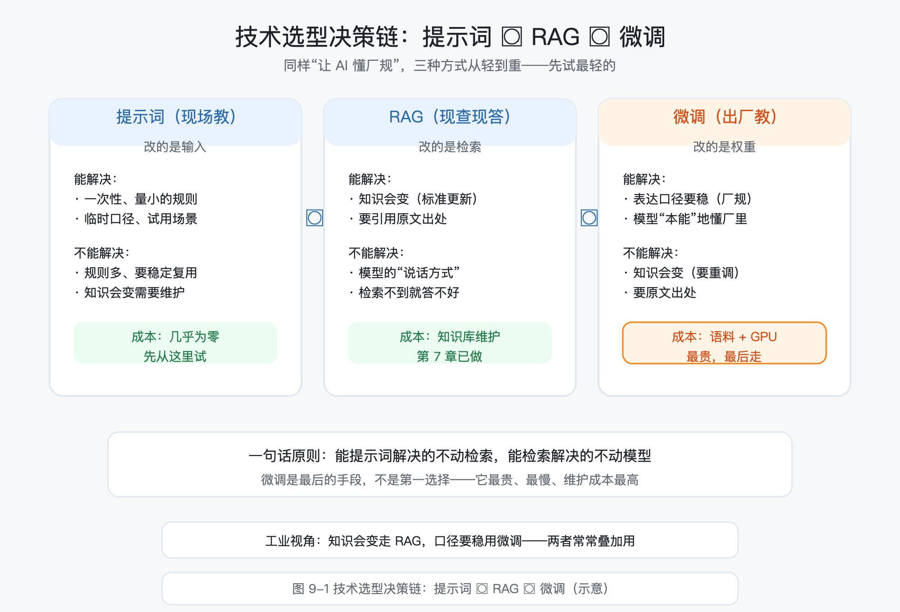
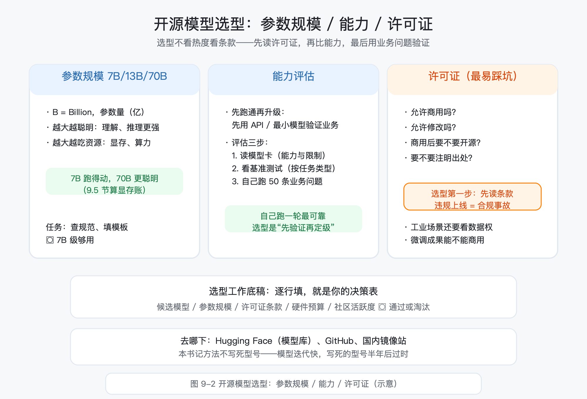
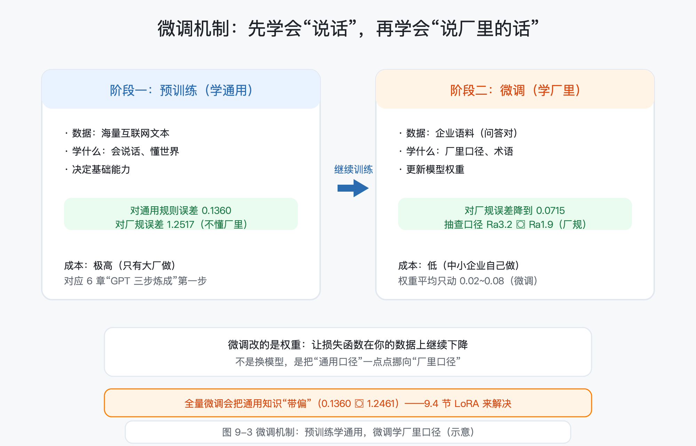
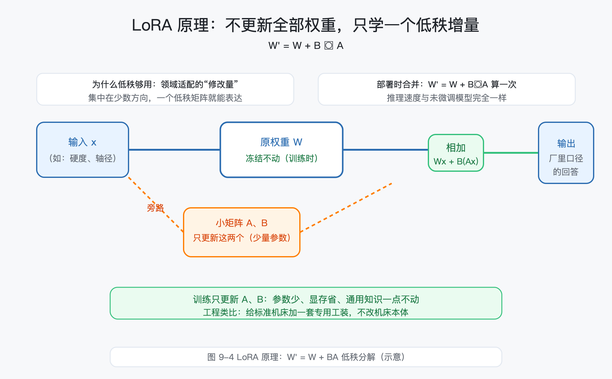
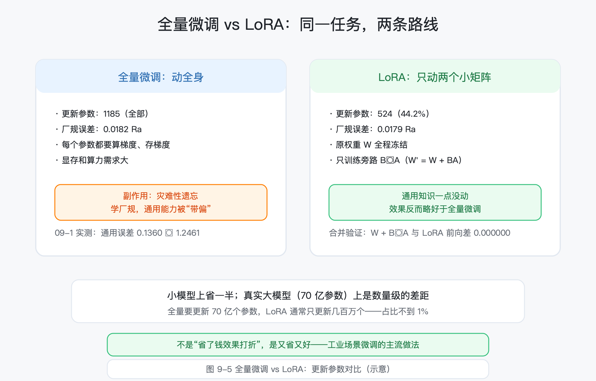
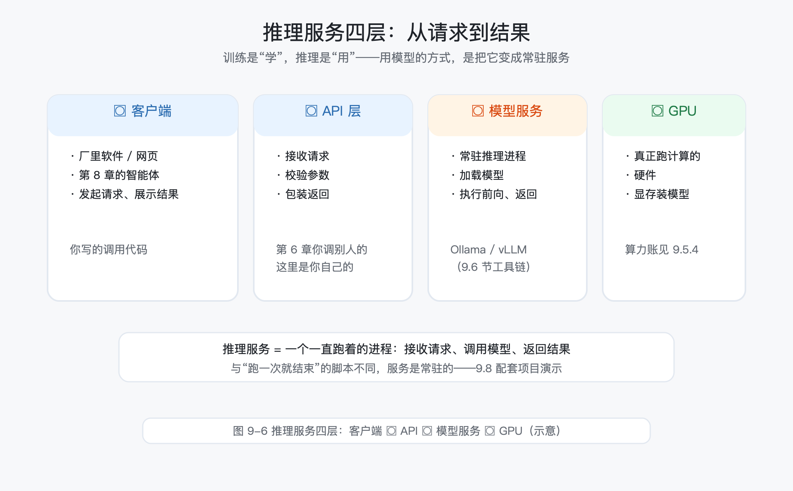
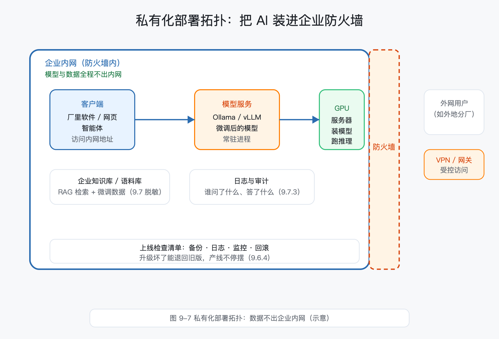
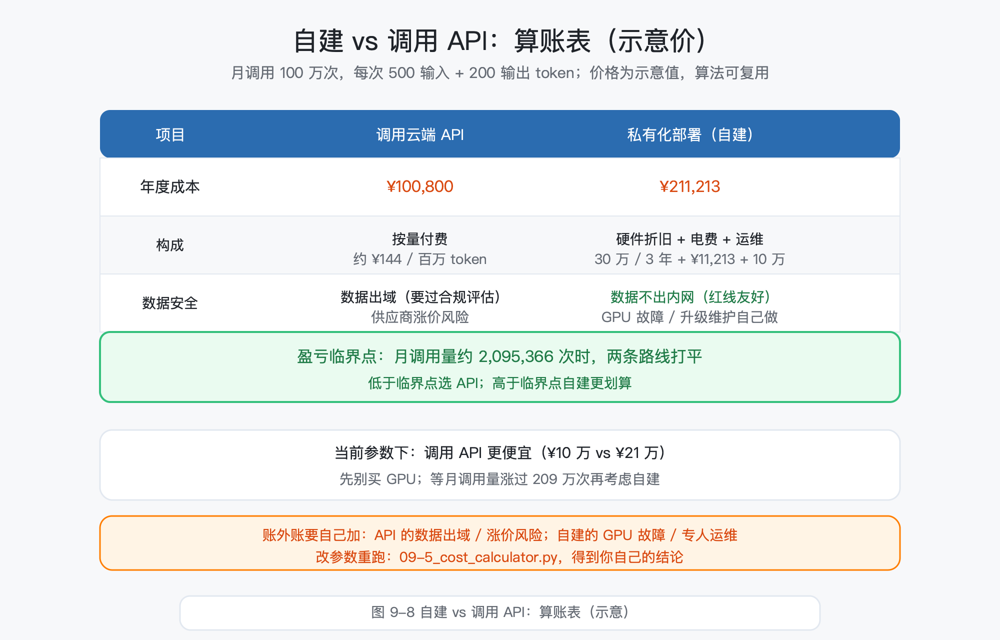

# 第 9 章 模型微调与私有化部署：把 AI 装进企业防火墙

> 所属框架层：L3 AI 应用工程化
> 预计篇幅：约 10,000~12,000 字（含可运行代码；9.1~9.2 为选型课，9.3/9.4 为微调机制课，9.5/9.6 为部署课，9.7 为数据安全课，9.8 为完整配套项目）
> 配套文件：示例代码（`code/ch9/` 目录，09-1~09-5 已全部真实运行，输出见正文）、本章配图（SVG 源文件见 `figures/ch9/` 目录）、术语表第 9 章·L3 条目
> 版本：v0.1（首稿）

**本章验收标准**：学完后能不看资料回答——提示词、RAG、微调三个层次各解决什么问题、什么时候走到哪一步？开源模型按什么维度选（参数规模 / 许可证 / 评估）？微调改的是模型的什么（权重）、LoRA 为什么便宜（低秩增量 W' = W + BA）？量化省多少显存、精度损失什么样？私有化部署的推理服务长什么样（客户端 → API → 模型服务 → GPU）？为什么私有化部署能守住数据红线？配套项目"设计规范助手"（演示版）能独立跑通：玩具模型微调演示 + 本地推理服务 + 自建 vs API 算账表。

---

> **本章配图清单**（图号 / 内容 / 对应小节 / 类型）

| 图号 | 内容 | 对应小节 | 类型 |
|---|---|---|---|
| 图 9-1 | 技术选型决策链：提示词 → RAG → 微调 | 9.1 | 决策流程图 |
| 图 9-2 | 开源模型选型：参数规模 / 能力 / 许可证 | 9.2 | 三栏对比图 |
| 图 9-3 | 微调机制：预训练（通用）→ 微调（领域） | 9.3 | 两阶段图 |
| 图 9-4 | LoRA 原理：W' = W + BA 低秩分解 | 9.4 | 公式结构图 |
| 图 9-5 | 全量微调 vs LoRA：更新参数对比 | 9.4 / 9.8 | 对比图 |
| 图 9-6 | 推理服务四层：客户端→API→模型服务→GPU | 9.5 | 架构图 |
| 图 9-7 | 私有化部署拓扑：数据不出企业内网 | 9.6 / 9.7 / 9.8 | 拓扑图 |
| 图 9-8 | 自建 vs 调用 API：算账表 | 9.8 | 对比表图 |

---

## 9.0 本章解决什么问题

这一章解决一个让无数工程师头疼的矛盾：**通用大模型不够专业，企业数据又不能出内网**。

第 7 章，老张把厂里的设备手册、企业标准做成了知识库，问答机器人答得不错；第 8 章，他给智能体配了工具和权限，工艺卡片能自动生成了。可他心里一直压着一件事：这些能力都建立在**云端大模型 API** 上——厂里的《设计规范》全文、工艺参数、客户图纸，全都从内网"出去"转了一圈。保密协议白纸黑字写着"不得向第三方披露技术资料"，他心里没底。

同时他还发现另一个问题：通用大模型"不够厂里"。你问它"45 钢轴表面粗糙度默认值"，它按国家标准给你个范围；可厂里《设计规范》写得清清楚楚"默认 Ra1.6"，这是老师傅们多年沉淀的口径。老张想要的，是一个**本身就懂厂规、张口就是厂里口径**的助手，而不是每次都要"现查现拼"。

问题很明确：**AI 能不能既懂厂里的规矩，又不让厂里的数据出大门？** 答案就是这一章的两条主线——**微调**（用企业语料把通用模型"教成"厂里口径）和**私有化部署**（把模型装进企业防火墙，数据不出内网）。学完这一章，你会拿到：一张"提示词 → RAG → 微调"的选型决策链（9.1）、一张"自建 vs 调用 API"的算账表（9.8），并跑通一个"设计规范助手"演示版（9.8）。

## 9.1 技术选型决策链：提示词 → RAG → 微调，什么时候走到哪一步

### 9.1.1 三个层次："让 AI 懂厂规"的三种方式

想让 AI 懂厂里的规矩，一共有三个层次，从轻到重：

1. **提示词（现场教）**：在每次提问时把规则写进提示词——"你是一个熟悉 45 钢轴的工艺员，表面粗糙度默认 Ra1.6……"。便宜、即时，但规则一多提示词就装不下，而且每次都要重新"教"。
2. **RAG（现查现答）**：第 7 章的做法——把《设计规范》放进知识库，模型回答前先检索相关条款，再照着条款答。规则更新只需改知识库，不需要动模型。
3. **微调（出厂教）**：本章的做法——用企业语料继续训练模型，让"厂里口径"变成模型自身的一部分。模型张口就是厂规，不用检索、不用提示。

三者的本质区别在于**改哪里**：提示词改输入、RAG 改检索、微调改模型权重。图 9-1 把这条决策链画出来：从最轻的开始试，能提示词解决的不动检索、能检索解决的不动模型。



### 9.1.2 决策链怎么走：三条路的成本对照

判断"走到哪一步"，先看每层能解决什么、代价是什么：

| 层次 | 能解决 | 不能解决 | 成本 |
|---|---|---|---|
| 提示词 | 一次性、量小的规则；临时口径 | 规则多、要稳定复用 | 几乎为零 |
| RAG | 知识会变（标准更新、手册改版）；要引用原文出处 | 模型"说话方式"改不了；检索不到就答不好 | 知识库维护 |
| 微调 | 表达口径要稳（企业特有说法）；模型要"本能"地懂 | 知识会变（微调一次数据旧了就要重调）；要原文出处 | 语料准备 + GPU 训练 |

一句话原则：**能提示词解决的不动检索，能检索解决的不动模型**。微调是最后的手段，不是第一选择——它最贵、最慢、维护成本最高。

### 9.1.3 工业视角：RAG 和微调常常叠加用

真实项目里，RAG 和微调不是二选一，而是**分工**：微调改模型的"说话方式"（厂里口径、表达习惯、术语），RAG 供"最新事实"（标准条款、手册数据、图纸要求）。判断标准两条：

- **知识会变吗？** 会（标准更新、手册改版）→ 走 RAG，改知识库就行；不会、且要稳（企业特有的表达口径）→ 考虑微调；
- **要引用出处吗？** 要（审计、留痕、工程师要查原文）→ 必须 RAG；只要结论口径对 → 微调可补。

老张的"设计规范助手"正是两者叠加：规范条文本身用 RAG（第 7 章已建库），"说话口径"用微调（本章演示）。这也是工业界最常见的组合。

## 9.2 开源模型选型：参数规模、能力、许可证

### 9.2.1 参数规模怎么读：7B / 13B / 70B 是什么意思

决定走微调 + 私有化部署后，第一个问题是：**用哪个开源模型？** 你会在模型页面上看到"7B""13B""70B"这样的词——B 是 Billion（十亿），指的是模型的**参数量**：7B 就是约 70 亿个可调参数（第 5 章讲过，神经网络的"参数"就是那些连接权重和偏置）。

参数量决定两件事：

- **能力**：通常参数量越大，模型越聪明——理解复杂指令、写长文、推理更稳；
- **资源**：参数越多，训练和推理需要的显存、算力越大（9.5 会算这笔账）。

工程上的一句话：**按任务复杂度选型，不按"越大越好"选**。让 AI 查设计规范、填卡片模板，7B 级别的小模型绰绰有余；让它写长篇技术文档、做复杂推理，才需要更大模型。

### 9.2.2 能力与资源的权衡：先跑通再升级

选型的通用流程（对应术语 **Open-source Model（开源模型）**：权重公开、可下载、可在自己服务器上运行的模型，区别于只能通过 API 调用的闭源模型）：

1. **先用 API 或最小模型验证业务可行**：你的场景到底需要多聪明的模型，先花小钱试出来；
2. **再按"跑得动 + 够用"选参数规模**：业务验证需要 7B 就 7B，不要一步到位 70B；
3. **最后用真实业务数据评估**：拿 50~100 条厂里真实问题逐条测，看回答质量能不能接受。

工程师贴士：**选型是"先验证再定级"，不是"看参数表定级"**。参数表再漂亮，不如拿真实业务问题跑一轮。

### 9.2.3 许可证与合规：选型不看热度看条款

这是工程师最容易踩的坑。开源模型不是"随便用"——每个模型都带 **License（许可证）**：允许不允许商用、允许不允许改、要不要注明出处、商用后要不要开源你的东西。选型第一步不是比能力，是**先读许可证**。对应术语 **Model License（模型许可证）**：规定模型使用、修改、商用权利的法律条款，选型前必须核对的条款。

一张选型工作底稿（读者按自己的场景逐行填写，就是你的选型决策表）：

| 候选模型 | 参数规模 | 许可证条款（商用？可改？） | 硬件预算够不够 | 社区/文档活跃度 | 结论 |
|---|---|---|---|---|---|
| （自己填） | 7B / 13B / 70B | 逐条核对 | 显存测算（9.5） | 有无中文资料 | 通过 / 淘汰 |

### 9.2.4 去哪下、怎么评估

开源模型的下载与社区集中在 Hugging Face（模型库，全球最大）、GitHub（部分官方发布页）、以及国内镜像站（下载速度友好）。评估三步：**读模型卡**（官方写的能力与限制）→ **看基准测试**（MMLU 等通用榜单，注意别只看总分，看你的任务类型）→ **自己跑 50 条业务问题**（最可靠）。图 9-2 把选型三栏（参数规模 / 能力 / 许可证）画在一起：小模型跑得动，大模型更聪明，条款先看清楚。



> 本节的选型只给"方法"不给"型号"：模型迭代很快，写死的型号半年后就过时。方法是稳定的——用工作底稿逐行评估，型号让读者在动手时自己填。

## 9.3 微调是什么：先讲真实机制

### 9.3.1 预训练 → 微调：两阶段，两种"教法"

微调（Fine-tuning）这个词，翻译成工程师的话就是：**在领域数据上继续训练模型**。要理解它，先看清大模型是怎么来的——两个阶段：

- **预训练（Pre-training）**：用海量互联网文本训练，让模型"会说话、懂世界"。这一阶段决定模型的基础能力，成本极高，只有大厂做。
- **微调（Fine-tuning）**：在预训练好的模型基础上，用**你的领域数据**继续训练，让模型"懂你的厂"。成本低得多，中小企业自己做。

第 6 章讲过"预训练 → 指令微调 → RLHF"的 GPT 炼成路线——微调就是这条路线里"把它教成你想要的助手"的那一步。区别只在于：OpenAI 用通用指令教它做通用助手，你用厂里语料教它做厂里的助手。

对应术语 **Fine-tuning（微调）**：用领域数据在预训练模型基础上继续训练，使模型适配特定领域。工程类比：**在标准机床上换专用工装做精加工**——机床还是那台机床，换上你的专用工装，干的活就是你的活。

### 9.3.2 微调改的是什么：权重

第 5 章讲过，神经网络的知识全部存在**权重**里。微调做的，就是让损失函数在**你的数据**上继续下降、权重沿着梯度继续更新——把模型的"通用口径"一点点挪向"厂里口径"。

光说机制可能还是虚的，跑代码 9-1 看个真的。这个演示用一个 2 层小神经网络模拟"粗糙度建议"任务：先在通用规则数据上训练（预训练），再在厂规数据上继续训练（微调），全程打印损失、误差和权重变化。

```python
"""
09-1 微调机制最小演示：从"通用"到"厂里口径"
==============================================

配套《从工程师到 AI 工程师》第 9 章 9.3 节。

问题背景
--------
老张想给厂里的"设计规范助手"定制口径：45 钢轴的表面粗糙度，
通用规则是 Ra3.2 上下，但厂规更严，要求按 60% 收（Ra1.9 上下）。
通用模型"只会通用规则"，微调就是用厂里的数据继续训练，
让模型把规则从"通用"改成"厂里口径"。

本演示用一个 2 层小神经网络模拟这件事：
  输入  = [材料硬度 HB, 轴直径 mm]（已归一化）
  输出  = 表面粗糙度建议值 Ra（μm）

  阶段一（预训练）：在"通用规则"数据上训练，模型学会通用规律；
  阶段二（微调）  ：在"厂规规则"数据上继续训练，模型学会厂里口径。

运行方式：CPU 即可，秒级完成，无需 GPU、无需联网。
依赖：torch（CPU 版即可）。
"""

import torch

torch.manual_seed(42)  # 固定随机种子，保证每次运行结果一致


# ---------- 1. 两条"规则"：通用 vs 厂规 ----------

def rule_general(x1, x2):
    """通用规则：粗糙度随硬度增大而略小、随轴径增大而略大（示意数值）。"""
    return 3.2 - (x1 - 150) / 200 * 1.0 + (x2 - 10) / 70 * 0.5


def rule_factory(x1, x2):
    """厂规：在通用规则基础上加严 40%（表面粗糙度要求更细）。"""
    return 0.6 * rule_general(x1, x2)


# ---------- 2. 数据生成与训练工具 ----------

def gen_data(n, rule):
    """生成 n 条样本：硬度 150~300 HB，轴径 10~80 mm；输入归一化到 0~1。"""
    x1 = torch.rand(n) * 150 + 150
    x2 = torch.rand(n) * 70 + 10
    x1_n = (x1 - 150) / 150      # 归一化：让输入落在 0~1，避免梯度爆炸
    x2_n = (x2 - 10) / 70
    y = rule(x1, x2)
    return torch.stack([x1_n, x2_n], dim=1), y.unsqueeze(1)


def make_model():
    """2 层小网络：2 输入 → 8 隐藏 → 1 输出。"""
    return torch.nn.Sequential(
        torch.nn.Linear(2, 8),
        torch.nn.ReLU(),
        torch.nn.Linear(8, 1),
    )


def train(model, x, y, steps=300, lr=0.01, tag=""):
    """普通梯度下降训练，打印损失下降过程。"""
    opt = torch.optim.SGD(model.parameters(), lr=lr)
    loss_fn = torch.nn.MSELoss()
    for step in range(steps):
        opt.zero_grad()
        pred = model(x)
        loss = loss_fn(pred, y)
        loss.backward()
        opt.step()
        if (step + 1) % 75 == 0:
            print(f"    {tag} 第 {step + 1:>3} 步：损失 {loss.item():.4f}")


def mae(model, x, y):
    """平均绝对误差（工程师好懂：平均差多少个 Ra 值）。"""
    with torch.no_grad():
        pred = model(x)
    return (pred - y).abs().mean().item()


def behavior_check(model, samples):
    """给三个不同输入，看预测是否随输入变化（防止模型退化成'输出常数'）。"""
    with torch.no_grad():
        preds = model(samples).squeeze().tolist()
    for (a, b), p in zip(samples.tolist(), preds):
        print(f"        硬度 {(a*150+150):.0f} HB、轴径 {(b*70+10):.0f} mm → 预测 Ra {p:.2f}")


# ---------- 3. 准备数据 ----------

torch.manual_seed(42)
x_g, y_g = gen_data(600, rule_general)      # 预训练用的"通用数据"
x_f, y_f = gen_data(200, rule_factory)      # 微调用的"厂规数据"
x_test_g, y_test_g = gen_data(100, rule_general)
x_test_f, y_test_f = gen_data(100, rule_factory)

# 三个固定抽查样本：看模型"会不会随输入变"
probe = torch.tensor([[0.0, 0.0], [0.5, 0.5], [1.0, 1.0]])

# ---------- 4. 阶段一：预训练（学通用规则） ----------

print("=" * 62)
print("阶段一：预训练 —— 在通用规则数据上训练 300 步")
print("=" * 62)
model = make_model()
train(model, x_g, y_g, tag="预训练")

# 保存"通用模型"权重（微调前的样子）
w_before = {k: v.clone() for k, v in model.state_dict().items()}

print()
print("预训练完，看看它懂什么：")
print(f"    通用规则测试集 平均误差：{mae(model, x_test_g, y_test_g):.4f} Ra")
print(f"    厂规规则测试集 平均误差：{mae(model, x_test_f, y_test_f):.4f} Ra")
print("    → 对通用规则很准，对厂规差得远（通用模型不懂厂里口径）")
print("    抽查三个输入，预测随输入变化：")
behavior_check(model, probe)

# ---------- 5. 阶段二：微调（学厂规） ----------

print()
print("=" * 62)
print("阶段二：微调 —— 在厂规数据上继续训练 300 步")
print("=" * 62)
train(model, x_f, y_f, tag="微调")

print()
print("微调完，再测一次：")
print(f"    通用规则测试集 平均误差：{mae(model, x_test_g, y_test_g):.4f} Ra")
print(f"    厂规规则测试集 平均误差：{mae(model, x_test_f, y_test_f):.4f} Ra")
print("    → 厂规误差大幅下降（学会了厂里口径）")
print("    同样三个输入，预测口径变了：")
behavior_check(model, probe)

# ---------- 6. 权重真的"变"了吗 ----------

w_after = model.state_dict()

def layer_change(name):
    """打印某一层权重的平均与最大变动幅度。"""
    diff = (w_after[name] - w_before[name]).abs()
    return diff.mean().item(), diff.max().item()

mean1, max1 = layer_change("0.weight")   # 第一层 Linear(2,8)
mean2, max2 = layer_change("2.weight")   # 第二层 Linear(8,1)
print()
print("权重变化（微调前 → 微调后）：")
print(f"    第一层权重  平均变动 {mean1:.4f}  最大变动 {max1:.4f}")
print(f"    第二层权重  平均变动 {mean2:.4f}  最大变动 {max2:.4f}")
print("    → 行为大变，权重只是被小幅修改——微调不是换模型，是'微调'")
print()
print("注意一个现象：微调后通用规则误差从 0.1360 升到 1.2461，")
print("    全量微调会把模型'带偏'，忘掉一部分通用知识（灾难性遗忘的雏形）。")
print("    这正是 9.4 节 LoRA 的价值：只动少量参数，少忘事、少花钱。")
```

在终端（第 2 章的"命令行"）里运行它——注意你的环境需要装好 torch（安装方式见 `code/ch9/requirements.txt`）：

```bash
python3 09-1_finetune_mini.py
```

真实输出如下：

```
==============================================================
阶段一：预训练 —— 在通用规则数据上训练 300 步
==============================================================
    预训练 第  75 步：损失 0.0856
    预训练 第 150 步：损失 0.0590
    预训练 第 225 步：损失 0.0408
    预训练 第 300 步：损失 0.0281

预训练完，看看它懂什么：
    通用规则测试集 平均误差：0.1360 Ra
    厂规规则测试集 平均误差：1.2517 Ra
    → 对通用规则很准，对厂规差得远（通用模型不懂厂里口径）
    抽查三个输入，预测随输入变化：
        硬度 150 HB、轴径 10 mm → 预测 Ra 3.22
        硬度 225 HB、轴径 45 mm → 预测 Ra 3.08
        硬度 300 HB、轴径 80 mm → 预测 Ra 2.95

==============================================================
阶段二：微调 —— 在厂规数据上继续训练 300 步
==============================================================
    微调 第  75 步：损失 0.0093
    微调 第 150 步：损失 0.0079
    微调 第 225 步：损失 0.0068
    微调 第 300 步：损失 0.0058

微调完，再测一次：
    通用规则测试集 平均误差：1.2461 Ra
    厂规规则测试集 平均误差：0.0715 Ra
    → 厂规误差大幅下降（学会了厂里口径）
    同样三个输入，预测口径变了：
        硬度 150 HB、轴径 10 mm → 预测 Ra 2.05
        硬度 225 HB、轴径 45 mm → 预测 Ra 1.85
        硬度 300 HB、轴径 80 mm → 预测 Ra 1.64

权重变化（微调前 → 微调后）：
    第一层权重  平均变动 0.0237  最大变动 0.1544
    第二层权重  平均变动 0.0754  最大变动 0.2981
    → 行为大变，权重只是被小幅修改——微调不是换模型，是'微调'

注意一个现象：微调后通用规则误差从 0.1360 升到 1.2461，
    全量微调会把模型'带偏'，忘掉一部分通用知识（灾难性遗忘的雏形）。
    这正是 9.4 节 LoRA 的价值：只动少量参数，少忘事、少花钱。
```

三个关键观察：

1. **预训练完**：对通用规则误差 0.1360，对厂规误差 1.2517——模型"会说通用的话，不会说厂里的话"；
2. **微调完**：厂规误差降到 0.0715，三个抽查样本的预测口径从 Ra3.2 左右整体降到 Ra1.9 左右——模型"学会了厂里口径"；
3. **权重变化**：平均变动只有 0.02~0.08——**行为大变，权重只被轻轻修改**。这就是"微调"二字的来历：不是重训，是微调。

同时注意一个真实现象：微调后通用误差从 0.1360 升到 1.2461——全量微调把通用知识"带偏"了。这叫**灾难性遗忘**（Catastrophic Forgetting）：学新东西、忘旧东西。这直接引出 9.4 的 LoRA。图 9-3 把两个阶段画在一起：预训练学会"说通用的话"，微调改口"说厂里的话"。



### 9.3.3 微调的两类任务：指令微调与领域适配

微调按目的分两类，机制相同、数据不同：

- **指令微调（Instruction Tuning）**：教模型"按指令办事"——给一段指令-回答数据，让模型学会"用户这么问，就这么答"。这是第 6 章 GPT 路线里"指令微调"那一步的同款机制，对应术语 **Instruction Tuning（指令微调）**：用"指令-回答"配对数据训练模型，使其能遵循指令完成任务。
- **领域适配**：教模型"懂你的厂"——用厂里语料继续训练，让表达口径、术语、规范都变成厂里的。

实际项目里两者常合并：准备一批"厂规问题 → 厂规答案"的数据，一次微调既学会按指令办事，又学会厂里口径。

### 9.3.4 全量微调的代价：每个参数都要更新

最直接的微调叫**全量微调（Full Fine-tuning）**：所有参数都参与更新（代码 9-1 演示的就是这种）。代价有两个：

- **显存与算力**：要更新、要存梯度，参数量越大越吃 GPU（第 5 章讲过，训练比推理吃显存）；
- **灾难性遗忘**：代码 9-1 已经演示——全量微调容易"带偏"通用能力。

对应术语 **Full Fine-tuning（全量微调）**：更新模型全部参数的传统微调方式，效果强但资源消耗大、容易灾难性遗忘。有没有办法"只改一点"？有——下一节的 LoRA。

## 9.4 LoRA 微调实战：用少量领域数据定制模型

### 9.4.1 LoRA 的核心机制：不更新全部权重，只学一个低秩增量

**LoRA（Low-Rank Adaptation，低秩适配）** 的思路很朴素：领域适配需要改的"方向"其实很少，没必要动全部权重。于是它把更新写成这样：

$$W' = W + B \times A$$

- $W$ 是原有权重（**冻结不动**）；
- $A$、$B$ 是两个**小矩阵**（新学的、参数量极少）；
- 推理时先合并 $W' = W + BA$ 再前向——部署速度不受影响。

为什么"低秩"够用？因为领域适配的"修改量"通常集中在少数方向上——一个低秩矩阵就能表达（对应术语 **Low-Rank（低秩）**：用远小于原矩阵规模的秩来近似表达权重增量，LoRA 的数学基础）。图 9-4 把公式画成结构图：原权重 W 冻结，旁边挂两个小矩阵 B、A，输出 = Wx + B(Ax)。



### 9.4.2 为什么 LoRA 便宜：更新参数少，通用知识不动

跑代码 9-2 看真实的数字对比。同一个"粗糙度"任务，三条路线摆一起：基线（通用模型）、全量微调、LoRA。

```python
"""
09-2 LoRA 机制最小演示：不更新全部权重，只学一个低秩增量
==========================================================

配套《从工程师到 AI 工程师》第 9 章 9.4 节。

问题背景
--------
09-1 里全量微调把通用知识"带偏"了（灾难性遗忘），而且每个参数都要
更新梯度、都要占显存。LoRA 的思路是：**原权重 W 完全冻结不动**，
在旁边加两个小矩阵 B、A（低秩），让新权重 = W + B×A。
训练时只更新 B、A——参数少、显存省、通用知识不动。

本演示用同一个"粗糙度"任务对比两条路线：
  输入  = [硬度, 轴径]（归一化）
  输出  = 表面粗糙度建议值 Ra

  基线  ：预训练好的"通用模型"（不懂厂规）
  路线 A：全量微调 —— 更新所有 1185 个参数
  路线 B：LoRA —— 原权重冻结，只更新低秩旁路 B×A（524 个参数）

运行方式：CPU 即可，秒级完成。依赖：torch（CPU 版即可）。
"""

import torch

torch.manual_seed(42)


# ---------- 规则与数据（与 09-1 相同） ----------

def rule_general(x1, x2):
    return 3.2 - (x1 - 150) / 200 * 1.0 + (x2 - 10) / 70 * 0.5

def rule_factory(x1, x2):
    return 0.6 * rule_general(x1, x2)

def gen_data(n, rule):
    x1 = torch.rand(n) * 150 + 150
    x2 = torch.rand(n) * 70 + 10
    return torch.stack([(x1 - 150) / 150, (x2 - 10) / 70], dim=1), rule(x1, x2).unsqueeze(1)

def make_model():
    """稍大一点的 3 层网络：2 → 32 → 32 → 1（让参数对比更有说服力）。"""
    return torch.nn.Sequential(
        torch.nn.Linear(2, 32),
        torch.nn.ReLU(),
        torch.nn.Linear(32, 32),
        torch.nn.ReLU(),
        torch.nn.Linear(32, 1),
    )

def mae(model, x, y, forward=None):
    """平均绝对误差；LoRA 模型需传入带旁路的前向函数 forward(model, x)。"""
    fn = forward or (lambda m, xx: m(xx))
    with torch.no_grad():
        return (fn(model, x) - y).abs().mean().item()

def count_params(params):
    return sum(p.numel() for p in params)


# ---------- 1. 基线：预训练一个"通用模型" ----------

torch.manual_seed(42)
x_g, y_g = gen_data(600, rule_general)
x_f, y_f = gen_data(300, rule_factory)
x_tf, y_tf = gen_data(100, rule_factory)

model = make_model()
opt = torch.optim.SGD(model.parameters(), lr=0.01)
for _ in range(400):                      # 预训练：学通用规则
    opt.zero_grad()
    loss = torch.nn.functional.mse_loss(model(x_g), y_g)
    loss.backward()
    opt.step()

print("=" * 66)
print("基线：预训练好的通用模型")
print("=" * 66)
print(f"    模型总参数：{count_params(model.parameters())}")
print(f"    厂规测试集 平均误差：{mae(model, x_tf, y_tf):.4f} Ra（不懂厂规）")

# ---------- 2. 路线 A：全量微调 ----------

print()
print("=" * 66)
print("路线 A：全量微调 —— 更新全部权重")
print("=" * 66)
model_a = make_model()
model_a.load_state_dict(model.state_dict())   # 从通用模型出发
opt_a = torch.optim.SGD(model_a.parameters(), lr=0.01)
for _ in range(400):
    opt_a.zero_grad()
    loss = torch.nn.functional.mse_loss(model_a(x_f), y_f)
    loss.backward()
    opt_a.step()
print(f"    更新参数数量：{count_params(model_a.parameters())}（全部）")
print(f"    厂规测试集 平均误差：{mae(model_a, x_tf, y_tf):.4f} Ra")

# ---------- 3. 路线 B：LoRA（原权重冻结 + 低秩旁路） ----------

print()
print("=" * 66)
print("路线 B：LoRA —— 冻结原权重，只学低秩旁路 B×A")
print("=" * 66)

r = 4  # 低秩秩（rank）：旁路矩阵的"宽度"，r 越大表达能力越强、参数越多

def lora_params(model, r):
    """收集 LoRA 需要更新的参数：每层线性层旁路 A(r×in) 与 B(out×r)。"""
    ps = []
    for i, m in enumerate(model):
        if isinstance(m, torch.nn.Linear):
            A = torch.randn(r, m.in_features) * 0.01
            B = torch.zeros(m.out_features, r)
            A.requires_grad_(True)
            B.requires_grad_(True)
            setattr(model, f"lora_A_{i}", A)   # 挂到模型上，方便前向
            setattr(model, f"lora_B_{i}", B)
            ps += [A, B]
    return ps

# 冻结原权重：requires_grad 全关掉
model_b = make_model()
model_b.load_state_dict(model.state_dict())
for p in model_b.parameters():
    p.requires_grad = False
lora_ps = lora_params(model_b, r)
n_lora = count_params(lora_ps)

# 带 LoRA 旁路的前向：y = f(W x) 改为 y = f(W x + B(A x))
def forward_with_lora(model, x):
    h = x
    for i, m in enumerate(model):
        if isinstance(m, torch.nn.Linear):
            # 旁路：(h @ A.T) 得到 (batch×r)，再 @ B.T 得到 (batch×out)
            h = m(h) + (h @ getattr(model, f"lora_A_{i}").T) @ getattr(
                model, f"lora_B_{i}").T
        elif isinstance(m, torch.nn.ReLU):
            h = torch.relu(h)
    return h

opt_b = torch.optim.SGD(lora_ps, lr=0.05)
for _ in range(400):
    opt_b.zero_grad()
    loss = torch.nn.functional.mse_loss(forward_with_lora(model_b, x_f), y_f)
    loss.backward()
    opt_b.step()

print(f"    更新参数数量：{n_lora}（仅旁路 B、A，原权重冻结）")
print(f"    占全量微调的 {n_lora / count_params(model_a.parameters()) * 100:.1f}%")
print(f"    厂规测试集 平均误差：{mae(model_b, x_tf, y_tf, forward_with_lora):.4f} Ra")

# ---------- 4. 合并验证：W + B×A 等价于 LoRA 前向 ----------

print()
print("=" * 66)
print("合并验证：把旁路 B×A 加回原权重，得到'微调后模型'")
print("=" * 66)
model_merged = make_model()
model_merged.load_state_dict(model.state_dict())
for i, m in enumerate(model_merged):
    if isinstance(m, torch.nn.Linear):
        # 把旁路 B×A 加回原权重：W_new = W + B×A（偏置不动）
        m.weight.data.add_(
            getattr(model_b, f"lora_B_{i}") @ getattr(model_b, f"lora_A_{i}"))

with torch.no_grad():
    pred_lora = forward_with_lora(model_b, x_tf)
    pred_merged = model_merged(x_tf)
print(f"    LoRA 前向与'合并后模型'预测最大差：{(pred_lora - pred_merged).abs().max().item():.6f}")
print("    → 两个写法数学等价：部署时只需把 B×A 合进 W，推理速度不变")

# ---------- 5. 三张牌摆一起 ----------

print()
print("=" * 66)
print("对比总表")
print("=" * 66)
print(f"    基线（通用模型）          更新参数 0      厂规误差 {mae(model, x_tf, y_tf):.4f} Ra")
print(f"    全量微调                 更新参数 {count_params(model_a.parameters()):>4}  厂规误差 {mae(model_a, x_tf, y_tf):.4f} Ra")
print(f"    LoRA（r=4）              更新参数 {n_lora:>4}  厂规误差 {mae(model_b, x_tf, y_tf, forward_with_lora):.4f} Ra")
print()
print("结论：LoRA 用不到一半的更新参数达到接近全量微调的效果，")
print("      而且原权重全程冻结——通用知识一点没动。")
print("      真实大模型（如 70 亿参数）上这个差距是数量级的：")
print("      全量要更新 70 亿个参数，LoRA 通常只更新几百万个（占比 <1%）。")
```

运行：

```bash
python3 09-2_lora_mini.py
```

真实输出如下：

```
==================================================================
基线：预训练好的通用模型
==================================================================
    模型总参数：1185
    厂规测试集 平均误差：1.2278 Ra（不懂厂规）

==================================================================
路线 A：全量微调 —— 更新全部权重
==================================================================
    更新参数数量：1185（全部）
    厂规测试集 平均误差：0.0182 Ra

==================================================================
路线 B：LoRA —— 冻结原权重，只学低秩旁路 B×A
==================================================================
    更新参数数量：524（仅旁路 B、A，原权重冻结）
    占全量微调的 44.2%
    厂规测试集 平均误差：0.0179 Ra

==================================================================
合并验证：把旁路 B×A 加回原权重，得到'微调后模型'
==================================================================
    LoRA 前向与'合并后模型'预测最大差：0.000000
    → 两个写法数学等价：部署时只需把 B×A 合进 W，推理速度不变

==================================================================
对比总表
==================================================================
    基线（通用模型）          更新参数 0      厂规误差 1.2278 Ra
    全量微调                 更新参数 1185  厂规误差 0.0182 Ra
    LoRA（r=4）              更新参数  524  厂规误差 0.0179 Ra

结论：LoRA 用不到一半的更新参数达到接近全量微调的效果，
      而且原权重全程冻结——通用知识一点没动。
      真实大模型（如 70 亿参数）上这个差距是数量级的：
      全量要更新 70 亿个参数，LoRA 通常只更新几百万个（占比 <1%）。
```

四个数字值得记下来：

1. **更新参数**：全量 1185 个 vs LoRA 524 个（44.2%）——小模型上已经是省一半；真实大模型（70 亿参数）上，LoRA 通常只更新几百万个，占比 **<1%**，差距是数量级的；
2. **效果**：LoRA 误差 0.0179 甚至略优于全量微调的 0.0182——不是"省了钱效果打折"，是又省又好；
3. **通用知识**：全量微调会把通用能力带偏（09-1 已见），LoRA 原权重全程冻结，通用知识一点没动；
4. **合并验证**：LoRA 前向与"合并后模型"预测差 0.000000——**部署时把 B×A 合进 W 就行，推理速度不变**。对应术语 **LoRA（低秩适配）**：冻结原权重、只训练低秩旁路 B、A（W' = W + BA）的高效微调方法。工程类比：**给标准机床加一套专用工装，不改机床本体**——工装（旁路）要改就改工装，机床（原权重）永远完好。

图 9-5 把两条路线的差异画出来：全量微调"动全身"，LoRA"只动两个小矩阵"。



### 9.4.3 微调数据长什么样：指令-回答的 JSONL

LoRA 训练需要的数据格式很固定：每行一条 JSON，包含"指令"和"回答"（有些还会加"输入"）。比如厂里的设计规范问答：

```json
{"instruction": "45钢轴表面粗糙度默认值是多少？", "output": "Ra1.6（厂规 9-2-3）"}
{"instruction": "轴端倒角按什么标准？", "output": "默认 C1（厂规 9-2-4）"}
{"instruction": "45钢轴调质处理硬度要求？", "output": "217~255 HB（厂规 9-2-5）"}
```

对应术语 **Instruction Data（指令数据）**：由"指令-回答"配对组成的微调训练数据，通常存为 JSONL（每行一条 JSON）。

数据准备的一句话原则：**质量比数量重要**。几百条高质量、口径一致的厂规问答，远胜几千条凑数的。数据从哪来？厂里的规范文档、老师傅的问答记录、历史工艺卡片——整理成问答对即可。

### 9.4.4 实战流程：数据 → 加载 → 冻结 → 只训旁路 → 合并

真实大模型的 LoRA 微调流程（概念与命令级，与 09-2 玩具演示一一对应）：

1. **准备数据**：整理成 JSONL 指令数据（9.4.3）；
2. **加载基础模型**：从 Hugging Face 等渠道下载开源模型（9.2 选型）；
3. **冻结原权重**：模型所有参数 `requires_grad = False`；
4. **只训练 B、A**：在目标层挂上低秩旁路，只更新旁路参数（09-2 代码 9-2 的核心）；
5. **合并 / 保存 LoRA 权重**：训练完保存 B、A（几个 MB 的小文件，可上传共享）；部署时合并进 W 或运行时加载旁路。

工具上，社区标准是 PEFT 库（Hugging Face 出品）配合 Transformers：`peft.LoraConfig` 指定 r、目标层，`get_peft_model` 自动完成"冻结 + 挂旁路"。代码 9-2 演示的机制，就是 PEFT 在底层做的事。

> **工程师贴士：我有 GPU 的话，怎么把演示变成真跑？** 代码 9-2 是玩具模型演示，机制与真实一致，但真实微调需要：① 一台有 GPU 的机器（自己买或云租，10GB+ 显存起步）；② 用 Transformers + PEFT 加载开源模型和 LoRA 配置（配置文件里把模型名从"玩具网络"换成你选的 7B 模型）；③ 把 JSONL 数据按官方模板格式化成训练集。命令大致是 `pip install transformers peft` 后跑一个几十行的训练脚本，社区模板到处都是。首次建议先在 7B 级小模型 + 几百条数据上试通，再放大。

## 9.5 推理与部署：模型从"训练完"到"能用"

### 9.5.1 推理是什么：训练是"学"，推理是"用"

训练（Train）是让模型学会规律的过程；**推理（Inference）** 是"用"的过程——模型加载进显存，接收输入，输出结果。对应术语 **Inference（推理）**：用训练好的模型对新输入做预测的过程。工程类比：**量具校好后投入使用去测量**。

推理阶段的两件大事：**模型放哪（显存装不装得下）** 和 **请求怎么进（服务怎么架）**。

### 9.5.2 量化：把精度降下来，换显存和速度

一个 7B 模型用 float32（每个数 4 字节）存权重，要 28GB 显存；企业里常见的消费级显卡（24GB）都装不下。**量化（Quantization）** 就是降低数字精度来省资源：float16（2 字节）减半、int8（1 字节）再减半。对应术语 **Quantization（量化）**：降低模型数值精度以节省显存与算力。工程类比：**高精度量具换成够用的低精度量具**——省空间省电，但精度要心里有数。

跑代码 9-3 看真实的精度损失长什么样：

```python
"""
09-3 量化原理演示：用精度换资源，省多少、亏多少
================================================

配套《从工程师到 AI 工程师》第 9 章 9.5 节。

问题背景
--------
一个 70 亿参数的模型，用 float32（每个数占 4 字节）存储要占 28GB 显存，
普通企业显卡根本装不下。量化就是把模型里的数字从"高精度"换成"低精度"，
例如 float16（2 字节）或 int8（1 字节）——显存立刻减半、再减半，
代价是数值精度损失，回答质量可能打折扣。

本演示做两件事：
  1. 拿几个典型数值，看 float32 → float16 → int8 之后误差有多大；
  2. 给一张"参数量 × 精度"的显存估算表，算算省多少。

运行方式：离线真实运行，零第三方依赖，纯标准库。
"""

import struct
import math

# ---------- 1. 三种精度的"存回再读回" ----------

def to_float16(v):
    """float32 → float16 → float32（用标准库 struct 的 'e' 半精度格式）。"""
    return struct.unpack("e", struct.pack("e", v))[0]


def to_int8(v, scale):
    """对称量化：v → 整数刻度 → 反量化回近似值。"""
    q = round(v / scale)
    q = max(-127, min(127, q))     # int8 范围 -127~127
    return q * scale, q


# 一组典型权重值：大数、小数、π、循环小数……
values = [0.1, 0.125, 3.14159, 0.333333, 123.456, 1.0, 0.001]

print("=" * 72)
print("一、数值精度损失对比")
print("=" * 72)
print(f"{'原值':>10} {'float32':>10} {'float16':>10} {'16位误差':>10} "
      f"{'int8存回':>10} {'8位误差':>10}")
print("-" * 72)

max_abs = max(abs(v) for v in values)
scale8 = max_abs / 127.0

for v in values:
    f32 = struct.unpack("f", struct.pack("f", v))[0]
    f16 = to_float16(v)
    i8, _ = to_int8(v, scale8)
    print(f"{v:>10.4f} {f32:>10.6f} {f16:>10.6f} {abs(v-f16):>10.6f} "
          f"{i8:>10.6f} {abs(v-i8):>10.6f}")

print("-" * 72)
print("解读：float16 对大多数数误差在 1e-4 量级（几乎无损）；")
print("      int8 整张表共用一个刻度 scale（由最大值 123.456 决定），")
print("      小数（0.1、0.3333、π）被大刻度'吞掉'，失真严重；")
print("      而最大值本身恰好落在刻度上，反而精确。")
print("      → 动态范围越大的张量，int8 量化伤害越大——")
print("        这正是量化要'分组/归一化'的原因，也是量化不能当没损失用的原因。")

# ---------- 2. 显存估算表 ----------

print()
print("=" * 72)
print("二、显存估算表（模型权重部分）")
print("=" * 72)

# 参数量（十亿） × 每参数字节数 = 权重显存（GB）
models = [("7B 模型", 7e9), ("13B 模型", 13e9), ("70B 模型", 70e9)]
precisions = [("float32", 4), ("float16", 2), ("int8", 1), ("int4", 0.5)]

print(f"{'模型':>10} {'float32':>10} {'float16':>10} {'int8':>10} {'int4':>10}  备注")
print("-" * 72)
for name, n in models:
    row = []
    for _, b in precisions:
        row.append(f"{n * b / 1e9:>9.1f}GB")
    print(f"{name:>10} {'  '.join(row)}   int8 省 75%")

print("-" * 72)
print("备注：")
print("  · 这是'权重'本身的显存；推理时还要加激活值、中间缓存、KV Cache，")
print("    工程估算通常再乘 1.2~1.5。")
print("  · 一块企业级 GPU（如 A100 80GB）装 float16 的 13B 模型没问题，")
print("    装 float16 的 70B 模型就要 2 块卡或先量化到 int8。")
print()
print("结论：量化 = 用精度换资源。省不省、亏不亏，")
print("      先看这张表，再看你的任务吃不吃得下精度损失。")
```

运行：

```bash
python3 09-3_quantization_demo.py
```

真实输出如下：

```
========================================================================
一、数值精度损失对比
========================================================================
        原值    float32    float16      16位误差     int8存回       8位误差
------------------------------------------------------------------------
    0.1000   0.100000   0.099976   0.000024   0.000000   0.100000
    0.1250   0.125000   0.125000   0.000000   0.000000   0.125000
    3.1416   3.141590   3.140625   0.000965   2.916283   0.225307
    0.3333   0.333333   0.333252   0.000081   0.000000   0.333333
  123.4560 123.456001 123.437500   0.018500 123.456000   0.000000
    1.0000   1.000000   1.000000   0.000000   0.972094   0.027906
    0.0010   0.001000   0.001000   0.000000   0.000000   0.001000
------------------------------------------------------------------------
解读：float16 对大多数数误差在 1e-4 量级（几乎无损）；
      int8 整张表共用一个刻度 scale（由最大值 123.456 决定），
      小数（0.1、0.3333、π）被大刻度'吞掉'，失真严重；
      而最大值本身恰好落在刻度上，反而精确。
      → 动态范围越大的张量，int8 量化伤害越大——
        这正是量化要'分组/归一化'的原因，也是量化不能当没损失用的原因。

========================================================================
二、显存估算表（模型权重部分）
========================================================================
        模型    float32    float16       int8       int4  备注
------------------------------------------------------------------------
     7B 模型      28.0GB       14.0GB        7.0GB        3.5GB   int8 省 75%
    13B 模型      52.0GB       26.0GB       13.0GB        6.5GB   int8 省 75%
    70B 模型     280.0GB      140.0GB       70.0GB       35.0GB   int8 省 75%
------------------------------------------------------------------------
备注：
  · 这是'权重'本身的显存；推理时还要加激活值、中间缓存、KV Cache，
    工程估算通常再乘 1.2~1.5。
  · 一块企业级 GPU（如 A100 80GB）装 float16 的 13B 模型没问题，
    装 float16 的 70B 模型就要 2 块卡或先量化到 int8。

结论：量化 = 用精度换资源。省不省、亏不亏，
      先看这张表，再看你的任务吃不吃得下精度损失。
```

三个要点：

1. **float16 几乎无损**：误差 1e-4 量级，大多数场景直接用；
2. **int8 有代价**：整个张量共用一个刻度，动态范围一大，小数值就失真——量化不是免费午餐；
3. **省多少**：7B 模型 float32 28GB → float16 14GB → int8 7GB，显存减到四分之一。显存够不够，直接决定你买什么 GPU、能跑多大模型。

### 9.5.3 推理服务长什么样：四层结构

模型训练完、量化完，怎么让厂里的人用起来？答案是把它变成一个**常驻服务**：一个进程一直跑着，接收请求、调用模型、返回结果。这就是**推理服务（Model Serving）** 的骨架。对应术语 **Model Serving（模型服务）**：把训练好的模型封装成常驻 API 服务、对外提供推理能力的工程形态。

从客户端到模型，一共四层（图 9-6）：

1. **客户端**：厂里的软件、网页、第 8 章的智能体——发 HTTP 请求；
2. **API 层**：接收请求、校验参数、转发给模型、包装返回（第 6 章你调别人的 API，这里是你自己的）；
3. **模型服务**：常驻的推理进程，加载模型、执行前向、返回结果；
4. **GPU**：真正跑计算的硬件。



### 9.5.4 资源账本：显存怎么算、并发怎么估

部署前先算资源账（9.8 配套项目会用代码 9-5 把账算全）：

- **显存**：权重显存 = 参数量 × 每参数字节数（float16 按 2 字节），再 × 1.2~1.5 留出激活和缓存的余量；
- **并发**：一个 GPU 同时能服务多少请求，取决于模型大小和显存；并发不够就加卡或排队；
- **CPU 还是 GPU**：小模型（7B 及以下）在强 CPU 上也能跑，但慢；企业内网服务建议 GPU。

## 9.6 私有化部署：把 AI 装进企业防火墙

### 9.6.1 部署形态对照：云端 API vs 私有化部署

第 7 章 7.8 讲过数据红线："企业数据不能出内网"。云端 API 的本质是**把数据送到模型那里**——数据出了内网；私有化部署是把**模型装进内网**——数据不用出去。对应术语 **Private Deployment（私有化部署）**：把模型部署在企业内网、数据不出域的部署方式。工程类比：**把设备装进自家车间，不出厂门**。

两种形态的取舍（9.8 会算账）：

| 维度 | 调用云端 API | 私有化部署 |
|---|---|---|
| 数据安全 | 数据出域（要过合规评估） | 数据不出内网（红线友好） |
| 成本 | 按量付费，无硬件投入 | 一次性硬件 + 运维（9.8 算账） |
| 延迟与可控 | 依赖公网 | 内网自控 |
| 升级维护 | 平台负责 | 自己负责（模型、服务、GPU 故障） |

### 9.6.2 部署工具链：Ollama 与 vLLM

自己架推理服务，主流是两个工具（都开源、社区活跃）：

- **Ollama**：一条命令跑开源模型，自动处理下载、量化、API 暴露——**入门首选**。`ollama run llama3.1:8b` 就能在本地起一个对话服务。对应术语 **Ollama**：本地一键运行开源模型的工具，自带模型管理、量化与 OpenAI 兼容 API。
- **vLLM**：面向高并发的生产级推理服务，吞吐量高、显存管理精细——**生产环境首选**。对应术语 **vLLM**：高吞吐的推理服务框架，用 PagedAttention 等机制提升并发能力。

两个工具都提供与 OpenAI 兼容的 API 接口——也就是说，第 6 章你写的"调用 API"的代码，改一下 base_url（从云端地址改成内网地址），就能指向自己部署的模型。这是私有化部署最顺滑的一点。

### 9.6.3 内网部署拓扑：模型和数据都留在防火墙里

私有化部署的典型拓扑（图 9-7）：

- **模型服务在内网**：GPU 服务器 + 推理服务（Ollama/vLLM），跑在内网；
- **客户端在内网**：厂里的软件、网页、智能体访问内网地址；
- **外网访问要控**：如需外部访问（比如给外地分厂用），走 VPN 或网关，而不是把服务直接暴露公网；
- **日志与权限**：访问记录、请求审计（呼应 8.7 的日志审计——模型服务也要留痕）。



### 9.6.4 部署检查清单：上线前逐项过

部署不是"装完就完"，上线前过一遍检查清单（沿用第 8 章"日志审计 + 权限最小化"的思路）：

1. **数据**：训练与推理数据都确认可留内网（9.7 红线）；
2. **备份**：模型权重、配置文件、LoRA 权重有备份（微调成果是资产）；
3. **日志**：请求日志、错误日志开着，能审计、能排查；
4. **监控**：显存占用、GPU 温度、请求延迟有告警；
5. **升级与回滚**：换模型版本前有回滚方案——升级坏了能退回旧版，产线不停摆。

## 9.7 数据安全与合规：工业数据出域的边界

### 9.7.1 数据出域的三条红线

私有化部署解决"数据出内网"的问题，但**不是所有数据都该进模型**。先过三条红线（呼应第 7 章 7.8）：

1. **保密协议**：客户图纸、客户技术要求——协议里写明了不能给第三方，训练数据、推理数据都不能含这些；
2. **涉密项目**：涉军、涉密、受控项目数据——原则是"能不碰就不碰"；
3. **个人数据**：员工、客户的个人信息（第 10 章会展开《个人信息保护法》的要求）。

红线清单先过，再谈部署。红线内的数据，宁可不用模型，也不能侥幸。

### 9.7.2 微调数据的脱敏：训练前先清洗

给模型做微调前，语料要先"洗澡"——**脱敏（Data Masking）**：把工艺参数里的客户名、设备型号、项目代号替换成占位符或泛化值。对应术语 **Data Masking（数据脱敏）**：在数据进入训练或推理前，对敏感字段做替换、泛化等处理。

脱敏三件套：**删**（不需要的敏感字段直接删）、**换**（客户名 → "客户A"）、**泛化**（具体项目号 → "某项目"）。脱敏检查不进代码流程，进**人工复核**——老师傅过一遍。

### 9.7.3 留痕与审计：谁问了什么，模型答了什么

模型服务上线后，审计要求：**谁在什么时间问了什么、模型答了什么、是否命中敏感内容**——全部留日志（9.6.4 检查清单里的"日志"）。这不是为了找谁麻烦，是为了出事能查：万一模型泄露了不该说的，日志能定位是哪条数据、哪次调用。

### 9.7.4 边界声明

本节给的是**原则与红线清单**。具体的法条细节——《数据安全法》《个人信息保护法》对工业数据的适用范围、合规流程——留给第 10 章展开。记住一句话：**技术能解决的问题（装防火墙），法律要守住的问题（什么能进防火墙），是两件事**。

## 9.8 配套项目：用企业语料微调"设计规范助手"（演示版）

### 9.8.1 需求拆解

把本章所有线索串成一个项目——**设计规范助手（演示版）**：

- **输入**：厂里设计规范问题（"45 钢轴表面粗糙度默认值是多少？"）；
- **输出**：按厂规口径的回答；
- **三件一套**：微调演示（09-2 的玩具模型机制）+ 内网推理服务（09-4）+ 算账表（09-5）。

演示版的定位：机制全真、规模缩微——把"微调 → 部署 → 算账"整条链路在本机跑通，真实模型接入点全部标注清楚。

### 9.8.2 微调演示：让回答口径变成"厂里的"

微调演示就是 9.4 的 LoRA 项目（代码 9-2）：把"设计规范问答"当成领域数据，玩具模型从"通用口径"微调成"厂里口径"。真实项目里，这一步换成真实模型 + 真实 JSONL 语料（9.4.4 的实战流程）。

### 9.8.3 推理服务最小实现：把助手装进"内网"

跑代码 9-4：用 Python 标准库起一个常驻服务，模拟"把设计规范助手部署进内网"的完整骨架——服务端接收请求、查演示库、返回回答并留日志；客户端发请求、收回答。真实模型接入点已标注（把 `mock_answer` 换成调用 Ollama/vLLM 的代码）。

```python
"""
09-4 配套项目：私有化部署"设计规范助手"最小演示
=================================================

配套《从工程师到 AI 工程师》第 9 章 9.8 节。

做什么
------
把"设计规范助手"装成企业内网里一个**常驻服务**：
  - 服务端：用 Python 标准库 http.server 起一个本地服务（相当于内网服务器），
    收到问题后查"设计规范演示库"，返回按厂规口径的回答；
  - 客户端：像第 6 章调用云端 API 一样发 HTTP 请求（这次服务是你自己的）。

为什么这么做
------------
大模型私有化部署 = 把"推理服务"装进内网。本演示把**服务骨架**讲透：
请求长什么样、服务怎么响应、日志怎么留。真实模型接入点已标注——
把你的 mock_answer() 换成调用 vLLM/Ollama 的代码，骨架不用动。

运行方式：离线真实运行，零第三方依赖（只用标准库），无需联网。
"""

import json
import threading
from http.server import BaseHTTPRequestHandler, ThreadingHTTPServer
from urllib import request

PORT = 8765

# ---------- 1. "设计规范演示库"（企业语料的最小形态） ----------

# 厂里的设计规范，只放了几条演示数据。真实场景里这里是：
# 企业知识库 + 微调后的模型，见 9.4 / 9.6 节。
RULE_BOOK = {
    "表面粗糙度": "45 钢轴配合面表面粗糙度默认 Ra1.6（厂规 9-2-3）",
    "倒角": "轴端倒角默认 C1（厂规 9-2-4）",
    "热处理": "45 钢轴调质处理，硬度 217~255 HB（厂规 9-2-5）",
}


def mock_answer(question: str) -> str:
    """
    演示版"推理"：在规则库里按关键词找答案。
    真实部署时，把这里替换成调用微调后模型的代码（vLLM / Ollama），
    例如：requests.post("http://内网模型服务/v1/chat/completions", ...)
    """
    for key, ans in RULE_BOOK.items():
        if key in question:
            return ans
    return "演示库未收录这个问题（真实部署时由模型回答，此处仅示意）"


# ---------- 2. 服务端 ----------

class Handler(BaseHTTPRequestHandler):
    def do_POST(self):
        length = int(self.headers.get("Content-Length", 0))
        body = json.loads(self.rfile.read(length) or b"{}")
        question = body.get("question", "")

        answer = mock_answer(question)

        # 留痕：记录请求与回答（呼应 9.7 审计）
        log = {"q": question, "a": answer, "mode": "mock"}
        print(f"    [服务端日志] {json.dumps(log, ensure_ascii=False)}")

        resp = json.dumps({"answer": answer, "source": "设计规范-演示库",
                           "mode": "mock"}, ensure_ascii=False).encode("utf-8")
        self.send_response(200)
        self.send_header("Content-Type", "application/json; charset=utf-8")
        self.send_header("Content-Length", str(len(resp)))
        self.end_headers()
        self.wfile.write(resp)

    def log_message(self, fmt, *args):
        pass  # 关掉 http.server 自带的访问日志，只留上面的业务日志


def ask(question: str) -> dict:
    """客户端：像第 6 章调用云端 API 一样，向"自己家的服务"发请求。"""
    req = request.Request(
        f"http://127.0.0.1:{PORT}/answer",
        data=json.dumps({"question": question}).encode("utf-8"),
        headers={"Content-Type": "application/json"},
    )
    with request.urlopen(req) as resp:
        return json.loads(resp.read().decode("utf-8"))


# ---------- 3. 跑起来：起服务 → 发三次请求 → 关服务 ----------

print("=" * 66)
print("私有化部署演示：把'设计规范助手'装进内网（本机模拟）")
print("=" * 66)

server = ThreadingHTTPServer(("127.0.0.1", PORT), Handler)
thread = threading.Thread(target=server.serve_forever, daemon=True)
thread.start()
print(f"    服务已启动：http://127.0.0.1:{PORT}/answer（相当于内网服务器）")
print()

questions = [
    "45钢轴表面粗糙度默认值是多少？",
    "轴端倒角按什么标准？",
    "请算一下这根轴的疲劳强度。",
]
for q in questions:
    print(f"    [客户端请求] {q}")
    r = ask(q)
    print(f"    [客户端收到] {r['answer']}")
    print()

server.shutdown()
print("    服务已关闭。")
print()
print("小结：")
print("  · 服务端 = 常驻进程 + 规则库（真实场景里换成微调模型 + 知识库）；")
print("  · 客户端 = 和调用云端 API 一模一样，只是地址变成了内网地址；")
print("  · 日志留痕 = 9.7 数据审计的最小形态。")
print("  · 接入真实模型：把 mock_answer() 换成调用 vLLM/Ollama 的代码即可。")
```

运行：

```bash
python3 09-4_local_service.py
```

真实输出如下：

```
==================================================================
私有化部署演示：把'设计规范助手'装进内网（本机模拟）
==================================================================
    服务已启动：http://127.0.0.1:8765/answer（相当于内网服务器）

    [客户端请求] 45钢轴表面粗糙度默认值是多少？
    [服务端日志] {"q": "45钢轴表面粗糙度默认值是多少？", "a": "45 钢轴配合面表面粗糙度默认 Ra1.6（厂规 9-2-3）", "mode": "mock"}
    [客户端收到] 45 钢轴配合面表面粗糙度默认 Ra1.6（厂规 9-2-3）

    [客户端请求] 轴端倒角按什么标准？
    [服务端日志] {"q": "轴端倒角按什么标准？", "a": "轴端倒角默认 C1（厂规 9-2-4）", "mode": "mock"}
    [客户端收到] 轴端倒角默认 C1（厂规 9-2-4）

    [客户端请求] 请算一下这根轴的疲劳强度。
    [服务端日志] {"q": "请算一下这根轴的疲劳强度。", "a": "演示库未收录这个问题（真实部署时由模型回答，此处仅示意）", "mode": "mock"}
    [客户端收到] 演示库未收录这个问题（真实部署时由模型回答，此处仅示意）

    服务已关闭。

小结：
  · 服务端 = 常驻进程 + 规则库（真实场景里换成微调模型 + 知识库）；
  · 客户端 = 和调用云端 API 一模一样，只是地址变成了内网地址；
  · 日志留痕 = 9.7 数据审计的最小形态。
  · 接入真实模型：把 mock_answer() 换成调用 vLLM/Ollama 的代码即可。
```

注意看输出里的三件事：**服务端**是常驻进程（这和你写脚本跑一次就结束完全不同）；**客户端**发请求的方式和第 6 章调用云端 API 一模一样——只是地址从云端换成了 127.0.0.1（内网）；**服务端日志**逐条留痕——这就是 9.7 审计的最小形态。

### 9.8.4 部署与成本报告：算清"自建 vs 调用 API"的账

部署前最后一步：**算账**。工程师贴士的完整版——把"自建 vs 调用 API"的账算成一张可改参数的表（代码 9-5）。价格全部是示意值，算法可复用：改自己的调用量、单价、硬件价，立刻得到自己的结论。

```python
"""
09-5 配套项目：算清"自建 vs 调用 API"的账
============================================

配套《从工程师到 AI 工程师》第 9 章 9.8 节（工程师贴士落地版）。

做什么
------
私有化部署前先算账：同样一套"设计规范助手"，是每月按量调用云端
API 划算，还是自己买 GPU、租机房、养运维划算？本脚本把账算成一张
可以反复改参数的表格——读者改自己的数字，立刻得到结论。

所有价格均为**示意值，仅用于演示算法**；真实报价以供应商官网为准。

运行方式：离线真实运行，零第三方依赖，纯标准库。
"""

# ---------- 1. 参数（读者按自己的情况改这里） ----------

# 使用量
MONTH_CALLS = 1_000_000        # 月调用次数（次/月）
AVG_IN_TOKENS = 500            # 每次请求平均输入 token 数
AVG_OUT_TOKENS = 200           # 每次请求平均输出 token 数

# 调用 API（示意价：某国产大模型 API 公开价量级）
API_IN_PRICE = 12.0            # 元 / 百万输入 token
API_OUT_PRICE = 12.0           # 元 / 百万输出 token

# 自建（示意值：1 台 4×A100 服务器，企业内网部署）
HW_COST = 300_000              # 硬件一次性投入（元）
DEPREC_YEARS = 3               # 折旧年限（年）
GPU_POWER_W = 4 * 400          # 4 卡 × 400W
ELECTRIC_YUAN_PER_KWH = 0.8    # 电费单价（元/度）
OPS_COST = 100_000             # 运维人力 + 机房 + 带宽（元/年）


# ---------- 2. 算账 ----------

def api_yearly(month_calls, in_tok, out_tok):
    """调用 API 的年度成本（元）。"""
    in_m = month_calls * in_tok / 1e6      # 月输入 token（百万）
    out_m = month_calls * out_tok / 1e6    # 月输出 token（百万）
    return (in_m * API_IN_PRICE + out_m * API_OUT_PRICE) * 12


def self_yearly():
    """自建的年度成本（元）= 折旧 + 电费 + 运维。"""
    elec = GPU_POWER_W / 1000 * 24 * 365 * ELECTRIC_YUAN_PER_KWH
    return HW_COST / DEPREC_YEARS + elec + OPS_COST


def breakeven():
    """盈亏临界点：月调用量达到多少时，自建开始比 API 便宜。"""
    lo, hi = 1, 10_000_000_000
    while lo < hi:
        mid = (lo + hi) // 2
        if api_yearly(mid, AVG_IN_TOKENS, AVG_OUT_TOKENS) >= self_yearly():
            hi = mid
        else:
            lo = mid + 1
    return lo


# ---------- 3. 输出 ----------

api_cost = api_yearly(MONTH_CALLS, AVG_IN_TOKENS, AVG_OUT_TOKENS)
self_cost = self_yearly()
per_million = api_cost / (MONTH_CALLS * (AVG_IN_TOKENS + AVG_OUT_TOKENS) / 1e6)

print("=" * 66)
print("自建 vs 调用 API 算账表（示意价，算法可复用）")
print("=" * 66)
print(f"使用量      ：月 {MONTH_CALLS:,} 次，平均每次 输入 {AVG_IN_TOKENS} + 输出 {AVG_OUT_TOKENS} token")
print(f"调用 API    ：年度成本 ¥{api_cost:,.0f}  "
      f"（约 ¥{per_million:.2f}/百万 token）")
print(f"自建部署    ：年度成本 ¥{self_cost:,.0f}")
print(f"           （硬件 ¥{HW_COST/10000:.0f} 万 / {DEPREC_YEARS} 年折旧 + "
      f"电费 ¥{GPU_POWER_W/1000*24*365*ELECTRIC_YUAN_PER_KWH:,.0f} + "
      f"运维 ¥{OPS_COST/10000:.0f} 万）")
print("-" * 66)
print(f"盈亏临界点  ：月调用量约 {breakeven():,} 次时，两条路线打平")
print()
if api_cost > self_cost:
    print("结论：按当前参数，自建更便宜（但别忘了数据隐私、")
    print("      升级维护、GPU 故障这些 API 方案没有的隐性成本）。")
else:
    print("结论：按当前参数，调用 API 更便宜；等月调用量涨过临界点")
    print("      再考虑自建。")
print()
print("改一下参数再看：把 MONTH_CALLS、API 单价、硬件价格换成你的真实数字，")
print("      立刻得到你自己的结论——这就是'算账'的意义。")
```

运行：

```bash
python3 09-5_cost_calculator.py
```

真实输出如下：

```
==================================================================
自建 vs 调用 API 算账表（示意价，算法可复用）
==================================================================
使用量      ：月 1,000,000 次，平均每次 输入 500 + 输出 200 token
调用 API    ：年度成本 ¥100,800  （约 ¥144.00/百万 token）
自建部署    ：年度成本 ¥211,213
           （硬件 ¥30 万 / 3 年折旧 + 电费 ¥11,213 + 运维 ¥10 万）
------------------------------------------------------------------
盈亏临界点  ：月调用量约 2,095,366 次时，两条路线打平

结论：按当前参数，调用 API 更便宜；等月调用量涨过临界点
      再考虑自建。

改一下参数再看：把 MONTH_CALLS、API 单价、硬件价格换成你的真实数字，
      立刻得到你自己的结论——这就是'算账'的意义。
```

看这张表的读法（图 9-8）：

- **当前参数下**：调用 API 一年 ¥10 万，自建一年 ¥21 万——调用 API 便宜，先别买 GPU；
- **临界点**：月调用量涨到约 209 万次时两条路线打平，超过它自建更划算；
- **账外账**：自建还有 API 方案没有的隐性成本——GPU 故障、模型升级维护、专人运维；但 API 也有账外风险——数据出域、供应商涨价、服务不可控。**算账表算的是明账，隐性成本自己加**。

配套项目三件套跑完，你就把"微调 → 部署 → 算账"整条链路走了一遍。**替换案例**：工艺规范助手（语料换成工艺规范）、质量判定助手（语料换成检验标准）——只换数据，微调与部署骨架不动。



## 9.9 常见坑与练习

### 常见坑

- **选型跳级**：上来就微调，其实提示词或 RAG 就能解决——又贵又慢（先走 9.1 决策链）；
- **不看许可证**：用了限制商用的模型，产品上线才发现违规（9.2.3 工作底稿必查）；
- **数据没脱敏**：客户图纸、工艺诀窍进了训练集，出了事追悔莫及（9.7.2 三件套）；
- **微调数据质量差**：量多质低，模型学会了"废话"而不是"规矩"（9.4.3 质量优先）；
- **量化拍脑袋**：int8 省了显存却精度崩了，验收才发现（9.5.2 先测误差再定精度）；
- **部署无回滚**：模型升级坏了，回不到旧版本，产线停摆（9.6.4 检查清单）；
- **只算模型价不算运营账**：GPU 电费、运维人力、升级成本全被忽略（9.8.4 算账表）。

### 练习与验收标准

- **练习 1**：给你的场景画一条"提示词 → RAG → 微调"决策链，标出每一步的触发条件（抄 9.1.2 的对照表，填你的例子）；
- **练习 2**：跑代码 9-3，把你的目标模型参数量带进显存估算表，算一算 int8 后省多少显存、精度损失能不能接受；
- **练习 3**：用代码 9-4 起本地推理服务，改两个问题再发请求，观察服务端日志与返回；
- **练习 4**：用代码 9-5 把你的真实数字填进去（月调用量、单价、硬件价），给出你自己的"自建 or API"结论；
- **验收标准**："能讲清"——向同事解释提示词/RAG/微调三者何时用、LoRA 为什么便宜（W' = W + BA）、私有化部署为什么能守住数据红线；"能算账"——独立填完一张"自建 vs 调用 API"的算账表并给出结论；"能跑通"——独立跑通设计规范助手演示版（微调演示 + 本地服务 + 成本报告）。

### 本章小结（5 句）

微调 = 在领域数据上继续更新模型权重，让模型"懂你的厂"——与提示词（改输入）、RAG（改检索）是三个层次，**能检索解决的不微调**；全量微调每个参数都更新、又贵又容易带偏通用能力，LoRA 只学一个低秩增量（W' = W + BA），像给标准机床加专用工装，又省又好；推理是"用"，部署是"装"——量化用精度换资源（float32 28GB → int8 7GB），推理服务是常驻进程（客户端 → API → 模型服务 → GPU 四层）；私有化部署让模型和数据都留在内网，是第 7 章数据红线与第 8 章权限最小化的兑现——Ollama 入门、vLLM 上生产，数据先过红线、语料先脱敏、服务必留痕；上线前先算账——自建 vs 调用 API，把 GPU、电费、运维、升级全算进去再决定。

### 延伸阅读

- Datawhale 开源教程（微调 / LoRA / 部署章节，中文）
- Ollama / vLLM 官方文档（部署工具，中文社区资料丰富）
- Hugging Face 官方文档（模型库与微调工具 PEFT，英文为主）
- 各开源模型官方许可证页（选型前必读）
