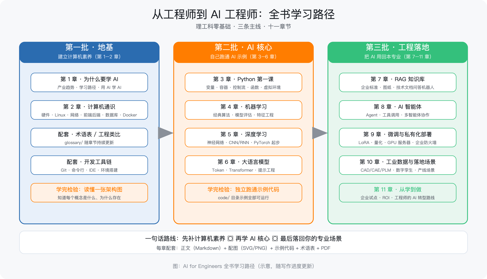

# AI for Engineers · 从工程师到 AI 工程师

**理工科零基础学习指南** —— 一套面向"有工作经验、零计算机背景"的理工科工程师的开源学习资料。

- 📖 GitHub 仓库：<https://github.com/cuoluan2012/ai-for-engineers>
- 📄 PDF 下载：见仓库 [Releases](https://github.com/cuoluan2012/ai-for-engineers/releases) 页面
- 📚 术语表：[glossary/术语表.md](https://github.com/cuoluan2012/ai-for-engineers/blob/main/glossary/术语表.md)

## 学习路径

> 怎么读：第一批（第 1–2 章）补计算机素养 → 第二批（第 3–6 章）跑通 AI 示例 → 第三批（第 7–11 章）把 AI 用回本专业。

## 内容目录

| 章节 | 状态 |
|---|---|
| [第 1 章 为什么工程师要拥抱 AI](ch1-为什么工程师要拥抱AI.md) | ✅ 已完成 |
| [第 2 章 计算机通识：学 AI 前必懂的基础课](ch2-计算机通识.md) | ✅ 已完成 |
| [第 3 章 编程第一课：像搭积木一样学 Python](ch3-Python第一课.md) | ✅ 已完成 |
| [第 4 章 机器学习](ch4-机器学习.md) | 规划中 |
| [第 5 章 深度学习与神经网络](ch5-深度学习.md) | 规划中 |
| [第 6 章 大语言模型与提示词](ch6-大语言模型.md) | 规划中 |
| [第 7 章 RAG 知识库](ch7-RAG知识库.md) | 规划中 |
| [第 8 章 AI 智能体](ch8-AI智能体.md) | 规划中 |
| [第 9 章 模型微调与私有化部署](ch9-微调与部署.md) | 规划中 |
| [第 10 章 工业数据与 AI 落地场景](ch10-工业落地.md) | 规划中 |
| [第 11 章 从学到做](ch11-从学到做.md) | 规划中 |

## 欢迎参与

纠错、建议、贡献，见仓库 README 的"如何参与"。
